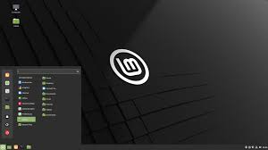
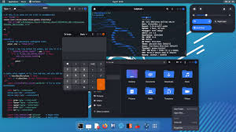
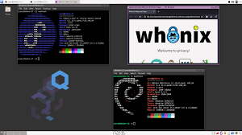
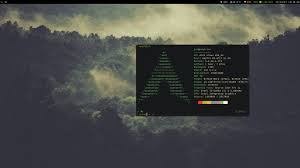
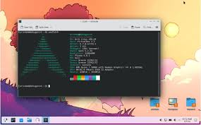
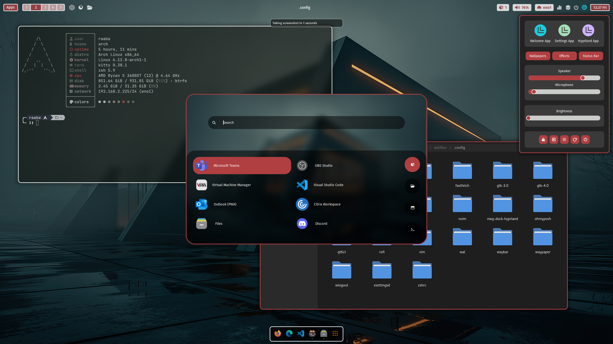



- [Wiki ArchLinux](https://archlinux.org)
- [DistroSea](https://distrosea.com/fr/)
- [Ventoy](https://www.ventoy.net/en/index.html)
- [Hyprland](https://hyprland.org)





| Date           | Heures passées | Indications               |
| -------------- | -------------- | ------------------------- |
| Vendredi 27/12 | 2H             | Choix de la distro        |
| Samedi 28/12   | 4H             | Installation de ArchLinux |
| Jeudi 30/12    | 3H             | Personnalisation          |
| Mercredi 29/01 | 1H30           | Rédaction MON             |
|                |                |                           |
| Total          | 10H30          |                           |



## 💡 Introduction

J'ai souvent entendu parler de Linux, mais j'ai toujours pensé que cet OS était réservé au expert en informatique. Mais est-ce vraiment le cas ?

De ce questionnement je me suis lancé l'objectif de tester linux afin de voir si cet OS peut remplacer mon Windows.

## Etape 1 - Choisir sa distribution

Bien nous avons un nouvel objectif installer Linux, cependant il existe de nombreuses versions de Linux appelées distribution ou distro. Chacunes de ces distros possèdent des avantages et des inconvéniants qui leurs sont propres. Il est donc important de choisir la distribution qui convient à nos attentes.

Par exemple, si je suis un utilisateur Windows terrifié à l'idée de taper des commandes dans une console, Mint Linux :

    

Si je souhaite un distro clé en main, complète et souvent mis à jour, Fedora ou Ubuntu :

    

Si je veux hacker le code wifi du voisin afin de ne pas payer le wifi, Kali Linux :

    

Si j'ai peur de me faire hacker par un utilisateur de Kali, QubesOs:

    

Enfin, si je veux un OS hautement personnalisable et qui me ressemble, ArchLinux :

    

Voulant pousser l'expérience linux au maximum j'ai décidé d'installer ArchLinux !

## Etape 2 - Créer une clé pour booter ArchLinux

Installer un nouvel OS sur un ordinateur n'est pas aussi simple qu'installer une application quelconque. En effet, il faut le "booter" ! Pour cela il faut créer une clé USB particulière permettant cette installation. La solution la plus simple est d'utiliser [Ventoy](https://www.ventoy.net/en/index.html). Une fois la clé USB créée on installe l'ISO (la version) de ArchLinux dessus et on peut passer à l'installation.

## Etape 3 - ArchInstall

La volonté de ArchLinux est de pouvoir tout configurer comme on le souhaite, de ce fait l'installation de cet OS se fait "à la main" via un terminal. Je ne vais pas détailler l'ensemble des étapes à réaliser le [Wiki est là pour ça !](https://archlinux.org).

Je tiens juste à souligner que pour un débutant certains concepts, comme le partionnement du disque, sont compliqués à maitriser. Il faut être patient et ne pas avoir peur de tout recommencer plusieurs fois.

## Etape 4 - Hyprland

Une fois ArchLinux installé j'ai été déçu par l'interface graphique KDE Plasma. Pour moi cela ressemble à une interface Windows 10 en moins beau.

    

C'est l'heure de la personnalisation, pour cela j'ai opté pour l'interface [Hyprland](https://hyprland.org) 100% personnalisable et qui permet le tiling (mode de disposition de l'écran). Et aprés des heures de recherche de la config parfaite (ML4W) j'ai enfin mon Linux :

    

## Conclusion : Pourquoi et pour qui Linux ?

Cette expérience m'a fait me rendre compte d'une chose : Windows est un OS complexe et gourmand en ressources auquel il existe des solutions plus souple. Cependant pour mon utilisation de l'ordinateur linux n'est pas optimal. En effet, linux nécessite un temps apprentissage et d'assimilation plus long.

Pour moi, il faut passer sur linux si vous en avez marre des bugs de windows, que vous voulez améliorer les performances de votre ordinateur. Mais surtout il faut passer sur linux si vous aimez l'informatique et que vous n'avez pas peur de consulter la documentation lorsqu'il y a des problèmes.
