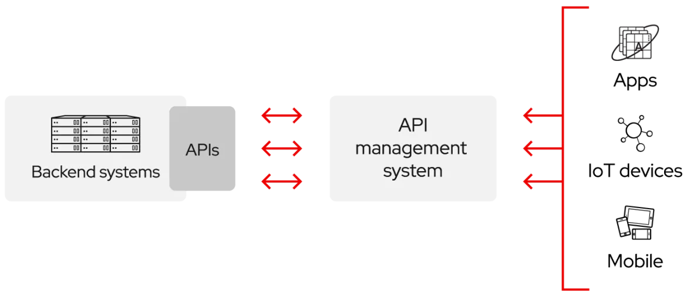



- [Définiton API selon RedHat](https://www.redhat.com/fr/topics/api/what-are-application-programming-interfaces#api-ou-webhook)
- [Github](https://github.com/Mathisadi)





| Date           | Heures passées | Indications               |
| -------------- | -------------- | ------------------------- |
| Lundi 10/02    | 2H             | Documentation sur les API |
| Samedi 15/02   | 2H             | API BitGet                |
| Vendredi 28/02 | 5H             | API CTZ (projet POK)      |
| Dimanche 09/03 | 1H             | Rédaction MON             |
|                |                |                           |
| Total          | 10H            |                           |



## Introduction : Qu'est ce qu'une API ?

Si on s'intéresse de près ou de loin à la programmation, on finira par entendre parler d'API.

Une API ou Application Programming Interface en anglais, est une interface permettant d'accéder à des fonctionnalités ou des données d'un autre programme sans avoir besoin d'en comprendre le fonctionnement interne.

Ainsi les API permettent de capitaliser les innovations informatique de chacun : si un programme ou une application propose déjà une solution à notre problème, on peut le réutiliser via une api sans devoir la réinventer de 0.

Pour mieux comprendre imaginons que je veuille réaliser une appli permettant de localiser les déchets dans Marseille. Je pourrais par exemple réutiliser la cartographie de google maps puis rajouter de mon coté des fonctions permettant le recensement des déchets.

Le gain de temps est non négligeable !

De ce fait, les API jouent un rôle essentiel dans la création d'applications. Elles facilitent l'intégration de différents services, permettent le partage de ressources et de données, et simplifient le développement en évitant de réinventer des fonctionnalités déjà existantes.

    

## Partie 1 : Comment utiliser une API ?

Bien une API c'est pratique mais si nous ne savons pas l'utiliser c'est inutile !

Tout d'abord il faut savoir que chaque interface possède sa propre documentation et ses propores spécificitées. On ne peut donc pas utiliser correctement une API sans consulter la doc officiel. Cependant, la manière de procéder elle ne change pas :

En premier lieu, il faut bien choisir son API, opté pour une qui répond aux besoins et qui a une bonne longévité.

Exemple :

- API Google Maps : Permet d'intégrer des cartes interactives, calculer des itinéraires et obtenir des informations géographiques détaillées.

- API OpenWeatherMap : Fournit des données météorologiques actualisées (température, humidité, prévisions météo, etc.) utilisées dans les applications météo.

- API Twitter/X : Permet d'accéder aux publications (tweets), de les publier, ou d'analyser les tendances sur ce réseau social.

Attention la plupart des API exigent une authentification, généralement sous forme de clé d’API ou de jeton d’accès. Pour obtenir ces identifiants, il est nécessaire de s’inscrire auprès du fournisseur et de suivre les procédures décrites dans sa documentation.

Important : ces codes sont personnels et ne doivent jamais être diffusés à qui que ce soit !

Une fois l'accées obtenu nous pouvons commencer à intéragir avec l'API. Cette interaction se fait principalement à l’aide de requêtes HTTP. Ces requêtes utilisent souvent des méthodes telles que :

- GET pour récupérer des données.

- POST pour envoyer ou créer des données.

- PUT/PATCH pour mettre à jour des données existantes.

- DELETE pour supprimer des données.

Après envoi de la requête, l’API renvoie généralement une réponse structurée, souvent au format JSON ou XML. Cette réponse doit être traitée par le logiciel ou l'application afin d'extraire les données pertinentes pour leur exploitation.

Enfin, il est important de prévoir une gestion appropriée des erreurs retournées par l’API (codes HTTP spécifiques, messages d'erreur) et de respecter les limites d’utilisation imposées par le fournisseur (nombre maximal de requêtes autorisées par période donnée, quotas, etc.).

## Partie 2 : Mise en pratique utilisation de l'API Bitget

Afin de bien comprendre comment cela fonctionne il faut pratiquer.

C'est pourquoi j'ai réaliser un petit programme permettant de communiquer avec bitget (plateforme de trading crypto) et qui place des ordres en fonction de certaines conditions.

Voir le projet ici [Github](https://github.com/Mathisadi/Crypto)

## Partie 3 : Création d'une API

Une fois que j'ai compris comment utiliser une API je me suis lancé au défi d'en créer une. Etant entrain de travailler sur mon pok mélant front et back, c'était l'occasion parfaite pour tester ce que j'avais appris.

Pour cette API j'ai opté pour FastAPI en python car mon back est en python.

Pour plus d'explication voir mon [POK-3](./../pok/temps-3)
