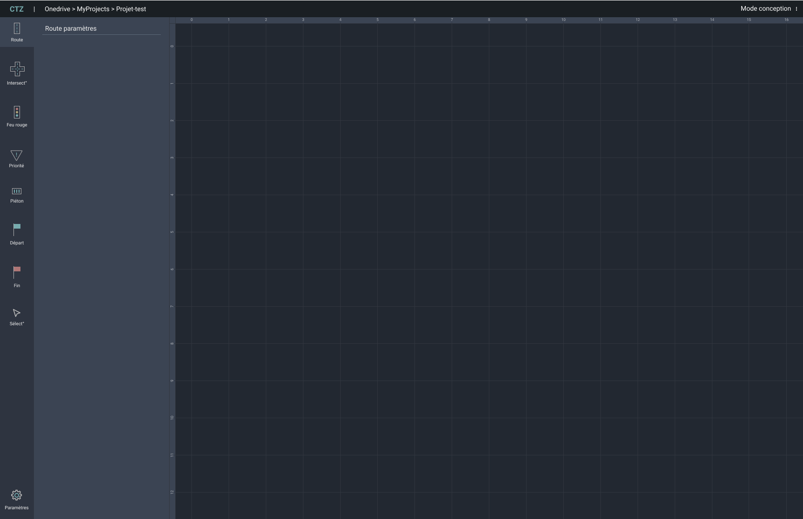



- [GitHub du projet](https://github.com/Mathisadi/CTZ)
- [UI / UX](https://www.figma.com/proto/dopHqMIiH66xRPQrgtlRmr/CTZ?node-id=116-7&p=f&t=Zi46zE4Hgid765ho-0&scaling=min-zoom&content-scaling=fixed&page-id=1%3A5)
- [Figma de l'interface](https://www.figma.com/proto/dopHqMIiH66xRPQrgtlRmr/CTZ?node-id=1-4&p=f&t=Zi46zE4Hgid765ho-0&scaling=scale-down&content-scaling=fixed&page-id=0%3A1)





- [x] Faire la maquette Figma
- [ ] Front
- [x] Menu
- [x] Edition : Toolbar
- [x] Edition : Parametre
- [x] Edition : Grid
- [x] Edition : Drag
- [ ] Edition : Zoom
- [ ] Lecture
- [ ] Simulation





| Date           | Heures passées | Indications              |
| -------------- | -------------- | ------------------------ |
| Samedi 11/01   | 2H             | Maquette Figma           |
| Dimanche 12/01 | 2H             | Initialisation du projet |
| Samedi 18/01   | 2H             | Menu                     |
| Dimanche 19/01 | 1H30           | Toolbar                  |
| Mercredi 22/01 | 2H30           | Grid + drag              |
| Mercredi 29/01 | 0H30           | Rédaction POK            |
|                |                |                          |
| Total          | 10H30          |                          |

Sur ce sprint, j'ai essayé d'anticiper le fait que le développement de l'appli serait long. En revanche, c'est toujours frustrant de voir que cet exercice avance lentement. Je vais me concentrer sur mon sprint 2 afin de finir le développement de l'application.




- [x] Front
- [x] Edition
- [x] Lecture
- [x] Simulation
- [ ] Menu
- [x] Connexion avec le back
- [c] Interface intéractive





| Date           | Heures passées | Indications                                         |
| -------------- | -------------- | --------------------------------------------------- |
| Mercredi 19/02 | 3H             | Front 1                                             |
| Vendredi 21/02 | 3H             | Front 2                                             |
| Dimanche 23/02 | 5H             | Front 3 (fin)                                       |
| Dimanche 02/03 | 3H             | Automatisation des fichier .json                    |
| Vendredi 07/03 | 3H             | Compatibilité avec le back et page simulation front |
| Samedi 08/03   | 2H             | Test de l'application                               |
| Mercredi 29/01 | 1H             | Rédaction POK                                       |
|                |                |                                                     |
| Total          | 20H            |                                                     |

Sur ce sprint j'ai pu réaliser 20h (remplacement de monitoring) j'ai profité de ce temps pour terminer le front, cependant la multitude de variables et de components ont rendu la tâche longue et fastidieuse. Infine, je n'ai pas eu le temps de faire le menu de l'appli car la création de l'API et les corrections de bugs engendrés m'ont pris trop de temps.


## ✅ Obejectifs du POK

Pour rappel j'ai créé une simulation du trafic routier en python lors du [POK 1](../temps-1) et [POK 2](../temps-2). Cependant, il est actuellement difficile de créer de nouvelles routes, il faut pour cela modifier à la main tout le fichier var. L'objectif est donc de concevoir une application facilitant la création de nouvelles routes.

## Etape 1 - Maquette Figma

Grâce aux bases aquises lors du cours UI/UX et de mon [MON 2.2](./../mon/temps-2.2) j'ai pu réaliser la maquette de l'interface graphique sur Figma. J'ai opté pour un mode sombre (possibilité de faire un mode clair) aux apparences de l'application AutoCad.

Afin de gagner du temps, j'ai réalisé seulement les deux premières pages de l'application, les suivantes étant du même style.

Menu : Cette page a pour but de présenter les projets en cours, il doit être possible de créer ou d'ouvrir un projet facilement. Et l'on doit pouvoir visualiser un aperçu des projets récents sans les ouvrir.

    

Edition : Une fois le projet ouvert, il doit être possible de modifier ses éléments. Pour cela l'ensemble des éléments sont listés dans la toolbar à gauche, et un menu listant les paramètres doit s'ouvrir. Le dessin de la route se fera sur une grille centrale.

    

Lecture : Vue permettant de vérifier un projet sans le modifier, non accés aux outils mais grille plus large.

Simulation : Une fois une route créée l'on doit pouvoir visualiser le mouvement des voitures, avancer plus vite stopper reculer (comme un lecteur audio).

## Etape 2 - Frontend

Une fois la maquette réalisée il faut la rendre vivante. Pour cela j'utilise le framework vue. Etant novice avec ce framework et en front dev, le développement me prend du temps.

Pendant le sprint 2 j'ai eu le temps de bien avancer le front, même si la création des variables et des components a été long. Finalement, je suis assez satisfait du rendu bien qu'il manque encore certain éléments.

## Etape 3 - Connexion back et front FastAPI

Afin de connecter mon back et mon front j'ai opté pour FastAPI car il est simple d'utilisation et tout mon back est en python. L'objectif de cette API est de récupérer les infos inscrites dans l'interface et de créer les matrices variables pour note back. Pour cela j'ai réalisé des créations de fichier .json qui sont facile à manipuler.

## Etape 4 - Simulation

Il manque une dernière étape afficher la simulation dans mon interface. Pour cela j'ai opté pour la simplicité j'enregistre la simulation en fichier mp4 et je la stream sur mon front. Je suis conscient que ce n'est pas la meilleure solution mais par manque de temps je suis obligé de me contenter de cela.

## Conclusion et retour d'expérience

Ce POK conclut mon projet sur le trafic routier. J'ai pu réaliser une interface permettant de créer différentes situations et d'observer comment les automobilistes réagiraient dans cet environnement.

Ce projet, qui m'aura pris trois POK à réaliser m'a permi de développer mes compétences en informatique. Grâce à lui, j'ai pu appliquer concrètement les notions vues en cours, notamment l'utilisation d'outils tels que Figma, Bubble et GitHub.
