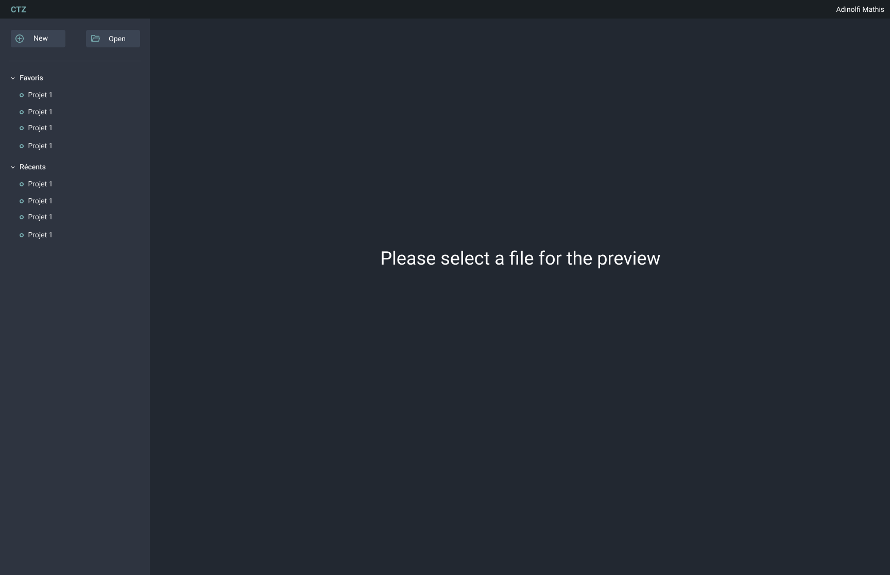



- [GitHub du projet](https://github.com/Mathisadi/CTZ)
- [UI / UX](https://www.figma.com/proto/dopHqMIiH66xRPQrgtlRmr/CTZ?node-id=116-7&p=f&t=Zi46zE4Hgid765ho-0&scaling=min-zoom&content-scaling=fixed&page-id=1%3A5)
- [Figma de l'interface](https://www.figma.com/proto/dopHqMIiH66xRPQrgtlRmr/CTZ?node-id=1-4&p=f&t=Zi46zE4Hgid765ho-0&scaling=scale-down&content-scaling=fixed&page-id=0%3A1)





- [x] Faire la maquette Figma
- [ ] Front
- [x] Menu
- [x] Edition : Toolbar
- [x] Edition : Parametre
- [x] Edition : Grid
- [x] Edition : Drag
- [ ] Edition : Zoom
- [ ] Lecture
- [ ] Simulation





| Date           | Heures passées | Indications              |
| -------------- | -------------- | ------------------------ |
| Samedi 11/01   | 2H             | Maquette Figma           |
| Dimanche 12/01 | 2H             | Initialisation du projet |
| Samedi 18/01   | 2H             | Menu                     |
| Dimanche 19/01 | 1H30           | Toolbar                  |
| Mercredi 22/01 | 2H30           | Grid + drag              |
| Mercredi 29/01 | 0H30           | Rédaction POK            |
|                |                |                          |
| Total          | 10H30          |                          |

Sur ce sprint, j'ai essayé d'anticiper le fait que le développement de l'appli serait long. En revanche, c'est toujours frustrant de voir que cet exercice avance lentement. Je vais me concentrer sur mon sprint 2 afin de finir le développement de l'application.


## ✅ Obejectifs du POK

Pour rappel j'ai créé une simulation du trafic routier en python lors du [POK 1](../temps-1) et [POK 2](../temps-2). Cependant, il est actuellement difficile de créer de nouvelles routes, il faut pour cela modifier à la main tout le fichier var. L'objectif est donc de concevoir une application facilitant la création de nouvelles routes.

## Etape 1 - Maquette Figma

Grâce aux bases aquises lors du cours UI/UX et de mon [MON 2.2](./../mon/temps-2.2) j'ai pu réaliser la maquette de l'interface graphique sur Figma. J'ai opté pour un mode sombre (possibilité de faire un mode clair) aux apparences de l'application AutoCad.

Afin de gagner du temps, j'ai réalisé seulement les deux premières pages de l'application, les suivantes étant du même style.

Menu : Cette page a pour but de présenter les projets en cours, il doit être possible de créer ou d'ouvrir un projet facilement. Et l'on doit pouvoir visualiser un aperçu des projets récents sans les ouvrir.

    

Edition : Une fois le projet ouvert, il doit être possible de modifier ses éléments. Pour cela l'ensemble des éléments sont listés dans la toolbar à gauche, et un menu listant les paramètres doit s'ouvrir. Le dessin de la route se fera sur une grille centrale.

    

Lecture : Vue permettant de vérifier un projet sans le modifier, non accés aux outils mais grille plus large.

Simulation : Une fois une route créée l'on doit pouvoir visualiser le mouvement des voitures, avancer plus vite stopper reculer (comme un lecteur audio).

## Etape 2 - Frontend

Une fois la maquette réalisée il faut la rendre vivante. Pour cela j'utilise le framework vue. Etant novice avec ce framework et en front dev, le développement me prend du temps. Actuellement j'ai terminé le menu et la page édition. Petite démo :

<video controls src="Demo.mp4"></video>
