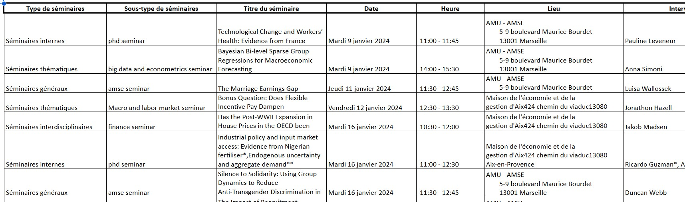



Des bases en python sont nécessaires pour ce POK.
De plus, des bases en HTML et CSS sont préférables pour bien comprendre la structure des pages.





${toc}



Pour mon projet de filière métier, nous réalisons un bilan carbone. Pour cette structure, beaucoup d'informations sont disponibles sur leur site web. Ainsi, pour pouvoir faciliter la récupération de données, j'aimerais apprendre le scraping et comment l'utiliser pour récupérer des données qui sont utilisables et complétables par la suite.

## Tâches

### Sprints

#### Sprint 1

- [x] Qu'est ce qu'est réellement le scraping ?
- [x] Apprendre les bases du scraping
- [x] Quelles en sont les limites
- [x] Coder la récupération des données

#### Sprint 2

- [x] Algorithme de récupération des données
- [x] Traitement des données
- [x] Travail sur l'utilisation des données

### Horodatage

Toutes les séances et le nombre d'heure que l'on y a passé.

| Date | Heures passées | Indications |
| -------- | -------- |-------- |
| 14/01 | 30 min | Lecture des mons précédents sur le sujet et étude rapide du site à scraper |
| 16/01 | 1 h 15 | Définition du scraping et recherches sur ces limites |
| 17/01 | 2 h | Suivi d'une formation sur le scraping |
| 20/01 | 1 h | Suivi d'une formation sur le scraping |
| 22/01 | 1 h 30 | Suivi d'une formation sur le scraping |
| 23/01 | 1 h 45 | Travail sur le site de l'AMSE et algorithme de scraping |
| 27/01 | 2 h | Travail sur le site de l'AMSE et algorithme de scraping |
| 28/02 | 1 h 20 | Travail sur le site de l'AMSE et algorithme de scraping |
| 01/03 | 2 h 40 | Travail sur le site de l'AMSE et algorithme de scraping |
| 02/03 | 2 h | Travail sur le site de l'AMSE et algorithme de scraping |
| 03/03 | 1 h 30 | Travail sur le site de l'AMSE et algorithme de scraping, mise en page des données et automatisation |
| 04/03 | 2 h 30 | Mise en page des données et automatisation |

## Contenu

### Premier Sprint

#### Le scraping

Pour comprendre un peut mieux de quoi il en retourne, j’ai commencer par lire l’article de Cloudflare sur le sujet : [Qu'est ce que le scrping de données ?](https://www.cloudflare.com/fr-fr/learning/bots/what-is-data-scraping/).

Ainsi, le craping de données est une technique qui permet, à l’aide d’un programme informatique, d’extraire des données d’un autre programme, généralement celui d’un site web.

Il y a trois étapes clés au scraping : 

1. Envoie d’une requette http GET à un site web
2. Analyse du document HTML reçu
3. Extraction des données et conversion dans un certain format

Le scraping est le plus souvent utilisé pour récupéré du contenu spécifique d’un site web, des prix ou encore des contacts.

#### Légalité du scraping

Pour comprendre ce sujet, j’ai lu l’article de datadome : [Le web scraping est-il illégal ?](https://datadome.co/fr/guides-fr/scraping-fr/le-web-scraping-est-il-illegal/) et regardé la vidé de Fireship : [Am I going to jail for web scraping ?](https://www.youtube.com/watch?v=8GhFmQPZAlo).

Dans la plupart des pays, le web scraping n’est pas illégal. Cependant l’utilisation des données récoltées peut être punissable juridiquement. Et il faut rester attentif, certains sites restreignent ou interdisent explicitement le web scraping sur leurs données.

Les activités liées au webscrping qui sont à la limite de la légalité sont les suivantes : 

- Se connecter à un site web et télécharger des données
- La collecte de données personnelles ou des informations sensibles sans consentement
- Le scraping de contenu protégé par des droits d’auteur ou propriétaire sans consentement explicite
- Le scraping des données à partir de zones restreintes ou privées d’un site web
- Revendre ou distribuer les données récupérées
- La collecte de données à des fins discriminatoires, contraires à l’éthique, ou malveillantes
- Le scraping non autorisé de sites web ou de bases de données gouvernementales

En France, certaines de ces activités sont concernés par le RGPD, notamment tout ce qui consiste en la récolte de données personnelles sans consentement explicite.

#### Apprendre le scraping de données

Pour apprendre à scraper, j’ai utiliser la formation proposée par Docstring : [Scraping avec Python : Formation complète 2024](https://www.youtube.com/watch?v=sOAZpHDEdkg).

Je conseille vivement cette formation, elle est assez complète à la fois sur les bases théoriques du scraping mais elle permet aussi de mettre en valeur les différentes bibliothèques qui peuvent être utiles pour le scraping et d'apprendre petit à petit les différentes fonctions importantes à l'aide d'exemples et d'exercices.

### Second Sprint

Le second sprint s'est plus concentré autour de l'algorithme, la récolte de donnée, la mise en page et l'automatisation du script pour réutilisation future.

#### Etude du site du labo

Le but de ce MON était de récupérer toutes les données utilisables qui sont présentes sur le site de l'AMSE à propos des différents séminaires utilisés.
Pour cela, j'ai étudié la structure du site afin de bien comprendre comment aller chercher les informations à l'aide de l'outil "Inspecter" du navigateur.

Le premier défi auquel j'ai du faire face a été de gérer le scroll infini de la page évènement. En effet, tous les évènements ne s’affiche pas d’un coup sur la page et il faut scroller pour les afficher, ils ne sont même pas loader dans le code html

Ce qu’il se passe sur le site c'est que à chaque fois que l’on scroll, c’est comme si le site cliquait sur le lien de la page suivante et envoyait une requête pour l’obtenir mais les informations s’affichent directement sur la page initiale pour donner une impression de scroll infini. Ce qui me pose problème pour aller récupérer d'un coup toutes les données sur les séminaires. 

Pour résoudre ce problème, j'ai utilisé la structure de la page. En effet, le lien de la sous-page suivante est contenu dans le code html de la page, ainsi, je peux le sélectionner et envoyer une requête pour cette nouvelle page. Cela marche pour toutes les pages sauf pour la dernière qui ne possède pas ce lien. Ainsi, il suffit de faire une fonction qui va chercher ce lien pour chaque page et traiter le cas où cette fonction ne peut rien renvoyer.

Pour cela, j'ai utilisé la fonction suivante : 
```python
def next_page_url (soup) :
    next_page_link_div = soup.find('li', class_="pager__item").find('a')
    if next_page_link_div == None :
        return (None)
    else : 
        next_page_link_half = next_page_link_div['href']
        next_page_full_url = urljoin(url_AMSE,next_page_link_half)
        return(next_page_full_url)
```

A part pour cela, la structure était assez simple. Pour chaque évènement, il est constitué en bloc avec la plupart des information disponibles rapidement dont le lien vers la page de renseignement.
En naviguant sur la page de renseignement, je peux facilement récupérer quelques informations en plus qu'il me manquait.

La deuxième grosse difficulté que j'ai pu rencontrer a été que en fonction du type d'évènements, la structure n'est pas excatement la même. Pour gérer cela, j'ai récupérer le type de séminaire pour chacun d'entre eux et en fonction de celui-ci, j'ai trié les séminaires et suis allé chercher les informations relatives à ce type de séminaire.

#### Algorithme

Pour simplifier mon code, j'ai décidé de le découper en beaucoup de fonctions différentes. Cela m'a permis de clarifier le code principal et ainsi de pouvoir le lire rapidement et l'automatiser plus facilement.

La structure du code est la suivante :
1. Requête de la page web
2. Lecture de la page : récupération du code HTML pour chaque séminaire et du lien de la page suivante
3. Répéter les deux premières étapes pour toutes les pages
4. Pour chaque séminaire et en fonction du type de séminaire, récupérer les informations correspondantes. Par exemple, le nom de l'intervenant, la date, ...

J'ai trié non seulement les évènements en fonction de leur type mais j'ai aussi séparé les évènements en distanciel et les évènements annulés grâce aux tags qu'ils avaient en plus.

#### Récupération des données

Pour récupérer les données, j'ai utilisé la bibliothèque BeautifulSoup. Celle-ci m'a permis avec les fonctions ```.find```, ```.find-all```, ```.text``` et ```.strip()``` et je me suis raccrochée aux différentes balises comme je le pouvais.

Malheuresement, la structure du site avait peut d'identifiant unique ou de balise unique. J'ai donc du être assez précise dans mes rattachements afin de ne pas viser des balises ```<div>``` dont la class serait la même.

#### Mise en page

Pour mettre en page les données que j'ai pu récupérer, j'ai utilisé la bibliothèque openpyxl.

Cette fonction m'a permis d'écrire, à partir du nom du fichier excel et de ces onglets, les informations importantes avec une certaine mise en forme.

Pour faciliter la lecture de l'excel et son exploitation, je me suis concentrée sur l'écriture des informations dans différents onglets en fonction du type de séminaire.

#### Automatisation du script et durabilité

Le but de cet exercice est de réaliser et faciliter un bilan carbone. Ainsi, mon but est aussi de créer un outil qui soit durable dans le temps et utilisable pour des bilans carbone au fur et à mesure des années. Pour cela, j'ai mis en place quelques petites modifications pour le permettre.

Dans un premier temps, j'ai ajouter de la récupération d'information dans l'excel. Ainsi, dans une feuille "Inputs", la personne souhaitant scrapper les données peut changer le lien de la page à scrapper. Elle doit quand même toujours respecter la structure pour que tout fonctionne mais comme cela on peut changer l'année à scrapper.

Pour pouvoir écrire dans l'excel, il faut que celui-ci soit fermer. De plus, pour faire face à la modification humaine, j'ai ajouté quelques fonctions de vérification. Lorsque l'on lance le programme, une première fonction vérifie que le fichier ne soit pas ouvert. S'il l'est on arrête le code en renvoyant un message demandant de le fermer. De plus, une fonction se charge de vérifier si jamais les feuilles que l'on appelle sont toujours là et de renvoyer un message si ce n'est pas le cas.

Enfin, la récupération des données ne sera pas forcément faite une fois par an mais parfois à des intervalles plus réguliers. Ainsi, j'ai voulu ajouter une fonction qui vérifie les dates et en les comparant à celles données dans l'excel inclue ou non le séminaire dans la liste. Cela permet de faire moins de requêtes et d'alléger le temps d'exécution du programme.

Pour la suite et finir ce projet, mon but va être de préparer une notice à deux niveaux. Cette notice aura pour premier but de montrer les étapes et les obligations pour pouvoir exécuter le programme sans soucis. J'aimerais aussi inclure dans cette notice une rapide explication du programme et des fonctions afin que si il doit être revu ou corriger suite à une modification du texte, cela soit faciliter.

#### Résultat final

Le code produit est disponible sur le lien suivant :

[Github des exercices et du projet](https://github.com/AlixDureault/Scraping-pour-bilan-carbone)

La page pour les séminaires donne ceci :

