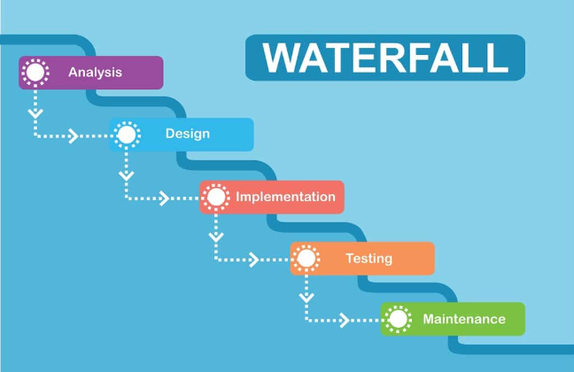
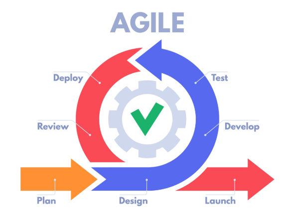



Pas de prérequis.




[Scrum vs. waterfall: which methodology is right for your project?](https://www.float.com/resources/scrum-vs-waterfall)



### Objectif du MON 

Étudier et adapter les méthodologies Scrum et les outils d'estimation comme le Planning Poker et la suite de Fibonacci pour structurer efficacement les POK et MON. 

| Date       | Heures passées | Indications                                             | 
|------------|----------------|--------------------------------------------------------|
| 17/01/2025 | 2h             | Lecture sur les concepts de Scrum et Fibonacci. |
| 18/01/2025 | 2h             | Étude des cas pratiques pour appliquer le Planning Poker. |
| 24/01/2025 | 2h             | Rédaction d'exemples concrets pour l'application dans les POK et MON. |
| 24/01/2025 | 2h             | Analyse critique et synthèse des résultats|
| 25/01/2025 | 1.5h           | Préparation de recommandations |

**Total : 9.5h.** 

### Présentation des Méthodes de Gestion de Projet 

Il existe deux grandes approches en gestion de projet : la **méthodologie linéaire**, également appelée **méthodologie Waterfall**, et la **méthodologie Agile**, dont Scrum particulièrement adaptée aux POK et MON.  

---  

### **Méthodologie linéaire (Waterfall)**  

Le plus souvent on utilise cette approche dans les cas suivants :  

- Les étapes du projet sont bien définies dès le départ.  

- Les besoins du client ne changent pas pendant la réalisation.  

- Chaque phase dépend de la précédente et ne peut être modifiée une fois achevée.  

**Exemple :**  

Dans la construction d’une maison, le client précise à l’avance ses attentes (taille, design) et ne peut pas demander un changement majeur, comme transformer la maison en villa, une fois les travaux terminés.  

[image recupérée sur ici](https://geniorama.com/methode-cascade-waterfall-methode-gestion-projet-agile/)

---  

### **Méthodologie Agile**  

Cette approche est plus adaptée à des environnements où :  

- Les besoins du projet peuvent évoluer avec le temps.  

- Le projet est complexe ou incertain nécessitant des ajustements fréquents.  

- On souhaite livrer des fonctionnalités progressivement et recueillir des retours rapidement.  

**Exemple :**  

Dans le développement logiciel, un client peut demander une fonctionnalité aujourd’hui et décider de la modifier ou de l’abandonner demain. Agile permet d’intégrer ces changements sans perturber le projet.  

[image recupérée sur ici ](https://etcdigital.fr/blog/quest-ce-que-la-methodologie-agile/)

**Pourquoi Agile pour les POK et MON ?**  

Les projets POK et MON sont souvent réalisés dans un temps limité, avec des ajustements possibles en cours de route. Agile permet de travailler de manière itérative, en s'adaptant aux imprévus et en livrant des résultats après chaque cycle.  

Pour cette partie, j'ai consulté l'article "Scrum vs. waterfall: which methodology is right for your project?" sur le site de Float lien au niveau des sources.

---  

### **Méthodologie Scrum**  

Scrum est une approche Agile itérative et collaborative, particulièrement adaptée aux projets évolutifs comme les POK et MON.  

---  

#### **Concepts Clés**  

 **Backlog :**  

- Une liste de toutes les fonctionnalités et tâches nécessaires pour le projet.  

On a deux types principaux :  

- *Backlog produit* qui regroupe toutes les fonctionnalités à long terme.  

- *Backlog du sprint* qui liste des tâches spécifiques à réaliser pendant un sprint.  

  

Documentation officielle de Scrum : *"The Product Backlog is an ordered list of everything that might be needed in the product and is the single source of requirements for any changes to be made to the product."*  Voir les sources.

  

**Sprint :**  

- Une période fixe (1 à 4 semaines) où un sous-ensemble des tâches du backlog est réalisé.  

- L'objectif : Fournir un livrable fonctionnel au client à la fin de chaque sprint.  

 **Planning Poker :**  

- Méthode d'estimation des tâches basée sur la suite de Fibonacci (1, 2, 3, 5, 8, etc.).  

- Chaque membre de l'équipe (ou vous-même, si vous travaillez seul) évalue la complexité d'une tâche.  

  

1. Une tâche est proposée : "Créer un système de drag-and-drop pour les cartes".  

2. Les membres de l'équipe votent en secret avec une carte Fibonacci.  

3. Si les votes varient beaucoup (e.g., 2 et 8), ils discutent pour harmoniser l'évaluation.  

  

 **Rétrospective de Sprint :**  

- Réunion à la fin du sprint pour analyser ce qui a bien fonctionné, ce qui doit être amélioré et ajuster les stratégies.  

---  

#### **Autres concepts Clés**  

1. **Les Rôles dans Scrum :**   

- **Product Owner**, c'est lui ou elle qui priorise les tâches et s’assure que l’équipe travaille sur les fonctionnalités ayant le plus de valeur pour le projet.  

- **Scrum Master**, c'est lui ou elle qui garantit que l’équipe suit la méthodologie Scrum.  

- **Équipe Scrum**, Composée des membres responsables de l’exécution technique.  

Dans le cas d’un projet individuel (POK ou MON), vous pouvez cumuler ces rôles.  

1. **Livraison par incréments :**  

- Produisez des résultats tangibles après chaque sprint, même s’ils sont incomplets (*Minimum Viable Product* ou MVP).  

3. **Gestion des impédiments :**  

  Notez et résolvez les obstacles rencontrés :  

- Manque de compétence sur une technologie.  

- Difficultés dans la gestion du temps.  

Documentez les solutions pour éviter qu’elles ne se répètent.  

1. **Méthode MoSCoW pour Prioriser :**  

- **Must Have** : Fonctionnalités indispensables.  

- **Should Have** : Fonctionnalités importantes mais non critiques.  

- **Could Have** : Fonctionnalités supplémentaires si le temps le permet.  

- **Won’t Have** : Fonctionnalités exclues pour cette version.  

---  

### **Application concrète pour les POK et MON**  

#### **Étapes concrètes pour appliquer Scrum dans les POK et MON (Exemple mon POK 3)**  

---  

##### **1. Préparer le backlog du projet**  

 Il regroupe toutes les fonctionnalités nécessaires à votre projet sous forme de *user stories*.  

**Exemple pour un POK de creation d'un interface graphique avec PyQt(MON POK) :**  

- User Story 1 : *"En tant qu’utilisateur, je veux pouvoir créer des tableaux pour organiser mes tâches."*  

- User Story 2 : *"En tant qu’utilisateur, je veux pouvoir ajouter et supprimer des cartes dans mes tableaux."*  

- User Story 3 : *"En tant qu’utilisateur, je veux que mes données soient enregistrées entre les sessions grâce à une base de données."*  

- User Story 4 : *"En tant qu’utilisateur, je veux que l’interface soit ergonomique et personnalisée avec des styles professionnels."*  

 

 

Les user stories doivent être courtes, claires et centrées sur les besoins de l'utilisateur final.  

 

 

Ne surchargez pas votre backlog avec des tâches non essentielles. Priorisez les tâches critiques pour un MVP (Minimum Viable Product).  

 

---  

##### **2. Décomposer les user stories en tâches spécifiques**  

Chaque user story doit être divisée en tâches plus petites.  

 

Une tâche trop grande ou complexe est difficile à estimer et à réaliser. Décomposer en tâches plus petites améliore la clarté.  

 

**Exemple tâches associées pour "Créer des tableaux dynamiques" :**  

1. Étudier la documentation PyQt sur les widgets (`QVBoxLayout` et `QTableWidget`).  

2. Prototyper une interface avec des tableaux statiques.  

3. Ajouter une fonctionnalité pour créer dynamiquement des tableaux.  

4. Tester et corriger les bugs liés aux tableaux.  

5. Ajouter des styles avec QSS.  

 

Assurez-vous que chaque tâche est indépendante et peut être réalisée sans dépendance excessive à d'autres tâches.  

 

---  

##### **3. Estimer le temps avec le Planning Poker et la suite de Fibonacci**  

###### **Étapes pour appliquer le Planning Poker :**  

1.  Préparez une liste de toutes les tâches du backlog à estimer.  

2. Attribuer des points Fibonacci à chaque tâche ( Estimez la complexité ou le temps nécessaire à chaque tâche) 

| Points Fibonacci | Temps estimé |
|-------------------|--------------|
| 1                | 30 minutes   |
| 2                | 1 heure      |
| 3                | 1,5 heures   |
| 5                | 2,5 heures   |
| 8                | 4 heures     |
| 13               | 6,5 heures   |

 

La suite de Fibonacci est une séquence mathématique où chaque nombre est la somme des deux précédents : 1, 2, 3, 5, 8, 13, etc. Elle est utilisée pour estimer la complexité des tâches.  

 

3. **Calculer le temps total estimé** : 
   
   Additionnez les estimations pour planifier les sprints.  

###### **Tableau d'estimation pour un POK :**  

| Tâche                                   | Points Fibonacci | Durée estimée |
|----------------------------------------|------------------|---------------|
| Étudier la documentation PyQt          | 2                | 1h            |
| Prototyper une interface avec tableaux | 5                | 2,5h          |
| Ajouter des fonctionnalités dynamiques | 8                | 4h            |
| Tester et corriger les bugs            | 3                | 1,5h          |
| Styliser les tableaux avec QSS         | 3                | 1,5h          |
| **Total**                              | **21**           | **10,5h**     |
 

  

- Divisez les tâches trop complexes (13+ points) en sous-tâches plus gérables.  

- Ajoutez une marge de 10-20 % pour les imprévus.  

- Réalisez des estimations collectives si possible pour réduire les biais individuels.  
  

L'article "Planning Poker: An Agile Estimating and Planning Technique" sur Mountain Goat Software m'a aidé à comprendre l'utilisation de la méthode Planning Poker avec la séquence de Fibonacci, lien au niveau des sources.

---  

##### **4. Planifier les Sprints**  

Avec les estimations prêtes, divisez le projet en sprints avec des objectifs clairs.  

###### **Exemple pour mon POK (20h) :**  

**Sprint 1 (10h) : Création de l’interface de base**  

 **Objectifs :**  

- Étudier les composants PyQt nécessaires.  

- Prototyper une interface simple avec des tableaux statiques.  

- Ajouter des styles avec QSS.  

 **Tâches :**  

- Étudier la documentation PyQt (2h).  

- Prototyper une interface (5h).  

- Ajouter des styles avec QSS (2h).  

- Tester et ajuster les interactions utilisateur (1h).  

 **Livrable attendu :**  

- Une interface fonctionnelle comprenant des tableaux statiques, stylisée et prête pour l’ajout de fonctionnalités dynamiques.  

**Sprint 2 (10h) : Ajouter les fonctionnalités avancées et intégrer SQLite**  

 **Objectifs :**  

- Intégrer SQLite pour assurer la persistance des données.  

- Ajouter des fonctionnalités de gestion dynamique des cartes.  

- Tester et optimiser les performances.  

 **Tâches :**  

- Configurer SQLite et créer une base de données pour les tableaux et les cartes (2h).  

- Ajouter la gestion des cartes dynamiques dans l’interface (4h).  

- Tester les fonctionnalités d’ajout et de suppression de cartes (2h).  

- Optimiser les requêtes SQLite pour un meilleur temps de réponse (1h).  

- Finaliser les styles pour rendre l’expérience utilisateur fluide et ergonomique (1h).  

 **Livrable attendu :**  

- Une application complète avec une interface utilisateur, intégrant des tableaux et des cartes gérés via SQLite, prête à être présentée ou utilisée.  

---  

###### **Suivi et ajustements durant les Sprints**  

  **Daily Stand-ups :**  

- Auto-évaluations quotidiennes pour identifier les blocages et ajuster les priorités.  

 **Rétrospectives de Sprint :**  

- Analyse de ce qui a bien fonctionné et des axes d’amélioration après chaque sprint.  

 **Burndown Charts :**  

- Suivez visuellement le travail restant pour mieux anticiper les retards.  

 

 

10- 15 minutes maximum où vous allez répondre à trois questions : 

Qu'ai-je fait hier ? 

Que vais-je faire aujourd'hui ? 

Quels sont les obstacles ?  

 

Ne sautez pas les rétrospectives de sprint. C'est un bon moment pour identifier ce qui fonctionne et ce qui peut être amélioré.  

  L'article "How to Apply Scrum to Personal Projects" sur ClickUp m'a été utile voir la partie source.

---  

### **Autres avantages de Scrum pour les POK et MON**  

1. Intégration rapide des changements dans le projet.  

2. Structure les étapes de travail pour éviter les retards.  

3. Chaque sprint produit un résultat. 

 ## Sources :

- [Scrum vs. waterfall: which methodology is right for your project?](https://www.float.com/resources/scrum-vs-waterfall)
- [Why Product Owner should treat Product Backlog with consideration - ligne 1]( https://www.merixstudio.com/blog/why-product-owner-should-treat-product-backlog-consideration)
- [How to Apply Scrum to Personal Projects](https://clickup.com/blog/scrum-personal-projects/)
- [Planning Poker: An Agile Estimating and Planning Technique](https://www.mountaingoatsoftware.com/agile/planning-poker)


