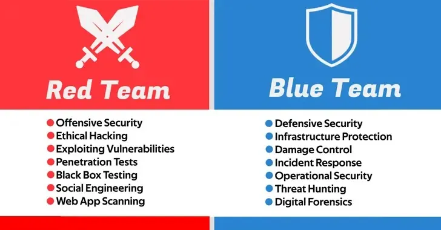


- Connaissances de base en réseaux informatiques
- Compréhension des principes de sécurité informatique



- [OWASP Top 10](https://owasp.org/www-project-top-ten/)
- [ANSSI - Guides essentiels et bonnes pratiques](https://cyber.gouv.fr/guides-essentiels-et-bonnes-pratiques-de-cybersecurite-par-ou-commencer)


### Objectif du MON

Présenter une vue complète des cyberattaques, leurs mécanismes, et les stratégies de défense appropriées.

| Date       | Heures passées | Indications                                             |
|------------|----------------|--------------------------------------------------------|
| 28/02/2025 | 4h            | Recherche sur les types d'attaques et protocoles        |
| 01/03/2025 | 2h            | Étude des vulnérabilités web et mémoire                 |
| 01/03/2025 | 3h            | Analyse des processus de réponse aux incidents          |
| 02/03/2025 | 2h            | Étude et synthèse sur le rôles des équipes de sécurité             |

**Total : 11h**

J'ai récemment publié sur Medium un article qui parle de [l’affaire XZ](https://medium.com/@babacaramar02/laffaire-xz-l-infiltration-silencieuse-qui-a-failli-tout-changer-ae4d3dc8c765), une attaque qui a failli bouleverser le monde entier. Cet article va sûrement vous donner envie de bien lire et comprendre mon MON .

## **1. C'est quoi une Cyberattaque ?**


Une cyberattaque est une action malveillante visant à compromettre la **disponibilité**, l'**intégrité**, la **confidentialité**, et la **traçabilité** des informations et systèmes informatiques. Ces attaques peuvent exploiter des failles humaines ou techniques pour atteindre leurs objectifs.


### **1.1 Types d'attaques**

- **Ingénierie sociale**, une manipulation psychologique des individus pour obtenir des accès non autorisés (ex. phishing, fraude au président).
- **Exploitation de vulnérabilités techniques**, une attaques utilisant des failles connues (ex. injection SQL, XSS, attaques sur les API).
- **Attaques réseau**, un déni de service distribué (DDoS), interception de données (Man-in-the-Middle), empoisonnement du cache DNS.
- **Malwares**, des logiciels malveillants tels que les ransomwares, chevaux de Troie et rootkits.
- **Espionnage et sabotage**, des cyberattaques organisées par des États ou des groupes pour voler des informations ou causer des dommages.

Pour cette partie, j'ai consulté le site [fortinet](https://www.fortinet.com/fr/resources/cyberglossary/types-of-cyber-attacks)

### **1.2 Acteurs impliqués**

- **Hacker isolé** qui agit seul avec des compétences variables, souvent pour le profit.
- **Groupes cybercriminels** une organisations recherchant un gain financier (ex. rançongiciels).
- **Hacktivistes** un attaquent pour des causes idéologiques ou politiques.
- **Groupes étatiques** un cyberespionnage, attaques contre des infrastructures critiques.


Je me suis basé sur le cours de Mathieu SCHIANO.

## **2. Attaques sur les Protocoles Réseau**

### **2.1 Focus aux Protocoles Réseau**

Les communications réseau reposent sur une architecture en couches, notamment le modèle **ISO/OSI** et **TCP/IP**. Chaque couche a un rôle spécifique et inclut des protocoles vulnérables aux attaques.




| Couche ISO/OSI | Couche TCP/IP | Exemples de Protocoles |
|----------------|---------------|------------------------|
| Physique       | -             | Ethernet, WiFi         |
| Liaison        | -             | MAC, ARP               |
| Réseau         | Internet      | IPv4, IPv6             |
| Transport      | Transport     | TCP, UDP               |
| Session        | -             | -                      |
| Présentation   | -             | -                      |
| Application    | Application   | HTTP, FTP, SMTP        |




Chaque couche possède son propre système d'adressage (**MAC, IP, ports**), ce qui est exploité dans diverses attaques.


Ce model est disponible sur [Wikipedia](https://fr.wikipedia.org/wiki/Mod%C3%A8le_OSI)

### **2.2 Types d'attaques réseau**

#### **2.2.1 Déni de Service (DoS/DDoS)**

Le but d'une attaque DoS est de rendre un service inaccessible en surchargeant ses ressources.

**Exemples :**
1. **Ping of Death** : Envoi de paquets ICMP de taille supérieure à 65535 octets.

```bash
ping -l 65527 <cible>   # Windows
ping -s 65527 <cible>   # Unix
```



Le **Ping of Death** consiste à envoyer un **paquet ICMP** (ping) d’une taille anormalement grande (supérieure à 65 535 octets).
- Les anciennes implémentations du protocole ICMP ne pouvaient pas gérer des paquets aussi gros, ce qui provoquait un **crash ou un redémarrage** de la machine cible.
- Cette attaque est aujourd’hui **moins efficace**, car les systèmes modernes ont mis en place des protections.


2. **SYN Flood**:  Envoi massif de requêtes SYN pour saturer la file d'attente des connexions TCP.

```text
Attaquant -> Serveur : SYN
Serveur -> Attaquant : SYN-ACK
Attaquant n'envoie jamais d'ACK
```

Une attaque **SYN Flood** consiste à envoyer un grand nombre de **paquets SYN** au serveur cible pour saturer sa file d’attente de connexions TCP.
- Normalement, une connexion TCP suit ce processus (**Three-Way Handshake**) :

  **a.** ***Client envoie un SYN** (demande d’ouverture de connexion).*
  **b.** ***Serveur répond avec SYN-ACK** (accusé de réception). *
  **c.** ***Client envoie un ACK**, et la connexion est établie.*

- **Dans une attaque SYN Flood**, l’attaquant **ne répond jamais au SYN-ACK**. Le serveur garde alors la connexion en attente, ce qui peut **épuiser ses ressources** et provoquer un déni de service.


1. **Smurf Attack** : Utilisation d'adresses IP spoofées pour envoyer des requêtes ICMP à une adresse broadcast.

```plaintext
Attaquant -> Broadcast : ICMP request (spoofed IP cible)
Tous les hôtes répondent à la cible (surcharge)
```

4. **Amplification DDoS** : Exploitation de protocoles comme DNS, NTP, SSDP pour amplifier le trafic envoyé à la cible.

#### **2.2.2 Sniffing et Spoofing**

1. **Sniffing** : Capture du trafic via une interface en mode promiscuous.

```shellscript
tcpdump -i eth0
```

Ce code permet de **capturer** tout le trafic circulant sur l’interface réseau `eth0`.
- `tcpdump` est un outil utilisé pour analyser les **paquets réseau** en temps réel.
- Cela permet à un attaquant de :
  - **Espionner les communications** sur un réseau non sécurisé.
  - **Capturer des identifiants et mots de passe non chiffrés** (HTTP, Telnet, FTP).


2. **ARP Spoofing** : Empoisonnement du cache ARP pour intercepter le trafic.


```shellscript
arpspoof -i eth0 -t <cible> <passerelle>
```

L’**ARP Spoofing** est une attaque où l’attaquant usurpe une adresse MAC pour intercepter ou manipuler le trafic réseau.
- Le protocole ARP est utilisé pour **associer une adresse IP à une adresse MAC**.
- L’attaque consiste à **empoisonner le cache ARP** d’un appareil cible, lui faisant croire que **l’adresse MAC de l’attaquant est celle du routeur**.
- Ainsi, **tout le trafic de la cible passe par l’attaquant**, qui peut alors :
  - **Espionner** les communications (sniffing).
  - **Modifier** les données en transit.
  - **Exécuter des attaques de type Man-in-the-Middle (MITM)**.


3. **IP Spoofing** : Envoi de paquets avec une fausse adresse source.


```c
struct iphdr *iph = (struct iphdr *) buffer;
iph->saddr = inet_addr("192.168.1.1"); // Spoofed source
```

Le **IP Spoofing** consiste à **usurper une adresse IP** en modifiant les en-têtes des paquets envoyés sur le réseau.
- L’attaquant modifie le champ `saddr` (source address) de l’en-tête IP pour qu’il semble provenir d’une **source légitime**.
- Cette technique est souvent utilisée pour :
  - **Dissimuler l’identité** d’un attaquant.
  - **Contourner les règles de pare-feu** qui filtrent certaines adresses IP.
  - **Lancer des attaques DDoS** via l’usurpation d’adresses IP valides.


### **2.3 Contre-mesures**

- **Filtrage ARP/DNS**
- **Firewall avec règles anti-SYN flood**
- **Utilisation de SYN Cookies** pour éviter les attaques SYN flood

## **3. Sécurité des Applications Web**

### **3.1 Vulnérabilités Courantes**

1. **Cross-Site Scripting (XSS)**

Injection de scripts malveillants dans les pages web.

```html
&script&alert('XSS');&/script&
```

Le **Cross-Site Scripting (XSS)** est une attaque où un attaquant injecte du **JavaScript malveillant** dans une page web.
- Ce script peut :
  - **Voler les cookies** d’authentification.
  - **Détourner des sessions utilisateur.**
  - **Afficher de fausses informations**.




- **Stocké** : Le script est enregistré dans la base et affiché à d'autres.
- **Reflété** : Le script est inclus dans une URL et exécuté.
- **DOM-based** : Injection à travers le DOM.



2. **Injection SQL**

 Exécution de requêtes SQL malveillantes.

```sql
SELECT * FROM users WHERE username = 'admin' OR '1'='1';
```

L’**injection SQL** est une attaque où un attaquant injecte du **code SQL malveillant** dans une requête pour manipuler une base de données.
- Ici, la condition `OR '1'='1'` est **toujours vraie**, ce qui permet :
  - D’accéder à **tous les comptes utilisateurs** sans connaître le mot de passe.
  - De **modifier ou supprimer des données**.
  - De **contourner l’authentification**.

3. **Cross-Site Request Forgery (CSRF)**

Exécution forcée d'une requête en profitant de la session active d'un utilisateur.

### **3.2 Contre-mesures**

- **Validation stricte des entrées**
- **Encodage et échappement des caractères spéciaux**
- **Utilisation de jetons CSRF**


## **4. Vulnérabilités des Chaînes de Format**

### **4.1 Principe**

Le problème survient lorsque des fonctions comme `printf()` sont utilisées sans format explicite.

```c
printf(argv[1]); // Vulnérable
```

Une faille **Format String** survient lorsque l’entrée utilisateur est utilisée dans `printf()` **sans format spécifié**.
- Un attaquant peut injecter des paramètres format (`%x`, `%n`) pour :
  - **Lire la mémoire du programme.**
  - **Écrire des valeurs arbitraires.**


### **4.2 Exploitation**

1. **Lecture mémoire**

```shellscript
./vuln "%x %x %x"
```

- Cette commande injecte `"%x %x %x"` dans un programme vulnérable (`vuln`) qui utilise `printf()` **sans format sécurisé**.
- Chaque `%x` **affiche une valeur mémoire** au format hexadécimal.
- Un attaquant peut **fouiller la mémoire** pour récupérer des informations sensibles (ex: adresses mémoire, mots de passe en clair).


2. **Ecriture mémoire avec %n**

```c
int i;
printf("Hello%n", &i); // i == 5 (nombre de caractères imprimés)
```

- `%n` **écrit en mémoire** le nombre de caractères imprimés avant son appel.
- Un attaquant peut **modifier une variable ou une adresse mémoire critique**, entraînant un **comportement malveillant**.


### **4.3 Contre-mesures**

- Utiliser des formats fixes (`printf("%s", argv[1])`)
- Désactiver `%n` via des options de compilation

## **5. Dépassements de Mémoire Tampon (Buffer Overflows)**

### **5.1 Principe**

Se produit lorsqu'une donnée dépasse la taille allouée et écrase d'autres parties de la mémoire.

```c
char buffer[64];
gets(buffer); // Pas de contrôle de taille
```

Un **buffer overflow** se produit lorsqu’une entrée utilisateur dépasse la mémoire allouée.
- Ici, `gets()` ne contrôle pas la taille de l’entrée, ce qui permet à un attaquant de :
  - **Écraser des zones critiques de la mémoire**.
  - **Injecter un shellcode pour exécuter des commandes arbitraires.**


### **5.2 Exploitation**

1. **Modification de l'adresse de retour** pour exécuter un shellcode.
2. **Shellcode injection** : Insertion d'un code exécutable dans la mémoire.

[Le top 10 des différents types de cyberattaques](https://www.oodrive.com/fr/blog/securite/top-10-differents-types-cyberattaques/) et le site web [Les principaux types de cyberattaques](https://www.trendmicro.com/fr_fr/what-is/cyber-attack/types-of-cyber-attacks.html) m'ont aidé pour cette partie.

### **5.3 Contre-mesures**

- Utilisation de `fgets()` à la place de `gets()`
- Activation de protections comme ASLR et DEP

[Cette source propose des pratiques pour éviter les dépassements de mémoire tampon](https://learn.microsoft.com/fr-fr/windows/win32/SecBP/avoiding-buffer-overruns)
## **6. Étapes à Suivre en Cas d'Attaque**

### **6.1 Détection et Qualification de l'Incident**

- Analyser les premiers **signes** de compromission a savoir ralentissements anormaux, activités suspectes, alertes de sécurité.
- Vérifier les logs du **SIEM** pour identifier une activité anormale.
- Catégoriser l'incident qui peut-être **faux positif ou menace réelle**.
- Évaluer l'impact potentiel en se posant la question **quelles données et systèmes sont concernés ?**


### **6.2 Activation de la Cellule de Crise**

- **Analyse et réponse technique (SOC, analystes sécurité).**
- **Prise de décisions stratégiques**
- **Communication et logistique**

### **6.3 Contenir l'Attaque et Protéger les Données**

- **Isoler les machines infectées** en coupant leur accès réseau.
- **Révoquer ou modifier les accès** des comptes compromis.
- **Mettre en quarantaine** les fichiers suspects.
- **Bloquer les adresses IP malveillantes** et surveiller les connexions sortantes.


### **6.4 Analyse et Réponse**

- **Identifier la méthode d'attaque** utilisée
- **Effectuer une analyse forensique**
- **Corriger la vulnérabilité exploitée**
- **Restaurer les systèmes à partir de sauvegardes propres**

### **6.5 Communication et Sensibilisation**

- **Informer les parties concernées**
- **Respecter les obligations légales** (RGPD, NIS)
- **Éduquer les utilisateurs**


### **6.6 Amélioration et Prévention**

- **Évaluer l'incident**
- **Mettre en place des mesures correctives**
- **Tester régulièrement les défenses**

Je me suis basé sur le cours de Gilles TROSSEVIN.

## **7. Les Équipes de Cybersécurité**



- La **Red Team** représente l'équipe offensive en cybersécurité.
- La **Blue Team** est chargée de la défense des systèmes informatiques.
- Le **SOC** est un centre de surveillance qui collecte et analyse en continu les données de sécurité.
- La **Cyber Threat Intelligence** analyse les tendances et nouvelles méthodes d'attaques.
- La **Purple Team** favorise la collaboration entre Red et Blue Team.




### **7.1 Synthèse des Stratégies**

| **Critère** | **Red Team** | **Blue Team** | **SOC** | **Cyber Threat Intelligence** | **Purple Team**
|-----|-----|-----|-----|-----|-----
| **Objectif** | Attaquer pour tester la sécurité | Défendre contre les attaques | Surveiller et répondre aux incidents | Anticiper les cybermenaces | Collaboration attaque/défense
| **Méthodes** | Pentesting, phishing, exploitation de failles | Surveillance réseau, détection des intrusions | Analyse des logs, investigation forensique | Renseignement sur les menaces, analyse des cyberattaques | Intégration des stratégies Red et Blue
| **Avantages** | Met en évidence les failles de sécurité | Protège activement les systèmes | Détection en temps réel des incidents | Aide à prévenir les futures attaques | Réduit les délais de correction des failles
| **Limites** | Peut être intrusif et coûteux | Peut être dépassé par des attaques avancées | Réagit après coup plutôt qu'en prévention | Nécessite une veille continue et des ressources spécialisées | Nécessite une bonne coordination interne

Je me suis basé sur le cours de Mathieu SCHIANO.

  

[Source de l'image](https://www.leblogduhacker.fr/blue-team-vs-red-team-guide-complet/)
## Sources :



- [OWASP - Web Security Testing Guide](https://owasp.org/www-project-web-security-testing-guide/)
- [NIST Cybersecurity Framework](https://www.nist.gov/cyberframework)
- [MITRE ATT&CK Framework](https://attack.mitre.org/)
- [ANSSI - Anticiper et gérer une crise Cyber](https://cyber.gouv.fr/anticiper-et-gerer-une-crise-cyber)



