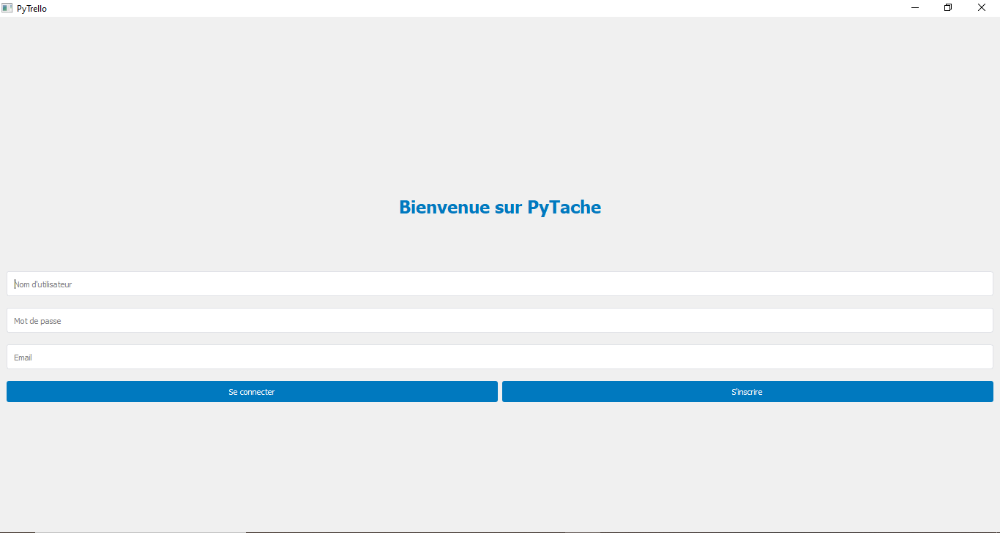
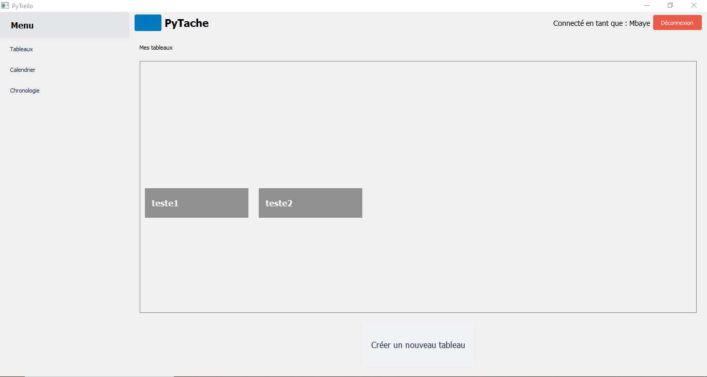



- Une bonne base en python
- Base en SQL




- [MON de Duc]({{ site.url }}/promos/2023-2024/Dang-Vu-Duc/mon/temps-1.1/)
- [POK de Duc]({{ site.url }}/promos/2023-2024/Dang-Vu-Duc/pok/temps-1/)




### Objectifs principaux

1. Développer une interface avec PyQt en structurant le projet selon l’architecture MVC pour séparer l’interface graphique la gestion des données et la logique métier.

3. Implémenter un système de glisser-déposer (drag & drop) permettant de déplacer les cartes entre les listes sans bloquer l’interface.
4. Gérer les données avec SQLite pour stocker les tableaux, listes, cartes, étiquettes et échéances.
5. Avoir un design responsive avec QSS pour la personnalisation.
   
---

### Recueil des besoins



| Étape                          | Résultat attendu                                                                                 | Difficultés rencontrées                                                                                       |
|--------------------------------|--------------------------------------------------------------------------------------------------|--------------------------------------------------------------------------------------------------------------|
| **Identification personnelle des besoins** | Définir les fonctionnalités principales en tant qu'utilisateur (ajout de tableaux, gestion des cartes). | Risque de vouloir tout intégrer dès le départ et de dépasser le cadre d’un projet MVP (produit minimum viable). |
| **Analyse des outils existants**          | Étudier Trello et d’autres outils similaires pour s’inspirer des fonctionnalités essentielles. | Difficulté à rester focalisé sur les fonctionnalités indispensables sans ajouter des options superflues.       |
| **Étude des contraintes techniques**      | Vérifier si les outils techniques choisis (par exemple PyQt et SQLite) peuvent répondre efficacement aux besoins. | Découverte des limites techniques comme la gestion des performances avec des widgets complexes sous PyQt.     |
| **Prototypage rapide**                    | Concevoir une interface simple et fonctionnelle pour tester rapidement mes idées.                          | Adapter rapidement les designs en fonction des tests et des ajustements nécessaires.                          |






Parmi les fonctionnalités minimales on a la gestion de tableaux dynamiques et la possibilité d’ajouter et modifier des cartes associées.



#### Fondements


- Je veux une interface simple, sans besoin de connexion à un serveur distant.

- La gestion des cartes et des tableaux doit rester rapide et réactive.

- Le design doit être uniforme.

---


- Installer PyQt 5 et SQLite sur ma machine.
- Installer la dernière version de Python


---

### Monitoring du projet

#### Back-log et organisation par sprints

Chaque sprint répond à une **question principale**.


### Sprint 1 : **Comment utiliser PyQt pour créer une interface fonctionnelle ?**

**Objectifs :**

1. Étudier PyQt et comprendre ses composants de base.

2. Concevoir une interface simple permettant de visualiser des tableaux.

3. Commencer l’intégration de styles via QSS.

**Backlog :**

- [x] Lire les POK et MON de Duc ainsi que documentation officielle de PyQt et effectuer des exercices pratiques.

- [x] Développer une maquette avec des `QVBoxLayout` pour organiser les tableaux.

- [x] Créer un premier prototype fonctionnel permettant d’afficher des widgets dynamiquement.

- [x] Étudier et intégrer des styles basiques avec QSS.



| Date       | Heures passées | Indications                                   |
|------------|----------------|-----------------------------------------------|
| 16/01/2025 | 3.0h           | Lecture et exercices sur PyQt (widgets de base). |
| 16/01/2025 | 1.5h           | Exploration des styles via QSS.              |
| 17/01/2025 | 2.0h           | Design des tableaux avec QVBoxLayout.        |
| 18/01/2025 | 1.5h           | Étude des signaux et slots.                  |
| 18/01/2025 | 2.0h           | Création de l'interface principale.          |


**Total du sprint 1 :** 10h.



#### Activités réalisées

1. **Étude des composants de PyQt**

<!-- 
Avant de commencer ce sprint, je me suis assuré d'avoir environnement correctement configuré :
- **Python** (>= 3.13.2)
- **SQLite3** (inclus avec Python, mais qu'on peut vérifier avec `sqlite3 --version`)

 -->

 Pour cette partie, j'ai fait une découverte des **widgets** et de leur rôle dans la construction d'interfaces graphiques.

 **Nous avons comme Widgets** :

- `QWidget`  qui est le conteneur de base.

- `QPushButton` qui sont les boutons interactifs.

- `QLabel` qui affiche les textes et les images.



Voici comment configurer un bouton et un label dans une interface :

```python

button = QPushButton("Cliquez-moi")

label = QLabel("Bienvenue dans PyQt")

layout = QVBoxLayout()

layout.addWidget(button)

layout.addWidget(label)

widget.setLayout(layout)

```

Ce code crée une fenêtre simple avec un bouton et un label empilés verticalement.



#### 1. **Création d’un layout structuré pour afficher des tableaux**

- On utilise `QHBoxLayout` pour organiser les widgets horizontalement (exemple : plusieurs tableaux).

- Puis on met en place d’un **conteneur** qui permet d’ajouter ou de supprimer des widgets.



```python

layout = QHBoxLayout()

button1 = QPushButton("Tableau 1")

button2 = QPushButton("Tableau 2")

layout.addWidget(button1)

layout.addWidget(button2)

widget.setLayout(layout)

```

Chaque bouton représente un tableau dans l’interface utilisateur.



#### 2. **Point sur la gestion des événements utilisateur avec les signaux et slots**

- Pour une meilleur gestion des événements, on effectue une connexion des actions utilisateur aux fonctions Python via des **signaux**.

 Exemple : Ajouter un tableau lorsqu’un bouton est cliqué.



```python

button.clicked.connect(self.ajouter_tableau)

def ajouter_tableau(self):

print("Un nouveau tableau a été ajouté !")

```

Lorsque le bouton est cliqué, la fonction `ajouter_tableau` est déclenchée.



#### 3. **Apprentissage et application des styles QSS (Qt Style Sheets)**

- QSS fonctionne comme du CSS, permettant de styliser des widgets PyQt de manière plus détaillée. Cela permet de personnaliser les boutons, labels, arrière-plans et autres composants sans toucher directement au code PyQt.

- On peut modifier l’apparence des boutons (QPushButton), en appliquant des couleurs personnalisées, des bordures arrondies ainsi que d'autres effets.

- On peut aussi utilisé un pseudo-classes, comme :hover, pour modifier l’apparence des boutons lorsqu’un utilisateur passe la souris dessus. 

- J’ai vu l’intérêt de séparer les styles QSS dans un fichier externe plutôt que de les définir directement dans le code PyQt, ce qui facilite les modifications et la maintenance du design sans impacter la logique métier.



Fichier QSS pour personnaliser un bouton :

```css

QPushButton {

background-color: #0079BF;

color: white;

border-radius: 5px;

}

QPushButton:hover {

background-color: #026AA7;

}

```

Le bouton change de couleur lorsque la souris passe dessus.



- Pour ce projet, j'ai définition un fichier `main.qss` pour centraliser les styles.

---



1. **Composants de base PyQt :**

- **QWidget**, le composant de base pour créer une fenêtre ou un conteneur.

- **QHBoxLayout**  permet d’organiser les widgets horizontalement, ce qui est idéal pour une interface basée sur des ligne, comme sur mon projet Pytrello.

- **QPushButton** et **QLabel** sont utilisés pour les interactions utilisateur de base.

2. **Gestion des layouts :**

- Si on utilise un `QVBoxLayout` imbriqué dans un `QHBoxLayout`, on peut organiser des colonnes de maniere dynamique, par exemple pour afficher des listes de cartes sous forme de tableaux.

- Les marges et les espacements (`setContentsMargins`, `setSpacing`) permettent d'ajuster précisément l'apparence.

3. **Signaux et slots :**

- Les signaux comme `clicked` permettent de connecter un bouton à une action spécifique.

- Les slots facilitent la gestion des interactions sans complexifier le code.

**Ressources utilisées :**

- **POK et Mon de Duc** pour comprendre comment structurer les interfaces de manière modulaire (lien au niveau des sources).




### Analyse post-mortem

- **Points forts :** Maîtrise des bases de PyQt et de QSS, premier prototype fonctionnel.

- **Points faibles :** Temps sous-estimé pour la personnalisation des styles pour le premier prototype fonctionnel.

- **Amélioration :** Prévoir un temps supplémentaire pour ajuster le design pour le sprint 2.


   Comprendre comment organiser et structurer une interface graphique avec PyQt.
   

    Les connaissances acquises dans ce sprint serviront de base pour intégrer des fonctionnalités dans le sprint futur. 

---

A la fin de ce sprint, mon code a ete organise ainsi(architecture MVC) : 
  
 - **main. py** le point d'entrée de l'application
- **main_window.py** la fenêtre principale qui gère les différentes vues
- **Dossier components/** les Widgets réutilisables (cartes, listes, etc.)
- **Dossier views/** les vues principales de l'application
- **Dossier models/** les modèles de données
- **Dossier utils/** les utilitaires divers
- **Dossier assets/** les ressources (styles, images, polices)

  


La page de connexion:



La première page:






L'un des défis majeurs de ce sprint a été l'optimisation du placement des widgets. J'avais besoin d'une bonne gestion des layouts pour éviter des problèmes d'affichage.



### Sprint 2 : **Comment intégrer une base de données SQLite et gérer les événements utilisateur ?**

**Objectifs :**

1. Implémenter une base de données SQLite pour persister les données des tableaux et cartes.

2. Permettre la création, suppression et modification des tableaux par l’utilisateur.

3. Intégrer une gestion des cartes dans chaque tableau.

**Backlog :**

- [x] Configurer SQLite pour stocker les données des tableaux et cartes.

- [x] Ajouter des fonctionnalités pour créer, supprimer et modifier des tableaux.

- [x] Gérer les cartes dynamiquement dans les tableaux.

- [x] Finaliser les styles QSS pour uniformiser l’expérience utilisateur.

- [ ] Implémenter des tests pour vérifier la cohérence des données.



| Date       | Heures passées | Indications                          |
|-----------|---------------|--------------------------------------|
| 24/02/2025 | 2.0h          | Configuration de la base SQLite.    |
| 27/02/2025 | 3h          | Gestion des tableaux de maniere dynamique.     |
| 28/02/2025 | 3.0h          | Gestion des cartes dans les tableaux. |
| 03/03/2025 | 3h          | Tests et ajustements des styles.    |

**Total du sprint 2 :** 12h.



#### 1. **Conception de la base de données SQLite :**

- La base de données repose sur plusieurs tables interconnectées qui permettent de structurer les tableaux, listes et cartes, avec des fonctionnalités comme l’étiquetage, les listes de vérification et les pièces jointes.

Ainsi : 

**a.** *J'ai crée une table `boards` pour stocker les tableaux de gestion des tâches, contenant un identifiant unique, un nom et une date de création.*  
**b.** *Puis une table `cards` pour stocker les cartes associées aux listes, avec un titre, une description, une échéance et une référence à la liste correspondante.*

Ainsi que d'autres tables telle que :

**c.** *users pour la gestion des utilisateurs*   
**d.** *lists pour stocker les listes dans les tableaux*    
**e.** *labels pour stocker les etiquettes pour les cartes*   
**f.** *card_labels qui fait Association entre cartes et étiquettes*    
**g.** *checklists pour stocker les listes de vérification*   
**h.** *checklist_items pour stocker Éléments des listes de vérification*   
**i.** *attachments pour stocker les pièces jointes*
  
  
  Chaque tableau peut contenir plusieurs listes, et chaque liste peut contenir plusieurs cartes. Pour établir ces relations, des clés étrangères sont utilisées afin de lier les cartes à leurs tableaux respectifs.


- En suite j'ai utilisé les relations entre les différentes entités avec des **clés étrangères** pour lier les cartes aux listes (`list_id`) et les listes aux tableaux (`board_id`).  
  


- Un tableau (board) peut contenir plusieurs listes (lists).
- Une liste (list) peut contenir plusieurs cartes (cards).
- Une carte (card) peut être associée à plusieurs étiquettes (labels).
- Une étiquette (label) peut être appliquée à plusieurs cartes (card_labels).


- Pour permettre l’ajout, la modification, la lecture et la suppression des tableaux, listes et cartes., j'ai implémenté des opérations CRUD.  
  
  
  Les operations gérées de manière transactionnelle pour assurer la cohérence des données, en utilisant des clauses ON DELETE CASCADE dans les clés étrangères.

- J'ai intégré en suite une **suppression en cascade (`ON DELETE CASCADE`)** pour assurer qu’en supprimant un tableau, toutes les listes et cartes associées soient supprimées automatiquement pour éviter les incohérences et garantir qu’aucune donnée orpheline ne reste dans la base de données après suppression.

- Les dates d’échéance (`due_date`) stockagé en **format UTC** pour assurer une gestion cohérente des tâches à travers différents fuseaux horaires.  

- J'ai ajout d’une vérification automatique des tâches en retard via une requête SQL, permettant d’afficher des alertes ou des rappels à l’utilisateur.  
- En fin, une requête SQLite qui vérifie chaque jour les tâches en retard. 

#### 2. **Gestion des signaux et événements utilisateur :**
   
L’implémentation s’appuie sur le système de signaux et de slots de PyQt pour assurer une interaction fluide entre l’interface et la base de données.
Pour se faire : 

- J'ai utilisé des signaux `clicked` pour connecter les boutons d’aujout et de suppression aux actions correspondantes.  
- Des slots personnalisés ont été implémenté aussi pour mettre à jour l'interface et la base de données simultanément.  
- Le déplacement des cartes entre les listes repose sur le système de signaux et slots de PyQt.  
- Chaque carte est un widget PyQt personnalisé, activant l’événement `dragEnterEvent` lorsqu’elle est déplacée.  
- Lorsqu’une carte est déplacée, sa position est mise à jour dans SQLite pour la persistance après fermeture de l’application.  
- Si une tâche a une échéance dépassée, une alerte visuelle est affichée dans l’interface PyQt.  
- j'ai utilisé  `QMessageBox` pour notifier l’utilisateur des échéances importantes.  

#### 3. **Stylisation via QSS :**
Pour cette partie, j’ai regroupé les compétences acquises lors du sprint 1 sur l’utilisation de QSS pour la mise en forme de l’interface :

- J'ai appliqué une couleur d’arrière-plan spécifique `#0079BF` pour les boutons, pour avoir une lisibilité du texte en blanc.  
- Y a aussi un **effet de survol** en modifiant la couleur du bouton (`#026AA7`) lorsque l’utilisateur passe la souris dessus.
-  Les bords sont arrondi avec **(`border-radius: 3px`)**. 
  
---

### Analyse post-mortem

- **Points forts :** Bonne avancée dans la gestion des données et la persistance avec SQLite.

- **Points faibles :** La gestion des cartes a été plus complexe que prévu, les performances de l’interface ralentissaient lorsque de nombreuses cartes étaient chargées simultanément.  

- **Amélioration :** Intégrer des tests unitaires dès le début pour détecter les incohérences.

- **Le plus grand problème rencontré :** La suppression d’un tableau ne supprimait pas toujours correctement les cartes associées.
  
- **Solution :** Ajout de contraintes ON DELETE CASCADE dans la base de données SQLite pour une suppression complète.
---

### Livrable final



1. Modifier et supprimer des tableaux.

2. Ajouter, déplacer et supprimer des cartes dans les tableaux.

3. Les données sont stockées dans une base SQLite.

4. Utilisation de QSS pour un designe uniforme.
   
   <video controls>
    <source src="./Resultat.mp4" type="video/mp4">
   </video>




   Mon readme sur github donne une explication tres claire sur le  projet. 
   Voici le lien vers [le code source](https://github.com/MbayeSyAmar/Pok3)
   

---


### Pistes d'amélioration

- Automatiser les tests pour éviter des bugs liés à la gestion des événements utilisateur.

- Implémenter un chargement asynchrone des données SQLite pour éviter les ralentissements.
  
- Réduire les redessins inutiles des widgets PyQt pour améliorer la fluidité de l’interface
  
- Intégrer une option de personnalisation des alertes, permettant aux utilisateurs de définir leurs propres rappels.


 ## Sources :

- [Documentation officielle PyQt ](https://doc.qt.io/qtforpython-6/)
- [MON de Duc]({{ site.url }}/promos/2023-2024/Dang-Vu-Duc/mon/temps-1.1/)
- [POK de Duc]({{ site.url }}/promos/2023-2024/Dang-Vu-Duc/pok/temps-1/)
- [Learn Python PyQt5 in 1 hour!](https://www.youtube.com/watch?v=92zx_U9Nzf4&t=1753s)

