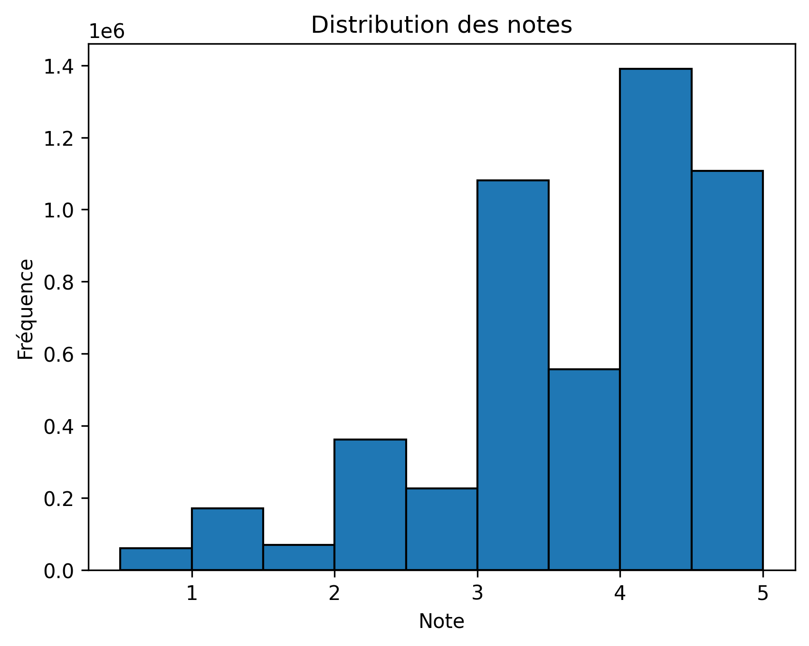
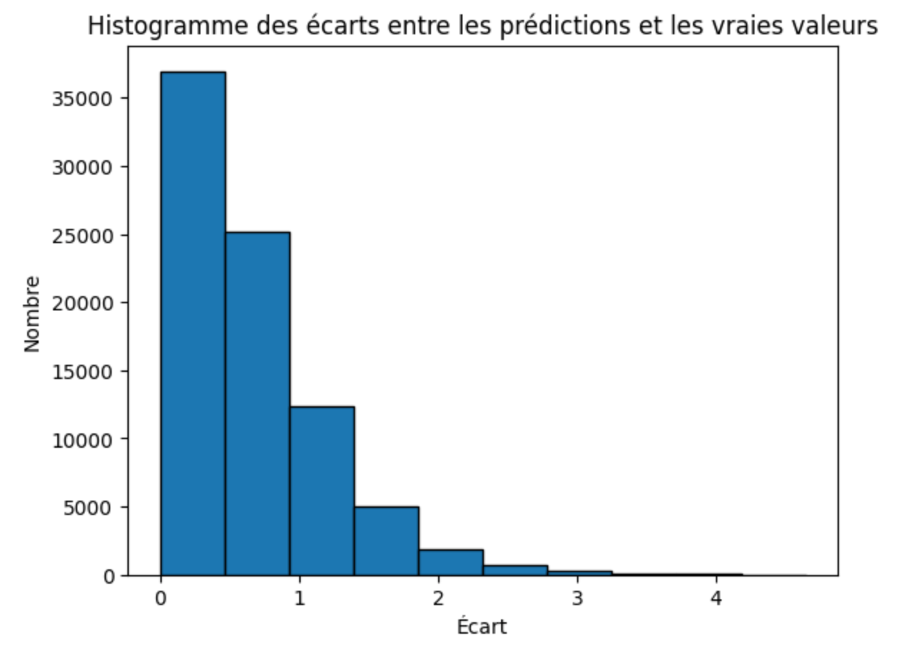



- Bases en python




- [Théorie du  modèle ALS sur le site flink](https://nightlies.apache.org/flink/flink-docs-release-1.4/dev/libs/ml/als.html)
- [Dataset MovieLens sur kaggle](https://www.kaggle.com/datasets/grouplens/movielens-20m-dataset?select=rating.csv)
- [Documentation PySpark](https://spark.apache.org/docs/latest/api/python/index.html)



Au cours de mon cursus j'ai déjà eu l'occasion de travailler sur des modèles de Machine Learning comme kNN (k-Nearest Neighbors) ou Matrix Factorization (SVD - Singular Value Decomposition) de la librairie *scikit-learn*. Dans ce POK je voudrais travailler avec PySpark qui est une bibliothèque Python qui permet de traiter de grandes quantités de données rapidement en utilisant Apache Spark. Très utilisé en data science, il aide à analyser et manipuler des données massives de manière efficace. Je souhaite appliquer le modèle ALS (Alternating Least Squares) à un dataset de notation de films afin de faire un systèmede recommandation.

## Cadrage

### Objectifs principaux

1. Comprendre la théorie du modèle ALS.
2. Préparer les données
3. Implémenter le modèle de recommandation
4. Évaluer les performances

### Sprints

#### Sprint 1

- [x] Documentation sur la théorie du modèle ALS (2h)
- [x] Recherche et sélection du dataset (1h30)
- [x] Découverte de Pyspark (1h30)
- [x] Préparation de l'environnement PySpark (1h)
- [x] Exploration initiale des données (analyse des colonnes et visualisation) (2h)
- [x] Nettoyage et transformation des données (gestion des valeurs manquantes, typage) (1h)

#### Sprint 2

- [x] Implémentation du modèle de recommandation avec ALS (Alternating Least Squares) (4h)
- [x] Optimisation des hyperparamètres du modèle (3h)
- [x] Analyse du modèle optimisé (1h)
- [x] Génération de recommandations pour les utilisateurs (1h)
- [x] Documentation finale (1h)


### Horodatage


| Date | Heures passées | Indications |
| -------- | -------- |-------- |
| Jeudi 23/01  | 2h  | Cadrage et documentation sur le modèle ALS |
| Jeudi 23/01  | 1h30  | Recherche et sélection du dataset |
| Samedi 25/01  | 2h  | Découverte de Pyspark |
| Samedi 25/01  | 30min  | Préparation de l'environnement PySpark |
| Dimanche 26/01  | 2h  | Exploration initiale des données (analyse des colonnes et visualisation) |
| Dimanche 26/01  | 1h  | Nettoyage et transformation des données (gestion des valeurs manquantes, typage) |
| Dimanche 26/01  | 1h  | Rédaction |
| Mardi 25/02  | 3h  | Implémentation du modèle de recommandation avec ALS |
| Mercredi 26/02 matin | 2h  | Optimisation des hyperparamètres du modèle |
| Mercredi 26/02 soir | 2h  | Optimisation des hyperparamètres du modèle |
| Mercredi 26/02 soir | 1h  | Analyse du modèle optimisé  |
| Vendredi 07/03 | 1h  | Génération de recommandations pour les utilisateurs |
| Vendredi 07/03| 1h  | Documentation finale  |


## Contenu


### Premier Sprint

#### Le modèle ALS (Alternating Least Squares)

Le modèle **ALS (Alternating Least Squares)** est utilisé pour les systèmes de recommandation. Il cherche à décomposer une matrice \\( R \\), qui représente les interactions entre utilisateurs et éléments (comme les notes attribuées à des films pour ce POK), en deux matrices plus petites :

- \\( U \\) : matrice des préférences des utilisateurs.
- \\( M \\) : matrice des caractéristiques des éléments (comme les films).

L'approximation se fait avec la relation suivante :
$$
R \\approx U \\cdot M^T
$$

L'objectif est de minimiser l'erreur entre les valeurs prédites \\( U_u^T \\cdot M_i \\) et les notes réelles \\( R_{ui} \\)
tout en ajoutant une régularisation pour éviter le surapprentissage. La fonction d'optimisation est :

$$
\\min_{U, M} \\sum_{(u, i) \\in R} \\left( R_{ui} - U_u^T M_i \\right)^2 + \\lambda \\left( ||U_u||^2 + ||M_i||^2 \\right)
$$

**Où :**

- \\(lambda\\) : paramètre de régularisation pour limiter les valeurs extrêmes dans \\( U \\) et \\( M \\).
- \\( ||U_u||^2 \\) et \\( ||M_i||^2 \\) : normes des vecteurs utilisateur et élément.


#### Fonctionnement d'ALS

1. Fixer la matrice \\( M \\) et calculer \\( U \\).
2. Fixer la matrice \\( U \\) et calculer \\( M \\).

Le processus alterne entre ces deux étapes jusqu'à ce que l'erreur soit suffisamment basse.

#### Exemple simple

Supposons une matrice \\( R \\) comme celle-ci (notes données par des utilisateurs) :

| Utilisateur / Film | Film 1 | Film 2 | Film 3 |
|---------------------|--------|--------|--------|
| Utilisateur 1       | 5      | ?      | 3      |
| Utilisateur 2       | ?      | 4      | ?      |
| Utilisateur 3       | 1      | ?      | 2      |

Le modèle utilise \\( U \\) et \\( M \\) pour prédire les notes manquantes (notées "?"). En ajustant itérativement \\( U \\) et \\( M \\), ALS minimise l'erreur entre les prédictions et les notes réelles.

#### Choix du Dataset

Pour ce projet , j'ai choisi le dataset **MovieLens** disponible sur Kaggle, un des datasets les plus populaires pour les systèmes de recommandation. Ce dataset contient des millions de notes attribuées à des films par des utilisateurs. Il inclut plusieurs fichiers, dont les principaux sont :

- **movies.csv** : Contient les informations sur les films, notamment l'ID du film, le titre et les genres associés.
- **ratings.csv** : Contient les évaluations des utilisateurs pour les films, avec l'ID de l'utilisateur, l'ID du film, la note attribuée et la date de l'évaluation.
- **tags.csv** : Contient des informations sur les tags associés aux films, qui peuvent être utiles pour l'analyse des préférences.

Dans la suite du projet je ne suis pas certains d'utiliser toutes ces données, je vais dans un premier temps travailler avec le dataset **ratings.csv**.

#### Préparation de l'environnement PySpark

Avant de pouvoir analyser les données, il est nécessaire de configurer un environnement pour travailler avec PySpark. Suite à me documentation sur le site [PySpark](https://spark.apache.org/docs/latest/api/python/index.html) voici les étapes principales de la configuration de PySpark :

**Étapes principales :**
1. Installer PySpark :
   ```bash
   pip install pyspark
   ```
2. Configurer une SparkSession dans le code. Exemple minimal :
   ```python
   from pyspark.sql import SparkSession

   spark = SparkSession.builder \
       .appName("Recommandation de films") \
       .getOrCreate()
   ```

**Test de connexion avec les données :**
Une fois l’environnement configuré, on peut charger quelques lignes du fichier `ratings.csv` :
```python
df = spark.read.csv("ratings.csv", header=True, inferSchema=True)
df.show(5)
```

#### Exploration initiale des données

Une fois l’environnement prêt, nous pouvons d’explorer les données pour mieux comprendre leur structure. Cette exploration se concentre sur :

- **Colonnes principales** :
  - `userId` : identifiant unique des utilisateurs.
  - `movieId` : identifiant unique des films.
  - `rating` : note attribuée (échelle de 0.5 à 5, par pas de 0.5).
  - `timestamp` : date et heure de l’évaluation.

- **Statistiques descriptives :**
   - Nombre total de lignes dans le dataset : 20 millions.
   - Nombre d’utilisateurs uniques : 138 493.
   - Nombre de films uniques : 26 744.







#### Nettoyage et transformation des données

Pour garantir une exploitation optimale des données, des vérifications ont été réalisées :

1. **Gestion des valeurs manquantes**
   Une analyse des colonnes a confirmé l'absence de valeurs nulles dans le dataset. Aucun nettoyage supplémentaire n'était requis.

2. **Transformation du timestamp**
   La colonne `timestamp` a été convertie en une date lisible pour faciliter les analyses temporelles :
   ```python
   from pyspark.sql.functions import from_unixtime

   df = df.withColumn("date", from_unixtime(f.col("timestamp")))
   ```

3. **Typage des données**
   Les types de colonnes (`userId`, `movieId`, `rating`, `timestamp`) ont été validés comme appropriés pour les traitements envisagés.

Les données sont désormais prêtes pour la création des matrices utilisateurs-films et l’implémentation du modèle.


### Second Sprint

#### Implémentation du modèle de recommandation avec ALS

Après avoir compris la théorie du modèle ALS, créé l'environnement pyspark, importé, nettoyé et exploré les données de MovieLens nous pouvons implémenter une première fois le modèle ALS.

La première étape à réaliser est de diviser notre dataset **ratings**  en deux dataset, un dataset d'entrainement et un dataset de test. Comme il est coutume de le faire pour ce type de sujet, nous allons prendre aléatoirement 80% des lignes du dataset pour constituer le dataset d'entrainement et 20% pour le dataset de test.
Le modèle va donc être appliqué sur le set d'entrainement et calculer de la même façon que définit dans la partie 1 du premier  sprint les matrices \\( U \\) et \\( M \\).



```python
from pyspark.ml.recommendation import ALS
from pyspark.ml.evaluation import RegressionEvaluator

rating = rating.select("userId", "movieId", "rating")
train, test = rating.randomSplit([0.8, 0.2], seed=42)

als = ALS(
    userCol="userId",
    itemCol="movieId",
    ratingCol="rating",
    coldStartStrategy="drop"
)

model = als.fit(train)
```



Pour évaluer notre modèle, on va l'appliquer au set de test et calculer l'erreur quatratique moyenne RMSE (Root Mean Squared Error) qui est une métrique d'évaluation qui mesure l'écart moyen entre les prédictions du modèle et les valeurs réelles. Plus la valeur de RMSE est proche de 0, plus la prédiction est bonne.
Le calcul de la valeur du RMSE pour cette première application du modèle nous donne **RMSE = 0.84**. Ce qui signifie que, en moyenne, l'écart entre la note prédite et la note réelle est de 0.84 points.

Pour mieux visualiser la performance de cette première appliquation du modèle, voici  un histogramme montrant les écarts entre les notes prédites et les notes réelles :







Le système semble être globalement performant, cependant il existe certains paramètres appelés hyperparamètres clés. Un hyperparamètre est une valeur définie avant l'entraînement d’un modèle de machine learning. Contrairement aux paramètres (qui sont appris par le modèle), les hyperparamètres contrôlent la manière dont le modèle apprend et se généralise. Dans la partie qui suit, nous allons explorer ces différents paramètres et en modifier certains afin de voir s'il est possible de faire diminuer la valeur de RMSE.

#### Optimisation des hyperparamètres du modèle

Après avoir essayer d'agrandir le set d'entrainement (90% du set total), l'erreur n'est diminuée de façon significative. De plus,
le set de test doit être suffisamment grand afin de pouvoir correctement tester notre modèle. Cherchons maintenant quels hyperparamètres changer afin de potentiellement réduire l'erreur.

Voici les principaux paramètres ajustables dans le modèle ALS de pyspark :

1. **rank :**
   - Définit le nombre de facteurs latents dans la factorisation de la matrice utilisateur-item.
   - Valeurs typiques : entre 10 et 50.
2. **maxIter :**
   - Nombre maximum d'itérations pour la convergence de l'algorithme.
   - Valeurs typiques : 10 à 20.
3. **regParam :**
   - Paramètre de régularisation (L2) pour éviter le surajustement.
   - Valeurs typiques : 0.01 à 0.1.
4. **alpha (uniquement si implicitPrefs=True) :**
   - Contrôle l'importance des préférences implicites.
   - Valeurs typiques : 10 à 40.

Après avoir recherché les valeurs optimales pour chacuns de ces paramètres par dichotomie, voici les valeurs que nous avons trouvé :

| Paramètres | Valeurs |
| -------- | -------- |
| **rank**  | 16 |
| **maxIter**  | 15 |
| **regParam** | 0.055 |
| **alpha** | 25 |


#### Choix du modèle finale

Après avoir testé l’ensemble des hyperparamètres optimaux trouvés par dichotomie (rank=16, maxIter=15, regParam=0.055, alpha=25), nous avons constaté une forte augmentation de l’erreur RMSE (supérieur à 3). Ce phénomène est un signe de surentraînement (ou overfitting), ce qui signifie que le modèle s'est trop ajusté aux données d'entraînement et ne généralise plus bien aux nouvelles données du test.
En ne gardant que rank=16 et regParam=0.055, nous avons observé une légère diminution de l'erreur RMSE par rapport à notre première tentative avec les paramètres par défaut.  Nous utiliserons donc ces paramètres pour la dernière partie.

#### Recommandation avec l'algorithme

Le but de cette dernière partie est de créer une fonction qui prend en argument l'id d'un utilisateur et qui renvoie les 5 films les plus recommandés par notre algorithme parmis ceux qu'il n'a pas vu.



```python
from pyspark.sql.functions import col

def recommend_movies(user_id, nb_reco=5):
    seen_movies = rating.filter(col("userId") == user_id).select("movieId")
    unseen_movies = movie.select("movieId").subtract(seen_movies)
    user_unseen_movies = unseen_movies.withColumn("userId", col("movieId") * 0 + user_id)
    recommendations = model.transform(user_unseen_movies)
    top_movies = recommendations.orderBy(col("prediction").desc()).limit(nb_reco)
    final_recommendations = top_movies.join(movie, "movieId").select("title")

    return final_recommendations
```


Cette fonction nous renvoie donc le titre et la date des films les plus recommandés pour l'utilisateur.