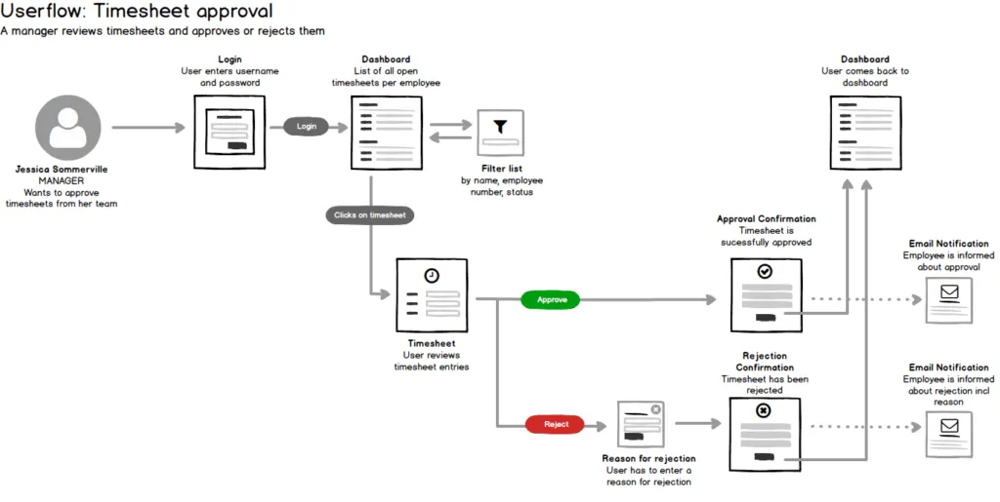
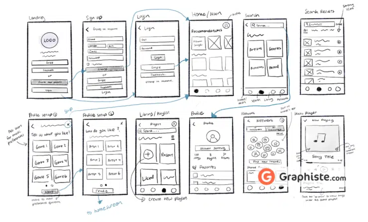
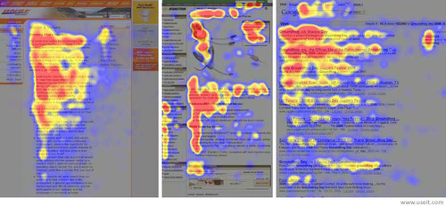
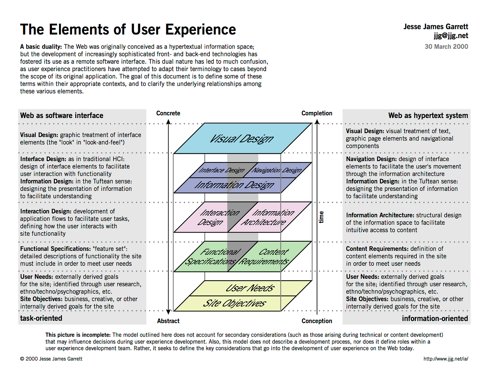



- Connaissances de ce qu'est un Frontend : 2/3 📶
- Connaissances de ce qu'est un Système de composants : 1/3 📶




<b>SOURCES</b>

- [Juxtopposed. (2023, 23 juillet). world’s shortest UI/UX design course [Vidéo]. YouTube.](https://www.youtube.com/watch?v=wIuVvCuiJhU)
- [Definir Personnas utilisateurs en web design - Exemple, cas UX. (2014, août 13). Oseox |.](https://oseox.fr/ux/profils-utilisateurs.html)
- [Faisal, S. (2024, 30 décembre). User Journey vs. User Story : How Are They Different ?  Thoughts About Product Adoption, User Onboarding And Good UX | Userpilot Blog.](https://userpilot.com/blog/user-journey-vs-user-story/#:~:text=A%20user%20journey%20is%20represented,%2C%20%5Bso%20that%5D.%E2%80%9D)
- [Orozco, J. (2021, 13 décembre). User flow, User Journey, Quelle est la différence ? Medium.](https://medium.com/@_jb_orozco_/user-flow-user-journey-quelle-est-la-diff%C3%A9rence-ebfd92f2965e)
- [Xavier. (2024, 26 novembre). Quelle est la différence entre le Zoning, Wireframe, Mockup et Prototype ?  Blog Ux.](https://blog-ux.com/quelle-est-la-difference-entre-le-zoning-wireframe-mockup-et-prototype/)
- [Sens de lecture en Z et Hiérarchie visuelle - Webdesign UX. (2014, août 13). Oseox |.](https://oseox.fr/ux/lecture-heriarchie-visuelle.html)



| Date | Heures passées | Indications |
| -------- | -------- |-------- |
| Mardi 09/03 | 1H15 + 3H15 + 17H45-18H | Création de la problématique, partie 2 et début partie 3, partie 3, 4 et 5 |
| Total | 4H30 |

## Table des matières

1. [Introduction](#section1)
2. [Qu'elles sont les grandes étapes pour créer une interface répondant à des besoins ?](#section2)
3. [Créer un projet Angular](#section3)
4. [Comment ça marche ?](#section4)
5. [Que sont les directives et les pipes ?](#section5)
6. [Comment récupérer des données ?](#section6)
7. [Conclusion](#section7)

## 1. Introduction 

Je fais ce MON pour résumer et approfondir mes connaissances en UI/UX et notamment la création d'une interface. Cela va de trouver les besoins et les critères de réussites jusqu'à la création de la maquette de l'interface.
Je me suis donc posé comme question :

<b>Comment construire une interface répondant aux besoins d'une entreprise ?</b>

Ce MON retrace ma démarche pour répondre à cette question. Je le fais pour un moi futur qui voudrait suivre ses étapes pour créer une interface.

Je vais m'inspirer des cours (UI/UX, UI/UX avancé, UX design/expression du besoin et Services Design) que j'ai eu sur le sujet avant d'approfondir le contenu avec mes recherches. Je m'intéresse seulement à la partie UI/UX et non pas au développement frontend.

## 2. Qu'elles sont les grandes étapes pour créer une interface répondant à des besoins ? 

La première chose que je me demande c'est quelles sont les étapes pour créer une interface ? Qu'est-ce que l'on retrouve dans les différentes approches du design UI/UX.

En me basant sur les cours j'ai identifié 6 étapes :

1. **Pourquoi ?** : Etape la plus importante qui consiste à savoir qu'est-ce qui fait que l'on crée l'interface
2. **Qu'elles sont les limites ?** : Maintenant que l'on sait pourquoi, il faut savoir quand est-ce que l'on s'arrête et quelles sont les limites du projet, nos ressources (charte graphique préexistante...)
3. **Pour qui ?** : Il faut savoir pour qui on crée l'interface, l'utilisation que le public cible en a
4. **Création d'un Mockup** : Une fois que l'on s'est posé toutes ces questions, on peut réaliser une maquette de l'interface
5. **Validation de la maquette** : Il faut valider la maquette avec les utilisateurs et/ou l'entreprise pour voir si l'interface répond bien à leurs besoins

Certaines étapes en contiennent d'autres comme Création d'un Mockup qui contient le listage des éléments de l'interface, les relations entre éléments, les différentes pages/composants, l'aspect visuel(charte graphique)...

J'ai choisi ces étapes parce qu'elles sont les plus importantes pour moi.

### Pourquoi est-ce que l'on crée cette interface ?

C'est la question la plus importante à se poser puisque c'est la raison qui justifie la création de l'interface.

L'interface répond à un besoin existant ou elle en crée un. Il n'est pas nécessaire d'être très précis dans la réponse du pourquoi mais il reste important de savoir l'origine du projet, ce qu'il vient apporter.

Il est essentiel de toujours garder à l'esprit le pourquoi de l'interface et une phrase simple, claire et concise suffit.

## 3. Quel est le cadre du projet ? ses limites ? 

Je sais pourquoi je crée l'interface, maintenant il s'agit de définir d'où je pars et où je vais.

### Point d'arrivée

En sachant le pourquoi de l'interface, on peut définir ce que l'on veut obtenir à la fin du projet. Ce sont les objectifs de l'interface.
Ces **objectifs** doivent être **SMART** (Spécifique, Mesurable, Atteignable, Réaliste, Temporellement défini).
Ils correspondent aux **critères de réussite** du projet, comme cela on sait si l'on a rempli la mission du pourquoi.

### Point de départ

On a besoin du point de départ pour savoir où l'on se situe par rapport à nos objectifs. On va avoir 2 choses à définir :

- **Les ressources**
- **Les contraintes**

#### Ressources 

C'est ce que l'on a à disposition pour réaliser l'interface.

Il y a par exemple une charte graphique préexistante, des données déjà collectées, des valeurs à respecter, des exemples d'interfaces qu'ils ont déjà réalisées...

#### Contraintes 

C'est ce qui permet de définir les limites du projet.

On a souvent les contraintes de temps, de budget.

### Outils

Maintenant il s'agit d'obtenir ses informations. Pour cela, on peut utiliser plusieurs outils selon si on est seul ou en groupe.

#### Seul

**Brief graphique** :

- Quels sont les éléments préexistants à disposition ? (voir [Ressources](#section3.1))
- Quelles sont les valeurs de la marque ? du produit ? Qu'est-ce qui nous différencie de concurrents ?
- Quels sont les utilisateurs ciblés ? (voir [partie 4](#section4))
- Quels sont les contraintes ? (voir [Contraintes](#section3.2))
- Recherche d'inspirations, de références ([Pinterest](https://www.pinterest.fr/), [Dribbble](https://dribbble.com/), [Behance](https://www.behance.net/))

A la fin du brief graphique, on réunit toutes les informations sur une seule page pour avoir une vue d'ensemble du projet.

#### En groupe

Ateliers de co-création :

- **5W2H** : 

  - *Who* : qui sont les personnes responsables du projet ?
  - *What* : quels sont les objectifs SMART du projet ?
  - *Where* : où se déroule le projet ?
  - *When* : quand se déroule le projet ? Quels sont les délais ?
  - *Why* : pourquoi le projet est-il réalisé ? (voir [Pourquoi](#section2))

- **Brainstorming** : chaque personne rédige 3 post-it et les fait passer à chaque autre personne qui doit ajouter une idée ("oui et..."). Cela ne doit pas durer plus de 5 minutes.
- **DOT Voting** : on définit une problématique à répondre et chaque personne écrit 3 objectifs principaux simples puis chacun vote avec ses 3 points pour ses objectifs préférés parmi les objectifs des autres.
- **Goal Grid** : on a 4 catégories à remplir :

  - *Preserve* : the user **has** and **wants** 
  - *Achieve* : the user **hasn't** and **wants**
  - *Eliminate* : the user **has** and **doesn't want**
  - *Avoid* : the user **hasn't** and **doesn't want**

- [**User Persona**](#section4.1)
- [**User Story**](#section4.2)

## 4. Quel est le public cible ? 

Dans la partie d'avant je parle principalement de l'entreprise et de ses besoins mais il est primordial de s'intéresser à qui va utiliser l'interface parce que c'est pour eux qu'elle est créée.

### User Persona 

Le User Persona est une personne fictive qui représente au mieux le public cible.

Dans les caractéristiques des Personas, on différencie les **hypothèses** sur le public cible et les **caractéristiques relevées** par l'**analyse des données** et les **entretiens** avec les utilisateurs.

J'ai trouvé 2 écoles pour les caractéristiques à relever :

- ceux qui se concentrent sur toutes les caractéristiques pour s'imaginer la personne plus facilement
- ceux qui se concentrent sur les caractéristiques qui ont un impact sur l'interface pour éviter le surplus d'informations (celle que je préfère)

Après avoir fait une fiche avec la liste des caractéristiques, on résume les informations en un court paragraphe. [Pour faire un bon paragraphe](https://oseox.fr/ux/profils-utilisateurs.html)

### User Story 

Maintenant que l'on sait qui va utiliser notre interface, il faut que l'on sache *comment* ils vont l'utiliser.

Une User Story est une phrase simple qui décrit une fonctionnalité de l'interface pour un utilisateur.

Elle est composée de 3 parties : As a **type of user**, I want **action** so that **outcome**.

Plus de détails [ici](https://userpilot.com/blog/user-journey-vs-user-story/#:~:text=A%20user%20journey%20is%20represented,%2C%20%5Bso%20that%5D.%E2%80%9D).

## 5. Comment utilisé les informations et les ressources ? 

On a les informations, les ressources, les contraintes, les objectifs, les personas et les user stories. Il est temps de passer à la création de l'interface.

Dans un premier temps, on liste les éléments dont on va avoir besoin en faisant un **User Flow**

### User Flow

Comme on a fait les User Stories, on peut faire un User Flow qui simule le parcours de l'utilisateur sur l'interface.

Par exemple :

[Orozco, J. (2021, 13 décembre). User flow, User Journey, Quelle est la différence ? Medium.](https://medium.com/@_jb_orozco_/user-flow-user-journey-quelle-est-la-diff%C3%A9rence-ebfd92f2965e)

### Zoning

Une fois que l'on a les éléments, on peut les organiser dans des Zonings qui sont des schémas de chaque page de l'interface.
On peut ainsi retranscrire le User Flow en Zoning.

On cherche à une disposition des éléments, on n'a pas besoin de détails simplement une idée de l'occupation de l'espace.

[Ricard, S. (2024, 14 mars). Comment créer un wireframe d& # 8217 ; application mobile ?  Graphiste.com.](https://graphiste.com/blog/wireframe-application-mobile/)

En faisant les Zonings, il faut prendre en compte :
- la **hiérarchie de l'information** : les éléments les plus importants doivent être mis en avant
- **l'unité, le rythme et l'harmonie** : les éléments doivent être alignés, espacés de manière régulière
- le **chemin du regard**

[Oseox |. (2014, août 13). Sens de lecture en Z et Hiérarchie visuelle - Webdesign UX.](https://oseox.fr/ux/lecture-heriarchie-visuelle.html)

Plus d'informations [ici](https://blog-ux.com/quelle-est-la-difference-entre-le-zoning-wireframe-mockup-et-prototype/)

Souvent ce que l'on fait c'est un mélange entre un Zoning et un Wireframe qui est un schéma plus détaillé des pages de l'interface avec les boutons, les champs de texte, les images...

### Kit UI

On a la structure de nos pages, l'organisation de la navigation dans la page et entre les pages. Il est temps de passer à l'aspect visuel.

C'est là que l'on utilise la charte graphique préexistante, les inspirations/références que l'on a trouvé.

C'est également là où l'on utilise toutes les informations collectées : les valeurs de la marque, le ressenti que veulent les utilisateurs, les couleurs qui vont avec...

Dans le Kit UI on choisit les couleurs, les polices, les icônes, les images, les boutons, les champs de texte...
On va des éléments les plus petits (les boutons, les champs de texte) aux éléments les plus grands (les composants comme la barre de navigation).

Site recommandé : [Figma](https://www.figma.com/)

### Mockup

On a tout ce qu'il nous faut pour réaliser la maquette de l'interface.

On reprend les Zonings/Wireframes et on icorporre les éléments du Kit UI pour avoir l'interface.

Il faut toujours essayer de respecter les principes suivants :

- Hiérarchie visuelle : donne l'importance des éléments
- Contraste : permet de distinguer les éléments
- Espacement : permet de rendre le contenu plus lisible
- Consistence : garde une logique dans l'interface qui facilite la compréhension
- Simplicité : garde l'interface simple et concise
- Feedback : donne un retour à l'utilisateur sur ses actions

<!--  -->

---

Attention balise
Il faut TOUJOURS faire valider ses progressions surtout pour la construction de l'interface (User Flow, Zoning, Wireframe, Mockup) pour être sûr que l'on est sur la bonne voie.

## Conclusion 

Pour répondre à ma question :

<b>Comment construire une interface répondant aux besoins d'une entreprise ?</b>

> Pour moi les bases d'Angular à maîtriser se divisent en 3 parties :
>
> - Compréhension et implémentation du système de composants, modules, directives et pipes
> - Gestion des données avec les services et l'injection de dépendances
> - Récupération des données depuis un serveur avec les requêtes HTTP et les observables
>
> Avec cela on peut récupérer les données, les manipuler et les afficher à l'utilisateur en fonction de ses actions ce qui est le but d'un frontend.

En parallèle, j'ai pu améliorer mes bases en Angular, je ne pense pas cependant avoir assez de connaissances pour dire que je maîtrise les bases d'Angular.