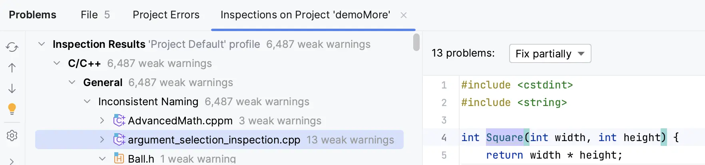


${toc}



- Bases en programmation
- Une petite idée des concepts clé de C et C++ eg. pointeurs


## Objectifs

Cela fait un petit moment que je suis disons effrayé et intrigué par le C++, la plupart des témoignages sur internet
semblent faire remarquer à quel point le langage est devenu compliqué et complet. Récemment, je suis tombé sur de
multiples offres d'emploi en C++ dans des entreprises qui m'intéressent, mais aussi dans un domaine que j'aimerais
approfondir : la programmation embarquée. J'aimerais donc élargir mes compétences et comprendre mieux comment C++ est
utilisé en pratique, au dela des cours d'informatique théorique.

Cette citation, du créateur de C++, met bien en avant la complexité du langage. Aussi, elle m'a permis de relativiser
et me donner envie d'apprendre, même si je ne pourrais jamais tout connaître sur le sujet.

> Even I can’t answer every question about C++ without reference to supporting material
> (e.g. my own books, online documentation, or the standard). I’m sure that if I tried to keep all of that
> information in my head, I’d become a worse programmer. What I do have is a far less detailed – arguably higher
> level – model of C++ in my head.

*[Interview de Bjarne Stroustrup par Ryou Ezoe, p.9](http://www.stroustrup.com/japanese2010.pdf)*

Aussi, puisque mon but est principalement de pouvoir réussir quelques entretiens sur C++, j'ai concentré
mon apprentissage à une grosse partie théorique sur les fonctionnalités du langage (c'est le genre de questions
auxquelles j'ai eu à faire dans le passé)


Ce MON n'a pas vocation à être un cours sur le C++ moderne, mais plutôt de constituer une bonne base d'outils
permettant d'apprendre par soit même. J'ai mis quelques examples de fonctionnalités intéressantes comme par exemples
les smart pointers, les attributs et enums cependant il me semble contre productif de tenter par moi-même de
retranscrire la richesse du langage surtout au vu de la grande qualité de certaines ressources cités dans ce MON.



## Rappels de C++
Pour commencer, j'ai décidé de regarder dans son entièreté une video de 4h sur les bases de C++:
[C++ Full Course - Caleb Curry](https://www.youtube.com/watch?v=9Myk2vcK8s8).
Souvent en x2, par moment en passant certains chapitres (sur les opérateurs mathématiques par exemple).
Honnêtement, c'est une plutôt bonne ressource, elle m'a permis de m'assurer d'être au jus sur les bases des bases.

Voici une liste de POK&MON intéressants sur le sujet :






## Versions de C++
Les versions de C++ sont publiées régulièrement, environ tous les 3 ans, avec un processus bien défini pour définir un
nouveau standard. Chaque nouvelle version apporte des améliorations, corrige des défauts et introduit de nouvelles
fonctionnalités, tout en garantissant une grande compatibilité avec les versions précédentes. Cela suit les
recommandations du comité de standardisation C++ (ISO/IEC JTC1/SC22/WG21). Voici les principales versions de C++ :

- **C++98 (1998)** : Première version standardisée.
- **C++03 (2003)** : Révision mineure de C++98.
- **C++11 (2011)** : Introduction majeure avec des fonctionnalités comme `auto`, lambda, smart pointers, etc.
- **C++14 (2014)** : Améliorations mineures de C++11.
- **C++17 (2017)** : Fonctionnalités comme `std::filesystem`, `std::optional`, `if constexpr`, etc.
- **C++20 (2020)** : Extensions majeures avec les concepts, coroutines, ranges, et plus.
- **C++23 (2023)** : Améliorations autour de la bibliothèque standard, `constexpr` et autres.
- **C++26 (2026)** : [Article du site CppScripts](https://cppscripts.com/cpp26) qui liste de prévisions pour C++26.


Une série de vidéos sur la chaîne [C++ Weekly](https://www.youtube.com/@cppweekly)
au cours desquelles il fait passer un ancien projet de C++98 à C++23.
- [C++98 -> C++11](https://www.youtube.com/watch?v=84Zy1D8MWaI)
- [C++11 -> C++14](https://www.youtube.com/watch?v=_Rq8gWimRcA)
- [C++14 -> C++17](https://www.youtube.com/watch?v=yL0DWa2LxNU)
- [C++17 -> C++20](https://www.youtube.com/watch?v=s2XWAxbxk9M)
- [C++20 -> C++23](https://www.youtube.com/watch?v=dvxj39gZ22I)


## Structures de données
Lors de mon dernier stage, j'ai passé une certification Java et depuis, quand je souhaite vraiment approfondir un
langage et m'entraîner pour des tests techniques, j'apprends les quelles structures de données sont disponibles
dans la librairie standard.

Je pensais qu'en C++ c'était un thème récurrent de réinventer la roue, mais à ma grande surprise, la libraire standard
est TRÈS complète en termes de structures de données. Il y en a pour tous les goûts:
- `std::vector`
- `std::map`
- `std::priority_queue`
- ...


Ces deux sites (au moins) proposent des cheat sheets pour en savoir plus sur les structures de données et leur usage:
- [Répository Github - Cpp Cheat Sheet](https://github.com/gibsjose/cpp-cheat-sheet/blob/master/Data%20Structures%20and%20Algorithms.md)
- [Site - HackingCpp](https://hackingcpp.com/cpp/cheat_sheets.html)


## Best Practices
Au cours de mes recherches, j'ai découvert l'existence de `std::array<T>` qui est en gros un tableau standard `T[]`
mais en mieux à moindre coût. En effet, il encapsule un tableau standard pour permettre l'accès aux fonctions
classiques des containers comme `std::vector` comme par exemple `.size()` (!)

Je me suis aussi rendu compte d'une des raisons de la complexité du langage. Pour des raisons de compatibilité,
les standards C++ ne peut pas modifier les comportements existants ni les retirer, c'est pourquoi certaines
fonctionnalités bien que strictement non recommandée sont encore disponible dans le langage. Par exemple
certaines fonctions ne doivent pas être utilisées car elles posent des problèmes de sécurité mais elles sont
encore dans les standards cf. [fichier qui liste des fonctions bannies](https://github.com/git/git/blob/master/banned.h).
Ainsi, il est très important de se tenir au courant des best practices.


En suivant la vidéo de 4h, j'ai décidé de regarder celle çi, qui permet déjà de se faire une meilleure idée de bonnes
habitudes à prendre. Elle m'a permis d'avoir une bonne base de sujets à approfondir.

<!-- Permet d'inclure une vidéo dans le MON -->

<div id="player" style="margin: auto;"></div>
<script>
  var tag = document.createElement('script');
  tag.src = "https://www.youtube.com/iframe_api";

  var firstScriptTag = document.getElementsByTagName('script')[0];
  firstScriptTag.parentNode.insertBefore(tag, firstScriptTag);

  var player;
  function onYouTubeIframeAPIReady() {
    player = new YT.Player('player', {
      height: '390',
      width: '640',
      videoId: 'i_wDa2AS_8w',
      playerVars: {
        'playsinline': 1
      },
    });
  }
</script>
<br/>


- [CppCoreGuidelines](https://isocpp.github.io/CppCoreGuidelines/CppCoreGuidelines)
*C'est LA référence pour C++ (un des auteurs est en autre Bjarne Stroustrup)*
- [Répository - Cpp Best Practices](https://github.com/cpp-best-practices/cppbestpractices)


Généralement quand quelque chose est vraiment problématique avec une version de C++, il existe,
dans les versions suivantes, une nouvelle fonctionnalité pour y remédier. On peut par exemple prendre
comme référence les pointeurs et l'allocation de mémoire (cf. partie suivante). En tout cas, être au courant
des nouveautés du langage est souvent une bonne façon de comprendre mieux erreurs à éviter.
J'ai rapidement exploré les listes disponibles sur le dépôt Github
[Modern Cpp Features - Anthony Calandra](https://github.com/AnthonyCalandra/modern-cpp-features),
mais aussi regardé une conférence sur C++23 : [C++23: An Overview - Marc Grégoire](https://www.youtube.com/watch?v=Cttb8vMuq-Y).

## Fonctionnalités
### Smart Pointers *
Initialement, pour allouer de la mémoire, on le faisait avec `malloc` et `free`, mais cette méthode manuelle est sujette
à des erreurs comme les fuites de mémoire ou la double libération (`double free`), causant des crashs imprévisibles.
Ensuite, `new` et `delete` ont été introduits pour simplifier la gestion de mémoire, tout en restant vulnérables aux
mêmes problèmes si mal utilisés. Aujourd'hui, on encourage vivement l'utilisation des smart pointers
qui apportent une gestion automatique et sécurisée de la mémoire, en s'assurant que les ressources soient
libérées correctement lorsque plus aucune référence valide n'existe. Cela réduit considérablement les risques
de bugs liés à la gestion mémoire manuelle.


- `std::unique_ptr` : garantit qu'un seul pointeur possède une ressource à la fois (propriété exclusive).
- `std::shared_ptr` : permet le partage de la propriété d'une ressource entre plusieurs pointeurs avec un comptage
  de références.
- `std::weak_ptr` : fonctionne avec `std::shared_ptr` pour casser les références circulaires sans affecter le
  comptage de références.


### \[\[Attributs\]\]
Les attributs en C++ introduisent une manière standard d'annoter et d'ajouter des métadonnées au code. Ces annotations
peuvent être utilisées par le compilateur pour activer des optimisations, générer des avertissements ou modifier le
comportement du code lors de la compilation. Les attributs modernes sont encapsulés dans `[[ ]]` pour éviter les
conflits avec les extensions spécifiques des compilateurs.

Ils jouent de multiples rôles :
- améliorer la lisibilité et la sécurité du code.
- donner des indications explicites au compilateur sans affecter directement la logique du programme.
- remplacer les anciennes annotations dépendantes des compilateurs (comme `__attribute__` avec GCC).


- Les attributs sont toujours optionnels : ils n'ont aucune incidence sur le comportement fonctionnel du programme.
- Ils peuvent être ignorés par le compilateur s'il ne les reconnaît pas.
- Certains attributs sont spécifiques à des versions récentes de C++, veillez donc à vérifier les standards pris en
  charge par votre environnement.


#### Quelques attributs courants

Indique que la valeur de retour d'une fonction *ne doit pas être ignorée*. Cela peut prévenir des
erreurs accidentelles.
```cpp
[[nodiscard]] int calculate() { return 42; }
int main() {
    calculate(); // Génère un avertissement car la valeur de retour est ignorée.
}
```



Permet de marquer une fonction, une classe ou une variable comme obsolète. Le compilateur émet un
avertissement si vous tentez de l'utiliser.
```cpp
[[deprecated("Utiliser la nouvelle méthode calculateNew() à la place.")]]
int calculateOld();
```



Indique qu'une variable ou une fonction peut ne pas être utilisée, pour éviter des avertissements
inutiles du compilateur.
```cpp
void func() {
    [[maybe_unused]] int unusedVar = 10;
}
```



Utilisé dans les instructions `switch` pour indiquer qu'une chute volontaire vers le cas suivant
est intentionnelle (utile pour éviter des avertissements).
```cpp
switch (value) {
    case 1:
        // code
        [[fallthrough]];
    case 2:
        // code
        break;
}
```



Fournissent des indications au compilateur sur la probabilité d'exécution d'
une branche conditionnelle, pour optimiser les performances.
```cpp
if ([[likely]] x > 0) {
    // Branch expected to be taken frequently
} else {
    // Branch expected to be rarely taken
}
```


### `constexpr` et `consteval`
`constexpr` et `consteval` sont deux mots-clés utilisés en C++ pour gérer les calculs constants à la compilation.

Ces mots-clés servent principalement à **optimiser le programme** et à **assurer des invariants au moment de la
compilation**, ce qui améliore la sécurité et les performances globales.

#### `constexpr` (C++11)
Permet de déclarer des variables, des fonctions ou des objets dont la valeur peut être calculée à la compilation, si
possible. Il garantit également que la valeur d'une variable est immuable. Il est très utile pour optimiser les
performances et réduire l'exécution à l'exécution.

Exemple :
```cpp
constexpr int square(int n) {
    return n * n;
}
constexpr int result = square(5); // Calculé à la compilation
```

#### `consteval` (C++20)
Similaire à `constexpr`, mais plus strict, ce mot-clé force une fonction à être évaluée uniquement à la compilation.
Si la fonction est appelée au moment de l'exécution, une erreur sera générée.

Exemple :
```cpp
consteval int cube(int n) {
    return n * n * n;
}
int val = cube(3); // Calculé à la compilation, OK
// int runtime_val = cube(runtime_input); // Erreur, ne peut pas être utilisé à l'exécution
```

## Utilisation d'IA
J'ai trouvé l'utilisation d'IA plutôt intéressante pour l'apprentissage du langage.


**You said:** \
[unrelated text]

Anyhow, do you have any recommendations of concepts to learn that are useful ?
For exemple I find myself regularly using itertools or enumerate in python, are there equivalents ?

**ChatGPT said:** \
[unrelated text]

## 🔥 Concepts You Should Learn Next
- Smart Pointers (std::unique_ptr, std::shared_ptr) – Manage memory safely.
- Move Semantics & RVO – Avoid unnecessary copies.
- Perfect Forwarding (std::forward) – Write high-performance templates.
- std::variant & std::optional – Better than using raw pointers.
- Ranges & Views (std::ranges::views) – Functional-style iteration in C++20.
- Multi-threading (std::thread, std::async) – Handle concurrency properly.
- Graph Algorithms & DP – C++ excels in competitive programming.
- Custom Memory Allocation (std::pmr::vector) – Optimize memory usage.
- SIMD (std::execution::par) – Speed up loops with parallelism.
- Compile-time Programming (constexpr, std::array) – Improve efficiency.



**You said:** \
Can you write a  short questions test to try my knowledge ?
I must be able to answer it as text (not long paragraph answers either)

**ChatGPT said:** \
Here’s a short test to check your understanding of various C++ topics:

## 📝 C++ Knowledge Test
1. What is the difference between lvalue and rvalue?
2. What does the explicit keyword do?
3. Explain the purpose of std::forward and when would you use it.
4. What does noexcept signify in C++?
5. What is the difference between std::map and std::unordered_map?
6. How would you initialize a std::vector<int> with 10 elements, each set to 0?
7. What does std::back_inserter do?
8. What is the [[nodiscard]] attribute used for?
9. What is the main benefit of using std::span over a raw pointer in C++?
10. What is the difference between constexpr and const?
11. What does std::move do and how is it different from passing by value or reference?
12. How would you prevent a function from being copied using the C++11+ features?
13. In what scenarios would you use std::deque instead of std::vector?
14. What does the inline keyword do in function declarations?
15. Explain the difference between a std::set and a std::unordered_set.

You can answer in short bullet points or brief text! Ready to give it a shot? 😊


## LeetCode
Je vous invite à lire les MONs suivants sur LeetCode pour plus d'informations. Pour résumer c'est une
plateforme sur laquelle on peut résoudre des problèmes d'algorithmique qui se rapprochent beaucoup de ce qui est
proposé en entretiens techniques.




Pour ma part, je suis déjà OK sur le sujet (~150 problèmes résolus) mais pas en C++.
C'est pourquoi je me suis concentré à essayer de travailler un peu mon écriture de solutions en C++.
J'ai commencé par reprendre des problèmes dont je connais la solution pour la refaire en C++, avec
les structures de données appropriées et travailler sur la syntaxe de base.

J'ai remarqué que les concepts avancés de C++ sont très peu utiles pour les problèmes, car finalement on
reste principalement sur de l'algorithmique et de l'informatique théorique. Par exemple, je n'ai pas eu besoin
d'utiliser d'attributs, de smart pointers ou autres fonctionnalités qui ont vocation à être plutôt utilisées dans
des codes bases plus conséquentes.

## Approfondir
Voici quelques liens vers des conférences disponibles sur la chaîne youtube [CppCon](https://www.youtube.com/@CppCon)
que j'ai regardées (mais au dela des 10h du MON) qui parlent de sujets plutôt intéressants.

- [Multi-Threading](https://www.youtube.com/watch?v=A7sVFJLJM-A)
- [Utilisation de la carte graphique](https://www.youtube.com/watch?v=8pJS3n4MITM)
- [Build systems](https://www.youtube.com/watch?v=Sh3uayB9kHs)

De ce que j'ai pu remarquer au cours de mes recherches, il est difficile de repérer les sujets sur lesquels
on peut s'améliorer en C++ tant ils sont nombreux. Un schéma que j'ai cependant souvent observé en vidéo est
celui de lire les suggestions de son éditeur de texte ! Aussi certains outils d'analyse statique de code sont
particulièrement puissant, par exemple vous pouvez en trouver une liste sur le site
[Terminal Root](https://terminalroot.com/top-10-static-analyzers-for-c-and-cpp/)

*Voici un exemple de résultats d'inspection du code sur l'IDE CLion :*


Plus généralement, rester au courant peut se faire sur pleins de canaux différents :


&#128250; Toutes ces chaînes YouTube sont mentionnées dans mon MON mais elles méritent de revenir dans cette liste.
Ce sont de super sources d'informations.
- [C++ Weekly](https://www.youtube.com/@cppweekly)
- [TheCherno](https://www.youtube.com/@TheCherno)
- [CppCon](https://www.youtube.com/@CppCon)

&#128240; DailyDev est une excellente plateforme pour découvrir du contenu technique sous forme d'articles
et suivre les dernières tendances en développement.
- [C++](https://app.daily.dev/sources/isocpp)
- [Meeting C++](https://app.daily.dev/sources/meetingcpp)


## Conclusion
J'ai eu l'occasion de passer un entretien technique type LeetCode que j'ai très bien réussi et qui m'a permis
de décrocher un second entretien technique, plus théorique lui. Je sais qu'il s'est bien passé et j'en suis
plutôt fier néanmoins ce processus de recrutement n'a pas abouti à cause d'un hiring freeze à dans l'entreprise
à l'échelle nationale...

<!-- Loads directly C & C++ prism js extensions without waiting for autoloader -->
<script src="https://cdn.jsdelivr.net/npm/prismjs/components/prism-c.min.js"></script>
<script src="https://cdn.jsdelivr.net/npm/prismjs/components/prism-cpp.min.js"></script>
