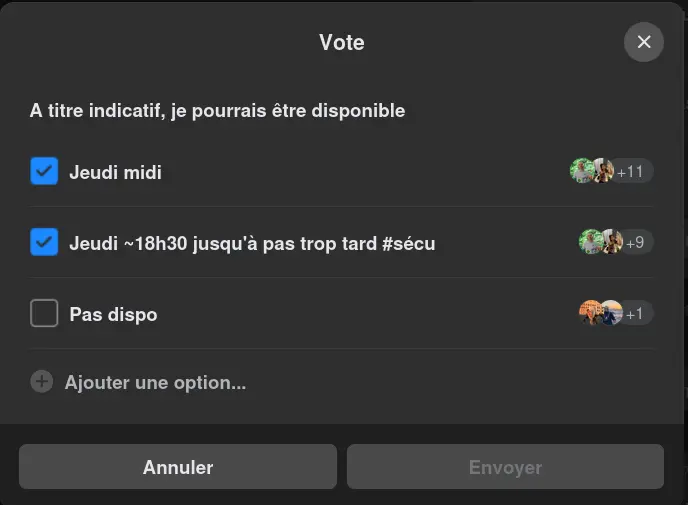


${toc}


## Prédécesseurs
Je me suis inspiré du travail effectué les années précédentes pour organiser le barbecue.




## Todo liste
De la même manière que mes prédécesseurs, j'établis ma todo pour ce MON.

### Interne à Do_It
- [X] trouver une date
- [X] estimer le nombre de participants
- [X] lister restrictions alimentaires
- [X] faire une liste de courses
- [X] faire un budget
- [X] trouver des élèves pour ramener une ou deux Nintendo Switch

### Externe (UA / Administration / Bar'bu)
- [X] faire un dossier COMA
- [] obtenir le permis feu auprès du PLP
- [] demander au Bar'bu d'héberger l'événement
- [] demander si le Bar'bu peut prêter le barbecue (si non, voir le réchaud de l'UA avec poële)

### Personnel
- [] faire les courses
- [] faire de la cuisine en avance
- [] organiser le remboursement en demandant les sous aux participants

*Je peux avancer le montant, je préfère ne pas m'encombrer de l'organisation liée à demander*
*une avance aux professeurs puis devoir rembourser et me faire rembourser dans tous les sens.*

## Organisation interne
L'entièreté de la communication entre les élèves de l'option s'est faite via le groupe
Messenger que nous avons créé en début d'année.

Je me suis inspiré des messages de communication associative qui prennent généralement
le format suivant pour être reconnaissables et sortir du lot :

> \[Barbecue\] \
> :emoji: Blabla informations sur le barbecue.

Pour communiquer avec les responsables de l'option, des mails suffisent.

### Date
Pour établir la date, j'ai envoyé un message aux élèves pour proposer le jeudi 13 mars midi ie. juste après les
soutenances de projet. Des élèves, indisponibles à ce moment, m'ont aussi proposé de faire ça mercredi avant la
séance POK&MON. C'est donc ce que j'ai proposé aux professeurs, tous deux disponibles jeudi, nous sommes partis sur ça.

Plus tard, nous avons eu une réflexion pour potentiellement voir et faire le barbecue en fin de journée, car certains
élèves font le ramadan. Suite à un sondage, nous avons finalement décidé de maintenir l'horaire du midi afin
d'accommoder un maximum d'étudiants. Néanmoins, pour éviter d’organiser seulement un festin (ce qui serait un peu 
triste pour nos camarades qui jeûnent) j'ai proposé de ramener une Nintendo Switch pour que nous puissions
aussi jouer ensemble.

### Participants
J'ai utilisé les résultats du sondage pour estimer le nombre de participants. Suite à deux relances sur le groupe,
j'ai dû contacter quelques élèves individuellement pour confirmer leur présence.

Aussi, nous avons décidé de proposer aux tuteurs projets présents physiquement de participer avec nous, cependant
ils ne seront pas nombreux, pas besoin de s'inquiéter sur les quantités.

Nous nous retrouverons donc à environ une petite vingtaine en tout.

### Régimes alimentaires
Je n'ai pas pris la peine de recontacter les professeurs pour leurs régimes alimentaires (cf. MONs précédents).

*Je pense d'ailleurs en le rédigeant que ces chôses peuvent changer d'année en année... Peu importe, au vu de ce que*
*j'ai prévu, il y a ce qu'il faut pour tout le monde, même après quelques changements.*

Pour les élèves, j'ai fait un message demandant s'il y avait des restrictions alimentaires à prendre en compte.
Il y a beaucoup moins de végétariens que l'année dernière. Puisque de tout le monde peut manger végétarien,
j'ai préféré ne pas vraiment ajuster la répartition carnée/végétarienne de l'année précédente.

Néanmoins, n'étant pas vraiment satisfait de juste proposer uniquement des falafels comme option végétarienne,
j'ai demandé de l'inspiration à mes camarades. Jeanne et Isée ont proposé de faire des camemberts chauds !

Aussi j'ai décidé de faire une salade de riz plutôt que des sandwichs, ça implique de préparer le riz en avance.

### Liste de course
En fonction des décisions précédentes, j'ai créé un document qui résume tout ça, et les quantités associées.
Ensuite, j'ai demandé aux étudiants de l'option d'y jeter un coup d'œil pour savoir s'ils en sont satisfaits.


- charbon
- allume feu
- 18 merguez
- 18 saucisses
- 600g de falafels
- mayonnaise
- ketchup
- moutarde
- 3 camemberts
- 3 baguettes (plus peut être ?)
- 2kg de riz
- 500g de tomates (cerise ?)
- 500g de maïs
- 500g de fromage (mozza, feta, emmental?)
- sauce salade (optionnel, mais non négligeable)
- 1kg d’oignon
- 1kg de poivron
- 4-5 paquets de chips
- 4-5 bouteilles de jus / soda / ice-tea, trucs du style


### Budget
J'ai fait une fausse commande drive sur le site d'un supermarché ce qui m'a donné des courses à un peu moins de 150€.
Cela revient à 150/20=**7.5€** par personne, j'ai transmis cette information sur le groupe en avance pour ne pas
surprendre une fois le barbecue fini.

### Nintendo Switch
Tout simplement en demandant sur le groupe, Lola veut bien ramener la sienne. Je lui rappellerai la prendre
jeudi matin.

### Staff
Je compte sur la coopération de mes camarades pour m'aider à mettre en place l'évènement ainsi que le rangement.
Puisque de toute façon tout le monde sera sur place, j'en profiterais pour donner des chôses à faire aux étudiants,
pour qu'on ne se tourne pas les pouces :)

## Organisation Externe
Pour trouver les contacts des 1A ou 2A à contacter, j'ai utilisé l'annuaire MyCentraleAssos pour
connaître les responsables appropriés dans les associations.

### UA & Administration
J'ai contacté le responsable matériel de l'UA pour lui faire valider la liste du matériel que je souhaite emprunter :

| **Type**          | **Quantité** |
|-------------------|--------------|
| Assiettes         | 30           |
| Verres            | 30           |
| Couverts          | 30           |
| Pinces à barbecue | 1            |
*J'ai aussi demandé à pouvoir prendre un réchaud si je ne peux pas avoir de barbecue*

Le matériel est ensuite autorisé à travers le dossier COMA. L'UA fait payer 20€ de frais de prêt, et 1000€ de caution.


[Dossier COMA rempli à partir du template de l'UA](files/coma_barbecue-do_it.pdf)


En parlant de COMA, j'ai aussi contacté le responsable event de l'UA pour faire transmettre la demande. Ils
ont dû faire passer la demande directement à l'administration et que je vais aller relancer moi-même lundi, car je n'ai
pas encore de réponse. *On peut comprendre qu'ils sont occupés en ce moment*

J'en profiterai également pour passer voir le PLP et leur demander le permis feu.

### Bar'bu
J'ai tenté de contacter le nouveau président, introuvable sur messenger... Je suis alors passé par des connaissances
pour avoir une réponse. Je n'ai pas encore de réponse du mandat actuel du Bar'bu, que je vais tenter d'aller
voir physiquement lundi.

## Organisation Personnelle
### Courses
Je compte trouver un camarade pour m'amener en voiture faire / chercher les courses ainsi que pour les ramener jeudi.

### Cuisine
Je préparerai le riz mercredi après midi / soir pour qu'il ait le temps de refroidir.
Le reste pourra être fait sur place, y compris de ~mélanger les ingrédients de la salade.

J'aimerais faire un gâteau, mais mon planning est pour l’instant un peu serré.

### Remboursement
Nous n'en sommes pas encore là, mais je sais pertinemment et d'expérience que le remboursement va être un processus
ardu. Je compte bien harceler tous les participants récalcitrants jusqu'à avoir reçu l'intégralité de l'argent.
