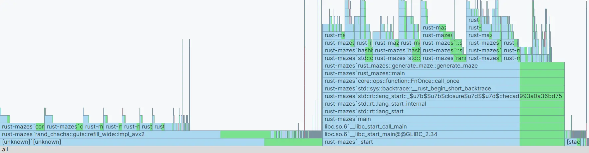


${toc}



- Bases de Rust
- Connaissances en structures de données



Le code lié au POK est disponible sur mon Github
[ValentinBilla/rust-mazes](https://github.com/ValentinBilla/rust-mazes).


## Objectifs
Je souhaite approfondir mes connaissances en rust et apprendre à mieux m'y prendre pour optimiser des algorithmes.
L'objectif est de créer un générateur de labyrinthe pour ensuite utiliser ce projet comme prétexte pour en
apprendre plus sur les techniques d'optimisation ainsi que les structures de données plus niches en Rust.

Aussi, j'ai aussi utilisé les connaissances acquises lors de ce POK pour réécrire un algorithme initialement
rédigé en Python vers Rust, pour générer des mosaïques à la vitesse de la lumière (ou presque) pour notre projet 3A.



Ce sera abordé dans la partie [Optimisation](#Optimisation), mais il faut savoir que généralement optimiser juste
pour optimiser est généralement **mauvaise idée**. Ce POK n'étant pas lié à project concret, c'est sans
trop de vergogne que je vais me déroger aux bonnes pratiques à des fins d'expérimentation !


### Rudiments de Rust
Plusieurs POK&MONs ont déjà été réalisés sur les rudiments de Rust, je ne m'y attarderais donc pas.
Entre autres, je peux recommander la lecture des deux suivants (non pas que je ne
recommande pas les autres, je ne les ai simplement pas tous lus).




## Sprint 1
### Planning Prévisionnel
#### 1.1 Mise en place et tests
- [X] Création d'une interface labyrinthe qu'implémenteront mes structures de données.
- [X] Création de tests pour les implémentations de cette interface.

#### 1.2 Implémentation de l'interface
- [X] Implémentation de l'interface de façon naïve.
- [X] Création d'une fonction permettant de visualiser un labyrinthe.
- [] Rédaction d'un algorithme de génération utilisant l'interface.


J'ai dû créer l'implémentation de l'interface naïve avant les tests, pour pouvoir tester les tests...
Ce sera abordé plus tard, mais les tests m'ont donné par mal de fil à retordre.


### Optimisation
L'optimisation est un sujet délicat en développement logiciel, au croisement entre performance et complexité.
Bien que cela semble contre-intuitif, beaucoup de professionnels, à commencer par des experts, conseillent la prudence.
La raison ? Optimiser prématurément un code peut introduire des bugs, rendre la maintenance plus complexe et détourner
l'énergie de problèmes critiques. C'est un travail qui coûte cher si mal planifié, tant en temps qu'en effort.

[Donald Knuth](https://en.wikipedia.org/wiki/Donald_Knuth)
> Premature optimization is the root of all evil.

[Michael A. Jackson](https://en.wikipedia.org/wiki/Michael_A._Jackson_(computer_scientist)) \
*À ne pas confondre avec Michael Jackson tout court dont l'opinion en informatique est probablement
beaucoup moins pertinente.* &#128378;
> Rules of Optimization: \
> • Rule 1: Don't do it. \
> • Rule 2 (for experts only): Don't do it yet.

Cela dit, optimiser peut s'avérer nécessaire dans des contextes spécifiques : améliorer la rapidité d'un processus
crucial pour l'utilisateur final, ajuster un programme pour fonctionner sur des systèmes aux ressources limitées
ou encore réduire les coûts d'infrastructure pour un logiciel gourmand en ressources.
La clé réside dans une analyse objective : mesurer les performances actuelles, identifier les goulots d’étranglement
et aborder les optimisations de manière réfléchie, après s’être assuré que l'application fonctionne comme prévu.


Je me suis inspiré d'un cours de l'université de Princeton sur
l'[amélioration de la performance](https://www.cs.princeton.edu/courses/archive/spring19/cos217/lectures/11_Performance.pdf)
pour écrire cette partie.


### Interface
Pour commencer, j'ai défini une interface ([`trait`](https://doc.rust-lang.org/book/ch10-02-traits.html)) `Maze`
et une énumération ([`enum`](https://doc.rust-lang.org/book/ch06-00-enums.html)) `Direction`
pour intéragir avec les structures de donnés qui serviront de labyrinthe. Peu importe
leur fonctionnement interne, elles devront implémenter les fonctions suivantes :

```rust
/* Directions cardinales pour préciser l'orientation des murs lors des appels de fonctions */
#[derive(Debug, Clone, Copy, PartialEq, Eq, Hash)]
pub enum Direction {
    North, East, South, West,
}

/* Interface à implémenter pour les différentes structures de données */
pub trait Maze {
    /* Instancie un labyrinthe de taille données dont tout les murs sont dans un état par défaut. */
    fn new(size: usize, default_state: bool) -> Self;

    /* Donne la taille du labyrinthe. */
    fn get_size(&self) -> usize;

    /* Renvoie si un mur est activé ou désactivé en fonction de sa position */
    fn is_wall(&self, x: usize, y: usize, d: &Direction) -> bool;

    /* Met le mur dans une position donnée dans l'état 'state' */
    fn change_wall(&mut self, x: usize, y: usize, d: &Direction, state: bool);

    /* Implémentation par défaut pour rajouter un mur */
    fn add_wall(&mut self, x: usize, y: usize, d: &Direction) {
        self.change_wall(x, y, d, true);
    }

    /* Implémentation par défaut pour rajouter un mur */
    fn remove_wall(&mut self, x: usize, y: usize, d: &Direction) {
        self.change_wall(x, y, d, false);
    }
}
```


Les **traits** en Rust sont similaires aux **interfaces** des langages orientés objet, mais avec des différences
notables :

- Les traits permettent des **implémentations par défaut** pour les méthodes.
- Ils supportent des **types et constantes associées**.
- Ils sont intégrés au système de typage pour un polymorphisme sécurisé au moment de la compilation.

En somme, les traits offrent plus de flexibilité tout en respectant les contraintes de sécurité de Rust.

Pour plus de détails voici une [réponse StackOverflow](https://stackoverflow.com/a/69485860) plutôt complète
ainsi qu'un [article Wikipédia](https://en.wikipedia.org/wiki/Trait_(computer_programming)) cité dans la réponse.


### Tests
Les tests ont été, d'après moi la partie la plus compliquée et par temps, frustrante, de ce POK.
Initialement, j'ai fait quelques expériences et j'ai trouvé l'écriture de tests plutôt intuitive.
Il suffit de créer un fichier juste à côté des fichiers sources et d'y placer un code similaire au suivant.
```rust
#[cfg(test)] // Permet de ne compiler ce code que quand on souaite exécuter des tests.
mod tests {
    use super::*;

    #[test] // Annote que la fonction est un test (c'est aussi simple que ça)
    fn it_works() {
        let result = 2 + 2;
        assert_eq!(result, 4); // On utilise des assertion, si aucune n'a de problème, le test passe
    }

    #[test]
    fn it_fails() {
        let result = 2 + 2;
        assert_eq!(result, 5); // Ici, 4 != 5, le test ne va pas fonctionner.
    }
}
```

Pour lancer les tests, toujours plutôt simple, on utilise la commande `cargo test` *(le tooling de Rust, c'est un plaisir)*
```shell
$ cargo test
running 2 tests
test tests::it_works ... ok
test tests::it_fails ... FAILED

failures:
    tests::it_fails

test result: FAILED. 1 passed; 1 failed; 0 ignored; 0 measured; 0 filtered out
```

Je souhaitais écrire des tests faciles à faire tourner sur toutes les structures qui implémentent
le trait `Maze`. Et c'est là que j'ai dû me heurter à plus fort que moi : l'écriture de
**macros**...


Les macros sont des outils puissants en Rust permettant de générer du code à la compilation. Contrairement aux
fonctions, les macros opèrent de manière plus flexible puisqu'elles prennent du code en entrée pour créer un nouvel
ensemble de comportements. Voici un exemple très simple d'une macro en Rust :

```rust
macro_rules! say_hello {
    () => {
        println!("Bonjour!");
    };
}
```

Vous pouvez appeler cette macro avec `say_hello!();`, et elle affichera "Bonjour!" sur la console.

Il existe plusieurs types de macros en Rust :

- **`macro_rules!`** : très utilisées pour des cas simples et souvent suffisantes pour une grande partie des besoins.
- **Macros procédurales** : permettant des opérations plus complexes, mais demandant d'importer des crates spécifiques
  comme `syn` ou `quote` et étant souvent utilisées pour le code dérivé des traits (e.g., `#[derive(...)]`).

Pour plus de détails la [documentation Rust](https://doc.rust-lang.org/book/ch20-06-macros.html) est plutôt bien écrite
et très complète.


En tout cas, ce qu'il faut savoir, c'est que débugger une macro relativement complexe (et mal comprise par manque
d'expérience), ce n'est pas forcément une mince affaire. Après avoir passé un LONG moment dessus, j'ai réussi à faire
marcher la macro disponible ci-dessous pour laquelle j'ai fait serment de ne plus toucher tant qu'elle fonctionne.
J'ai pu au fur et à mesure y rajouter des tests plus avancés.


Pour résumer brièvement son rôle, elle va générer du code en fonction d'une liste de couples de paramètres :
- `name`, le nom que l'on souhaite donner au module de test généré (besoin de noms distincts pour éviter les conflits)
- `type`, le type de la structure de donnée que l'on souhaite tester

*Ici le seul couple donné est `vecmaze: crate::vecmaze::VecMaze`, c'est la structure naïve que j'ai créée en première*

Dans le code généré, on crée un module avec le nom demandé, on y importe les dépendances du module parent puis
on écrit des tests qui au lieu de faire référence à un type en particulier, utilisent l'alias `<$type>`.
Un gros désavantage est que l'éditeur de texte a un peu du mal à deviner les fonctions à nous proposer à l'intérieur
de la macro, trouve parfois des erreurs qui n'existent pas et ne colorie pas correctement la syntaxe. Ça rends
l'expérience de développement sous optimale...

```rust
macro_rules! maze_tests {
    ($($name:ident: $type:ty,)*) => {
    $(
        mod $name {
            use super::*;

            #[test] // Un exemple de test
            #[should_panic(expected = "Maze size must be less than 1000")]
            pub fn test_creation_size_too_big() {
                let _maze = <$type>::new(MAX_MAZE_SIZE + 1, true);
            }
        }
    )*
    }
}

#[cfg(test)]
mod tests {
use rstest::rstest;
use crate::maze::*;

maze_tests ! {
vecmaze: crate::vecmaze::VecMaze, // Le type qu'on souhaite tester.
}
}
```


J'ai commencé par créer des tests conjointement à la structure de donnée VecMaze pour évaluer mon avancement
au fur et à mesure. Lors de cette partie, j'ai malheureusement écrit plein de petits bugs au fur et à mesure,
le problème étant que ces mêmes bugs étaient non pas seulement dans le code de VecMaze mais aussi
dans mes tests. C'est d'ailleurs une raison pour laquelle il est systématiquement recommandé, d'essayer d'écrire les
tests les plus simples possibles.

#### rstest
Pour m'assister, j'ai utilisé le module `rstest` qui permet entre autre d'écrire des fonctions de test
paramétrisées.

```rust
#[rstest]
#[case::south_upper_left_corner(0, 0, Direction::South)]
                    ...
#[case::west_random_inside(134, 553, Direction::West)]
pub fn test_add_wall_inside(
    #[case] i: usize,
    #[case] j: usize,
    #[case] direction: Direction,
) {
    let size = MAX_MAZE_SIZE;
    let mut maze = <$type>::new(size, false);

    maze.add_wall(i, j, &direction);

    // Fonction qui véfie un a un que tous les murs du labyrinthe sont dans leur position attentue
    is_wall_correctly_located(&maze, i, j, direction, false);
}
```

Ce test par exemple a été écrit pour essayer d'ajouter un mur dans CHACUN des edge cases du labyrinthe.


LE type d'erreurs et bugs que j'ai le plus couramment écris lors de ce POK sont les
[OBOE ou Off-By-One-Error](https://en.wikipedia.org/wiki/Off-by-one_error) traduisible par
*"erreur de décalage unitaire"* et qui consiste en gros à mettre un `-1` à un endroit où il n'en fallait pas
ou oublier un `+1` là où il était nécessaire.

Voici un exemple en C++.
```cpp
void foo (char *s)
{
    char buf[15];
    memset(buf, 0, sizeof(buf));
    strncat(buf, s, sizeof(buf)); // Le paramètre final devrait être sizeof(buf)-1
}
```


#### Fuzzy Testing
Une autre stratégie que j'ai décidée de mettre en place est l'écriture de **fuzzy tests**.
Le fuzzy testing est une méthode qui consiste à générer des **entrées aléatoires ou semi-aléatoires**
afin de tester la robustesse et la fiabilité du code face à des cas imprévus.
Ils permettent ainsi de détecter des bugs difficiles à anticiper avec des tests classiques.

En l'occurrence, je ne pouvais pas me permettre d'écrire un test case par mur possible du labyrinthe ainsi,
j'ai plutôt choisi de générer des cas aléatoires à chaque `cargo test` ce qui me permettrait avec un peu
de chance de tout de même déceler quelques problèmes et edge cases en avance.

```rust
#[rstest]
#[case::small_mazes(10, 1000)]
#[case::medium_mazes(100, 1000)]
#[case::large_mazes(1000, 10)] // Peu de tests pour la taille 1000 car vérifier chaque mur prends beaucoup de temps.
pub fn fuzzy_test_add_wall_inside(#[case] size: usize, #[case] number_of_tests: usize) {
    let mut rng = rand::rng();

    for _ in 0..number_of_tests {
        // Génération d'un mur au hasard.
        let i = rng.random_range(0..size);
        let j = rng.random_range(0..size);
        let d = DIRECTIONS[rng.random_range(0..4)];
        if (!is_inside_maze(size, i, j, &d)) {
            continue;
        }

        let mut maze = <$type>::new(size, false);

        maze.add_wall(i, j, &d);

        is_wall_correctly_located(&maze, i, j, d, false);
    }
}
```

### Structure naïve

Pour la structure naïve de labyrinthe, j'ai opté pour un vecteur de vecteurs de cellules.

```rust
#[derive(Clone)]
struct VecMazeCell {
    north: bool,
    west: bool,
    south: bool,
    east: bool,
}

pub struct VecMaze {
    size: usize,
    cells: Vec<Vec<VecMazeCell>>,
}
```

Pour un labyrinthe de 1000x1000 fait 4 bytes par `VecMazeCell`, soit 4 * 1000 * 1000 = 4 Mo par labyrinthe.
On est loin de la valeur minimale en terme d'information à stocker : 2 * (n-1) * n < 200 ko.

### Visualisation
J'ai créé une fonction `draw_maze_to_png` qui permet de dessiner un labyrinthe avec un nombre de pixels spécifiques
par cellule et de le sauvegarder en tant que fichier. Pour ce faire, j'ai utilisé la crate `image` qui contient
tout le nécessaire pour faire des dessins simples.

1. On commence par créer une image de taille appropriée que dont on remplit l'intérieur de blanc.
2. Ensuite, on colore le début et la fin
3. Enfin, on dessine un par un chacun des murs.

<div class="flex w-full gap-4 justify-center items-center mb-4">
    <figure style="margin: 0; image-rendering: crisp-edges;">
        
        <figcaption class="text-center">Étape 1</figcaption>
    </figure>
    <figure style="margin: 0; image-rendering: crisp-edges;">
        
        <figcaption class="text-center">Étape 2</figcaption>
    </figure>
    <figure style="margin: 0; image-rendering: crisp-edges;">
        
        <figcaption class="text-center">Étape 3</figcaption>
    </figure>
</div>

N'ayant pas pu terminer mon algorithme de génération, j'ai utilisé un petit script pour créer ce labyrinthe de test.
```rust
let size: usize = 10;
let mut maze = VecMaze::new(size, true);
for i in 0..size-1 {
    maze.remove_wall(i, i, &Direction::East);
    maze.remove_wall(i+1, i, &Direction::South);
}
draw_maze_to_png(&maze, 5, "draw-maze.png").unwrap();
```


<figure style="float: right; margin: 0 10px;">
    
    <figcaption class="text-center">Image interpolée</figcaption>
</figure>

Par défaut les navigateurs essaient d'**interpoler** les détails de l'image, quand on zoome dessus.
Généralement, c'est un comportement voulu, ça permet de ne pas avoir des images toutes pixelisées.
Mais dans notre cas, c'est *exactement l'inverse de ce qu'on souhaite.
<br/><br/>
La [propriété CSS](https://developer.mozilla.org/fr/docs/Web/CSS/image-rendering) suivante force à interpoler au plus proche voisin :
```css
img {
    image-rendering: crisp-edges; /* `pixelated` also works */
}
```


### Horodatage

| Date              | Heures passées | Indications                         |
|-------------------|----------------|-------------------------------------|
| 16 Janvier (Jeu.) | 2H             | Interface & Tests                   |
| 19 Janvier (Dim.) | 5H             | Tests                               |
| 25 Janvier (Sam.) | 3H             | Visualisation & Début de génération |
| **Total**         | **10H**        |                                     |

### Rétro
Pas mal de difficultés sur la rédaction de test qui a impacté mon temps total, je n'ai donc pas
eu le temps de faire tout ce que je voulais en 1.2.
Maintenant que j'y pense, j'aurais peut-être mieux fait d'écrire la fonction de visualisation avant l'écriture de test,
ce qui m'aurait permis de plus facilement détecter mes problèmes visuellement.

## Sprint 2
### Planning Prévisionnel
#### 1.2
- [X] Rédaction de l'algorithme de génération.

#### 2.1 Benchmarking
- [X] Créer des fonctions permettant de tester l'efficacité de l'algorithme de génération.

#### 2.2 Optimization
- [X] Identifier les bottle necks avec un flame graph.
- [X] Améliorer l'algorithme de génération.
- [X] Proposer d'autres structures de données.

### Algorithme de génération

<figure style="float: right; margin: 0; image-rendering: crisp-edges;">
    
    <figcaption class="text-center">Algorithme de Wilson</figcaption>
</figure>

Pour générer mon labyrinthe, j'ai choisi d'implémenter l'**algorithme de Wilson** qui est mon favori depuis
un moment en matière de labyrinthe, il donne des résultats esthétiquement plus équilibrés que les alternatives.
Je vous invite à lire l'[article Wikipédia](https://en.wikipedia.org/wiki/Maze_generation_algorithm)
qui est plutôt complet sur le sujet.

C'est un algorithme à priori relativement simple à décrire :

1. Commencez avec une grille remplie de murs. Choisissez une cellule au hasard et marquez-la comme faisant partie du labyrinthe.
2. Pour chaque cellule non incluse dans le labyrinthe :
    1. Choisissez une cellule non marquée au hasard et démarrez une "marche aléatoire" (random walk) à partir de cette cellule.
    2. Effectuez la marche aléatoire jusqu'à atteindre une cellule déjà incluse dans le labyrinthe :
        1. Si la marche visite une cellule déjà visitée dans cette marche en cours (avant d'atteindre le labyrinthe), retirez la boucle formée en revenant en arrière jusqu'à cette cellule (formez un chemin sans cycles).
    3. Connectez toutes les cellules de la marche au labyrinthe en transformant les murs rencontrés en passages.
3. Répétez jusqu'à ce que toutes les cellules soient incluses dans le labyrinthe.

<figure style="float: right; margin: 0; image-rendering: crisp-edges;">
    
    <figcaption class="text-center">Labyrinthe généré avec <br/> l'algorithme de Wilson</figcaption>
</figure>

J'ai donc créé une fonction ayant la signature ci-dessous qui implémente l'algorithme de Wilson pour n'importe
quelle structure qui implémente le `trait Maze`.

```rust
pub fn generate_maze<T: Maze>(size: usize) -> T {
    ...
}
```

J'ai pu générer un labyrinthe de 10x10 avec, puis 100x100 mais pour 1000x1000 la fonction semblait tourner infiniment.
Pour y remédier, j'ai dû faire quelques améliorations de performance et prendre quelques libertés avec l'algorithme,
que nous allons voir en suivant.


Certains joueurs de **Minecraft** sont aussi amateurs de labyrinthes. Ils se sont lancés le défi de créer
des générateurs dans le jeu, ce qui a récemment mené à l'invention d'un algorithme que je trouve
particulièrement élégant le ['Hilbert Lookahead'](https://www.youtube.com/watch?v=o7OhjEqCvSo)
qui utilise des courbes de remplissage de l'espace pour aiguiller les choix de mur à détruire.


### Améliorations
#### BitSet
Tout d'abord, une chose intéressante à savoir est qu'un booléen prend systématiquement au moins 8 bits en mémoire.
Un ordinateur ne sait en pratique pas stocker et récupérer des bits un par un, il stocke les informations en bytes.
Pour optimiser l'utilisation de la mémoire, j'ai remplacé mon vecteur de booléens par un `BitSet`.


Un `BitSet` ou [bit array](https://en.wikipedia.org/wiki/Bit_array) c'est un tableau de bits
où chaque élément est représenté par un seul bit plutôt qu'un byte entier. Cela permet de gagner
considérablement en mémoire pour des structures booléennes lorsque la taille augmente.

Pour le mettre en place, on crée, un tableau de byte puis on utilise des opérations binaires pour récupérer les bits
un à un.


Ce changement bien que peu impactant sur le temps d'exécution permet de réduire l'espace mémoire nécessaire
au programme et puisqu'il est vraiment simple à mettre en place, ce doit être un réflexe de l'utiliser quand on voit
un tableau de booléens traîner.
```rust
let mut visited = vec![true; size * size]
/* --- deviens --- */
use bit_set::BitSet;
let mut visited = BitSet::with_capacity(size * size);
```

#### Fenêtre
Un problème que j'avais remarqué dans le passé avec l'algorithme de Wilson est que pour de très gros labyrinthes,
la marche aléatoire a peu de chances de tomber sur les cellules déjà dans le labyrinthe tant qu'elles sont peu
nombreuses. Une solution que j'ai trouvée est de réduire l'espace de travail temporairement tant que les nombre
de cellules visitées est encore faible.

Par exemple, pour un labyrinthe de 1000x1000 je commence par générer des chemins uniquement dans un coin de 100x100
puis au fur et à mesure que le coin se rempli, j'élargis la fenêtre. Cet ajout, plus complexe m'a permis de générer
une grille 1000x1000 en quelques secondes.


Voici un [labyrinthe 1000x1000](https://raw.githubusercontent.com/do-it-ecm/promo-2024-2025/refs/heads/main//Billa-Valentin/pok/temps-3/images/maze_1000x1000.png) généré par mon algorithme.
J'ai ensuite fait passer l'image dans l'utilitaire `pngcrush` pour réduire la taille de
l'image de 4Mo à 700ko.

&#128270; *Pour l'observer correctement, je vous conseille de l'ouvrir dans un visualiseur d'image plutôt
que dans le navigateur.*


### Benchmarking
Le **benchmarking** est une méthode qui consiste à mesurer les performances d'un programme ou d'un algorithme en évaluant
des aspects tels que le temps d'exécution, l'utilisation des ressources ou encore l'efficacité globale,
afin d'identifier des pistes d'optimisation ou de comparer différentes implémentations.

[`criterion`](https://bheisler.github.io/criterion.rs/book/getting_started.html) est un super outil pour faire des
benchmarks et générer des rapports sur l'efficacité d'une fonction.

Je l'ai utilisé pour tester l'algorithme de génération au fur et à mesure que je tentais de l'optimiser.
Benchmarker est plutôt long, en effet pour éviter de tomber sur des cas exceptionnels, `criterion` fait
tourner les fonctions plusieurs fois (environ une centaine dans mon cas).

Dans la partie [Structures testées](#structures-testées), vous trouverez un lien vers le genre de rapports
générés par `criterion`.


Dans beaucoup de langages, il existe une distinction entre 'dev' et 'prod', généralement celle-ci permet :
- de compiler rapidement lors du développement, mais avoir un code pas très optimisé par le compilateur
- inversement, au coût d'une compilation plus longue, laisser le compilateur optimiser à fond

Quand on teste la performance d'une application, il est **primordial** de la benchmarker dans des conditions
les plus proches du réel possible. En fait, c'est encore mieux quand c'est fait grâce à des métriques
disponibles quant aux applications qui tournent en production. Dans notre cas, on va donc utiliser le mode
~ 'prod' pour compiler notre librairie en utilisant le flag `--release`.

Aussi, je profite de cette note pour mentionner que dans la plupart des cas, écrire de
l'assembleur à la main est une mauvaise idée aujourd'hui. Les compilateurs modernes sont devenus
extrêmement performants pour optimiser le code, exploitant des techniques complexes et spécifiques
au matériel, souvent mieux que ce qu'un humain pourrait produire manuellement, sauf dans des
cas très précis ou critiques.


### Profilage
Le **profilage** est une technique d'analyse utilisée pour examiner en détail l'exécution d'un programme afin d'identifier
les parties du code qui consomment le plus de ressources (temps ou mémoire).
Cela permet de repérer les **goulots d'étranglement** et d'orienter les efforts
d'optimisation de manière ciblée et efficace.

Pour profiler mon programme, j'ai utilisé les outils disponibles dans mon IDE (RustRover). Il utilise de
l'échantillonnage pour estimer le pourcentage de temps passé dans chaque fonction et produire des statistiques
visualisables entre autre sur un flame graph.


> Echantillonnage : l’exécution est échantillonnée régulièrement
> pour savoir quelles fonctions sont appelées. Pas d’intrusion, mais
> résultat dépendant notamment de la fréquence d’échantillonnage.
> Plus la durée d’exécution est longue, plus les résultats sont précis

*[cours de "Debogage / Profiling" donné pour LyonCalcul](http://lyoncalcul.univ-lyon1.fr/ed/DOCS_2015-2016/debogage_profiling.pdf)*


#### Flame Graph
Un flame graphe permet de représenter la répartition du temps passé dans chacune des fonctions du programme
lors d'une exécution. De bas en haut, un rectangle représente une fonction et les rectangles au-dessus, les
fonctions appelées par cette dernière. Par exemple, on peut voir que quasiment 50% du temps total est passé
à générer des nombres aléatoires dans `rust-mazes'rand_chacha::guts::refill_wide::impl_avx2`.


Mon IDE peut aussi générer des différences de flame graph entre deux versions, très utile pour identifier
d'un coup d'œil les améliorations de performance.
Ici, j'ai rajouté une condition pour que l'algorithme choisisse des directions aléatoires plus cohérentes
lors de la marche aléatoire eg. ne pas repartir en arrière (c'est ok pour une loop erased random walk).



### Structures testées
J'ai décidé d'implémenter une structure de bitset, pour optimiser la place mémoire utilisée par le


- [Génération avec VecMaze](reports/vecmaze/index.html)
- [Génération avec BitSetMaze](reports/bitsetmaze/index.html)


### Horodatage

| Date           | Heures passées | Indications                                       |
|----------------|----------------|---------------------------------------------------|
| 03 Mars (Lun.) | 2h             | Algorithme de génération & d'autres tests...      |
| 08 Mars (Sam.) | 4h             | [^1]                                              |
| 09 Mars (Dim.) | 4h             | Bidouilles avec différentes structures de données |
| **Total**      | **10H**        |                                                   |

[^1] Fonction de benchmarking, ajout de seeding dans l'algorithme de génération, identification de bottle
necks et premières optimisations.

### Rétro

<!-- Loads directly CSS & Rust prism js extensions without waiting for autoloader -->
<script src="https://cdn.jsdelivr.net/npm/prismjs/components/prism-css.min.js"></script>
<script src="https://cdn.jsdelivr.net/npm/prismjs/components/prism-rust.min.js"></script>
