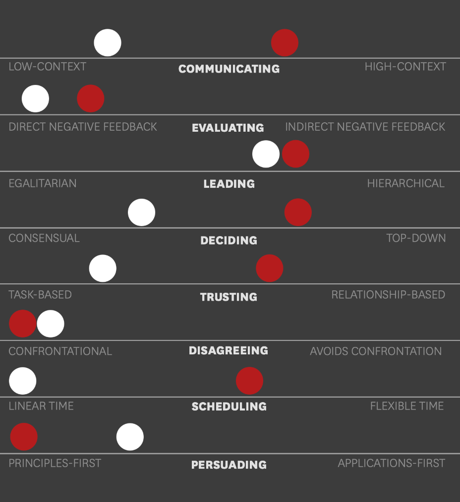



Aucun




- [1] [Moral, M.  (2007) . Le management interculturel : une nécessité vitale aujourd'hui ? Le Journal des psychologues, n° 245(2), 70-74](https://shs.cairn.info/revue-le-journal-des-psychologues-2007-2-page-70?lang=fr)
- [2] [Airbus et Boeing : deux cultures de l'intégration. *Extrait d'une communication de A. Gratacap au congrès de l'ECIG*](http://www.sietmanagement.fr/wp-content/uploads/2016/04/airbus-et-boeing.pdf)
- [3] [Gardel, M.  (2016) . Organisation du travail et management interculturel. Géoéconomie, N° 82(5), 155-171](https://shs.cairn.info/revue-geoeconomie-2016-5-page-155?lang=fr)
- [4] [Martin, C.  (2005) . Management interculturel en Europe. La Revue des Sciences de Gestion, n°214-215(4), 25-33](https://shs.cairn.info/revue-des-sciences-de-gestion-2005-4-page-25?lang=fr)
- [5] [Gallois, D. (2006, 20 juin). Une crise de croissance. Le Monde.fr](https://www.lemonde.fr/economie/article/2006/06/20/airbus-une-crise-de-croissance_785804_3234.html)
- [6] [Véronique Boirie. L’interculturel franco-allemand en entreprise: l’influence du management améri- cain: l’exemple du management franco-allemand chez Total. Gestion et management. Université Michel de Montaigne - Bordeaux III, 2013. Français. NNT : 2013BOR30018 . tel-00960149](https://theses.hal.science/tel-00960149/file/These-Veronique-BOIRIE.pdf)
- [7] [Afp, L. M. A. (2006, 3 octobre). Airbus livrera l’A380 avec dix mois de retard à la compagnie aérienne Emirates. Le Monde.fr](https://www.lemonde.fr/economie/article/2006/10/03/airbus-livrera-l-a380-a-son-plus-gros-client-avec-dix-mois-de-retard_819554_3234.html)
- [8] Meyer, E. (2015). The culture map : decoding how people think, lead, and get things done across cultures.


## Introduction

Le mardi 3 octobre 2006, Tim Clark, PDG de la compagnie *Emirates* et principal client d’Airbus avec 43 commandes d’A380, annonce qu’Airbus décale, pour la troisième fois, son calendrier de livraison. Avec 10 mois de retard supplémentaires ajoutés au calendrier de livraison, Airbus affiche alors près de deux ans de retard sur sa production d’A380 [7]. Cet échec industriel résulte de multiples facteurs, dont le management des systèmes d’information (SI) par l’entreprise, mettant en lumière les tensions, notamment entre Français et Allemands, sous-jacentes. Ainsi, l’émergence et la généralisation des TIC (Technologies de l’Information et de la Communication) en entreprise semblent faire tomber toutes les barrières liées à la distance géographique : les entreprises ont aujourd’hui tendance à aller chercher les talents directement là où ils sont, quitte à créer des équipes internationales où chacun peut apporter son expertise. Cependant, certaines problématiques de coopération ne peuvent être contournées par l’utilisation des TIC, comme les barrières culturelles, par exemple. Airbus et le projet A380 en sont une illustration. Il est donc intéressant de se questionner : **En quoi une gestion interculturelle inadaptée peut-elle compromettre la réussite d’un projet industriel d’envergure internationale, et comment y remédier ?**

## L’échec industriel de l’A380 et le rôle des tensions interculturelles dans l’échec de l’harmonisation des SI

En décembre 2000, six mois à peine après sa création, EADS, entreprise née de la fusion du français Aérospatiale Matra, de l'allemand Dasa et de l'espagnol Casa, donne le feu vert à sa filiale Airbus pour lancer la production du gros porteur A380, afin de concurrencer Boeing, qui occupe le marché seul depuis plus de trente ans [5]. Ce projet collaboratif, réunissant Français, Allemands, Espagnols et Britanniques, a mené à une restructuration d’Airbus. La nouvelle direction et les sites de production, notamment, ont été le résultat de décisions gouvernementales, et le gouvernement allemand, se sentant lésé dans l’affaire Aventis, a imposé une stricte parité franco-allemande dans la direction du projet, menant à une gouvernance bicéphale [6]. De plus, la répartition des sites de production a été choisie comme suit : les Britanniques (Bristol) sont en charge de la voilure, les Français (Toulouse) de la partie avant et centrale du fuselage, les Allemands (Hambourg) de la partie arrière, et les Espagnols (Madrid) de l’empennage et de la dérive. Après une rude compétition entre les sites de Toulouse et de Hambourg, c’est Toulouse qui a été choisi pour réaliser l’assemblage des différents tronçons [5]. Ainsi, ce projet est marqué dès le départ par une forte segmentation géographique et culturelle [2] : non seulement la production est répartie sur plusieurs pays, mais chaque pays applique des méthodes de travail différentes, créant des barrières linguistiques et organisationnelles.

Airbus va donc tenter de limiter ces problèmes de communication et d’intégration en mettant en place une uniformisation des TIC et des SI. En 2002, par exemple, « Airbus/People », portail intranet d’Airbus, est mis en place pour répondre à l’éclatement des sites [6]. Des e-rooms, destinées à favoriser la collaboration, sont également créées. Ce projet d’harmonisation des TIC a un double objectif : accélérer les échanges d’information (par la possibilité de valider ou non des modifications via un sondage, ou encore par le fait que toute modification soit notifiée par e-mail, par exemple) et contribuer au développement de systèmes d’information homogènes et compatibles entre les différents acteurs [2].

Cependant, malgré les efforts déployés, de nombreux problèmes liés à l’intégration des SI surviennent : des désalignements dans les outils informatiques persistent, illustrés par le fait que les sites de production de Hambourg et de Toulouse ne travaillent pas sur la même version de CATIA (outil de conception assistée par ordinateur), ou encore par les outils de gestion (TASKY en Allemagne et CIRCE en France), qui ne sont pas compatibles [6]. Les informations entrées par une équipe ne sont pas visibles par l’autre, car le système français est plus performant que le système allemand, et la passerelle mise en place afin de traduire les informations d’une plateforme à l’autre s’est révélée inopérante. L’harmonisation des SI a donc été un échec cuisant.

Ces problématiques et le retard qu’elles ont engendré sont révélateurs de difficultés majeures sur le plan de la communication et de l’intégration au sein du groupe EADS, et plus précisément au sein de sa filiale Airbus. Ainsi, l’origine de nombreux problèmes rencontrés par Airbus dans le projet A380 réside dans des styles de management différents, des problèmes de communication entre les équipes nationales, la création de fractures culturelles avec des équipes ayant tendance à privilégier des méthodes nationales plutôt qu’une approche centralisée, une incapacité des managers à imposer un seul outil ou encore un refus allemand d’utiliser le même outil que les Français pour la conception [2][6]. L’observation que nous pouvons faire est que, du fait de la parité totale, tant au niveau du design que de la production, les forces de travail sont restées telles quelles, et aucune des tentatives d’harmonisation des SI impulsées par Airbus n’a abouti, avec un taux d’adoption proche de zéro.

L’échec de l’harmonisation des systèmes d’information dans le projet A380 illustre à quel point une mauvaise gestion des différences culturelles peut entraîner des dysfonctionnements majeurs. Pour mieux comprendre ces tensions, il est essentiel d’analyser plus en détail les sources d’incompréhension entre les ingénieurs français et allemands, notamment en matière de management, de communication et de méthodologie de travail.

## Les sources d’incompréhension entre les ingénieurs allemands et français chez Airbus

La dimension culturelle est perçue de manière différente par les managers issus de pays et de cultures nationales différentes [6]. Ainsi, cette diversité d’origine culturelle peut être source de malentendus et générer des tensions dans la sphère professionnelle, comme cela a été le cas entre Français et Allemands dans l’exemple du projet de l’A380 développé précédemment. Pour illustrer cette idée, nous allons nous appuyer sur l’inventaire réalisé par P. Breuer, P. de Bartha et J. Pateau des malentendus récurrents dans les relations de travail franco-allemandes [6], que l’on appelle « incidents critiques ». Nous allons classer ces incidents critiques en trois catégories : communication, management et méthode de travail.

### Communication

La communication comprend tous les échanges interpersonnels qui peuvent survenir dans l’environnement professionnel. Une première source de tension réside dans la communication de l’information. En effet, dans les entreprises françaises, l’information se procure [6], et l’on privilégie l’utilisation de formules synthétiques et globales, orientées vers le contexte plutôt que le texte [4]. Il n’est en effet pas rare qu’il soit fait allusion à un contexte supposé connu de tous, sans lequel la discussion est incompréhensible. La communication allemande, quant à elle, est très exhaustive, afin de s’assurer que tout le monde ait le même niveau d’information. Cette communication intervient toujours dans un cadre défini [4][6]. Cet écart dans le style de communication est souligné par E. Meyer, qui place l’Allemagne du côté des pays à faible contexte, dans lesquels la communication est précise, simple, explicite et claire [8]. Au contraire, la France est considérée comme un pays à fort contexte, où les choses sont laissées à l'interprétation et où la compréhension peut dépendre de la lecture entre les lignes [5]. La clé, pour un Français souhaitant améliorer sa communication lors d’une collaboration avec un Allemand, serait donc d’utiliser des arguments "factuels" [6]. À défaut, il risque de passer pour quelqu’un d’arrogant, de suffisant, de superficiel ou encore de désordonné aux yeux de ses collaborateurs allemands.

La confiance est également un élément clé pour assurer une communication efficace et transparente. Cependant, selon la culture nationale, elle n’est pas accordée de la même manière. Il existe en effet des pays dans lesquels la confiance est basée sur les tâches, c’est-à-dire qu’elle se construit au travers d’activités professionnelles. Dans ce cas-là, les relations de travail se nouent et se dénouent facilement en fonction de l’aspect pratique de la situation [8]. La confiance dépend ainsi de la qualité et de la fiabilité du collaborateur : les compétences techniques et les aspects concrets priment sur l’affectif [6]. L’Allemagne se rapproche de cette perception de la confiance. 
Au contraire, en France, la confiance est affaire de sensation, de ressenti et de spontanéité. Elle repose principalement sur l’aspect affectif [6], se construisant donc par le partage de repas, d’afterworks et de discussions informelles autour de la machine à café [8]. Ainsi, la source d’incompréhension lors d’une collaboration franco-allemande réside dans le fait que, pour les Allemands, la confiance se mérite. Elle est le résultat d’un processus au cours duquel on prouve que l’on est digne de cette confiance, en se basant sur des compétences techniques. Ce mode de fonctionnement, bien que non personnel pour un Allemand, peut être perçu comme tel par un Français.

### Management

Le style de management diffère également énormément entre les Français et les Allemands sur divers aspects, ce qui explique en partie la difficulté de la collaboration franco-allemande dans le projet A380.
Le premier aspect concerne les motivations et attentes. En effet, une caractéristique bien française est le défi personnel. Les Français aiment entreprendre l’impossible et montrer ce dont ils sont capables. Au contraire, un collaborateur allemand est à l’aise dans son travail lorsque le but à atteindre est perçu comme réellement atteignable. La réalisation de l’objectif et la conscience du devoir priment sur le goût du risque, qu’un collaborateur français apprécierait davantage [6]. Si l’on [Français] souhaite motiver un partenaire allemand, il vaut mieux démontrer plutôt que séduire [6]. Ce premier aspect peut donc poser problème dès le lancement d’un projet.

La vision de l’autorité est également un point différenciant dans la collaboration franco-allemande. Les entreprises allemandes ont en effet tendance à adopter une organisation égalitaire, dans laquelle la distance hiérarchique est faible [4][8]. Le système est basé sur les compétences, avec la mise en place de responsabilités indépendantes les unes des autres, où chaque tâche possède un responsable exécutant [6]. Le système est donc collégial et fondé sur les faits. En France, le pouvoir reste un enjeu majeur, et de nombreux efforts de différenciation sont fournis pour y accéder [4]. Les structures organisationnelles françaises ont tendance à être multicouches et rigides. Un patron n’est pas un facilitateur parmi les égaux, comme en Allemagne, mais plutôt un directeur fort qui dirige depuis l’avant, et la communication suit des lignes hiérarchiques bien définies [8]. Cette organisation a un impact sur les décisions organisationnelles et stratégiques [4].

En effet, la prise de décision germanique est beaucoup plus consensuelle et réalisée en groupe [4][8], tandis que dans les entreprises françaises, les décisions sont généralement prises de manière individuelle par la haute hiérarchie [8]. L’un des points de friction entre ingénieurs français et allemands lors du projet Airbus résidait donc dans le fait que, du côté français, les techniciens attendaient davantage des directives de leurs supérieurs sans s’attendre à jouer un rôle actif dans leur élaboration, tandis que du côté allemand, la prise de décision était perçue comme un processus beaucoup plus collectif et consensuel.

### Méthodologie de travail

Enfin, l’organisation du travail est le dernier aspect que nous allons étudier, pouvant expliquer comment les différences culturelles ont pu mener à l’échec de l’industrialisation du gros-porteur d’Airbus.
La planification diffère entre les collaborateurs allemands et leurs homologues français. D’une part, la gestion des tâches est différente : les collaborateurs allemands ont une gestion linéaire du temps, où les étapes sont abordées de manière séquentielle [8]. On parle aussi de temps monochronique [4], avec des activités planifiées et réalisées sans interruption. L'accent est mis sur la date limite, le respect des échéances et la bonne organisation, plutôt que sur la flexibilité [6]. En revanche, dans une organisation française, la notion du temps est plus flexible, polychronique [4]. On a tendance à réaliser plusieurs tâches en même temps, ce qui confère au temps de travail un caractère irrégulier, pouvant être perçu comme de la confusion ou de l’impulsivité par un collaborateur allemand. Les interruptions sont acceptées, et l’accent est davantage mis sur l’adaptabilité et la flexibilité que sur l’organisation [8]. D’autre part, les travailleurs français ont tendance à vouloir passer le plus vite possible à la réalisation, même avec une simple idée vague du projet, tandis que leurs homologues allemands ne commencent la réalisation qu’une fois qu’une méthode parfaitement définie a été établie. Une fois cette étape franchie, plus rien ni personne ne pourra interrompre le processus [6].

La méthodologie de travail passe également par l’étude de la faisabilité. Si les Français ont tendance à s’enthousiasmer pour une idée créative, celle-ci est perçue avec un certain scepticisme du côté allemand. En effet, une entreprise germanique considère qu’une idée ne vaut rien tant que sa mise en œuvre n’a pas été démontrée comme faisable et rentable. Cette priorité accordée aux aspects pratiques par les Allemands est également visible dans leur compréhension du marché, où ils cherchent à valoriser les aspects concrets du produit. En France, en revanche, on fait plus souvent appel à l’originalité ou à la créativité, cherchant à convaincre le client par l’émotionnel [6]. Ainsi, pour être impactant lors d’une collaboration avec un partenaire allemand, un ingénieur français devra penser en termes de faisabilité avant d’exprimer une nouvelle idée, mais aussi démontrer son utilité pour mieux la vendre auprès de ses clients.

Les divergences culturelles en termes de communication, de management et de méthodologie de travail ont largement contribué à l’échec de l’harmonisation des SI dans le cadre du projet A380 chez Airbus. Il est donc essentiel de comprendre ces différences afin d’éviter de telles incompréhensions à l’avenir et de mettre en place un management interculturel plus efficace.

## Mettre en place un management interculturel efficace pour favoriser l’intégration des SI

L’intérêt pour le management interculturel devient une nécessité dans le contexte de mondialisation actuel, qui a débuté il y a plusieurs années. En effet, on assiste aujourd’hui à une contestation de la théorie de l’uniformisation culturelle, c’est-à-dire un rejet ou du moins une résistance face à la standardisation des pratiques culturelles. On observe également une évolution de l’organisation des groupes globaux, passant d’un modèle hiérarchique par pays à un système « en réseau » basé sur les types d’activités. Enfin, les mobilités géographiques sont en forte expansion, et l’avènement des TIC entraîne un effacement progressif des distances géographiques [1]. L’ensemble de ces éléments conduit à une coexistence accrue de cultures diverses dans l’environnement professionnel, ce qui peut engendrer certains points de friction, comme nous l’avons vu précédemment.

Le management interculturel présente deux écueils. Le premier est la myopie, qui consiste à nier l’influence des spécificités culturelles. Le second est l’illusion du « tout culturel », qui privilégie systématiquement l’aspect culturel au détriment des autres rapports sociaux à l’œuvre dans une organisation. L’objectif du management interculturel est donc de trouver un équilibre entre ces deux visions opposées : l’une particulariste et l’autre universaliste. Il s’agit tantôt de penser la diversité dans l’unité, tantôt l’unité dans la diversité [6].

Pour cela, l’outil développé par E. Meyer permet à chacun de mieux comprendre les divergences et points communs dans les manières de travailler selon les cultures nationales. Cet outil repose sur huit axes : communication, évaluation, persuasion, autorité, décision, confiance, confrontation et planification [8]. Chaque pays est positionné sur chacun de ces axes, créant ainsi son propre profil. En superposant deux profils, on identifie rapidement les similitudes et différences culturelles, ce qui permet d’adapter son organisation, sa communication ou son style de management en conséquence.

Ci-dessous, un exemple de superposition des profils de la France (en rouge) et de l’Allemagne (en blanc). En un coup d’œil, on retrouve les divergences en matière de communication, de confiance et de planification que nous avons évoquées précédemment. Cet outil s’avère donc très utile pour une gestion interculturelle efficace.

[*Comparing management cultures. (s. d.)*](https://hbr.org/web/infographic/2014/04/comparing-management-cultures)

Ainsi, il existe une forte interconnexion entre le management interculturel et l’intégration des systèmes d’information (SI), en particulier dans les entreprises internationales où la collaboration est indispensable pour mener à bien des projets technologiques. L’intégration de nouveaux SI représente en effet un défi majeur, car elle suppose une standardisation des outils, des méthodes et des processus à l’échelle internationale. Cependant, comme nous l’avons vu, des différences dans les styles de management et de communication peuvent compliquer cette uniformisation.
Il est donc primordial de prendre en compte ces divergences culturelles lors de la conception des nouveaux SI. Dans le cas contraire, l’intégration risque d’échouer en raison d’un faible taux d’adoption, comme cela a été le cas avec Airbus et le projet A380. Une harmonisation des SI avait été initiée, mais en ignorant les spécificités de chaque organisation locale, l’adoption a été très limitée, entraînant de lourds retards et des coûts supplémentaires.
La conduite du changement est également une dimension clé à ne pas négliger lors de l’implémentation des SI. Les moyens de persuasion varient en fonction des cultures : en France, l’aspect affectif et relationnel joue un rôle central, tandis qu’en Allemagne, l’adhésion repose davantage sur des arguments concrets et factuels. Une approche interculturelle adaptée permettrait ainsi d’optimiser l’adoption des nouveaux outils et d’éviter les résistances au changement.

## Conclusion

L’échec industriel de l’A380 met en évidence l’importance du management interculturel dans l’implémentation et l’harmonisation des systèmes d’information. Les divergences culturelles entre Français et Allemands, loin d’être anecdotiques, soulignent la nécessité d’une approche adaptée pour garantir la réussite des projets internationaux. Ainsi, la mise en place d’un management interculturel efficace, fondé sur une meilleure compréhension mutuelle, une communication transparente et une gestion du changement adaptée, est essentielle pour assurer la performance des entreprises internationales et optimiser l’intégration de leurs SI.

