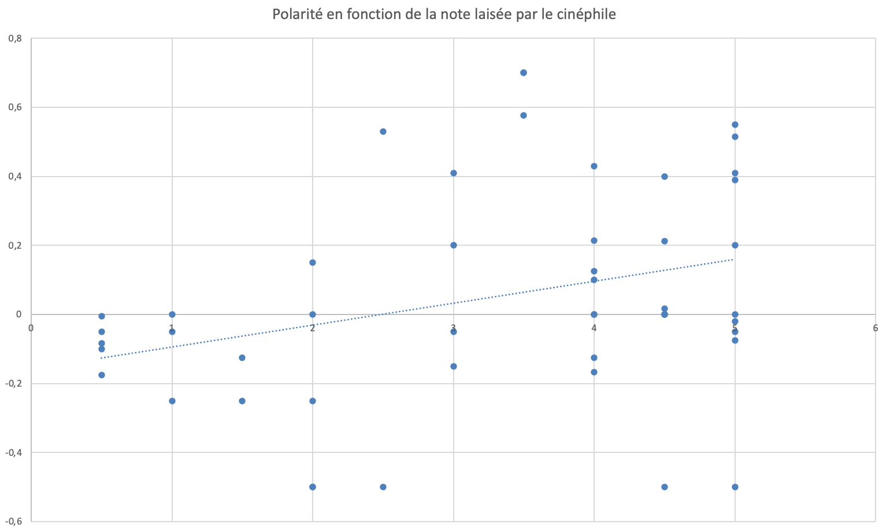



Bases en Python




- [Bibliothèques analyse de sentiment Python](https://www.unite.ai/fr/10-best-python-libraries-for-sentiment-analysis/)
- [Algorithme KMeans](https://www.datacamp.com/fr/tutorial/k-means-clustering-python)
- [Introduction au NLP](https://larevueia.fr/introduction-au-nlp-avec-python-les-ia-prennent-la-parole/)
- [Rédaction regex](https://regex101.com)
- [Cours regex](https://docs.python.org/fr/3/howto/regex.html)
- [Qualtrics](https://www.qualtrics.com/fr/gestion-de-l-experience/etude-marche/analyse-textuelle/)
- [Apprentissage regex](https://regexlearn.com/fr/learn)



## Cadrage

### Objectifs principaux
1. Comprendre les mécanismes de base du NLP
2. Appliquer une clusterisation thématique et une analyse sentimentale à un exemple.
3. Introduction au système de mise en place d'un chatbot

### Monitoring du projet
#### Back-log et Horodateur

- [x] Trouver des ressources pour comprendre ce qu'est le NLP
- [x] Création d'une base de données exploitable pour l'exemple
- [x] Mise en place une analyse sentimentale
- [x] Etude de l'analyse sentimentale
- [ ] Mise en place d'une clusterisation thématique
- [ ] Etude de l'analyse thématique

| Date | Heures passées | Indications |
| -------- | -------- | -------- |
| 19/01/2025 | 0.5h | Cadrage projet |
| 19/01/2025 | 2.5h | Compréhension des différents types de NLP et des processus sous-jacents |
| 20/01/2025 | 0.5h | Création de la première base de donnée |
| 22/01/2025 | 1.5h | Analyse sentimentale et étude des résultats |
| 24/01/2025 | 1.0h | Nouvelles base de données et analyse sentimentale |
| 25/01/2025 | 2.0h | Recherches sur la clusterisation |
| 26/01/2025 | 2.0h | Tentative de codage d'une fonction de clusterisation |
| 26/01/2025 | 1.0h | Rédaction du sprint 1 |


La mise en place d'un code permettant d'automatiser une clusterisation thématique n'a pas été une réussite en sprint 1.




- [x] Fin éventuelle de l'analyse textuelle du premier sprint
- [x] Etude du NLP dans le cadre d'une analyse vocale
- [x] Réalisation d'un exemple permettant de comprendre le fonctionnement
- [ ] Etude de mise en place en entreprise

| Date | Heures passées | Indications |
| -----|----------------|-------------|
| 03/02/2025 | 2.0h | Reprise du code de clusterisation en Pycaret |
| 04/02/2025 | 1.0h | Changement de méthode pour la clusterisation |
| 06/02/2025 | 1.0h | Tests sur la clusterisation |
| 08/02/2025 | 1.0h | Analyse totale sur la base de données |
| 09/02/2025 | 1.5h | Recherches sur le langage regex |
| 10/02/2025 | 0.5h | Recherches sur Qualtrics (abandonné) |
| 12/02/2025 | 1.0h | Recherches sur les IA conversationnelle |
| 15/02/2025 | 1.0h | Rédaction Sprint 2 |




#### Analyse post-morterm


**GESTION GENERALE DU TEMPS :** Bonne estimation générale dans le nombre de tâches pour le temps 1. Cependant, des difficultés et points bloquants n'ont pas été anticipé, ne permettant pas de terminer la totalité des tâches qui avaient été fixées. Celles-ci serton reprises en début de sprint 2.

**DIMENSIONNEMENT DES TACHES :** Les tâches auraient pû être plus précises. Cela aurait permis de moins perdre de temps dans la mise au travail pour chacune de celle-ci. L'ordre de celles-ci a cependant été suivi et réaliste.<br>
La compréhension et le choix des algorithmes mis en place dans la clusterisation ont été plus coûteux en temps que ce que j'avais imaginé. En effet, j'ai réalisé plusieurs essais de mise en place de la méthode k-means, mais les résultats que j'ai obtenus étaient totalement inexploitables.


**GESTION GENERALE DU TEMPS :** La reprise du code de clusterisation m'a pris plus de temps que je n'avais anticipé. Les sessions de code en général sont encore des étapes pour lesquelles j'ai du mal à anticiper le temps que cela me prend.

**REALISATIONS DES TACHES:** J'ai eu du mal à réaliser l'ensemble des tâches que je m'étais fixé notamment à cause d'une sous-réalisation de la difficulté derrière.


**REALISATIONS :** Ce POK m'a permis de découvrir des notions TRES utiles en entreprises, qui constituent un enjeu stratégiques aujourd'hui. En effet, après discussion avec Maxine BOURDEAU, j'ai pu réaliser que l'analyse de sentiment est encore très peu utilisée en France, à cause de la barrière du lanage. En effet, c'est quelque chose qui comment tout juste à être efficace en anglais, mais encore très peu en français. Seules les grandes entreprises commencent à en exploiter le potentiel. 

**REDACTION :** Le changement du type de rédaction est en effet plus clair pour une relecture à posteriori mais demande plus de temps de réflexion et de travail. 


## Analyse Textuelle
### Contexte
Nous nous plaçons dans le cas d'une entrepise qui possède énormément de données textuelles (réponses à des questions ouvertes d'un sondage, commentaires laissés sur google, réseaux sociaux). L'objectif est donc de tirer des apprentissages de cette quantité de données et de mettre en place des plans d'action. 

### Démarche générale pour l'entreprise
1. Analyse sentimentale afin de déterminer si l'échantillon textuel est positif ou négatif.
2. Clusterisation afin de classer les échantillons textuels par thématique.
3. Plans d'action par thématique en fonction du résultat de l'analyse sentimentale.

### Analyse sentimentale

- Création d'une base de données comprenant les notes et commentaires associés laissés par les spectateurs sur le film "The Substance" par Coralie Fargeat.
- Analyse sentimentale en attribuant un indice de positivité sur chacun des commentaires.
- Etude de la corrélation entre les notes attribuées par les spectateurs et l'indice de positivité. 


Cette préparation préalable se fait avec les étapes suivantes : 
- **Etape 1 : Suppression des données manquantes**<br>
*Fonction employée :* `dropna`
- **Etape 2 : Nettoyage du texte**<br>
**Conversion des caractères en minuscule** <br>
*Fonction employée :* `str.lower()`<br>
**Suppression des caractères spéciaux** <br>
*Fonction employée :* `apply(lambda x: re.sub(r"[^a-zA-Z0-9\s]", "", x))`<br>
**Suppression des espaces multiples** <br>
*Fonction employée :* `apply(lambda x: re.sub(r"\s+", " ", x).strip())`<br>
- **Etape 3 : Tokenisation**<br>
*Explication :* Transforme une chaîne de caractère en liste de mots.<br>
*Fonction employée :* `apply(word_tokenize)`<br>
- **Etape 4 : Lemmatisation**<br>
*Explication :* Réduit les mots à leur forme canonique (infinitif des verbes par exemple).<br>
*Fonction employée :* `lemmatizer = WordNetLemmatizer()`<br>


- *Méthode :* A partir d'un dictionnaire préconstruit, une polarité est attribué à chaque mot (*merveilleux* aura une polarité positive tandis que *mauvais* ara une polarité négative).
- *Bibliothèque utilisée :* TextBlob
- *Avantages :* Analyse sentimetale intégrée, peu de code, bon pour des projets simples, compatible en français.


On remarque que dans le cadre des commentaires sur le film "The Substance", la corrélation entre la note et la polarité n'est pas évidente. Ceci peut s'expliquer par le fait qu'il s'agit d'un film de body horror. Des commentaires possèdent donc des mots comme "gore", "horrible", "dégoûtant" mais ont de très bonnes notes.<br>

**Réitérons l'expérience avec une base de données comprenant les commentaires laissés sur un bar avec leurs notes associées.**
On remarque alors que la corrélation est beaucoup plus éviente. Ce code permet donc de déterminer automatiquement si un commentaire est plutôt positif ou négatif.


### Clusterisation

- Nettoyer les données en faisant une pré-analyse (comme pour l'analyse sentimentale).
- Représenter chaque mot sous forme de vecteur, appelé *Word Embedding*. Il s'agit de représenter une chaîne de caracatère en vecteur numérique de taille fixe. Les mots ayant un sens proche ont une représentation proche dans l'espace vectoriel.
- Classification des vecteurs par la méthode des k-means.


- Initialisation avec k le nombre de cluster souhaité. 
- Choix de k individus au hasard (représentant les k classes à ce stade).
- Association de chacun des individus restant à la classe la plus proche.
- Carcatérisation de chacune des classes par la moyennes de points qu'elle contient.
- Evaluation de la distance physique de chacun des individus à chacune des k moyennes. Les individus peuvent alors changer de classe si une autre est plus proche.
- Ré-itération de l'étape précédente jusqu'à ce qu'il n'y ait plus de changement de classe parmis les individus. 
- Obtention des k clusters.


- *Bibliothèque utilisée :* `Pycaret`
- *Avantage :* réalise le pré-traitement des données, encode les données (attribue un vecteur à chaque commentaire textuel), clustering intégré.


La base que j'ai utilisée est la base de 50 commentaires sur le bar avec les notes associées. Pour faire tourner le modèle j'ai choisi un k de 2 afin d'obtenir 2 clusters. Le problème est que l'lagorithme semble bien s'éxécuter mais lorsque j'essaie d'afficher les données dans un graphique (un graphique en barre par exemple pour obtenir la population de chacun des clusters), mon ordinateur plante avant d'afficher les résultats. Après recherche il semblerait que cela pourrait provenir de la capacité de l'environnement virtuel que j'utilise. Je vais tenter de trouver une solution lors du second Sprint. 


- *Problématique :* Je ne suis pas parvenu à faire fonctionner `Pycaret`sur ma machine, du fait de problèmes de compatibilités avec d'autres bibliothèques. 
- *Nouvelle bibliothèque utilisée :* `sklearn`
- *Avantage :* Cette bibliothèque, selon la documentation, est flexible et contient des extension permettant de vectoriser les données textuelles, réaliser la clusterisation à l'aide de l'algorithme kmeans mais également d'extraire les thématiques principales. 


L'application de ce code à la base de données contenant les commentaires sur le bar a permi de réaliser 2 clusters, dont les thématiques principales extraites sont les suivantes : 
```
Mots-clés des thèmes identifiés par LDA :
Thème 1: serveur, accueil, boisson, prix, qualite
Thème 2: bon, bar, service, cocktail, ambiance
```
 
 
 - *Objectif :* Réaliser une clusterisation thématique des commentaires laissés par les clients (en assigannt chaque commentaire à un numéro de cluster) et faire correspondre une polarité *générale* à chaque cluster reflettant le sentiment général sur la thématique extraite.
 - *Premiers Résultats :* 
 ```
Moyenne de la polarité par cluster :
Cluster
0    30.025132
1    11.171875
```
- *Discussion et limites :* On observe que les clients sont plus notablement plus satisfaits des prix et de la qualité des boissons que du service et de l'ambiance du bar. Une limite que l'on peut noter est que nous n'avons exploité une information donnée par l'analyse sentimentale précédente : *le score de subjectivité*. Il serait donc intéressant d'utiliser ce score afin de donner plus de poids aux commentaires les plus objectifs. 
- *Nouveau calcul :* Les résultats obtenus en pondérant la polarité des commentaires par le score de subjectivité sont les suivants :
```
Moyenne pondérée de la polarité par cluster :
Cluster
0    27.507671
1     8.538433
```
Les résultats semblent se confirmer, avec cette fois-ci une priorisation pour les commentaires les plus objectifs. 


*Choix des thématiques :* La méthode kmeans utilisée précédemment ne permet pas de choisir au prélable les thématiques des clsuters que l'on souhaite former. Comme vu dans les résultats V2, les thématiques des clusters ne sont pas particulièrement aisés à analyser car des sujets apparaissent dans les deux clusters. Une méthode permettant de choisir au préalable les thèmes serait donc plus impactante à utiliser afin d'en tirer de réels apprentissages.


- *Regex :* il s'agit d'un langage de programmation permettant de définir des règles afin de spécifier une correspondance avec une chaîne de caractère.
- *Application à la clusterisation :* Cette méthode permet de créer une requête par thématique permettant de repérer des associations de termes qui se renvoient à une thématique particulière.
- *Quelques règles du langage Regex :* Ci-après, une liste non-exhaustive des principaux métacaractères permettant de repérer des motifs dans une chaîne de caractère :
```
.       = n'importe quel caractère
\d      = un carctère numérique
\w      = un carctère alphanumérique
[abc]   = un carcatère dans la liste donnée
[^abc]  = n'importe quel carcatère sauf ceux dans la liste donnée
^       = début de chaîne
$       = fin de chaîne
*       = indique la présence de 0 ou pusieurs occurence
|       = ou
```
Le lien [suivant](https://regexlearn.com/fr/learn) permet de comprendre facilement les bases du langage regex.


Application du regex pour des requêtes simples dans le cas d'un bar :
- *Localisation :* `(emplacement|localisation|situation|proximité|endroit).*(vue|panorama|paysage|décor|panoramique)`<br>
Cette requête comprend deux groupes de termes, qui peuvent être séparés de n'importe quel nombre de carcatères (grâce à `.*`). Ainsi, un commentaire comprenant un mot appartenant au premier groupe et un mot appartenant au second groupe sera associé au cluster *Localisation*.
- *Qualité du service :* `(service|serveur|serveuse|accueil|personnel|serveurs).*(rapide|lent|efficace|sympathique|professionnel|désagréable|aimable|attentif|incompétent)`
- *Ambiance :* `(musique|playlist|son|DJ|volume).*(ambiance|atmosphère|vibe|animation|cadre|environnement)`


### IA Conversationnelle
#### Définition
Une IA conversationnelle est une technologie qui permet aux logiciels de comprendre et de répondre aux conversations humaines, en se basant sur la voix ou un texte. Cette technologie permet d'apporter une réponse, en imitant une interaction humaine. 

#### Application
Les applications pour les entreprises sont nombreuses, notamment dans le secteur du service client, afin d'augmenter la satisfaction client. D'une part, cela permet aux utilisateurs d'obtenir de l'aide 24/7. D'une autre part, cela permet d'augmenter la quantité de "self capabilities", permettant ainsi aux clients de réaliser un certain nombre de tâches, sans avoir à attendre la disponibilité d'un opérateur. Ceci permet ainsi de réduire la frsutration client. <br>
Pour ces raisons, la mise en place de chatbot fait donc partie intégrante du NLP.

#### Méthode d'implémentation d'une IA conversationnelle
Afin de pouvoir répondre à une plus grande partie possible des requêtes clientes, une IA conversationnelle doit être entraînée. Pour cela, on réaliser les étapes suivantes : 


- *Objectif :* Déterminer les thématiques des principales requêtes clientes. Cela se rapproche un peu de la clusterisation vue précédemment, l'objectif étant d'assigner chaque demande client à une thématique particulière.
- *Exemple :* En conservant notre exemple du bar, les principaux thèmes conversationnels serait donc : 
  + Accueil
  + Boissons et Menu
  + Ambiance
  + Promos et Offres spéciales


- *Objectif :* Lister pour chacun des thèmes identifiés, une liste de questions ou de renseignements susceptibles d'être demandés par un client.
- *Exemple :* Dans le cas d'un bar avec les thèmes conversationnels précédents :
  + **Accueil**
    - Jusqu’à quelle heure êtes vous ouvert ?
    - Puis-je réserver une table à l’avance ?
    - Quel est le meilleure horaire auquel venir pour avoir de la place ?
    - Est-ce qu’il est possible de privatiser une salle pour un anniversaire ?
  + **Boissons et Menu**
    - Avez-vous des options sans alcool ?
    - Quels sont les cocktails les plus populaires ?
    - Est-il possible de manger sur place ?
    - Avez-vous des boissons chaudes ? Thé ? Café ?
  + **Ambiance**
    - Est-ce que vous organisez des soirées à thème ?
    - Avez-vous des soirées ou des DJ en live ?
    - Est-ce que la musique est forte ou il est possible de discuter ?
    - Peut-on danser ?
  + **Promos et Offres spéciales**
    - Quand est l’Happy Hour ?
    - Les étudiants ont-ils des prix préférentiels ?
    - Quels sont vos offres spéciales ?
    - Existe-il des prix de groupe ?
- *Diversification des questions :* L'objectif est ensuite, pour chaque question, de créer des variantes de formaulation. Ceci peut aisément être réalisé en demandant à une IA générative. Un exemple de base d'entrâinement pour la thématique *Accueil* est visible dans la partie *livrables*.


Afin de couvrir le plus grand nombre de questions possibles, il est important de lister le plus grand nombre de questions et de thèmes possibles. Nous avons ici réalisé un exemple avec 4 thèmes et 4 questions associées à chaque thème mais un minimum serait de 7 questions par thèmes afin d'être le plus exhaustif possible. De même, pour la diversification des formulations, l'idéal est de demander 50 variantes au moins pour chaque question. 



- *Objectif :* Associer à chaque requête que pourrais formuler un client une intention mais également une entité. 
- *Intention :* Le but de la requête du client, comme obtenir un délais de livraison, une information sur le suivi d'une commande, la plage horaire d'ouverture,...
- *Entité :* Information spécifique que l'on souhaite extraire de la demande client (lieu, nom de famille, numéro de commande, horaire, "ce soir",...)
- *Entraînement de l'IA :* Chaque question de la base d'entraînement est étiquetée avec une intention et une entité. Cela permet ensuite au logiciel de pouvoir répondre de manière efficace et rapide à une demande client en pouvant extraire de manière automatisée une intention et les informations nécéssaires pour répondre à la demande. 



### Livrables

Les bases de données ("The Substance" et pour le bar) et les fichiers de travail intermédiaire se trouve sur le [GitHub](https://github.com/CharlesCook1/POK3).


- Ci-dessous les résultats de corrélation entre les notes laissés par les spectateurs du film "The Substance" et la polarité associée à chaque commentaire.<br>

La corrélation n'est pas évidente, lié, d'après-moi, au style du film (body horror)<br>

- Ci-après, la même corrélation pour un bar sur le Vieux Port :<br>

La corrélation est alors plus évidente, plus la note attribué par le client est proche de 5, plus la polarité attribuée par l'algorithme est proche de 1.


Le code se trouve sur le [GitHub](https://github.com/CharlesCook1/POK3).


**"Jusqu’à quelle heure êtes-vous ouvert ?"**
1. "À quelle heure fermez-vous ce soir ?"
2. "Vous êtes ouverts jusqu’à quelle heure ?"
3. "Quelles sont vos heures de fermeture ce soir ?"
4. "Fermeture prévue pour ce soir à quelle heure ?"

**"Puis-je réserver une table à l’avance ?"**
1. "Est-il possible de réserver une table pour plus tard ?"
2. "Acceptez-vous les réservations à l’avance ?"
3. "Je peux réserver une table pour ce soir ?"
4. "Est-ce que je peux réserver une table avant ma venue ?"

**"Quel est le meilleur horaire auquel venir pour avoir de la place ?"**
1. "À quelle heure est-ce que vous avez de la place pour une table ?"
2. "Quand est-ce le meilleur moment pour venir sans trop attendre ?"
3. "Il y a moins de monde à quel moment de la soirée ?"
4. "À quel moment de la journée vous avez généralement moins de monde ?"

**"Est-ce qu’il est possible de privatiser une salle pour un anniversaire ?"**
1. "Puis-je privatiser une salle pour une fête d’anniversaire ?"
2. "Est-ce que vous proposez la privatisation de salle pour des événements privés ?"
3. "J’aimerais organiser un anniversaire ici, est-ce possible de privatiser un espace ?"
4. "Est-ce qu’il y a des salles disponibles pour réserver un anniversaire en privé ?"
