

MON débutant, aucun prérequis



**Partie dactylographie** :  
- [edclub](https://www.edclub.com/sportal/)
- [keybr](https://www.keybr.com/fr)
- [monkeytype](https://monkeytype.com/)
- [10fastfingerrs](https://10fastfingers.com/typing-test/french)

**Partie lean** :  
Cours sur le lean de la filière métier "production et logistique"  




[[toc]]


## ⌨️ Dactylographie

Je n'ai jamais appris à bien écrire sur un clavier d'ordinateur sans regarder et en utilisant efficacement mes 10 doigts. Résultat, alors que je vais avoir un BAC+5, j'écris encore en regardant souvent mes doigts et je n'utilise que mes index (oui c'est la honte, je sais...). J'ai donc décidé de changer celà en **apprenant la dactylographie** ! La dactylographie est l'**action de saisir un texte sur un clavier**.  
La **vitesse de frappe** sur un clavier s'exprime en **mpm** = mot par minute. Sachant qu'un mot est défini comme cinq caractères ou frappes de touche sur ordinateur.


La personne **moyenne** tape à environ **40 mpm**.  
Les **meilleurs** dactylographes au monde sont à **plus de 200 mpm**.


### Placement des doigts

En effet, il y a une manière optimale d'utiliser ses 10 doigts pour les déplacer un minimum quand on écrit. La **barre en relief** sur les lettres **f et j** sert d'ailleurs à positionner nos **index** sans avoir besoin de regarder son clavier. Voici le bon positionnement ci-dessous :

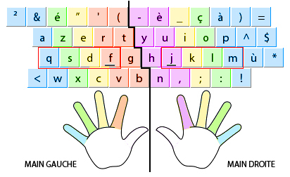

    Illustration trouvée sur le site Jimdo

### Sites pour s'entraîner

[edclub](https://www.edclub.com/sportal/) :  
J'ai d'abord commencé à **réapprendre à tapper chaque lettre avec le bon doigt** en suivant le cours sur le site **edclub**. Je trouve la **formation très bien faite** et ludique pour apprendre. Par contre, les exercices sont les mêmes donc c'est lassant de les refaire une fois réussi.  
J'ai mis ci-dessous des screens d'un entrainement pour montrer (lettres en rouge en cas d'erreur) et des scores en le faisant à fond : on voit bien la progression depuis le début !

    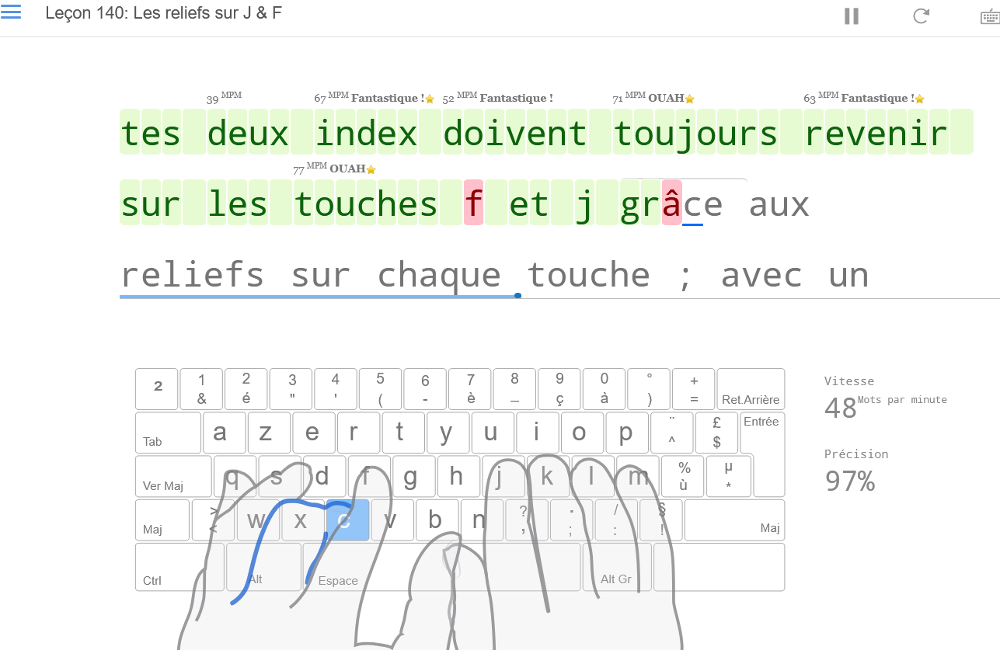
    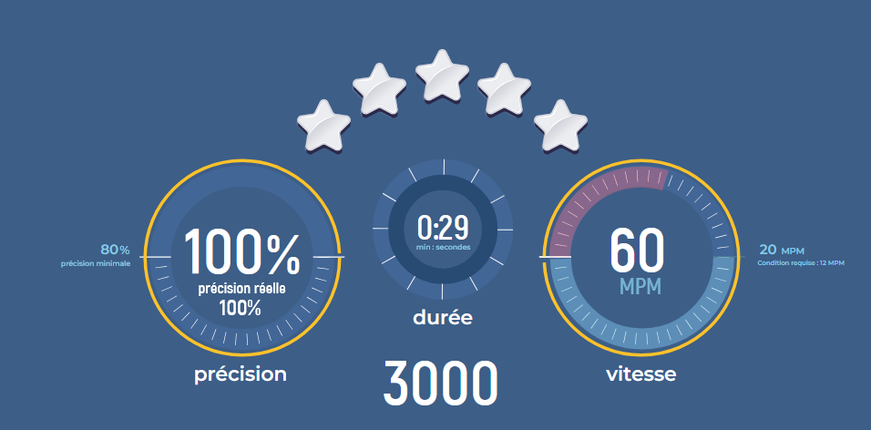
    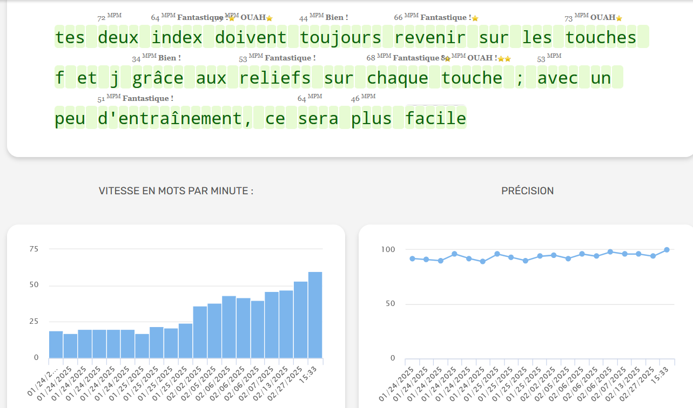

  
[keybr](https://www.keybr.com/fr) :  
Une fois les lettres toutes parfaitement apprises, j'ai renforcé ma précision et ma vitesse en utilisant le site **Keybr**. Il est assez intéressant car il propose des **sessions personnalisées en analysant notre vitesse de frappe et précision pour chaque lettre**. Ainsi, on s'entraîne sur nos difficultés.  
Sur le premier screen, on voit une leçon personnalisée pour tapper plus vite la **touche "è"** et on voit sur le deuxième screen que l'entraînement porte ses fruits. Puis sur le troisème screen, on voit que ma **vitesse de frappe varie fortement selon les lettres** allant de 17 à 62 mpm.
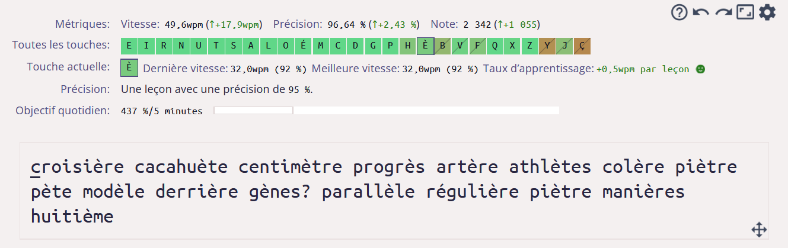
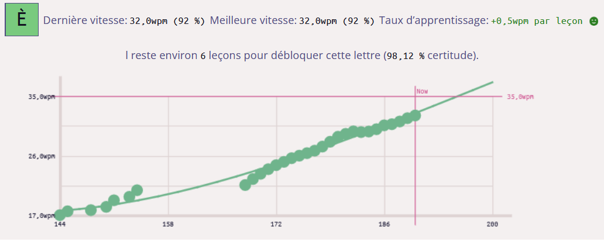
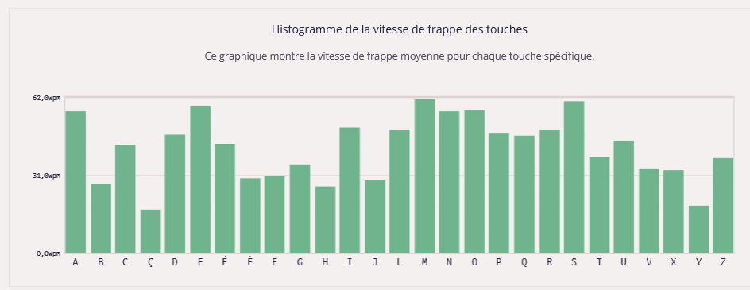

    Screens du site Keybr

[monkeytype](https://monkeytype.com/) :  
J'ai aussi souvent utilisé le site **monkeytype** pour m'entraîner sur la vitesse et la précision car je trouve son **interface très agréable** et il y a de nombreux **modes personnalisables**.

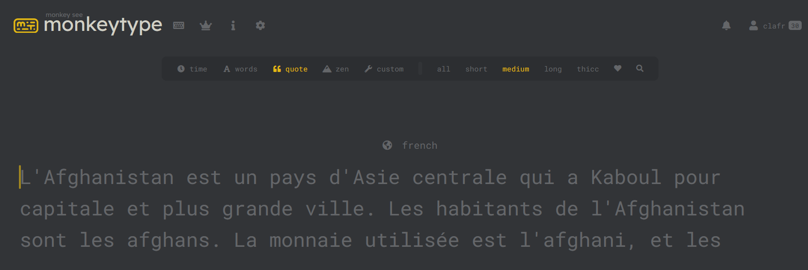

    Screen du site Monkeytype

[10fastfingerrs](https://10fastfingers.com/typing-test/french) :  
J'ai plusieurs fois utilisé le site 10fastfingers pour **mesurer ma vitesse et précision**.

### Conseils pour progresser

Voici quelques conseils vus sur Youtube ou des forums qui m'ont aidé à progresser :

1. **Regarder les mots suivants** tout en tapant le mot précédent
2. Essayer d'écire un mot en le **décomposant en syllabe** qu'on écrit chacune en une seule fois
3. D'abord **se concentrer sur la précision**, la vitesse viendra après

### Raccourcis clavier

J'en ai profité pour récapituler tous les **raccourcis pratiques** sur Windows dans le tableau ci-dessous afin de plus souvent avoir le **réflexe d'utiliser le clavier** au lieu d'une souris ou de multiples boutons.


| Commandes                 | Actions |
|---------------------------|---------|
| **Générales**             |         |
| Ctrl + A                  | Tout sélectionner |
| Ctrl + B / I / U          | Mettre en gras / italique / souligner |
| Ctrl + Maj + L/E/R/J      | Aligner le texte à gauche / milieu / droite / justifier |
| Ctrl + C                  | Copier |
| Ctrl + X                  | Couper |
| Ctrl + V                  | Coller |
| Ctrl + Maj + V            | Coller sans la mise en forme |
| Windows + V               | Coller historique |
| Ctrl + S                  | Sauvegarder |
| Ctrl + P                  | Imprimer la page |
| Ctrl + F                  | Rechercher |
| Ctrl + H                  | Rechercher et remplacer |
| Ctrl + Z                  | Annuler dernier mouvement |
| Ctrl + Y                  | Annuler l'annulation |
| Ctrl + K                  | Ajouter un lien |
| Ctrl + Flèche             | Se déplacer entre les mots ou alinéas |
| Ctrl + Clic               | Sélectionner plusieurs éléments |
| Maj + Clic                | Sélectionner tous les éléments entre 2 clics |
| Maj + Flèche              | Sélectionner un caractère à côté du curseur |
| Maj + Ctrl + Flèche       | Sélectionner mot (côtés) ou paragraphe (bas/haut) |
| Maj + Ctrl + Fin/Début    | Sélectionne texte jusqu’à la fin/début |
| Ctrl + ⬅                 | Supprimer un mot en entier |
| Ctrl + Suppr              | Supprimer un mot en entier à droite du curseur |
| Alt Gr                    | Obtenir les symboles en bas à droite (€ @ # …) |
| Fin / Début               | Aller à la fin / au début d’une zone |
| Up / Down                 | Aller à la page précédente / suivante |

| **Ordinateur / Navigation** |        |
| Windows                    | Rechercher et ouvrir le menu Windows |
| Windows + L                | Verrouiller l’ordi |
| Windows + I                | Paramètres |
| Windows + E                | Explorateur de fichiers |
| Windows + Q / 3 doigts clic | Explorateur menu (application, paramètre, dossier, Edge) |
| Windows + N / 4 doigts clic | Centre notification et calendrier |
| Windows + D / 3 doigts bas  | Afficher et masquer le bureau |
| Windows + Tab / 3 doigts haut | Naviguer entre fenêtres et bureaux visuellement |
| Windows + .                | Ouvrir panneau émoji |
| Windows + Flèches          | Réduire/agrandir, déplacer une fenêtre sur un côté |
| Windows + Maj + S          | Capture d’écran (photo, vidéo, onglet ou forme libre) |
| Ctrl + Tab                 | Naviguer entre les onglets |
| Ctrl + T                   | Nouvel onglet |
| Ctrl + N                   | Nouvel onglet dans nouvelle fenêtre |
| Ctrl + W                   | Fermer onglet |
| Ctrl + R / F5              | Rafraîchir la page |
| Ctrl + Maj + P             | Nouvel onglet privé |
| Ctrl + Maj + T             | Rouvrir dernier onglet fermé |
| Ctrl + Maj + B             | Masquer ou afficher barre raccourcis |
| Alt + Échap / 3 doigts côté | Naviguer entre les fenêtres |
| F2                         | Renommer fichier |
| F7                         | Vérifier l’orthographe |
| F11                        | Plein écran |
| Rapprocher / Éloigner doigts | Zoom avant / arrière |
| Clic 2 doigts              | Clic droit |


### Postures et matériel

Je voulais notamment apprendre la dactylographie pour **améliorer ma posture** devant un ordinateur. En effet, grâce à cette bonne pratique **mes poignets bougent moins** et je n'ai **pas besoin de bouger mon cou** pour regarder successivement mon clavier et l'écran quand j'écris.
Je trouve que ce screen du site [nabiraem.ru](https://solo.nabiraem.ru/fr/overview/typingtutor) résume bien d'autres conseils de postures pertinents.

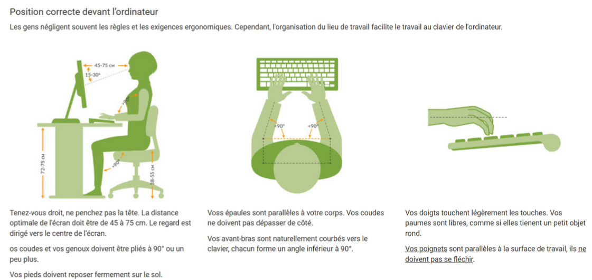

  
J'ai franchi le cap de m'acheter une souris ergonomique et un jolis tapis de souris (je n'utilisais que mon pavé tactile avant). J'espère ainsi réduire efficacement les douleurs dans mon poignet quand je navigue longtemps sur mon ordinateur portable.  
Peut-être qu'un jour je franchirai aussi le pas d'acheter un clavier ergonomique si je sens que ma posture actuelle n'est pas assez bonne pour éviter les TMS.
  

  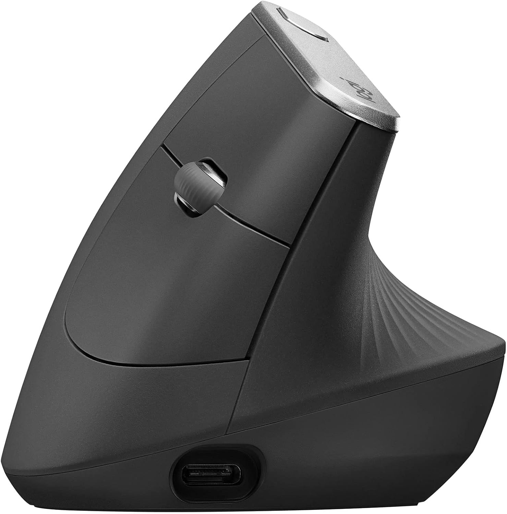

## 🧠 Mindmap sur le lean

En plus d'apprendre la dactylographie, j'ai eu envie d'apprendre à **faire une belle mindmap**. En effet, je n'ai jamais réalisé de vraie mindmap or je pense que c'est un **outil très visuel** et pratique pour retenir plein d'informations sur un sujet. Et ça tombe bien car je suis dans la filière métier **production et logistique** et on a eu de nombreux cours sur le "**lean**" : une méthode de management et de production qui vient du Japon et qui vise à produire au plus juste selon les besoins du client. J'ai adoré cette méthodologie au point d'avoir envie d'en faire une mindmap !  
Ainsi, j'ai conscré la deuxième moitié de ce MON a réaliser une mindmap sur le lean sur [Canva](https://www.canva.com/) en utilisant le format "tableau blanc".

Voilà le **résultat** obtenu : 
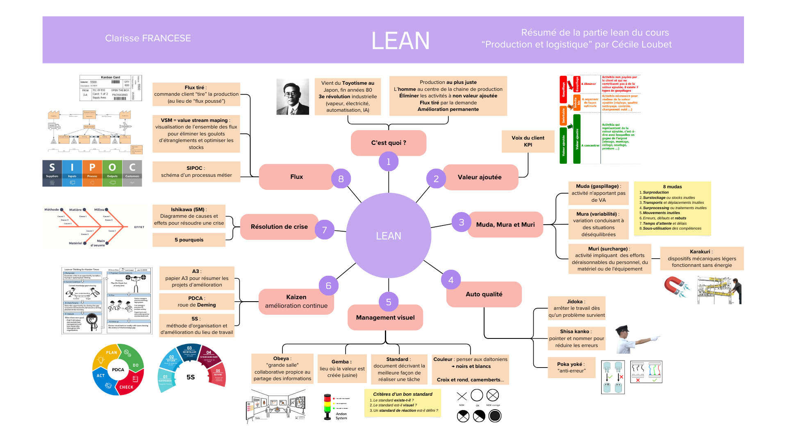
Je suis super satisfaite du résultat et je pense réutiliser Canva par la suite pour refaire des mindmaps très visuelles !

## 👍Conclusion

Je suis **très contente** de ce MON car il m'a permis d'enfin prendre le temps de progresser en **dactylographie**, de mieux **prendre soin de ma posture** devant un ordinateur et de réaliser une **mindmap** proprement. Tous ces **apprentissages me seront très utiles** par la suite. D'ailleurs, je précise que tout ce MON a été écrit en tappant avec mes 10 doigts et sans regarder mon clavier contrairement aux précédents !

## ⌛Horodatage

| Date | Heures passées | Indications |
| -------- | -------- |-------- |
 Depuis début janvier | +6h | Apprentissage de la dactylographie et renseigment sur les postures de travail |
| Jeudi 06/03 | 4h30 | Relecture de mes cours de production et logistique et réalisation de la mindmap |