

POK débutant : aucun prérequis




- [Transition Journey](https://transitionjourney.notion.site/Transition-Journey-7bb72c81669343c38516b370c98d79f9)
- Cours de la filière métier TREO (Transformation Environnementale des Organisations) disponibles sur Moodle
- [Economie.gouv.fr](https://www.economie.gouv.fr/)
- [Ecologie.gouv.fr](https://www.ecologie.gouv.fr/)
- [ISO.org](https://www.iso.org/fr/iso-26000-social-responsibility.html)
- Wikipédia
- [Novethic](https://www.novethic.fr/lexique.html)
- [Bon Pote](https://bonpote.com/)
- La Fresque du Climat



## 📌Tâches


### 🏃‍➡️Sprints

Objectif général : **avoir une meilleure culture sur l'environnement** en me renseignant sur certains sujets clés et en me créant un **petit récap** au cours de ces 20h.

#### Sprint 1

- [x] regarder les cours de TREO et le site Transition Journey pour lister les sujets pertinents : 30min (30min)
- [x] étudier les sujets trouvés et en faire des résumés sur GitHub : 9h30 (9h30)

**Total d'heures sprint 1 : 10h**
**Etude post mortem** : en réalité j'ai fini mes 2h dernières heures du sprint 1 lors du sprint 2 car cette période était moins chargée.

#### Sprint 2

- [] étudier les sujets restant et en faire des résumés sur GitHub : 5h ()
- [] faire un mini bilan carbone ou une ACV ou une étude de cas : 5h ()

**Total d'heures sprint 2 : xh**   
**Etude post mortem** : blabla

### ⌛Horodatage

| Date | Heures passées | Indications |
| -------- | -------- |-------- |
| **Sprint 1**
19/01/25  | 2h  | Rédaction développement durable et RSE, limites planétaires et théorie du donut|
25/01/25  | 2h  | Rédaction Instances et accords importants, GES bilan carbone et décarbonation|
26/01/25  | 3h  | Rédaction CSRD, ESRS, économie et environnement|
29/01/25  | 1h  | Rédaction low tech, shift project, HCC|

| **Sprint 2**
27/02/25  | 2h  | Rédaction biodiversité, ordre de grandeurs |
03/03/25  | 3h  | Rédaction bio, énergie, amélioration des autres parties et mise en page |




[[toc]]


## Récap des notions clés sur l'environnement

J'ai commencé par parcourir sur Moodle les ressources de la **filière métier TREO** (Transformation Environnementale des Organisations) et j'ai regardé le site [Transition Journey](https://transitionjourney.notion.site/Transition-Journey-7bb72c81669343c38516b370c98d79f9) qui m'a été recommandé par Inès. J'ai ainsi listé plein de notions que je veux résumer dans ce POK. Puis j'ai creusé ces notions à partir de ces sites, wikipédia, ceux du gouvernement, d'autres sites web etc afin de me faire **mon propre récap des** <b style="color: green;">notions essentielles sur l'environnement</b>.

### Instances et accords importants

⚡L'<b style="color: green;">ADEME</b> (1991) est **Agence de l'environnement et de la maîtrise de l'énergie**. C'est un **établissement public** à caractère industriel et commercial français dont la vocation est de faire des opérations de **protection de l'environnement** et surtout de **maîtrise de l'énergie**. Elle affiche également le nom d'<b style="color: green;">Agence de la transition écologique</b> depuis juin 2020.

🧑‍🔬Le <b style="color: green;">GIEC</b> (1988) est le Groupe d'experts intergouvernemental sur l'évolution du climat. C'est l'**organe des Nations unies chargé de l'évaluation objective de la recherche scientifique sur le changement climatique**. Il produit des **rapports d'évaluation** complets (le 6ème en 2023) qui servent de **référence pour orienter les politiques climatiques** à l'échelle mondiale.

🧑‍⚖️Le <b style="color: green;">HCC = Haut conseil pour le climat</b> (2018) est un organisme indépendant chargé d’**évaluer l’action publique en matière de climat**, et sa **cohérence avec les engagements européens et internationaux** de la France, en particulier l’Accord de Paris, l’atteinte de la neutralité carbone en 2050, et le **respect des budgets carbone** de la France.

🗼L'<b style="color: green;">Accord de Paris</b> (2015) est un **traité international** juridiquement contraignant sur les changements climatiques. Il a été adopté par **196 Parties** lors de la **COP 21**, la Conférence des Nations unies sur les changements climatiques à Paris. Son objectif primordial est de maintenir « l'augmentation de la **température moyenne mondiale bien en dessous de +2°C** au-dessus des niveaux préindustriels ».

📅L'<b style="color: green;">Agenda 2030</b> (2015) est un **programme de développement durable à l’horizon 2030**, adopté par les 193 États membres des Nations unies. Il prend la suite de l'Agenda 21 et définit un ensemble d'objectifs et de cibles que les pays sont libres de choisir et de prioriser en fonction des spécificités de leurs circonstances nationales.

📜La <b style="color: green;">CSRD</b> (2024) signifiant **Corporate Sustainability Reporting Directive** est une **directive euopréenne** impose aux grandes entreprises et aux PME cotées en bourse de fournir un **reporting extra-financier annuel de durabilité**.  
Le socle de la CSRD repose sur l'**analyse de double matérialité**. Les entreprises doivent rendre compte à la fois de :
- l'**impact** de la société et de l’environnement **sur la performance financière** de leur entreprise
- l'**impact** de leurs activités **sur la société et l'environnement**.  

✅Les <b style="color: green;">ESRS</b> (**European Sustainability Reporting Standards**) sont les **normes européennes** en matière de **reporting de durabilité** développées pour compléter la CSRD. Les ESRS permettront de favoriser une meilleure transparence, harmonisation et standardisation des déclarations non financières des entreprises et permettront ainsi de pouvoir **comparer plus facilement** les rapports extra-financiers de diverses entreprises européennes. Les ESRS reposent sur les 3 pilliers <b style="color: green;">ESG</b> (**Environnement**, **Social** et **Gouvernance**) et se découpent en 4 sujets : les thématiques générales, les sujets environnementaux, les sujets sociaux et les sujets de gouvernance.

### RSE et développement durable

🌱Le <b style="color: green;">développement durable</b> est un développement qui **répond aux besoins du présent sans compromettre la capacité des générations futures** de répondre aux leurs. Il respose sur 3 pilliers : **économique, social et environnemental**.   
L’**Agenda 2030** a fixé <b style="color: green;">17 objectifs de développement durable</b> (ODD) qui couvrent l’intégralité des enjeux de développement dans tous les pays tels que le climat, la biodiversité, l’énergie, l’eau, la pauvreté, l’égalité des genres, la prospérité économique, la paix, l’agriculture, l’éducation, etc.

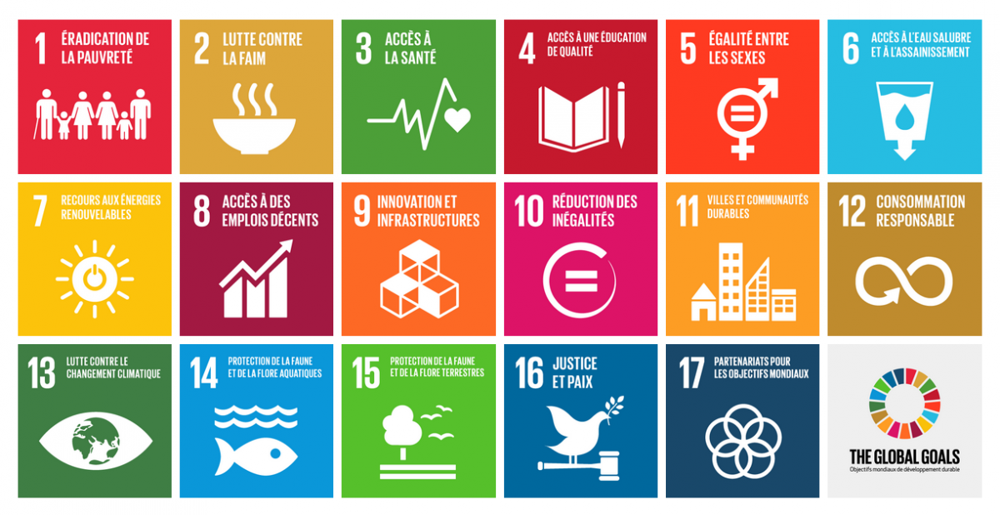

    Illustration trouvée sur Google image

🤝La <b style="color: green;">RSE = responsabilité sociétale des entreprises</b>, également appelée responsabilité sociale des entreprises, est la **contribution des entreprises au développement durable**. Une entreprise qui pratique la RSE va donc chercher à avoir un impact positif sur la société tout en étant économiquement viable.  
On parle de <b style="color: green;">RSO</b> pour la responsabilité sociétale des **organisations**.

📜La <b style="color: green;">norme ISO 26000</b> (2010), standard international, **définit le périmètre de la RSE autour de sept thématiques centrales** :
gouvernance de l’organisation,droits de l’homme, relations et conditions de travail, l’environnement, loyauté des pratiques, questions relatives aux consommateurs, communautés et le développement local. Cette norme a été élaborée par un groupe de travail d’environ **500 experts** après 5 ans de négociations entre des représentants des gouvernements, des ONG, de l’industrie, des groupes de consommateurs et du monde du travail. Elle représente donc un **consensus international**.

📜La <b style="color: green;">loi Pacte</b> (2019) : cette loi offre la possibilité aux organisations qui le souhaitent d’aller plus loin en matière de RSE.  
Elle leur permet, notamment, d’inscrire une <b style="color: green;">"raison d’être"</b> dans leurs statuts afin de **préciser leur projet collectif de long terme**.  
Elle permet également d’adopter un **nouveau modèle**, celui de <b style="color: green;">"société à mission"</b>. L'entreprise doit alors **associer sa raison d’être à un ou plusieurs objectifs environnementaux et sociétaux** qu’elle se donne pour mission de poursuivre dans le cadre de son activité.

### Les limites planétaires et la théorie du donut

🌍Les <b style="color: green;">9 limites planétaires</b> sont des **points de bascule du climat**. Ce sont des **seuils que l'humanité ne devrait pas dépasser** pour ne pas compromettre les conditions favorables dans lesquelles elle a pu se développer et pour pouvoir durablement vivre dans un écosystème sûr sans modifications brutales et imprévisibles de l'environnement planétaire. Chaque limite est ainsi fixée en amont d’un éventuel point de bascule.  

    Illustration trouvée sur le site Agence Lucie

Par exemple, on voit sur le schéma que le **changement climatique a déjà dépassé la limite planétaire** et est dans une zone de forte augmentation des risques : les changements initiés par le réchauffement vont continuer à s’amplifier même si les émissions de gaz à effet de serre sont stoppées.  
Le **dépassement de cette limite** nous fait entrer dans <b style="color: green;">l’Anthropocène</b>, la nouvelle époque géologique qui se caractérise par l'avènement des **hommes comme principale force de changement sur Terre**, surpassant les forces géophysiques.

📆Il ne faut pas confondre les limites planétaires avec <b style="color: green;">le jour de dépassement</b> qui est le **jour où l’humanité a "consommé" l’ensemble des ressources que la terre peut reconstituer en une année** calculée tous les ans par l’ONG Global Footprint Network.

🍩Selon la <b style="color: green;">théorie du Donut</b> (2014), ou "économie du donut", une **économie** est considérée comme **prospère** lorsque les **12 fondements sociaux sont réunis sans dépasser aucun des 9 plafonds écologiques**.  
L’autrice **Kate Raworth** définit ainsi au coueur du donut 12 besoin de bases dont personne ne devrait manquer qui constitue un « **plancher social** » pour assurer l’épanouissement de tous. Mais cet épanouissement ne peut se faire au-delà d’un cercle extérieur qu'elle appelle le « **plafond environnemental** ». Collectivement, nous ne pouvons utiliser les ressources de manière trop intensive, au risque de soumettre l’équilibre de la planète à une trop grande pression.

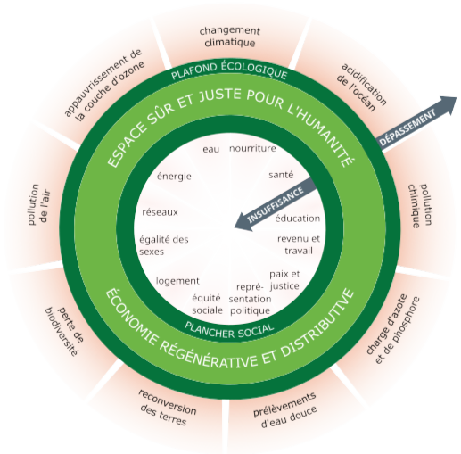

    Illustration trouvée sur Wikipédia - Économie du Donut (modèle)

### GES, bilan carbone et décarbonation

🔥L'<b style="color: green;">effet de serre</b> est le phénomène naturel par lequel les **gaz** présents dans l’atmosphère (principalement la vapeur d’eau) **retiennent une partie de la chaleur émise par notre planète**.  
Ainsi, les <b style="color: green;">gaz à effet de serre (GES)</b> désignent les **gaz présents dans l’atmosphère** qui contribuent à cet **effet de serre**. Ils garantissent les conditions de la vie sur notre planète : **sans GES**, la température moyenne de la terre serait de **-18°C** et là, elle est de **15°C**.  
Malheureusement, l’**activité humaine a fait croître énormément la concentration de certains GES**, tel le dioxyde de carbone CO₂, ce qui a créé l’**effet de serre additionnel**. On a déjà gagné **+1°C par rapport à l’ère pré industrielle 1750**.

    Illustration trouvée sur le site Save4Planet - Effet de Serre

Tous les gaz à effet de serre n’ont pas le même pouvoir réchauffant. Le <b style="color: green;">potentiel de réchauffement global (PRG)</b> ou Global Warming Potential (GWP) en anglais, d’un gaz est sa **capacité à garder la chaleur dans l’atmosphère** pendant une période de temps déterminée. Le **CO₂**, parce qu’il sert de référence, a reçu la valeur de **1**. Afin de pouvoir comparer les gaz entre eux, on convertit le potentiel de réchauffement de chaque gaz en <b style="color: green;">équivalent CO₂</b> sur une **période de cent ans** (période de référence utilisée par le GIEC).  
**CO₂ = ¾ de l’ensemble des GES**, PRG(méthane,CH₄) = 28 et PRG (protoxyde d'azote, N₂O) = 273

📊Le <b style="color: green;">Bilan carbone</b> est une **méthode de calcul** mise au point par l'**ADEME** pour **calculer les émissions de GES** d'une entreprise, d'un produit ou d'un individu. Le **résultat est exprimé en tonnes équivalent CO2**.

 Un Bilan carbone comprend l'analyse des émissions de gaz à effet de serre sur <b style="color: green;">3 scopes</b> : 
- **Scope 1** : **émissions directes**, issues des sources directes et contrôlées par l’organisation
- **Scope 2** : **émissions indirectes**, liées à la **consommation d'énergie** de l’organisation
- **Scope 3** : **autres émissions indirectes** qui couvrent l’activité de l’organisation **en amont et aval** (depuis 2023)

Le calcul du Bilan carbone est mené en plusieurs étapes : **sensibilisation** à l'effet de serre, la définition du **champ d'études**, la **collecte des données** au sein de l'entreprise, l'exploitation des **résultats**, l'établissement d'un **plan de réduction de ses émissions**, mise en action de ce plan.

En **France**, la **loi Grenelle II** (2010) a rendu obligatoire la réalisation d'un <b style="color: green;">bilan des émissions de gaz à effet de serre (BEGES)</b> pour :
- Les **entreprises de plus de 500 salariés** en métropole et 250 salariés en DROM - bilan **tous les 4 ans**
- Les collectivités de plus de 50 000 habitants
- Les **établissements publics de plus de 250 agents** - bilan **tous les 3 ans**
- Les **services de l’Etat**
Depuis **2016**, il est obligatoire de le **déposer sur la plateforme gérée par l’ADEME** et un contrôle doit être réalisé.

📊L'<b style="color: green;">empreinte carbone</b> est une mesure de la **quantité de GES émis par l'activité humaine dans l'atmosphère** généralement exprimée en tonnes de CO2 équivalent.

**Empreinte carbone citoyen Français** : **10t CO2eq/an** dont **alimentation = 20%**
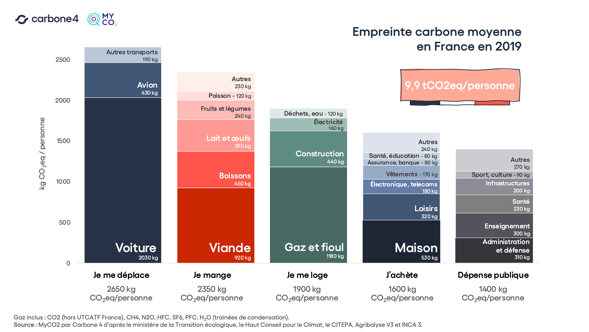

    Illustration trouvée sur le site Carbone 4 (le site cofondé par Jancovici)

**Budget carbone** cible citoyen Français d'ici **2050** : **2t CO2eq/an**. Je recommande de faire l'[atelier 2 tonnes](https://www.2tonnes.org/) pour comprendre comment cet objectif est réalisable.


**Impact carbone** des moyens de transport pour faire **1 000 km** (distance Paris-Madrid à vol d'oiseau)
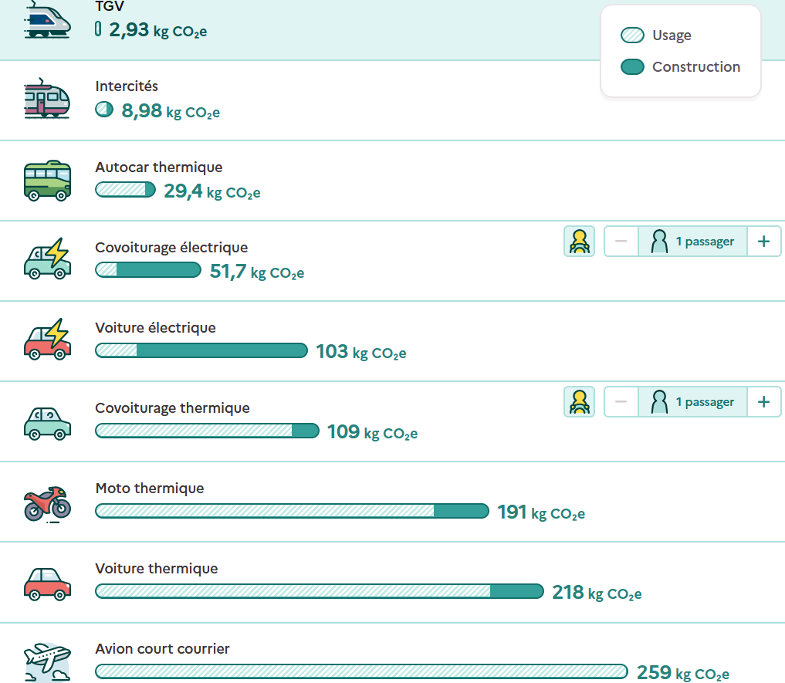

    Illustration trouvée sur le site Impact CO2

L’**avion** représente **2,5% de GES** mondiaux, mais **5% du réchauffement climatique** (car les traînées de condensation, la formation de nuages cirrus et le rejet de vapeur d’eau et de NOx à haute altitude ont un effet positif sur le forçage radiatif)

**1 tonne de CO2e**, c'est :
- 1 **aller-retour Paris/New-York en avion** pour une personne (environ 12 000 km)
- **6 allers-retours Paris/Marseille en avion** pour une personne
- les émissions **annuelles** moyennes d'un Français pour le **chauffage** de son domicile
- les émissions d'une **voiture** moyenne en France pour effectuer 5 000 Km (soit **200g CO2e/km**)


🦘L'<b style="color: green;">effet rebond</b> aussi appelé « **paradoxe de Jevons** » désigne un **accroissement de la consommation** provoqué par l'**amélioration des performances énergétiques** d'un bien. Ex : l’amélioration des performances énergétiques des voitures n’a pas réduit la demande en carburant. Les automobilistes ont fait plus de kilomètres, avec de plus grosses voitures et plus de voitures ont été vendues et au final l’impact sur les émissions de CO2 de l’automobile n’a pas diminué.

⚖️La <b style="color: green;">neutralité carbone</b> consiste à viser l’**équilibre entre** les **émissions de GES** et **ce que notre territoire est capable d’absorber** via les écosystèmes gérés par l’être humain (forêts, prairies, sols agricoles, zones humides…). Cela correspond à **diviser par 6 les émissions de GES d’ici 2050**.

📜Le <b style="color: green;">Pacte Vert pour l’Europe</b> (2019) de son nom roiginal **Green Deal Européen** est initiative politique clé de l'Union européenne est un **engagement pris par les 27 États** membres pour faire face aux défis du changement climatique et aux dégradations en cours de l'environnement. Ils se fixent comme objectif d'atteindre la **neutralité climatique en 2050**, respectant ainsi les objectifs fixés dans l'accord de Paris.  

📜La <b style="color: green;">loi énergie-climat</b> (2019) permet de fixer en **France** des objectifs ambitieux pour atteindre l’objectif de **neutralité carbone en 2050** pour répondre à l’urgence climatique et à l’Accord de Paris.

### Economie et environnement

🤝L'<b style="color: green;">ESS = économie sociale et solidaire</b> (2014) désigne un **ensemble d'entreprises** organisées sous forme de coopératives (artisans, SCOP, SCIC...), mutuelles, associations, fondations ou entreprises commerciales dont le fonctionnement interne et les activités sont fondés sur un principe de **solidarité et d'utilité sociale**. Elles poursuivent un **but autre que le seul partage des bénéfices**, ont une **gouvernance démocratique** et une **lucrativité limitée**. Les ESS accèdent à des **financements**. En 2023, l'ESS représente 10% du nombre d'emplois en France.

✅L'**agrément** <b style="color: green;">ESUS = Entreprise Solidaire d’Utilité Sociale</b> peut être obtenu par les ESS qui remplissent les conditions suivantes :
- la poursuite d’une **utilité sociale** comme objectif principal
- l’impact significatif de cet objectif sur le compte de résultat ou la **rentabilité financière** de l’entreprise
- **limiter les écarts de rémunération** : moyenne des 5 salariés ou dirigeants les mieux payés < 7 Smic annuels & rémunération salarié le mieux payé < à 10 Smic annuels
- les **titres de capital** ne doivent pas être admis aux négociations sur un marché d’instruments financiers

Pour obtenir l’agrément ESUS, il est nécessaire de déposer une demande qui est ensuite délivré pour une période de 5 ans et qui permet d’**accéder** au fonds d’épargne solidaire, à des outils de **financement** solidaire et à des marchés publics réservés.

🌱L'<b style="color: green;">économie verte</b> est une économie qui entraîne une **amélioration du bien-être humain et de l'équité sociale**, tout en **réduisant** de manière significative les **risques environnementaux et la pénurie de ressources**. Les emplois de l'économie verte ne sont pas uniquement liés à la nature et il en existe 2 types :
- les **métiers verts** : métiers dont la finalité et les compétences mise en oeuvre contribuent à mesurer, prévenir, maîtriser, corriger les impacts négatifs et les dommages sur l'environnement.  
  Ex : agent de parc national, technicien de mesure de la qualité de l'eau, poseur en isolation thermique, juriste en environnement...
- les **métiers verdissants** : métiers dont la finalité n'est pas environnementale, mais qui intègrent de nouvelles "briques de compétences" pour prendre en compte de façon significative et quantifiable la dimension environnementale dans le geste métier.  
  Ex : agriculteur (produire bio), plombier (installer des pompes à chaleur)

♻️L'<b style="color: green;">économie circulaire</b> est l’une des composante de l’économie verte. Cette notion désigne un modèle économique dont l’objectif est de **produire des biens et des services de manière durable**, en **limitant la consommation** et les gaspillages de ressources **et la production de déchets**. Elle vise à passer d’une société du tout jetable, basé sur une économie linéaire (extraire, fabriquer, consommer, jeter) vers un modèle économique plus circulaire.

🚯La <b style="color: green;">loi AGEC = loi anti-gaspillage pour une économie circulaire</b> (2020) vise l'**économie circulaire** autour de 5 grands axes : **sortir du tout jetable**, mieux **informer les consommateurs**, lutter contre le gaspillage et pour le **réemploi solidaire**, agir **contre l’obsolescence programmée** et mieux produire.  
Ex : pour l'objectif de la **fin du plastique jetable d’ici 2040**, la loi introduit des interdictions progressives pour réduire l’utilisation du plastique à usage unique.

🌊L'<b style="color: green;">économie bleue</b> englobe toutes les **activités économiques associées aux ressources marines** et aux écosystèmes aquatiques. L’économie bleue cherche à favoriser une croissance économique durable en **protégeant les milieux marins et aquatiques**. Contrairement à l’économie verte et à l’économie circulaire, l'économie bleu ne consiste pas juste à polluer moins, mais à **ne plus polluer du tout** en éliminant la production de déchets au moyen d’un changement dans les méthodes de production.

🩸L'<b style="color: green;">économie rouge</b> est le sous-produit du fordisme qui privilégie la **production de masse** et **considère les ressources environnementales comme illimitées**. C'est donc un **modèle commercial linéaire** consistant à prélever des ressources et à produire des déchets. Le cœur de métier repose sur de faibles coûts de production qui s'appuient sur une **économie mondialisée**. Les préoccupations sociales ou environnementales ne sont pas compatibles avec l'activité. Concrètement, ce modèle chie sur la planète...

🪴L'<b style="color: green;">économie régénérative</b> est un modèle économique émergent qui vise non seulement à réduire les impacts négatifs d'une entreprise sur l'environnement ou la société à des seuils incompressibles, mais aussi à **créer un impact positif global**. Toutefois, le **manque de normes** et de cadre clairs peut rendre difficile pour les entreprises de déclarer qu'elles sont régénératives de manière crédible et transparente.

📈L'<b style="color: green;">écolomie</b> est un concept qui vise à **conjuguer écologie et économie**, en montrant qu’il est possible de réduire son impact environnemental tout en réalisant des économies et en créant de la valeur.

### Production et environnement

💡L'<b style="color: green;">éco-conception</b> consiste à intégrer la **protection de l’environnement dès la conception** des biens ou services. Elle a pour objectif de **réduire les impacts environnementaux des produits tout au long de leur cycle de vie** : extraction des matières premières, production, distribution, utilisation et fin de vie.

🔨La <b style="color: green;">low tech</b> désigne toutes les technologies respectant ces 3 piliers : 

1. **Utile** : la low-tech répond à des besoins essentiels (énergie, alimentation, eau, habitat, transport…).
2. **Accessible** : elle doit avoir un coût adapté à une large part de la population et être compréhensible, réparable et fabriquée localement. Cela favorise une plus grande autonomie des population et une meilleure répartition du travail et des ressources.  
3. **Durable** : elle est conçue pour minimiser son impact écologique et social tout au long de son cycle de vie. Elle privilégie la robustesse, la réparabilité et la collaboration plutôt que l’accumulation technologique. Elle s'oppose ainsi au principe d'obsolescence programmée. 

📊L'<b style="color: green;">ACV = analyse de cycle de vie</b> appelée Life Cycle Analysis (**LCA**) en anglais, est la méthode de référence en matière d’**évaluation des impacts environnementaux d'un produit pendant toute sa durée d'existence**. L’ACV se fonde sur une **approche fonctionnelle multicritère** du produit en 5 étapes :
- L'**extraction des matières premières** nécessaires à la fabrication du produit
- Sa **fabrication**
- Sa **distribution**
- Son **utilisation**
- La **fin de vie** du produit (déchets, recyclage, etc.)  

Ainsi, l'ACV vise à repérer les étapes ayant le plus d’impact sur l’environnement afin de les optimiser et de réduire les émissions de GES ainsi que d’autres effets écologiques. En comparant différentes solutions, elle sert d’**outil d’aide à la décision stratégique** pour choisir l’option la moins coûteuse sur le plan environnemental.  
L'ADEME a mis en place le site [base empreinte](https://base-empreinte.ademe.fr/) qui est la **base de données publique officielle de facteurs d'émission et de jeux de données** d'inventaire nécessaires à la réalisation d'exercices de comptabilité carbone des organisations et d'affichage environnemental des produits et services de grande consommation.  
Pour réaliser une ACV il y a le  site [OpenLCA](https://www.openlca.org/) qui est gratuit et bien pour débuter (je l'avais personnellement utilisé en Erasmus).

### Divers

🧑‍🔬 Le <b style="color: green;">Shift Project</b> (2010) est un **think tank** qui travaille « en faveur d’une **économie libérée de la contrainte carbone** ». Concrètement, il se donne pour mission de **fournir des informations et de mener un lobbying dans le débat sur la transition énergétique**, de la France à l’Europe. Auteur d’un **Manifeste pour décarboner l’Europe**, The Shift Project émet des propositions qui répondraient à l’Accord de Paris. Chacune propose un % estimé de la réduction des émissions de GES que sa réalisation induirait :
- Fermer toutes les centrales au charbon (24%)
- Rénover les logements anciens (17%)
- Généraliser la voiture à moins de 2L/100kms (14%)
- Relier les grandes métropoles par des trains rapides (9%)

Son **président** est <b style="color: green;">Jean-Marc Jancovici</b>. Cet ancien élève de l’Ecole polytechnique et de Telecom ParisTech est également le co-fondateur de **Carbone 4** (société qui fournit conseil et données au monde économique pour se confronter au défi énergie climat) et membre depuis 2018 du **Haut Conseil pour le Climat**. Il est aussi auteur de 7 livres, du site internet [jancovici.com](jancovici.com) et de nombreux articles pour **vulgariser les questions relatives à l’énergie et au changement climatique**.

🧠 La <b style="color: green;">Fresque du climat</b> est un **atelier collaboratif** qui sensibilise aux enjeux climatiques en s'appuyant sur les données du **GIEC**. À travers un jeu de cartes, les participants relient les **causes et conséquences du changement climatique** pour mieux comprendre ses mécanismes.

⚠️ Le <b style="color: green;">triangle de l'inaction</b> explique pourquoi, malgré la connaissance des enjeux climatiques, les individus et organisations **tardent à agir**. **Chacun rejette la responsabilité** de lancer les actions sur les autres.

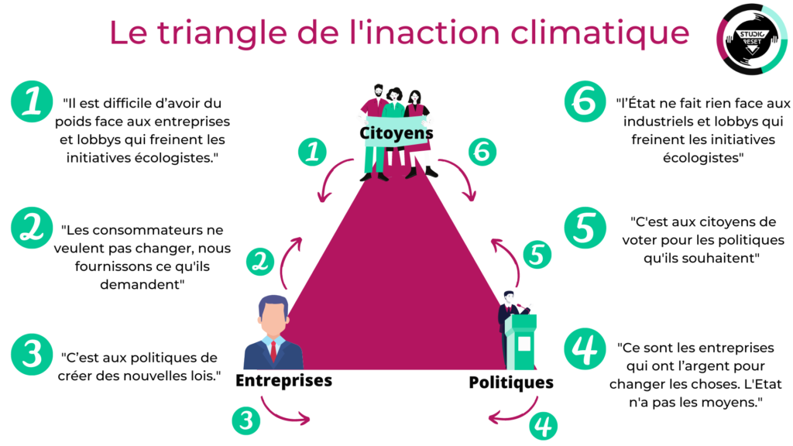

    Illustration trouvée sur le site Studioreset

🌡️ Les <b style="color: green;">bandes de réchauffement</b> (warmings stripes) créées par **Ed Hawkins** permettent de comprendre la rapidité avec laquelle le climat s’est déréglé ces dernières années. Les couleurs affichent l’**écart à la température moyenne** mondiale, de 1850 à 2018.

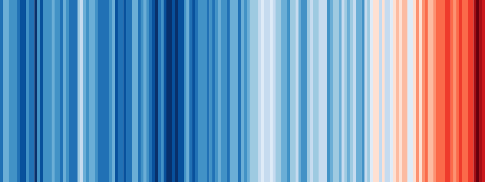

    Illustration trouvée sur Wikipédia - Bandes du réchauffement climatique

On peut retrouver les warming stripes et d'autres **graphiques intéressants** sur le site [show your stripes](https://showyourstripes.info/c/europe/france/all) comme celui sur le France ci-dessous : 

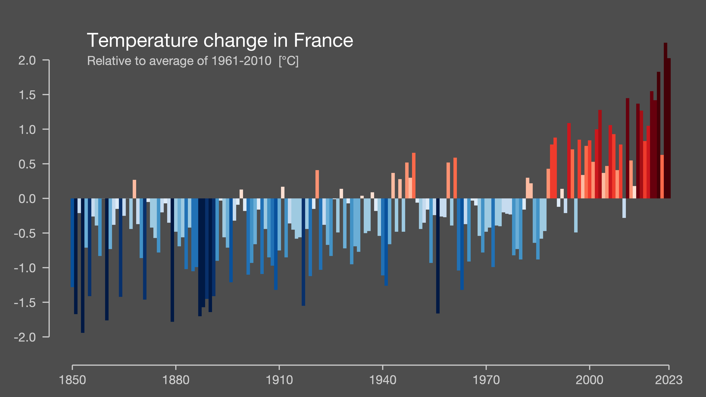

    Illustration trouvée sur le site Show your stripes

### Biodiversité

🐦 Inspirées des rayures du réchauffement, l'expert **Miles Richardson** a développé les <b style="color: green;">rayures de la biodiversité</b> (biodiversity stripes) allant du vert au gris, signe de la perte de couleur et de biodiversité de la nature.

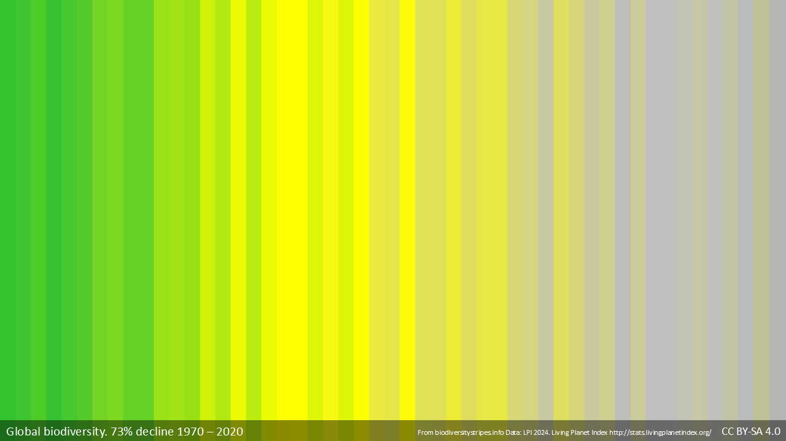

    Illustration trouvée sur le site Biodiversity stripes

📉 Le spécialiste s’est basé sur l’<b style="color: green;">IPV = Indice Planète vivante</b> (en anglais LPI = living planet index) qui est un **indicateur d'état de la biodiversité**, utilisé pour l'évaluation environnementale, en particulier par l'ONU. L’indice compare l’évolution d’une population en prenant celle de **1970 comme référence (IPV = 1)** et mesure le taux de croissance ou de décroissance à une année donnée par rapport à cette valeur initiale.  
L'IPV montre qu'au cours des **50 dernières années** (1970-2020), la **taille moyenne des populations d’animaux sauvages** suivies a **diminué de 73 %**. Les populations d’**espèces d’eau douce** affichent le plus fort déclin, avec une **baisse de 85 %**.

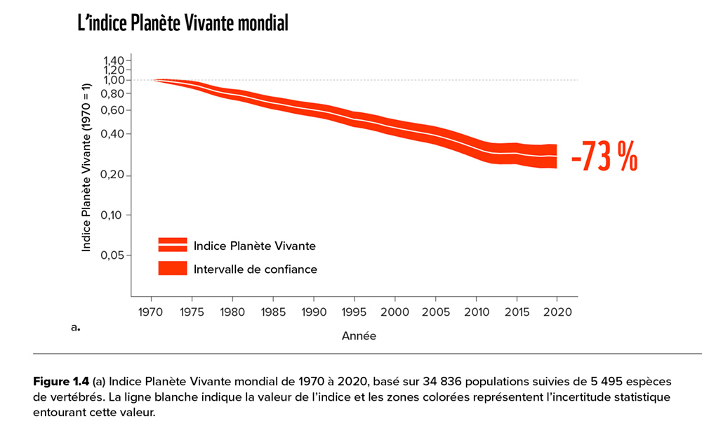

    Illustration trouvée sur le site WWF

### Bio, biosourcé, biodégradable... ça veut dire quoi ?

Tout d"abord, le préfixe **"bio" signifie vivant**. Ainsi, le terme bio sans aucun label ne veut **pas forcément dire que le produit est inoffensif** et sans impact pour l’environnement mais simplement qu’il **vient du vivant (végétal ou animal)**.

👩‍🌾 L'<b style="color: green;">agriculture biologique</b> se définit comme un système de gestion agricole et de production alimentaire qui allie les **meilleures pratiques environnementales**, un haut degré de biodiversité, la préservation des ressources naturelles, l’application de **normes élevées** en matière de bien-être animal et une méthode de production recourant à des substances et des produits naturels. Tous les opérateurs doivent notifier leur activité à l’**Agence BIO** qui tient à jour un annuaire pour les autorités de contrôle.

Concrètement, un <b style="color: green;">"produit "bio"/"biologique"</b>, est un produit agricole ou une denrée alimentaire issu de l’agriculture biologique qui répond aux exigences de la législation européenne, notamment :
- **aucune utilisation de produits chimiques de synthèse** (pesticides, engrais, désherbants…)
- **aucune utilisation d’OGM**
- respect du **bien-être animal** (transport, conditions d’élevage, abattage…)
- pour les produits transformés, une quantité de **95 % au moins des ingrédients issus de l’agriculture biologique**.

  
Le logo AB est le label français bio, il est facultati. L'eurofeuille à droite est le logo bio européen qui est obligatoire sur tous les produits bio alimentaires pré-emballés dans l’Union européenne.
  

  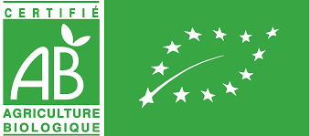

🐑 Un <b style="color: green;">produit biosourcé</b> est **fabriqué avec de la matière issue de la biomasse** donc à partir de **végétaux** (blé, colza, lin, chanvre, sciure de bois…) ou de **matière venant des animaux** (laine de mouton, déchets organiques…).  
Les produits biosourcés, utilisés notamment dans la **construction**, visent à **préserver les ressources non renouvelables** en intégrant des matières naturelles. Toutefois, leur **caractère biosourcé ne garantit ni une production biologique ni une innocuité environnementale**. Le label « Produit Biosourcé » distingue trois niveaux (**bronze, argent, or**) selon la proportion de biomasse intégrée, avec des seuils spécifiques par famille de produits.

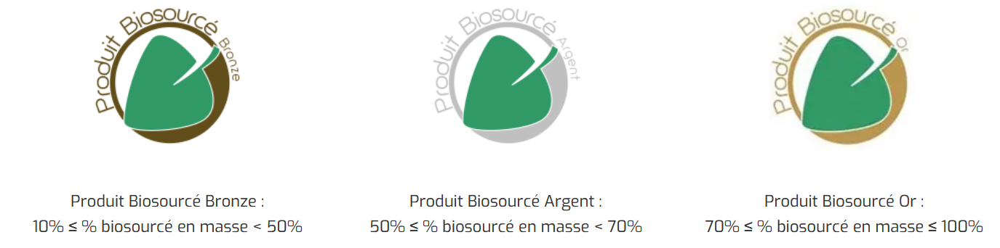

    Illustration trouvée sur le site Label produit Biosourcé

🪱 Un <b style="color: green;">produit biodégradable</b> se décompose grâce aux organismes vivants en un temps relativement court. Cette biodégradation peut être naturelle ou accélérée par l’homme, comme avec le compostage. Le terme s’applique souvent aux déchets organiques, issus de matières végétales ou animales.

### Énergie

🔋 Le <b style="color: green;">mix énergétique</b> (ou bouquet énergétique) désigne la **répartition des sources d’énergie** utilisées dans une région donnée. Il inclut les **énergies fossiles** (pétrole, gaz naturel, charbon), le **nucléaire** et les **énergies renouvelables** (biomasse, hydraulique, éolien, solaire).  
Aujourd’hui, le mix énergétique français dépend encore à plus de 60% des énergies fossiles. Pour atteindre ses objectifs climatiques, **la France doit décarboner son mix** et remplacer les sources fossiles par de l’électricité.

⚡ Le <b style="color: green;">mix électrique</b> représente l’éventail des **combustibles utilisés pour produire de l'électricité** dans une région donnée.

On retrouve sur le site Ecologie.gouv ci-dessous le mix énergétique à gauche et le mix électrique à droite pour l'année 2020.

    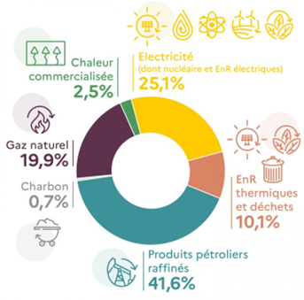
    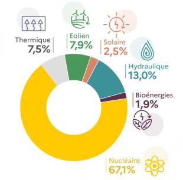

J'ai également regardé le graphique de la production d’électricité par filière sur les 8 dernières semaines sur **RTE**, le gestionnaire du réseau de transport d'électricité français. On y voit bien la différence de production entre le jour et la nuit et la variabilité de production de l'énergie éolienne selon les semaines.
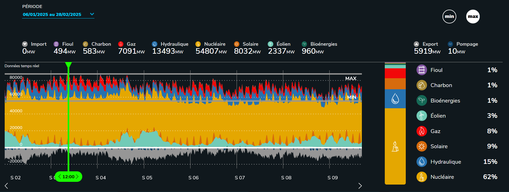

    Illustration trouvée sur le site RTE France

## 👍 Conclusion de ce POK 3