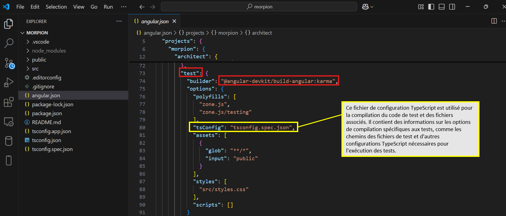
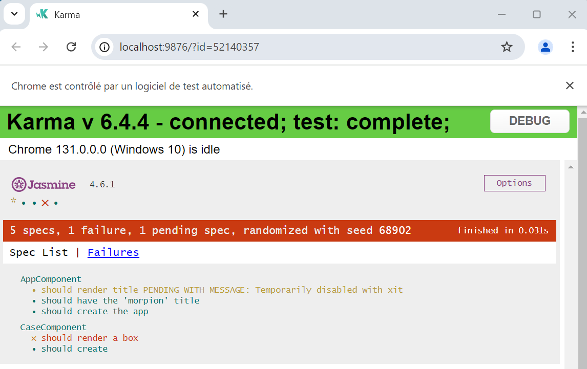



Aucun prérequis nécessaire




- [A Practical Example using Test Driven Development. Source : Vandan Gogna, an IBM Garage expert, sur Medium (2021)](https://vandangogna.medium.com/a-practical-example-using-test-driven-development-88b4536ac574)
- [*Test-Driven Development by example* de Kent Beck (2003)](https://github.com/test-driven-development/kent-beck-money-example/blob/master/kent-beck-test-driven-development-by-example.pdf)
- [Doc officielle du framework Jasmine](https://jasmine.github.io/)
- [Lien GitHub : projet morpion en TDD](https://github.com/TitouanCorne/morpion_TDD)



## Table des matières

- [Table des matières](#table-des-matières)
- [1. Test-Driven Development : Comprendre la méthodologie ](#1-test-driven-development--comprendre-la-méthodologie-)
- [2. Exemple (perturbant) de mise en application ](#2-exemple-perturbant-de-mise-en-application-)
- [3. Les principaux tests rencontrés en informatique ](#3-les-principaux-tests-rencontrés-en-informatique-)
- [4. Framework de test pour Javascript ](#4-framework-de-test-pour-javascript-)
- [5. Mise en pratique du tdd : morpion (Angular + Jasmine) ](#5-mise-en-pratique-du-tdd--morpion-angular--jasmine-)
- [6. Utiliser GitHub Copilot pour implémenter ses tests ](#6-utiliser-github-copilot-pour-implémenter-ses-tests-)
  - [Ma question](#ma-question)
  - [La réponse de GitHub Copilot Chat](#la-réponse-de-github-copilot-chat)
  - [Analyse de sa réponse](#analyse-de-sa-réponse)
- [Sources utiles](#sources-utiles)

## 1. Test-Driven Development : Comprendre la méthodologie <a id="section1"></a>

La méthodologie Test-Driven Development (tdd) consiste à concevoir un logiciel par des itérations successives courtes, telles que chacune de ses itérations correspond à un problème à résoudre formulé sous forme de test.

Le tdd suit généralement un cycle en trois étapes :

1. **Red :** Ecrire un test qui échoue (car le code pour le satisfaire n'existe pas encore, puisqu'on écrit **le test en amont** du code).
2. **Green :** Ecrire le **minimum** de code nécessaire pour que le test réussisse. On ne s'occupe pas ici de l'algorithme utilisé ou de sa performance.
3. **Refactor :** Améliorer le code tout en gardant les tests au "vert", de sorte à ce que sa performance soit optimale.



- **Etape 1 : Ecrire le test (Red)**

On écrit un test qui vérifie que la fonction `add(a,b)` renvoie bien la somme de `a` et de `b`. Par exemple, add(4,3) devrait retourner 7

```python
import unittest

class TestAddition(unittest.TestCase):
    def test_add_two_numbers(self):
        self.assertEqual(add(4, 3), 7)  # étant donné qu'on écrit le test en amont, la fonction add n'a pas encore été codée
```

Si on exécute le test à cette étape, on va obtenir une erreur qui est normale et voulue puisque la fonction `add` n'a pas été codée.



`unittest` est le module intégré de Python pour créer et exécuter des tests unitaires. Il fournit une infrastructure pour écrire, organiser, et exécuter des tests de manière systématique et automatisée.



- **Etape 2 : Implémenter le code minimal (Green)**

A présent on code la fonction `add` :

```python
def add(a,b):
  return a + b
```

A ce stade, si on exécute le test, il devrait réussir.

- **Etape 3 : Optimiser le code (Refactor)**

Dans ce cas simple, il n'y a pas vraiment de besoin de refactoriser, car la fonction est déjà concise et claire. Cependant, dans des cas plus complexes, cette étape consiste à nettoyer ou optimiser le code tout en gardant les tests au "vert".

Ensuite on peut continuer la méthodologie en entammant un nouveau cycle => nouvelle étape *red*, avec l'écriture d'un nouveau test.



Les **erreurs récurrentes** à ne pas faire en tdd :

- Oublier d'exécuter régulièrement les tests
- Ecrire trop de tests à la fois, ou des tests trop complexes. Il est important d'avancer par petits pas.
- Ecrire des tests qui manquent d'assertions, c'est-à-dire des tests qui ne vérifient pas correctement que le code fonctionne comme souhaité. Exemple d'assertion en Python avec unittest : `self.assertEqual(add(2, 3), 5)`

Les (nombreux) **avantages** du tdd :

- Amélioration de la qualité du code : code robuste, bien structuré et moins sujet aux bugs.
- Réduction des bugs et régressions : suite de tests automatisée qui garantit que chaque modification du code est validée. Cela aide à prévenir les régressions lorsque de nouvelles fonctionnalités ou des corrections de bugs sont introduites.
- Conception guidée par les tests : cela évite le surdéveloppement ou l'écriture de code inutile, ce qui améliore la clarté et la maintenabilité.
- Conception axée sur les résultats : on se concentre sur les objectifs fonctionnels (ce que le code doit faire) au lieu de se perdre dans les détails de l'implémentation.
- Documentation vivante : les tests eux-mêmes servent de documentation technique vivante qui décrit comment chaque fonctionnalité est censée fonctionner.
- Méthodologie adapté à l'intégration continue : le tdd garantit un flux de développement fluide, avec des livraisons fréquentes et fiables. On avance continuement petit pas par petit pas

## 2. Exemple (perturbant) de mise en application <a id="section2"></a>

J'ai lu un exemple bien détaillé (*"The Money Example"* écrit en java) respectant à la lettre la méthodologie du tdd dans le livre *Tesr-Driven Development by example* écrit par Kent Beck (disponible au centre de documentation). C'est assez perturbant lorsqu'on n'est pas familier avec le tdd ! Par exemple, pour son premier test :

```java
  public void testMultiplication(){
    Dollar five = new Dollar(5);
    five.times(2);
    assertEquals(10, five.amount)
  }
```

Kent Beck va au plus simple (comme le veut le tdd) et implémente cette classe Dollar :

```java
  class Dollar

  Dollar(int amount){ //constructeur qui ne fait rien
  }
  void times(int multiplier){ //méthode times utilisée dans le test, mais qui ne fait/renvoie rien
  }
  int amount = 10; //Pour passer le test
```

On voit ici qu'il n'a pas du tout écrit un code qui permet de multiplier deux nomnres... Il a simplement cherché à réussir le premier test de la manière la plus simple possible !

En plus, de toutes les règles explicitées dans la partie 1, Kent Beck souligne l'importance d'**éviter la duplication** entre test et code lors de la phase **refactor** de chaque cycle du tdd. C'est ainsi qu'il va revoir le code précédement écrit pour son premier test et l'améliorer (car il y a une répétition du nombre 10 qu'on trouve à la fois dans `testMultiplication` et dans `int amount = 10`).

De plus il montre que le principe de **triangularisation** dans les tests est important. Ce principe veut qu'on parte de tests simples et larges, dans un premier temps. Puis, au fur et à mesure, qu'on les affine pour se concentrer sur les détails en garantissant que l'**ensemble des scénarios sont couverts par des tests**.

## 3. Les principaux tests rencontrés en informatique <a id="section3"></a>

**Test unitaire** : petite portion de code écrite pour vérifier qu'une **partie spécifique** de l'application fonctionne comme prévu. Cela aide à identifier rapidement des erreurs ou régressions (bugs ou comportements incorrects introduits dans une fonctionnalité qui fonctionnait correctement auparavant).

**Test d'intégration** : il vérifie que plusieurs composants ou modules d'une application fonctionnent correctement **ensemble**.

**Test end-to-end (E2E)** : il simule l'interaction complète d'un utilisateur avec l'application dans un environnement réel ou presque réel. Il permet de tester l'**application dans son ensemble**, en vérifiant que toutes les parties du système fonctionnent correctement ensemble, y compris l'interface utilisateur, les services backend, les bases de données, etc

## 4. Framework de test pour Javascript <a id="section4"></a>

En faisant quelques recherches, j'ai réalisé qu'il y avait de nombreux outils utilisés pour faciliter l'écriture, l'exécution et l'organisation des tests. Parmi ces outils :

- [**Jest**](https://jestjs.io/) : un framework de tests complet et très populaire développé par Facebook. Ce framework permet d'implémenter des tests unitaires, d'intégration et E2E. Il peut être utilisé pour une multitude de projets dont des projets TypeScript, Node, React, Angular, Vue, ...
- [**Jasmine**](https://jasmine.github.io/) : framework de test complet et populaire. Il offre une syntaxe claire et simple qui se prète bien à l'écriture de tests unitaires et d'intégration. Angular utilise Jasmine comme framework de tests par défaut. On l'utilise souvent en duo avec **Karma** (outil d'exécution des tests qui s'assure que ces tests sont exécutés dans des navigateurs et fournit des rapports sur leur réussite ou échec).

Pour la suite, nous allons utiliser *Jasmine*, dans un environnement Angular.

## 5. Mise en pratique du tdd : morpion (Angular + Jasmine) <a id="section5"></a>



Jasmine s'inspire du concept de **Behavior-Driven Development (BDD)**. Ce concept de développement se concentre sur la spécification du comportement d'une application, **en mettant l'accent sur la compréhension et la communication** entre les développeurs, les testeurs et les parties prenantes. Dans le contexte de Jasmine, le BDD est utilisé pour écrire des tests qui décrivent le comportement attendu de ton code d'une manière claire et lisible.

Les concepts clés de BDD dans Jasmine :

- **describe()** : Utilisé pour regrouper des tests qui concernent une même fonctionnalité ou un même comportement. Il décrit un comportement spécifique.
- **it()** : Spécifie un cas de test concret, c’est-à-dire un exemple qui démontre un comportement attendu.
- **expect()** : Sert à faire des assertions sur le résultat obtenu pour vérifier si le comportement attendu est bien respecté. Chaque attente (construite avec  la fonction *expect()* qui prend la valeur réelle) est chaînée avec une fonction **Matcher**, qui prend la valeur attendue.

Exemples simples créés par ChatGPT :

```javascript
describe("Addition", function() {
  it("should add two numbers correctly", function() {
    const result = 2 + 3;
    expect(result).toBe(5);  // Vérification de la valeur obtenue
  });
});

describe('Authentification', function() {
  let authService;

  beforeEach(function() {
    authService = new AuthService();  // Initialisation du service d'authentification
  });

  it('should log in successfully with valid credentials', function() {
    const result = authService.login('user@example.com', 'password123');
    expect(result).toBe(true);
  });

  it('should fail login with invalid credentials', function() {
    const result = authService.login('user@example.com', 'wrongpassword');
    expect(result).toBe(false);
  });

  it('should return user info on successful login', function() {
    const result = authService.login('user@example.com', 'password123');
    expect(result.user).toEqual({ email: 'user@example.com' });
  });
});
```





Créer un nouveau projet avec Angular CLI : `ng new nom-du-projet`

Un projet Angular est alors généré avec la configuration par défaut, y compris Jasmine et Karma pour les tests unitaires.

Pour vérifier que Jasmine et Karma sont bien installés, il suffit d'aller dans le dossier *angular.json* :

 *Capture d'écran personnelle (2025)*

On peut ensuite voir qu'un fichier **app.component.spec.ts**, associé au composant **"app.component.ts"**, a été créé. C'est dans ce fichier TypeScript, qu'on retrouvera les tests du AppComponent ! Voici à quoi il ressemble dès l'initialisation du projet :

```javascript
import { TestBed } from '@angular/core/testing';
import { AppComponent } from './app.component';

describe('AppComponent', () => {
  beforeEach(async () => {
    await TestBed.configureTestingModule({
      imports: [AppComponent],
    }).compileComponents();
  });

  it('should create the app', () => {
    const fixture = TestBed.createComponent(AppComponent);
    const app = fixture.componentInstance;
    expect(app).toBeTruthy();
  });

  it(`should have the 'morpion' title`, () => {
    const fixture = TestBed.createComponent(AppComponent);
    const app = fixture.componentInstance;
    expect(app.title).toEqual('morpion');
  });

  it('should render title', () => {
    const fixture = TestBed.createComponent(AppComponent);
    fixture.detectChanges();
    const compiled = fixture.nativeElement as HTMLElement;
    expect(compiled.querySelector('h1')?.textContent).toContain('Hello, morpion');
  });
});
```

On remarque l'import de **TestBed** qui est un outil d'Angular permettant de configurer et de manipuler l'environnement de test.

Pour lancer les tests, il suffit d'exécuter la commande `ng test` dans le terminal.



- `fit` (à la place de `it`) : Focus sur un seul test — celui-ci est le seul à être exécuté, les autres sont ignorés.
- `xit` (à la place de `it`) : Ignore un test — ce test ne sera pas exécuté, même s'il est défini dans le fichier.







Je décide tout d'abord de créer un composant **case** (`ng generate component case`) qui sera répété 9 fois sur le tableau de jeu.

Ensuite, place au **tdd** :



**Phase 1 (red)** : On écrit un test qui vérifie que le composant case s'affiche sous forme de box.

```javascript
describe('CaseComponent', () => {
  let component: CaseComponent;
  let fixture: ComponentFixture<CaseComponent>;

  // ...

  it('should render a box',() => {
    const boxElement = fixture.nativeElement.querySelector('.case');
    expect(boxElement).toBeTruthy(); //vérifie qu'un élément avec la class .case est présent
  });
});
```

Bien évidemment le test échoue !

 *Capture d'écran (2025)*

**Phase 2 (green)** : On écrit un code simple de façon à ce que le test réussisse. Pour cela, il suffit de créer un bouton dans le fichier case.component.html :

```html
&lt;button class="case"&gt;
&lt;/button&gt;
```

 Le test passe !

**Phase 3 (refactor)** : Rien besoin de faire à ce stade.





**Phase 1 (red)** : On écrit un nouveau test qui vérifie si la case est cliquable.

```javascript
describe('CaseComponent', () => {
  let component: CaseComponent;
  let fixture: ComponentFixture<CaseComponent>;

  // ...

  it('should trigger a click event',() => {
    spyOn(component,'onClick'); //espion de la méthode onClick (créer d'abord la méthode dans case.component.ts)
    const boxElement = fixture.nativeElement.querySelector('.case');
    boxElement.click(); //Simule le click
    expect(component.onClick).toHaveBeenCalled(); //Vérifie que la méthode `onClick` a été appelée
  });
});
```

Bien évidemment le test échoue ! (j'arrêterai de le préciser pour les prochains tests, c'est promis !)

**Phase 2 (green)** : On écrit un code simple de façon à ce que le test réussisse :

```html
&lt;button class="case" (click)="onClick()"&gt;
&lt;/button&gt;
```

 Le test passe !

**Phase 3 (refactor)** : Rien besoin de faire à ce stade.





**Phase 1 (red)** : On écrit un nouveau test qui vérifie que la box peut seulement prendre les valeurs X, O ou null.

```javascript
describe('CaseComponent', () => {
  let component: CaseComponent;
  let fixture: ComponentFixture<CaseComponent>;

  // ...

  it('should accept only values : X or O or empty',()=>{
    component.value = 'X'; //on assigne une valeur valide
    expect(component.value).toBe('X'); // Vérifie que la valeur est bien "X"

    component.value = 'O';
    expect(component.value).toBe('O');

    component.value = null;
    expect(component.value).toBe(null);

    component.value = 'valeur invalide' as any; // Cas pour tester une valeur invalide
    expect(component.value).not.toBe('Valeur invalide');  // Vérifie que la valeur invalide n'a pas été acceptée
  });
});
```

**Phase 2 (green)** : On écrit un code simple de façon à ce que le test réussisse :

```javascript
export class CaseComponent {
  onClick(){
  };

  private _value: string | null = null; // Stockage interne de la valeur

  get value(): string | null {
    return this._value;
  }

  set value(val: string | null) {
    if (val === 'X' || val === 'O' || val === null) {
      this._value = val;
    } else {
      console.warn('Valeur invalide : ', val);
    }
  }

}
```

 Le test passe !

**Phase 3 (refactor)** : Rien besoin de faire à ce stade.





**Phase 1 (red)** : On écrit un nouveau test qui changer la valeur d'une case vide (null) après un clic, mais qui empêcher le changement de la valeur si la case contient déjà X ou O.

```javascript
describe('CaseComponent', () => {
  let component: CaseComponent;
  let fixture: ComponentFixture<CaseComponent>;

  // ...

  it('should change value when clicked (null --> X or null --> O)',()=>{
    const boxElement = fixture.nativeElement.querySelector('.case');

    component.value = null; //si on clique sur une case vide, on change sa valeur
    boxElement.click();
    expect(component.value).not.toBeNull();

    component.value = 'X'; //si on clique sur une case avec une croix, sa valeur doit rester la même
    boxElement.click();
    expect(component.value).toBe('X');

    component.value = 'O'; //si on clique sur une case avec un cercle, sa valeur doit rester la même
    boxElement.click();
    expect(component.value).toBe('O');
  });
});
```

**Phase 2 (green)** : On modifie légèrement la méthode `onClick` :

```javascript
onClick(){
    if(this.value === null){
      this._value = 'X';
    }
  };
```

 Le test passe !

**Phase 3 (refactor)** : Rien besoin de faire à ce stade.





```javascript
describe('CaseComponent', () => {
  let component: CaseComponent;
  let fixture: ComponentFixture<CaseComponent>;

  // ...

  it('should display the correct value inside the box',()=>{
    const boxElement = fixture.nativeElement.querySelector('.case');

    component.value = 'X';
    fixture.detectChanges(); //pour que le html affiche bien la nouvelle valeur !
    expect(boxElement.textContent.trim()).toBe('X');

    component.value = 'O';
    fixture.detectChanges();
    expect(boxElement.textContent.trim()).toBe('O');

    component.value = null;
    fixture.detectChanges();
    expect(boxElement.textContent.trim()).toBe('');
  });
});
```

Voici le dernier test que j'ai écrit pour que les fonctionnalités du composant soient aux mieux couvertes. Normalement, dès qu'on change une ligne de code, un des tests doit échouer !



La méthode `.trim()` en JavaScript est utilisée pour supprimer les espaces blancs en début et en fin de chaîne de caractères.









Je décide ensuite de créer un deuxième composant **grille** (`ng generate component grille`) qui va afficher les 9 cases du morpion.

Comme précédemment, place au **tdd** :



**Phase 1 (red)** : On écrit un premier test qui vérifie qu'on a bien neuf cases dans la grille.

```javascript
describe('GrilleComponent', () => {
  let component: GrilleComponent;
  let fixture: ComponentFixture<GrilleComponent>;

  // ...

  it('should render 9 boxes',()=>{
    const boxElements = fixture.debugElement.queryAll(By.css('.app-case')); //sélectionne tous les éléments app-case
    expect(boxElements.length).toBe(9); //on vérifie qu'il y en a bien neuf
  })
});
```

**Phase 2 (green)** : On modifie le code du component pour afficher les neufs cases :

Dans le fichier grille.component.ts :

```javascript
import { Component } from '@angular/core';
import { CaseComponent } from '../case/case.component';
import { CommonModule } from '@angular/common';

@Component({
  selector: 'app-grille',
  standalone: true,
  imports: [CommonModule, CaseComponent],
  templateUrl: './grille.component.html',
  styleUrl: './grille.component.css'
})
export class GrilleComponent {
  cases = Array(9).fill(null); // Tableau pour générer 9 cases
}
```

Dans le fichier grille.component.html :

```html
&lt;div class="grille"&gt;
    &lt;app-case *ngFor="let case of cases"&gt;&lt;/app-case&gt;
&lt;/div&gt;
```

 Le test passe !

**Phase 3 (refactor)** : Rien besoin de faire à ce stade.



Pour le bien de tous, j'arrête les explications détaillées à partir d'ici. Le projet **morpion** est disponible sur mon github (lien à venir) !



## 6. Utiliser GitHub Copilot pour implémenter ses tests <a id="section6"></a>

suite à venir (en cours de rédaction)

Pour ceux qui ne connaissent pas cet outil, GitHub Copilot c'est une IA, plus précisément un LMM (comme chatGPT), utilisé pour le développement informatique. Son plus grand atout : un gain d'efficacité remarquable.

Cet outil est payant, mais il y a une offre étudiante ([GitHub Copilot Student](https://docs.github.com/fr/education/explore-the-benefits-of-teaching-and-learning-with-github-education/github-education-for-students/apply-to-github-education-as-a-student)) qui est gratuite. C'est celle-ci, que j'utilise.

GitHub Copilot peut être ajouté, en tant qu'extension, à son IDE (par exemple à Visual Studio Code). Quand tu installes Copilot sur VS Code, deux extensions sont ajoutées :

- **GitHub Copilot**, qui propose de compléter le code de façon "intelligente" (auto-completion).
- **GitHub Copilot Chat**, qui permet d'avoir une *conversation* avec l'IA via une interface conversationnelle, similaire à ChatGPT.

GitHub Copilot, une fois intégré à VS Code est un outil très puissant puisqu'il peut scanner le code déjà écrit et proposer des améliorations sur le code existant, ou des suggestions pour continuer le développement.



GitHub Copilot m'a grandement aidé pour développer la fin du jeu de **morpion**. Voici un exemple de *conversation* qu'on a pu avoir :

### Ma question

For the moment I didn't write anything to end the game ... What do you suggest ?

### La réponse de GitHub Copilot Chat

To handle the end of the game in a Tic-Tac-Toe application, you need to implement a method to check for a win or a draw after each move. Here's a step-by-step plan:

Check for Win: Create a method to check if the current player has won the game.
Check for Draw: Create a method to check if the game is a draw.
Update Game State: Modify the game state accordingly when a win or draw is detected.
Here's an example implementation:

```javascript
// ...existing code...

// Method to check for a win
checkWin(): boolean {
  const winPatterns = [
    [0, 1, 2], [3, 4, 5], [6, 7, 8], // Rows
    [0, 3, 6], [1, 4, 7], [2, 5, 8], // Columns
    [0, 4, 8], [2, 4, 6]             // Diagonals
  ];

  return winPatterns.some(pattern => 
    pattern.every(index => this.board[index] === this.currentPlayer)
  );
}

// Method to check for a draw
checkDraw(): boolean {
  return this.board.every(cell => cell !== null);
}

// Method to handle the end of the game
handleEndGame() {
  if (this.checkWin()) {
    console.log(`Player ${this.currentPlayer} wins!`);
    // Additional logic to handle win (e.g., disable further moves)
  } else if (this.checkDraw()) {
    console.log("It's a draw!");
    // Additional logic to handle draw
  } else {
    this.changePlayer(this.currentPlayer);
  }
}

// Modify the onClick method to include end game check
onClick(index: number) {
  if (!this.board[index]) {
    this.board[index] = this.currentPlayer;
    this.handleEndGame();
  }
}

// ...existing code...
```

In this example:

checkWin checks if the current player has a winning combination.
checkDraw checks if all cells are filled without a winner.
handleEndGame calls these methods and handles the game state accordingly.
The onClick method is modified to call handleEndGame after a move.

### Analyse de sa réponse

L'IA a dirctement compris qu'il s'agissait d'un jeu de **morpion** (Tic-Tac-Toe en anglais). Sa proposition de code est tout à fait cohérente, elle respecte les règles du jeu et elle est complètement en phase avec le code existant (nom de variables, etc)



GitHub Copilot est excellent pour l'auto-completion, il m'a devancé à de nombreuses reprises. Il m'a été d'une grande utilité pour implémenter le design du jeu, en me proposant des feuilles CSS toutes faites ! Quel grand gain de temps.

Je sais dorénavant que j'utiliserai GitHub Copilot sur d'autres projets !

## Sources utiles



- [A Practical Example using Test Driven Development. Source : Vandan Gogna, an IBM Garage expert, sur Medium (2021)](https://vandangogna.medium.com/a-practical-example-using-test-driven-development-88b4536ac574)
- [*Test-Driven Development by example* de Kent Beck (2003)](https://github.com/test-driven-development/kent-beck-money-example/blob/master/kent-beck-test-driven-development-by-example.pdf)
- [Doc officielle du framework Jasmine](https://jasmine.github.io/)
- [Vidéo Youtube : Apprendre GitHub COPILOT en juste 5 MINUTES (2024) de Melvynx](https://www.youtube.com/watch?v=2CzwdX3jLX4)


