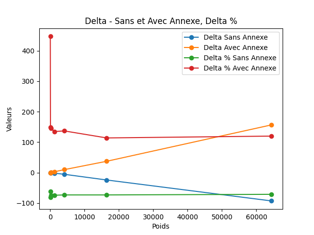



- « TIOBE Index ». TIOBE, https://www.tiobe.com/tiobe-index/.



## Réalisation du MON


Afin de réaliser ce MON dans les temps, j'ai fait le choix de fortement m'appuyer sur ChatGPT afin de mener rapidement les différents tests que je souhaitais réaliser.


## Pourquoi ce MON ?

Excel est un logiciel polyvalent utilisé par un grand nombre de personnes et de structures dans le monde. Il permet donc de "programmer" facilement via VBA (Visual basic for Application) dans beaucoup d'entreprises du fait de sa présence. Parallèlement, le langage de programmation Python est actuellement le langage le plus utilisé dans le monde.


En 2024, l'**index TIOBE** (The Importance Of Being Earnest) présente Python comme le langage le plus utilisé. [Lien](https://www.tiobe.com/tiobe-index/). Cet indice prend en compte le nombre de pages web écrites dans un langage donnée.  
En France, Python est le langage utilisé pour apprendre les fondamentaux de programmation dans les lycées et classes préparatoires entre autres.


## Comment utiliser python depuis Excel ?

Il est possible de faire appel à Python de différentes façons depuis Excel :
- **Directement depuis une cellule :** Barre de tâche > Formule > Insérer Python. *Cette solution n'a pas été étudiée durant ce MON*
- **Depuis une macro VBA.** *Présenté par la suite*

```
Sub Appeler_python()

  Dim path_script As String
  Dim commande As String
    
  ' Chemin vers le script Python
  path_script = "C:\Users\damie\Documents\GitHub\MON-3.1---Python-in-companies\A_lancer.py"  ' Chemin du scipt python
  
  ' Commande à insérer dans le terminal
  commande = "python " & path_script
  
  ' Ouverture d'un terminal et exécution de la commande
  Shell "cmd.exe /C" & commande '/C pour fermer le terminal après exécution | /K pour le garder ouvert
  
End Sub
```


Se référer aux astuces !


## Comment utiliser excel depuis Python ?
**Bibliothèque utilisée :** *pandas*



```python/
import pandas as pd
from openpyxl import load_workbook

path_excel = r"C:\Users\damie\Documents\GitHub\MON-3.1---Python-in-companies\Tests 6.xlsm"
nom_feuille = "ABCD"
nom_resultat = "DCBA"

fichier = load_workbook(path_excel,keep_vba=True) #keep_vba permet d'enregistrer les Macros VBA

# Ouverture d'une feuille

feuille = fichier[nom_feuille]
```


```python/
# Lecture d'une cellule

i = 2 # Ligne 2
j = 3 # Colonne 3

a = feuille.cell(i,j).value

# Modification d'une cellule

feuille.cell(i,j).value = 7
````


```python/
fichier.save(path_excel)
```


```python/
def lancement_macro_sans_argument(path_fichier, nom_macro):
    print("Lancement de la macro "+ nom_macro + " contenue dans le ficher" + path_fichier)
    
    import win32com.client

    fichier_excel = path_fichier

    # Ouverture d'Excel
    excel = win32com.client.Dispatch("Excel.Application")
    excel.Visible = True # Permet de voir Excel se lancer ou non

    # Ouvrir le fichier Excel
    wb = excel.Workbooks.Open(fichier_excel)
    
    # Lancer la macro
    excel.Application.Run(nom_macro)
    
    # Fermeture du fichier excel
    wb.Close(SaveChanges=True)

    # Fermeture Excel
    excel.Quit()

    print("Macro exécutée")

def lancement_macro_avec_argument(path_fichier, nom_macro, liste_arguments):
    print("Lancement de la macro "+ nom_macro + " contenue dans le ficher" + path_fichier)
    
    import win32com.client

    fichier_excel = path_fichier

    # Ouverture d'Excel
    excel = win32com.client.Dispatch("Excel.Application")
    excel.Visible = True # Permet de voir Excel se lancer ou non

    # Ouvrir le fichier Excel
    wb = excel.Workbooks.Open(fichier_excel)
    
    # Lancer la macro
    excel.Application.Run(nom_macro,*liste_arguments)
    
    # Fermeture du fichier excel
    wb.Close(SaveChanges=True)

    # Fermeture Excel
    excel.Quit()

    print("Macro exécutée")
```

## Astuces A CONNAITRE


Arrêter un programme en cours peut altérer un fichier et le rendre inutilisable par la suite. Pour tester un nouveau programmer, privilégier l'utilisation d'une copie du fichier Excel originel.


Le recours à un fichier .xlsm (prenant en charge les Macros) nécessite d'utiliser certaines fonctions pour ouvrir le fichier : ``load_workbook``. Ceci permet de manipulser des fichiers **.xlsm** et **.xlsx** sans les endommager et les rendre inutilisables.


Un scipt python ne peut pas modifier un fichier Excel ouvert. Il faut donc prendre garde à deux choses :
1. Fermer le fichier avant de lancer le script.
2. Si un script python est lancé depuis par une macro VBA, il ne devra pas être utilisé pour modifier le fichier de provenance de la macro puisque ce dernier sera ouvert.


## VBA ou Python ?

Afin de mettre en pratique les points Visual précédemment et évaluer les bénéfices de l'utilisation de Python sur Excel, j'ai réalisé une série de tests.

### Questionnement

L'utilisation de python est-elle plus efficace que l'utilsation de VBA pour des tâches telles que le parcours de tableaux ?
- Rapidité d'éxécution
- Praticité d'utilisation

### Tests

**Fichier de travail :** Document Excel contenant 7 feuilles. Chaque feuille contient un certain nombre de données (des chaines de caractères et des nombres générés par ChatGPT).  
**Protocole :** Parcourir les différents tableaux de données par VBA puis python afin de compter at additionner les nombres rencontrés. Puis relever les temps d'éxécution des différentes étapes de deux programmes.

### Résultats

**Rapidité d'exécution :** On observe que le programme VBA reste globalement plus rapide que les programmes python, notamment à cause du temps d'ouverture et d'enregistrement du fichier Excel.


**Poids =** Poids de la feuille Excel testée (en Ko)   
**Annexe =** Correspond au temps d'ouverture et d'enregistrement du programme python.  
**Delta =** Correspond à l'augmentation ou la diminution du temps d'éxécution du programme python par rapport au programme VBA.


L'éxécution seule du programme python est plus rapide que celle du programme VBA notamment pour des fichier volumineux. **CEPENDANT**, l'impossibilité de l'exécuter avec le fichier Excel ouvert contraint à l'ouvrir et l'enregistrer via le script Python, ce qui le rend plus lent que le script VBA, notamment pour des fichiers volumineux.



**Praticité d'utilisation :** Dans ce cas de figure, programmer le script python s'est révélé plus pénible que programmer le script VBA. En effet, ***pandas*** ne permet pas directement de déterminer les extrémités des tableaux tandis qu'une fonction existe en VBA. **Mais** la synthaxe python reste plus agréable à manipuler.

### Conclusion

Pour les tâches de parcours de tableaux, notamment des tableaux volumineux, il reste préférable d'utiliser VBA pour réaliser des manipulations sur Excel.


Pour compléter ce MON, il pourrait être intéressant de :
1. Etudier les nouvelles fonctionnalités d'Excel intégrant Python depuis le menu **Formules**.
2. Etudier les possibilités permettant de modifier un fichier excel alors que ce dernier est ouvert en étudiant les autorisations utilisateurs.
