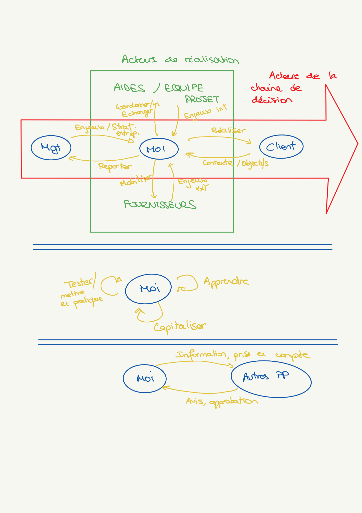
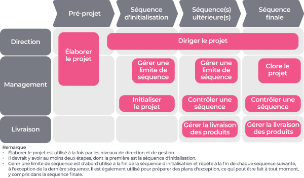



Liste des prérequis du POK ET/OU MON




**PRINCE2** :
- Qu’est-ce que la méthodologie PRINCE2 ? https://www.planzone.fr/blog/quest-ce-que-la-methodologie-prince2.
- Elaborer le Projet :: PRINCE2® wiki. https://prince2.wiki/fr/processus/elaborer-le-projet/.
- IMAGE 2 : « PRINCE2 c’est quoi ? Définition PRINCE2 ». France, https://www.qrpinternational.fr/blog/glossaire/prince2-cest-quoi-definition-prince2/.
**CRITIQUES PRINCE2 :**
- La méthode de gestion de projet Prince2 | Le Blog du Dirigeant. https://www.leblogdudirigeant.com/la-methode-de-gestion-de-projet-prince2/.
- alex. « La PRINCE2 Expliqué : Votre Guide Complet en Gestion ». Furious, 25 décembre 2023, https://www.furious-squad.com/methode-prince2/.


## Cadrage

### Objectifs principaux

1. Identifier une méthode et une philosophie de travail personnelles.
2. Identifier les différents outils utiles à la gestion de projet, leurs spécificités et leur plus-values.
3. Identifier des cas d'usages stéréotypés des outils de gestion de projets.
4. Identifier mes besoins en fonction de ces cas d'usage.
5. Construire une guide d'aide à la décision rapide et efficace.

### Monitoring du projet
#### Back-log et horodateur


- [x] Brainstorming personnel sur les problèmes rencontrés dans des cas de choix d'outils de GdP.
- [x] Brainstorming général d'identification des axes de travail, des questionnements et des enjeux.
- [x] Recherches bibliographiques :
  - [ ] Les outils existants. **EN PARTIE**
  - [ ] Le choix des outils **EN PARTIE**
  - [x] Problématiques ?
- [ ] Conception d'un formulaire : **ABANDONNEE EN COURS DE ROUTE**
  - [ ] Aspect typologie de projet
    - [x] Différenciation tâche/projet
    - [ ] Typologie temporelle **SUPPRIMEE**
    - [x] Typologie par importance (strat ? € ?...)
    - [ ] Typologie par taille **SUPPRIMEE**
    - [ ] Typologie par équipe projet  **EN PARTIE**
  - [x] Aspect besoin de gestion
  - [x] Aspect outils utilisés et pourquoi ?
  - [ ] Aspect pression extérieur
- [x] Révision du formulaire avec L.Piet **DECISION D'ABANSON APRES SOLLICITATION**
- [ ] Envoie du formulaire **SUPPRIMEE**
- [ ] Rédaction des présupposés **SUPPRIMEE**

| Date | Heures passées | Indications | Niveau d'efficacité |
| -------- | -------- | -------- | -------- |
| 08/01/2025 | 0.75h | Brainstorming | Elevée |
| 13/01/2025 | 1.5h | Catégorisation des projets et recherche d'outils de gestion de projet | Elevée |
| 15/01/2025 | 2h | Catégorisation des projets & recherche d'outils de gestion de projet & Méthodes de gestion de projet & Première version du questionnaire | Elevée |
| 16/01/2025 | 3h | Etude des outils de gestion de projet & Besoins projet & Définitons et notions | Faible |
| 19/01/2025 | 0.75h | Version 2 du questionnaire et changement de la stratégie de réalisation | Faible |
| 20/01/2025 | 2h | Réflexion sur le fonctionnement projet via la méthode Prince2 & Nouvelle défintion et formalisation des objectifs et de la stratégie du POK | Elevée |
| 26/01/2025 | 0.5h | Corrections et mise en ligne | Elevée |

***Total du sprint :*** *10.5 h*




- [ ] Conception d'une grille de caractérisation des outils
  - [x] Brainstorming caractéristiques à utiliser
  - [ ] Format de la grille
- [ ] Terminer la caractérisation de chaque outil
- [ ] Conception d'une grille caractérisation de projet utilisant la grille précédente
- [ ] Tests de la grille sur des projets déjà réalisés
- [ ] Construction d'un outil de REX efficace
- [ ] Construction d'une boite à outil
  - [ ] Identifier des templates pour chacun des outils
  - [ ] Identifier des méthodes de création de templates pour chacun des outils

| Date | Heures passées | Indications | Niveau d'efficacité |
| -------- | -------- | -------- | -------- |
| dd/mm/yyy  | xxh | Lorem ipsum | Lorem Ipsum |
| dd/mm/yyy | xxh | Lorem ipsum | Lorem Ipsum |

***Total du sprint 2 :*** *__h soit*



**QUOTA HORAIRE TOTAL POK 2 :** ___h


#### Analyse post-morterm



**GESTION GENERALE DU TEMPS :** Très bonne gestion du temps comparativement aux temps 2 et 3.

**DIMENSIONNEMENT DU PROJET :** Bon dimensionnement général des objectifs du projet.

**DIMENSIONNEMENT DES TACHES :** Les tâches ont été définies trop tôt par rapport à la compréhension du projet et de ses enjeux. Il aurait fallu réaliser dans ce cas 2 à 3 heures de recherches bibliographiques et dessaies avant de pouvoir avoir une idées réelle du contenu pertinent.



**GESTION GENERALE DU TEMPS :** Lorem Ipsum

**GESTION GENERALE :** Lorem Ipsum

**DIMENSIONNEMENT DU PROJET :** Lorem Ipsum





**DIMENSIONNEMENT PROJET :** Lorem Ipsum
**DIMENSIONNEMENT TÂCHES:** Lorem Ipsum
**APPROCHE METHODOLOGIQUE :** Lorem Ipsum



## 1. Importance et plus-value de la gestion de projet
### 1.1 La gestion de projet pour moi
Après avoir mené une démarche instrospective tout au long de ce POK je suis arrivé aux conclusions suivantes :
1. Je souhaite organiser l'ensemble de mon travail en mode projet.

Pouvant être mobilisé sur plusieurs projets et tâches opérationnelles simultannéement, l'oganisation en mode projet convient à mes méthodes de travail. En considérant mon poste comme étant un projet ou même un programme à part entière, je peux :
- Plannifier mon travail.
- Identifier l'avancement de mes tâches.
- Identifier et prévenir les différents risques gravitant autours de mon poste, tâches et projets.
- Reporter précisément et de manière casiment automatique mes activités à ma direction.
- Mener une démarche d'amélioration continue sur l'ensemble de mes activités.



2. Les besoins principaux pour le suivi de mes activités professionnelles sont : *Formaliser, plannifier, anticiper, identifier et capitaliser*.


| Besoin | Détail | Besoin psychologique et méthodologique |
|--------|--------|----------------------------------------|
| **Formaliser** | Clarifier les différentes demandes qui me sont adressées au travers de chartes projets, cahiers des charges...| Provient d'un besoin fort d'avoir une vue à la fois d'ensemble et précise des tâches que je dois réaliser. Mon niveau de motivation et d'efficacité en est très dépendant|
| **Plannifier** | Fixer deadlines, périodes de travail et jalons | Identifier le temps restant et disponible à la réalisation de mon travail, me permet de limiter mon stress ainsi que la remise en question perpétuelle du fondement de mes activités |
| **Anticiper** | Identifier les risques, les forces, les faiblesses de mon travail | Permet de limiter la durée de réflexion et le stress lors d'incidents ou d'imprévus |
| **Identifier** | Identifier les enjeux, les compétences (détenues ou manquantes) et les points stratégiques | Permet de répondre à ma quête de sens et d'optimiser mon propre engouement |
| **Capitaliser** | Automatiser et industrialiser production et réutilisation de REX | Permet de limiter la frustration due à la réalisation des mêmes tâches et/ou erreures. Permet également de maintenir un engouement en favorisant un apprentissage continu. |


### 1.2 Les enjeux

Mettre en place une méthode de travail permettant de lier chacune de mes activités suppose d'avoir connaissance des différentes typologies de tâches qui pourront m'incomber. J'ai donc identifié 4 cas de figure :

**Cas N°1 :** Membre d'une équipe projet, sans en être le gestionnaire. Le chef de projet mène une gestion complète : documents de cadrage, de conception, de plannification, tous partagés, validés et suivis.
**Cas N°2 :** Membre d'une équipe projet, sans en être le gestionnaire. Le chef de projet **NE** mène **PAS** gestion complète : **PAS** de documents de cadrage, de conception, de plannification partagées, validés et suivis.
**Cas N°3 :** Chargé de la réalisation d'un projet seul. Des attentes précises sont partagées par le management et le suivi du projet est actif.
**Cas N°4 :** Chargé de la réalisation d'un projet seul. Aucune attente particulière n'est adressée par le management et le suivi n'est pas actif.

### 1.3 Une méthode qui me correspond : Prince2

#### La méthode
D'après [cet article](https://www.planzone.fr/blog/quest-ce-que-la-methodologie-prince2), la méthode Prince2 (PRojects IN Controlled Environments) est "[...]une méthode pragmatique, structurée, évolutive et adaptable qui permet d'organiser, de gérer et de contrôler efficacement tous types de projets, quelle que soit sa taille."
"PRINCE2 se base sur :
- 7 principes qui présentent les lignes directrices à suivre ;
- 7 thèmes qui décrivent les aspects de la gestion de projet à aborder en permanence pour mener à bien le projet ;
- 7 processus qui détaillent les activités à accomplir pour réaliser le projet."

#### Avis et critiques


- Convient à mes besoins personnels et psychologiques évoqués précédemment : Formaliser, Plannifier, Anticiper, Identifier, Capitaliser
- Organisation en processus : permet de fournir une structure méthodologique pour des chefs de projet novices en quête de formalisme?
- Organisation en thèmes : permet d'identifier les compétences qu'un chef de projet doit maitrisser et affiner.
- Focus sur l'amélioration continue et l'adaptation.
- Semble facilement adaptable à des méthdologies agiles.



**Personnelles**
- Nécessite une formation importante du chef de projet et de l'équipe projet si l'objectif est de l'appliquer à la lettre.
- Ne mets a priori pas l'accent sur la communication avec les parties prenantes.

**D'après : [La méthode de gestion de projet Prince2](https://www.leblogdudirigeant.com/la-methode-de-gestion-de-projet-prince2/)**
- Les processus ne peuvent prendre en compte tous les cas de figure. Manquer de pragmatisme et rester focalisé sur la méthode peut altérer la qualité de la gestion du projet.

**D'après : [La PRINCE2 Expliqué : Votre Guide Complet en Gestion](https://www.furious-squad.com/methode-prince2/?utm_source=chatgpt.com)**
- Trop complexe pour les petits projets
- Au premier abord trop rigide et procédurale
- La certification Prince2 représente un investissement significatif
- Nécessite des ajustements


En conclusion, cette méthode convient parfaitement à un profil ayant à coeur la formalisation, l'amélioration continue et la gestion de la qualité **A CONDITION DE LA REMETTRE EN QUESTION ET DE L'ADAPTER AUX PROJETS**.

## 2. Les notions importantes

### 2.1 Différence cadrage/Conception

Le cadrage et la conception du projet sont deux phases différentes. Elle sont séparées par un Go/noGo.
**Cadrage :** Vise à fixer les grandes lignes du projet et les premières estimations d'allocation des ressources (temporelles, humaine et financières...)
**Conception :** Vise à affiner les exigences ainsi qu'à organiser le travail : Détail des exigences fonctionnelles et techniques, plannification détaillée, mobilisation des ressources humaines...


La conception du projet est une phase de travail à part entière pour le chef de projet.



Dans la méthode Prince2, ces deux phases se retrouvent essentiellement dans les thèmes ***Cas d'affaire*** et ***Organisation***, ainsi que dans les processus ***Elaborer*** et ***Initaliser***.

### 2.2 Les différentes catégorisations

#### Les besoins du projet
Une analyse des projets menés lors de mes stages et études m'a permis de réaliser cette cartographie



**Besoins :**
| N°  | Besoin | Détail | Pour | Depuis |
|-----|--------| -------|------|--------|
| 1   | Coordination - échange |  | Aide & équipe projet | Gestionnaire |
| 2   | Réalisation | | Client  | Gestionnaire |
| 3   | Mobilisation |  | Fournisseurs et sous-traitants  | Gestionnaire |
| 4   | Stratégie d'entreprise | | Gestionnaire | Management  |
| 5   | Enjeux externes | Situation de la chaîne de valeur, de la supply chain, relation avec les prestataires externes, rapports de force, état du marché, compétitivité, criticité des produits/services achetés | Gestionnaire | Fournisseurs et sous-traitants |
| 6   | Enjeux internes | Compétences, relations entre collaborateurs, disponibilité, engouement pour le projet, profils psychologiques | Gestionnaire | Aide & équipe projet |
| 7   | Contextualisation, critères et objectifs | Besoin avec les différents critères de réalisation et d’appréciation du livrable | Gestionnaire | Client |
| 8   | Apprendre | | Gestionnaire | Gestionnaire |
| 9   | Tester / Mettre en application | | Gestionnaire | Gestionnaire |
| 10  | Capitaliser | Amélioration continue pour les prochains projets, de l’entreprise ou non | Gestionnaire | Gestionnaire |
| 11  | Reporting | | Management | Gestionnaire |
| 12  | Approbation et avis | Le chef de projet doit pouvoir avoir accès aux avis, enjeux des autres PP afin de pouvoir obtenir leur approbation et/ou éviter les blocages | Gestionnaire | Autres parties prenantes |
| 13  | Informations et considérations | Les parties prenantes du projet doivent se sentir écoutées, prises en compte dans la démarche du projet. Pour ne pas (pouvoir) bloquer, elles doivent être informées de la réalité des choses | Autres parties prenantes | Gestionnaire |

#### Les processus et thèmes de gestion de projet d'après Prince2
L'approche du projet par processus est inétressante car elle permet de visualiser les actions à mener à la fois en fonction des phases et à la fois en fonction des besoins du projet. Ainsi, elle permet une approche par les compétences du chef de projet.
De même l'approche par les thèmes du projet permet d'imager à la fois les compétences que doit posséder le chef de projet, et à la fois les différentes préocupations qu'il doit avoir tout au long du projet.



IMAGE 2 : Illustration de la méthode Prince2


| N°  | Processus                              | N°  | Thème                  |
|-----|----------------------------------------|-----|------------------------|
| 1   | Elaborer                               | 1   | Le cas d'affaire       |
| 2   | Initialiser                            | 2   | Organisation           |
| 3   | Diriger le projet                      | 3   | Qualité                |
| 4   | Contrôle de séquence                   | 4   | Plannification         |
| 5   | Gestion de la livraison de produit     | 5   | Gestion des risques    |
| 6   | Gestion des limites de séquence        | 6   | Gestion des changements|
| 7   | Clôturer le projet                     | 7   | Contrôle de la progression |


Les thèmes doivent être abordés tout au long de chaque processus !



Dans la méthode Prince2, la communication avec les parties prenantes est inclue dans plusieurs thèmes et processus.
Bien que celà soit cohérent avec l'importance des tâches reliées, il faut à mon sens prendre particlièrement garde à ne pas la négliger car c'est un sous-thème et un sous-processus de plusieurs éléments !


## 3. Choisir les outils adéquats

