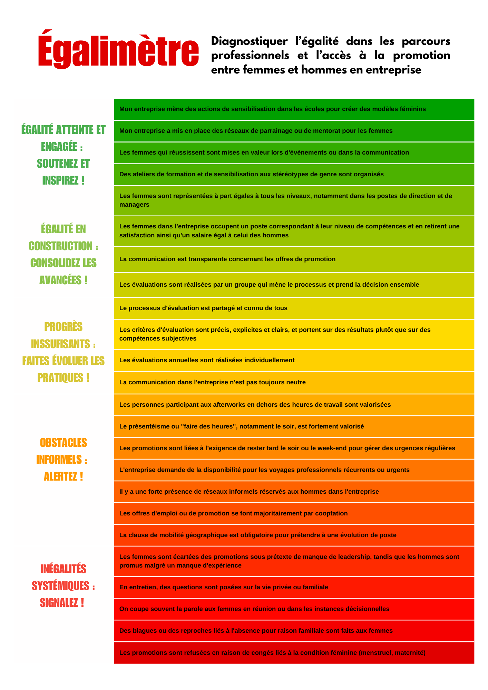



Aucun prérequis, seulement un peu d’ouverture d’esprit sur les questions d'égalité de genre.





<a href="./images/Egalimetre.pdf"
   download="Egalimetre.pdf">Cliquez sur le lien pour télecharger l’Égalimètre en PDF</a>



## Contexte

L’objectif de ce POK est de réaliser un **dispositif de diagnostic à destination des entreprises et de leurs salariés** afin d’évaluer si l’entreprise est un lieu où **l’égalité homme-femme** est encouragée, respectée ou, au contraire, où persistent de nombreuses inégalités.  

Ma première idée est de réaliser ce dispositif en m’inspirant du violentomètre dans l’apparence, car je trouve que ce format a, d’un côté, un **fort pouvoir visuel** : on comprend tout de suite où on se situe et ce que cela implique. D’un autre côté, cet outil est très **simple d’utilisation et de prise en main** (pas de calcul à faire ni de termes compliqués à comprendre).  

En somme, je voudrais donc réaliser un outil de diagnostic des inégalités ou de l’égalité entre les femmes et les hommes pour les entreprises, qui soit à la fois visuel et simple à utiliser, tout en portant un message construit. 

C’est l’occasion pour moi d’en apprendre plus sur le contexte légal en termes d’égalité homme-femme en France, mais aussi de me pencher sur la question de l’égalité et des stéréotypes de genre dans le milieu professionnel, avec une approche un peu plus sociologique, afin de mieux comprendre ces phénomènes et mécanismes.  

## Le cadre légal de l’égalité de genre au travail en France 

En France, l’égalité femmes-hommes au travail impose à l’employeur de respecter plusieurs principes : non-discrimination à l’embauche, égalité salariale et de carrière, obligations d’information et de prévention du harcèlement. En cas de non-respect, des sanctions civiles et pénales sont prévues. Les entreprises de plus de 50 salariés risquent des pénalités si elles n’adoptent pas d’accord ou de plan d’action en faveur de l’égalité professionnelle ou si elles ne réduisent pas les écarts de rémunération.  

Cependant, plus de 46 ans après l’inscription du principe « à travail de valeur égale, salaire égal », **il demeure 9 % d’écart de salaire injustifié entre les femmes et les hommes**.  

En parallèle, l'Index de l'égalité professionnelle est un outil mis en place en France pour mesurer les écarts de rémunération et de traitement entre les femmes et les hommes au sein des **entreprises d’au moins 50 salariés**. Calculé sur **100 points** à partir de plusieurs critères (écarts de salaire, augmentations, promotions, congé maternité, parité parmi les plus hautes rémunérations), il oblige les entreprises à publier leur score chaque année. **Un score inférieur à 75 impose des mesures correctives sous peine de sanctions financières**. Cet index vise à encourager une égalité réelle en incitant les employeurs à corriger les inégalités persistantes.  

Dans les faits, cet indicateur augmente en France depuis sa mise en place, mais son impact réel sur la réduction des inégalités au travail reste discutable.  

D’autres lois et mesures ont été mises en place en France, mais leur étude seule ne suffit pas à comprendre pleinement le sujet ni à mettre en contexte réel ces inégalités. C’est pourquoi la prochaine partie abordera les études sur le sujet.  

## Une approche sociologique de l’égalité de genre au travail



Cette partie s’appuie majoritairement sur les travaux de Clotilde Coron cités en bibliographie.  



### Limites du cadre légal

Le cadre légal en France, avec notamment l’obligation d’affichage de l’index égalité homme-femme, est un bon premier pas vers l’égalité, mais il ne se concentre que sur des critères quantitatifs mesurables. Cette approche n’est cependant pas suffisante pour analyser et comprendre les inégalités au travail, qui comprennent des critères bien plus complexes et implicites, donc plus difficiles à mesurer.  

Ainsi, l’objectif de l’égalimètre est de **voir au-delà de ces indicateurs mesurables les facteurs pouvant accentuer ou lutter contre les inégalités entre les hommes et les femmes**, notamment des facteurs implicites et sur des sujets qui peuvent, à première vue, ne pas sembler liés au genre (comme la mobilité géographique, par exemple).

### Lien entre les stéréotypes et les inégalités de genre

Un de nos premiers postulats est que **les inégalités de genre sont en partie liées aux stéréotypes de genre**. En effet, lutter contre les inégalités (en facilitant le temps de travail des femmes, par exemple, ou en équilibrant les salaires) permet aussi de lutter contre les stéréotypes. Si les femmes avaient un statut égal à celui des hommes, la répartition des tâches dans un couple hétérosexuel serait peut-être plus équilibrée, ce qui permettrait aux hommes et aux femmes de s’impliquer de manière équivalente dans le domaine professionnel et personnel. Cela réduirait ainsi la vision stéréotypée des femmes et des mères, souvent perçues comme devant s’occuper du foyer. D’où l’intérêt de travailler sur les inégalités, sans pour autant délaisser le travail sur les stéréotypes, car l’un va de pair avec l’autre.

On peut notamment distinguer **quatre dimensions de stéréotypes de genre** encore bien ancrés en France et en Europe :  

- Différences de **compétences** entre hommes et femmes : l’homme est perçu comme un leader, fait pour le travail rémunéré, tandis que la femme est associée à l’empathie, au sens de l’écoute et au travail domestique
- **Vision moraliste des mères** : si une femme/mère accorde trop d’importance à son travail rémunéré, sa famille en souffrirait. On accorde donc une priorité au rôle de mère des femmes, en opposition avec leur carrière professionnelle
- **Priorisation des hommes** face aux femmes dans le cas où il n’y aurait pas assez de place pour les deux (travail et études), justifiant ainsi les inégalités
- Vision **essentialiste** selon laquelle, **les femmes préféreraient avoir une famille plutôt qu’un travail**

Nous ne rentrerons pas plus dans le détail des stéréotypes de genre, mais il est notable que celui **le plus présent en France est le deuxième, sur le rôle des mères**.

### Le rôle des entreprises dans les inégalités de genre

Les entreprises ont leur part à jouer pour réduire les inégalités et les stéréotypes de genre, bien que ceux-ci existent dans un système bien plus vaste et complexe, qui englobe l’ensemble de la vie des individus. En effet, les stéréotypes de genre sont présents dans notre société dès la petite enfance (en partie aussi à cause des publicités et des produits genrés proposés par certaines entreprises, mais c’est un autre sujet). On pourrait donc croire que ce n’est pas aux entreprises d’être actrices de cette question d’égalité, car les stéréotypes existent bien avant notre entrée dans le monde du travail. Cependant, les entreprises sont des lieux dans lesquels ces stéréotypes peuvent se renforcer et où des inégalités se créent, ce qui peut, en conséquence, renforcer ces mêmes stéréotypes (par exemple sur les questions de représentativité). **Les entreprises ont donc un rôle clé à jouer dans la lutte contre les inégalités de genre**.



Ces actions en faveur de l’égalité de genre, peuvent être menées sur différents axes plus ou moins complémentaires, mais il est nécessaire de ne pas en délaisser, car ils sont fortement liés les uns aux autres dans un système complexe.  

**Attention** cependant car, **en actionnant certains leviers pour réduire certaines inégalités** (comme proposer le temps partiel pour permettre plus de flexibilité), **on peut en accentuer d’autres** (comme une diminution de salaire).



Les **inégalités peuvent être regroupées en cinq dimensions** principales et une sixième qui regroupe plusieurs points. Elles partagent des caractéristiques communes, bien que la frontière entre chacune soit mince et qu’agir sur l’une puisse avoir des répercussions positives mais aussi négatives sur une autre.

- **Salaire** (horaire, mensuel, global, …)  
- **Mixité ou ségrégation** (secteur et/ou métier)  
- **VSS** (violences sexuelles et sexistes)  
- **Responsabilité, promotion, carrière**  
- **Accès à l’emploi** / recrutement  
- **Équilibre vie pro/vie perso** / conciliation du temps  

C’est pourquoi il n’est pas possible de représenter toutes les inégalités sur un axe unidirectionnel (comme une simple échelle).  

## Égalimètre

### Choix pour l’Égalimètre

J’ai donc fait le choix de me concentrer dans un premier temps sur la création d’un égalimètre pour une seule de ces dimensions, à savoir : **Responsabilité, promotion, carrière**.  

En effet, si j’avais mélangé toutes ces dimensions sur une même échelle, la position n’aurait pas vraiment eu de sens, car certaines inégalités viennent se renforcer quand d’autres s’opposent.

Ma proposition d’Égalimètre est, à mes yeux, une première ébauche de ce que l’on peut produire à ce sujet, bien que d’autres choix auraient pu être faits.  

Ainsi, j’espère que ce POK pourra servir de base à d’autres travaux sur le sujet pour produire un Égalimètre le plus optimal possible (complet sans être trop long afin de conserver une prise en main facile).

### Réalisation de l’Égalimètre



En raison des lectures qui ont amené à la réalisation de notre égalimètre, celui-ci est beaucoup basé sur des démarches de gestion des ressources humaines. D'autres axes pourraient sûrement venir enrichir ce travail.



Par ailleurs, cet outil de diagnostic ne prend en compte que l’axe de la carrière des femmes, et donc ne spécifie pas d'éléments sur le salaire, les VSS, la ségrégation des métiers, l’accès à l’emploi ou l’équilibre vie pro/perso, bien que certains des items puissent y faire référence également.



Des violentomètres sur les VSS en entreprise existe déja et ont été créés par differents syndicats ou institutions, pour exemple : [LE BAROMÈTRE des violences sexistes et sexuelles au travail](https://www.pyrenees-atlantiques.gouv.fr/contenu/telechargement/46554/345787/file/Baromètre_des_violences_sexistes_et_sexuelles_SG.pdf)



### Résultat final

J’ai réalisé l’Égalimètre à partir de 25 items issus de mes diverses lectures, que j’ai ensuite organisés en 5 catégories, à savoir :

- Égalité atteinte et engagée
- Égalité en construction
- Progrès insuffisants
- Obstacles informels
- Inégalités systémiques

J’ai ensuite mis en forme sur une échelle de couleurs inspirée des violentomètres, car les couleurs permettent de comprendre immédiatement le message.

### Points de vigilance des politiques RH en faveur de l’égalité de genre

**Axe de vigilance sur l’acceptation des mesures (cf études de cas)** : plusieurs facteurs réduisent l’effet des mesures mises en place par les entreprises. Les mesures ont des effets inégaux en fonction de leur complexité et de leur appropriation. Une recommandation pour les entreprises serait d’accorder plus d’importance à l’effet des mesures qu’elles souhaitent mettre en place.

Un autre axe de vigilance concerne **l’écart entre la politique RH et la pratique RH**. En effet, dans un contexte où des politiques RH sont mises en place pour diminuer les inégalités de genre en entreprise, elles peuvent en réalité, sur le terrain, ne pas aboutir à des pratiques respectueuses de ces politiques. C’est donc un point à garder en tête pour les entreprises.

Par ailleurs, certaines discriminations sont plus ou moins faciles à discerner car il existe des discriminations directes et indirectes à l’encontre des femmes, à savoir : 

La **discrimination directe** à l'encontre des femmes se manifeste par un traitement défavorable explicite fondé sur le sexe, comme le refus d'embauche en raison d'une grossesse. La **discrimination indirecte**, quant à elle, résulte de pratiques en apparence neutres, mais ayant un impact disproportionné sur les femmes, par exemple lorsqu'une exigence de disponibilité totale pénalise celles ayant des responsabilités familiales.

De plus, on peut garder en mémoire que les **moments clés** de réalisation de ces inégalités sont notamment lors du**recrutement** et des **évaluations individuelles**, car on fait face à l’évaluation d’individu à individu, et donc une expression des stéréotypes de genre via différents biais inconscients, qu’il est difficilement possible de contrôler.

## Plan d’action



### Objectifs

- **Sprint 1** : Se documenter sur les droits et devoirs des entreprises en termes d’égalité hommes-femmes et sur les inégalités de genre dans le monde professionel.  
- **Sprint 2** Réaliser un outil de diagnostic pour les entreprises.

### Sprint 1

| Tâches | Temps estimés | Temps réels |
| -------- | -------- |-------- |
| Recherche documentaire  | 6h | 10h |
| Structuration des informations utilisables pour l’échelle | 4h | 0h |

### RETEX Sprint 1

Je ne suis pas très satisfaite de mon sprint 1, dans le sens où j’ai eu du mal à trouver des sources intéressantes et vraiment alignées avec mon sujet. J’ai donc fait appel à Laetitia Piet pour m’orienter dans ma recherche de sources, ce qui m’a permis d’avancer, mais avant cela, j’ai perdu beaucoup de temps inutilement. J’ai donc dû me réorganiser pour le sprint 2.

### Sprint 2

| Tâches | Temps estimés | Temps réels |
| -------- | -------- |-------- |
| Structuration des informations utilisables pour l’échelle  | 2h | 3h |
| Créer les différents palliers de l’échelle  | 4h | 3h |
| Créer le visuel de l’échelle  | 4h | 2h |
| Relecture et ajustements  | 0h | 2h |

### RETEX Sprint 2

Je suis satisfaite du travail et des lectures que j’ai pu réaliser pour ce POK 2, même si le temps de travail a dépassé les 20h attendues au total.

Pour ce qui est de la bibliographie, je recommande fortement la lecture du dernier ouvrage pour ceux qui voudraient se renseigner sur les indicateurs des inégalités de genre au travail, mais aussi sur les stéréotypes de genre en France et en Europe.

Pour ce qui concerne la réalisation de l’Égalimètre, je pense que c’est un bon début, mais le sujet est tellement vaste que je pense qu’il est possible soit de le centrer encore plus sur la dimension choisie en trouvant des items d’autant plus précis, justifiés et parlants, ou au contraire d’en proposer un plus général sur les inégalités.

La valeur ajoutée de mon travail aux violentomètres déjà existant est que, bien souvent, ceux-ci sont axés sur les VSS, ou alors sur des indicateurs plutôt explicites, là où j’ai essayé, via mes lectures, d’apporter des items plus implicites et pas directement liés aux inégalités, mais en faisant appel à des stéréotypes de genre via divers biais. De plus, la lecture de l’étude de cas de Clotilde Coron m’a permis de nuancer le propos à la fin en apportant quelques conseils à des entreprises qui aimeraient s’améliorer dans leurs politiques RH d’atteinte de l’égalité de genre.

Dans l’ensemble, je suis satisfaite de ce dernier POK car il m’aura permis d’explorer plus en profondeur le cadre de l’égalité de genre au travail, ce qui, je l'espère, me sera utile dans ma carrière, notamment si possible en ayant la possibilité d’animer des formations auprès de professionnels ou en milieu scolaire pour sensibiliser sur le sujet, en espérant qu’un jour l’égalité soit réellement atteinte.

### Horodatage

| Date | Heures passées | Indications |
| -------- | -------- |-------- |
| Lundi 20/01  | 1H  | Recherche de contenu |
| Lundi 20/01  | 1H  | Formation ANACT |
| Samedi  25/01  | 5H  | Documentation |
| Dimanche  26/01 1  | 3H  | Recherche nouvelles sources |
| Vendredi  28/02  | 2H  | Lecture étude de cas Clotilde Coron |
| Mardi  04/03  | 2H  | Lecture chap 1 |
| Mercredi  05/03  | 2H  | Lecture chap 4 |
| Mercredi  06/03  | 3H  | Structuration des informations utilisables pour l’échelle |
| Jeudi  06/03  | 3H  | Créer les différents palliers de l’échelle |
| Jeudi  06/03  | 2H  | Créer le visuel de l’échelle |
| Vendredi  07/03  | 2H  | Relecture et ajustement |



### Bibliographie



- [ANACT : Autoformation L'égalité professionnelle femme-homme](https://www.anact.fr/auto-formation-legalite-professionnelle-femme-homme)
- [L'égalité professionnelle Femmes-Hommes](https://travail-emploi.gouv.fr/legalite-professionnelle-femmes-hommes)
- [L'égalité de rémunération entre les femmes et les hommes et les obligations des employeurs](https://travail-emploi.gouv.fr/legalite-de-remuneration-entre-les-femmes-et-les-hommes-et-les-obligations-des-employeurs)
- [Index de l’égalité professionnelle : calcul et questions/réponses](https://travail-emploi.gouv.fr/index-de-legalite-professionnelle-calcul-et-questionsreponses)
- [Accélérer l'égalité professionnelle et l'autonomie économique des femmes](https://www.egalite-femmes-hommes.gouv.fr/accelerer-legalite-professionnelle-et-lautonomie-economique-des-femmes)
- Quels effets des mesures d’égalité professionnelle, en fonction de leur difficulté d’appropriation ? Une étude de cas - Clotilde Coron
- Stéréotypes de genre et inégalités professionnelles entre femmes et hommes. Quelles responsabilités pour les organisations ? - Clotilde Coron

