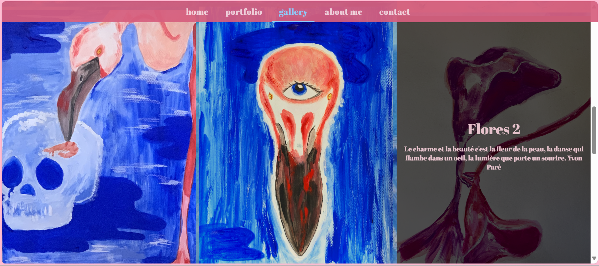

Mon objectif est de mettre en production mon site web React à l'adresse suivante : [https://balsamite.aioli.ec-m.fr].

## Tâches

### Sprints

But final.

#### Sprint 1

- [x] Améliorer la page portefolio
- [ ] Changer le système de mail si possible
- [x] Modifier la galerie pour pouvoir visualiser le titre de la peinture lorsqu'on passe la souris dessus
- [ ] Ajouter la navigation clavier pour le portefolio et le scroll
- [ ] Voir où stocker mes peintures : au lieu d'un json créer une collection sur MongoDB et faire une API avec FastAPI ou SQLite

#### Sprint 2

- [ ] Déployer le site sur aioli à la main
- [ ] Tester une seconde manière de déployer, cette fois en dockerisant mon appli

### Horodatage

Toutes les séances et le nombre d'heure que l'on y a passé.

| Date | Heures passées | Indications |
| -------- | -------- |-------- |
| Lundi 11/11  | 4H  | Amélioration de la page portefolio, rajout de deux peintures à la bdd, rajout de la fonctionnalité "hovering" dans la galerie photo |

## Contenu

Le contenu du POK.

### Premier Sprint

J'ai amélioré le carousel avec le chargement des images, ce qui m'ennuyait avec la version précédente du carousel c'était le chargement lent des images. Pour améliorer ceci, j'ai d'abord essayé de refaire le carousel de manière plus simple en faisant des tests mais je préférais le visuel que j'avais déjà, donc je suis repartie du code que j'avais à la fin du POK 1 et j'ai rajouté ces lignes de code qui charges les images de manière asynchrone : 
```
useEffect(() => {
    const preloadImages = async () => {
      const visibleItemIndices = [currentIndex, (currentIndex + 1) % items.length];
      
      const preloadPromises = visibleItemIndices.map(index => 
        loadImage(items[index])
      );

      await Promise.all(preloadPromises);

      setIsLoading(false);
      setVisibleItems(visibleItemIndices.map(index => items[index]));
    };

    preloadImages();
  }, [currentIndex]);

  const loadImage = async (item) => {
    return new Promise((resolve, reject) => {
      const img = new Image();
      img.onload = () => resolve(img);
      img.onerror = () => reject(new Error(`Failed to load image: ${item.img_url}`));
      img.src = item.img_url;
    });
  };
```
Une fois que j'étais satisfaite du résultat, j'ai rajouté deux peintures/dessins récents dans ma base de données. J'ai ensuite rajouté une fonctionnalité dans ma galerie photo qui est que lorsque l'utilisateur passe la souris sur une des images, s'affiche alors le titre et la description de l'image. Pour se faire, j'ai rajouté un state `hoveredItem` et une Box noire transparente qui se superpose à l'image.  



### Second Sprint

### Ressources
- https://stacklima.com/comment-dockeriser-une-application-reactjs/
- https://www.youtube.com/watch?v=4xj8N4a36Zs&ab_channel=chillotech