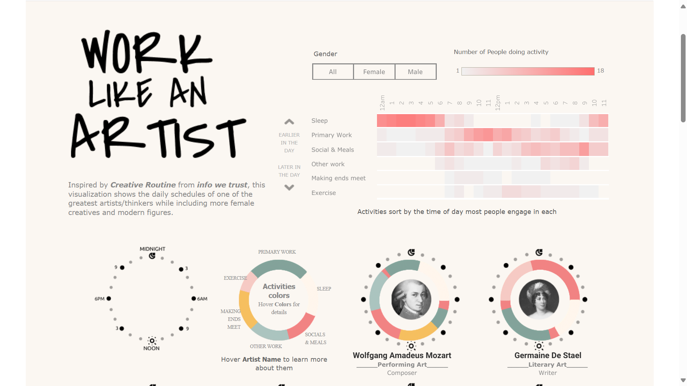
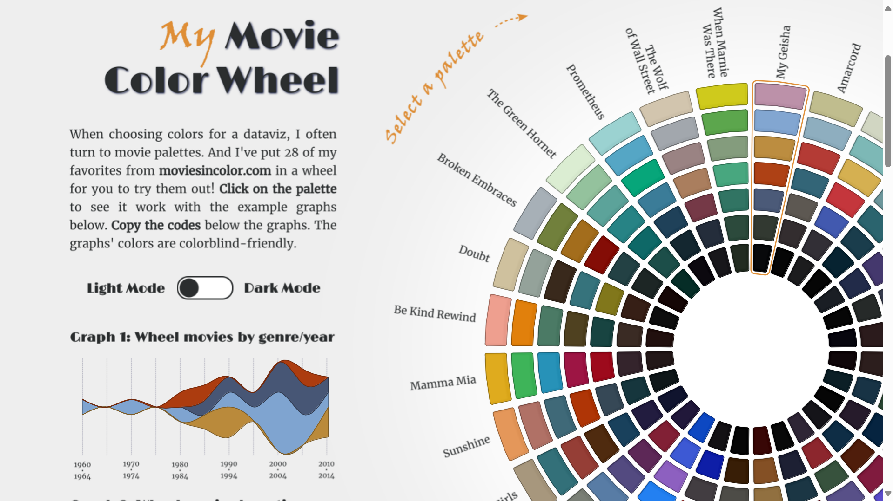
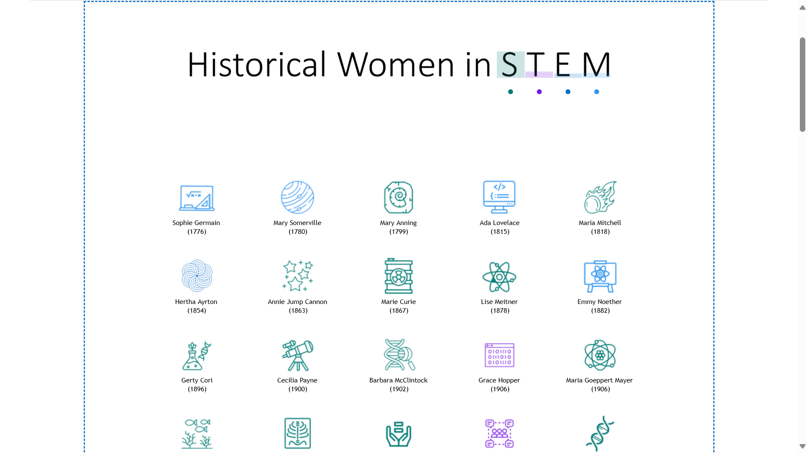
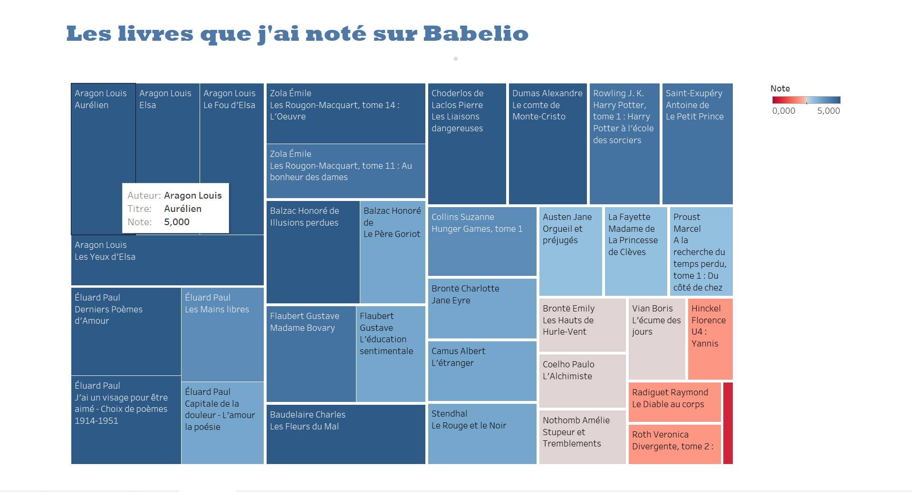



Liste des prérequis du POK ET/OU MON




[MON de Sarah Sebastien sur le data art](https://francoisbrucker.github.io/do-it/promos/2023-2024/Sarah-Sebastien/mon/temps-3.1/)
[Inspirations d'artistes](https://flowingdata.com/category/visualization/artistic-visualization/)



## Tâches

### Sprints

Je vais utiliser un des deux logiciels suivants : 
- soit **Tableau**, outil adapté pour des visualisations de données interactives, des dashboards.
- soit **Processing** pour des visualisations plus artistiques et expérimentales.
A la fin de ce POK je souhaite avoir fourni une ou plusieurs visualisations artistiques de données. 

#### Sprint 1

- [x] Choix entre Tableau et Processing
- [x] Prendre de l'inspiration sur Flowingdata.com
- [x] Définir le thème du projet 
- [x] Collecte et nettoyage des données
- [x] Conception de la première visualisation
- [ ] Création d’une visualisation interactive
- [x] Ecriture du compte-rendu sur le site do-it

#### Sprint 2

- [ ] Amélioration des visualisations
- [ ] Prototypage d’une visualisation créative (sculpture numérique, oeuvre générative ??)
- [ ] Ajouter des éléments narratifs ou interactifs avancés 
- [ ] Finalisation de la présentation visuelle
- [ ] Ecriture du compte-rendu sur le site do-it

### Horodatage

Toutes les séances et le nombre d'heure que l'on y a passé.

| Date | Heures passées | Indications |
| -------- | -------- |-------- |
| Vendredi 17/01 | 3H | Choix entre tableau et Processing (essais avec Processing) + inspirations sur Internet |
| Samedi 18/01  | 2H  | Tableau choisi : lecture de la documentation + des tableaux publics |
| Lundi 20/01 | 2H | Création du fichier csv avec les données + premier tableau |
| Dimanche 26/01 | 1H | Rédaction compte-rendu |
| Lundi 27/01 | 2H | Essais sur Tableau |

## Contenu

Le contenu du POK.

## Premier Sprint

Lors de mes premiers instants de travail sur ce POK, j'ai regardé les différentes possibilités de data visualisation en utilisant Tableau ou Processing. 
Processing est un logiciel facile d'utilisation, basé sur du Java et qui permet plutôt de faire du data art. 
Tableau est un logiciel de visualisation de données qui permet de créer des tableaux de bord à partir de données csv, json ou autres. La visualisation est plus générique, avec une combinaison de diagrammes en barres, de camemberts, de nuages... avec Tableau tandis que sur Processing on peut faire plus de créations abstraites et artistiques. Seulement, en entreprise Tableau est plus utilisé par les data analystes donc j'ai préféré utiliser ce logiciel pour apprendre à le prendre en main et l'appliquer à des sujets qui m'intéressent. Il y a beaucoup de tableaux publics créés avec ce logiciel, sur plein de sujets différents et cette manière de visualiser la donnée de manière créative m'a donné envie de m'y mettre aussi. Voici quelques liens parmi mes visualisations préférées : 

Des inspirations de tableaux publics :

-https://public.tableau.com/app/profile/ha.pl/viz/WorkLikeanArtistDailyRoutinesofFamousCreatives/Dashboard1

-https://public.tableau.com/app/profile/lomska/viz/MyMovieColorWheelwithLightDarkMode/Dashboard1

- https://public.tableau.com/app/profile/jennifer.dawes/viz/HistorialWomeninSTEM/WomeninSTEM

- https://infowetrust.com/work : Une source avec plein d'idées de visualisations

Etant un rat de bibliothèque, j'ai décidé de créer une visualisation sur mes livres favoris. J'ai donc créé un compte Babelio qui permet de faire sa propre bibliothèque virtuelle avec des catégories de livres (lus, à lire, en cours...) et un système de notation. J'ai donc ajouté une petite trentaine de livres à ma bibliothèque virtuelle. Ce site web là m'a permis d'exporter mes données sous un fichier csv et j'ai pu facilement l'importer sur Tableau. J'ai mis un peu de temps à prendre en main le logiciel malgré son UI accessible et ma première visualisation est la suivante :

Je ne suis pas trop satisfaite de cette visualisation et nécessite de visionner plus de tutoriels pour avoir un rendu plus sympa. Le but d'un tableau de bord est d'avoir sur une seule page plusieurs visualisations, j'aimerai apprendre à faire un fond qui mette en valeur les visualisations que je ferai lors du sprint 2. 

### Second Sprint
