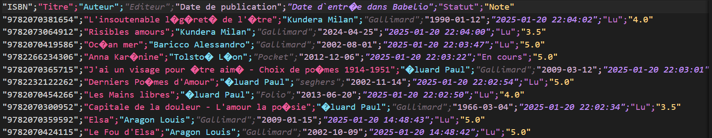
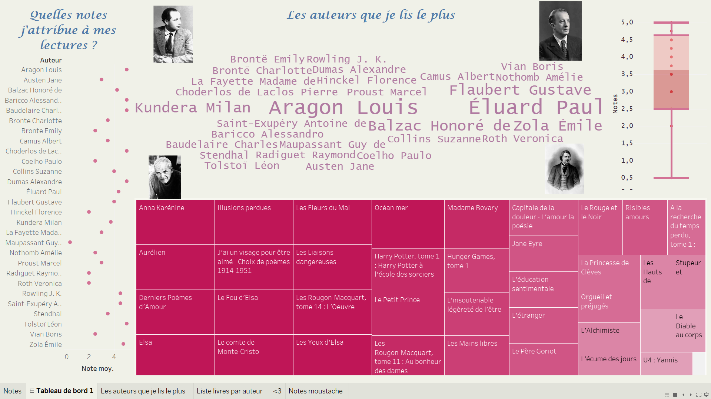
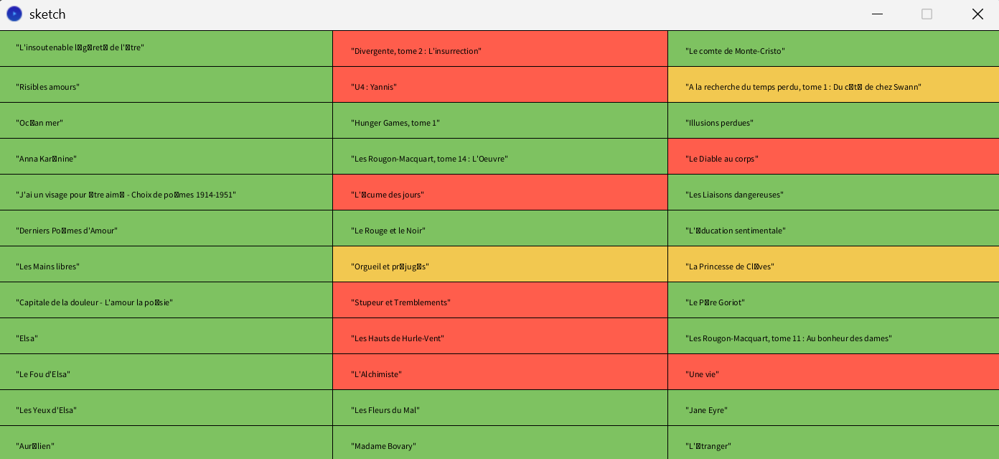
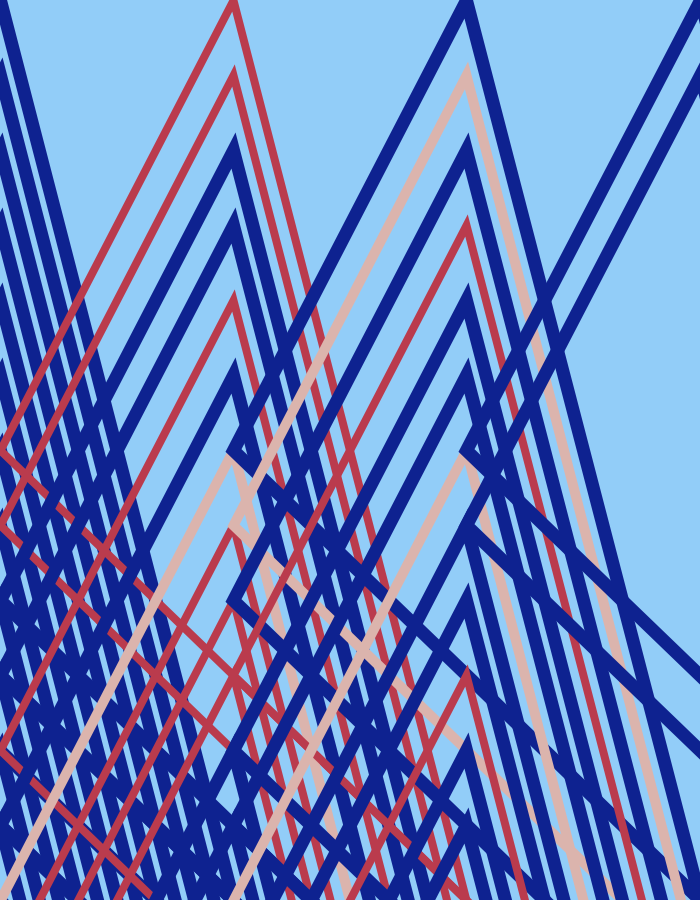



Liste des prérequis du POK ET/OU MON




[MON de Sarah Sebastien sur le data art](https://francoisbrucker.github.io/do-it/promos/2023-2024/Sarah-Sebastien/mon/temps-3.1/)
[Inspirations d'artistes](https://flowingdata.com/category/visualization/artistic-visualization/)



## Tâches

### Sprints

Je vais utiliser un des deux logiciels suivants :
- soit **Tableau**, outil adapté pour des visualisations de données interactives, des dashboards.
- soit **Processing** pour des visualisations plus artistiques et expérimentales.
A la fin de ce POK je souhaite avoir fourni une ou plusieurs visualisations artistiques de données.

#### Sprint 1

- [x] Choix entre Tableau et Processing
- [x] Prendre de l'inspiration sur Flowingdata.com
- [x] Définir le thème du projet
- [x] Collecte et nettoyage des données
- [x] Conception de la première visualisation
- [ ] Création d’une visualisation interactive
- [x] Ecriture du compte-rendu sur le site do-it

#### Sprint 2

- [x] Amélioration des visualisations
- [x] Prototypage d’une visualisation créative (sculpture numérique, oeuvre générative ??)
- [ ] Ajouter des éléments narratifs ou interactifs avancés
- [ ] Finalisation de la présentation visuelle
- [x] Ecriture du compte-rendu sur le site do-it


### Horodatage

Toutes les séances et le nombre d'heure que l'on y a passé.

| Date | Heures passées | Indications |
| -------- | -------- |-------- |
| Vendredi 17/01 | 3H | Choix entre tableau et Processing (essais avec Processing) + inspirations sur Internet |
| Samedi 18/01  | 2H  | Tableau choisi : lecture de la documentation + des tableaux publics |
| Lundi 20/01 | 2H | Création du fichier csv avec les données + premier tableau |
| Dimanche 26/01 | 1H | Rédaction compte-rendu |
| Lundi 27/01 | 2H | Essais sur Tableau |
| Vendredi 28/02 | 3H | Création d'un Tableau sur mes lectures |
| Samedi 01/03 | 2H | Recherche sur l'art génératif et visionnage de tutoriels Processing |
| Mercredi 05/03 | 3H | Premiers essais Processing |
| Jeudi 06/03 | 2H | Création de ma propre oeuvre Processing |


## Contenu

Le contenu du POK.

## Premier Sprint

Lors de mes premiers instants de travail sur ce POK, j'ai regardé les différentes possibilités de data visualisation en utilisant Tableau ou Processing.
Processing est un logiciel facile d'utilisation, basé sur du Java et qui permet plutôt de faire du data art.
Tableau est un logiciel de visualisation de données qui permet de créer des tableaux de bord à partir de données csv, json ou autres. La visualisation est plus générique, avec une combinaison de diagrammes en barres, de camemberts, de nuages... avec Tableau tandis que sur Processing on peut faire plus de créations abstraites et artistiques. Seulement, en entreprise Tableau est plus utilisé par les data analystes donc j'ai préféré utiliser ce logiciel pour apprendre à le prendre en main et l'appliquer à des sujets qui m'intéressent. Il y a beaucoup de tableaux publics créés avec ce logiciel, sur plein de sujets différents et cette manière de visualiser la donnée de manière créative m'a donné envie de m'y mettre aussi. Voici quelques liens parmi mes visualisations préférées :

Des inspirations de tableaux publics :

-https://public.tableau.com/app/profile/ha.pl/viz/WorkLikeanArtistDailyRoutinesofFamousCreatives/Dashboard1

-https://public.tableau.com/app/profile/lomska/viz/MyMovieColorWheelwithLightDarkMode/Dashboard1

- https://public.tableau.com/app/profile/jennifer.dawes/viz/HistorialWomeninSTEM/WomeninSTEM

- https://infowetrust.com/work : Une source avec plein d'idées de visualisations

Etant un rat de bibliothèque, j'ai décidé de créer une visualisation sur mes livres favoris. J'ai donc créé un compte Babelio qui permet de faire sa propre bibliothèque virtuelle avec des catégories de livres (lus, à lire, en cours...) et un système de notation. J'ai donc ajouté une petite trentaine de livres à ma bibliothèque virtuelle. Ce site web là m'a permis d'exporter mes données sous un fichier csv et j'ai pu facilement l'importer sur Tableau.



 J'ai mis un peu de temps à prendre en main le logiciel malgré son UI accessible et ma première visualisation est la suivante :


Je ne suis pas trop satisfaite de cette visualisation et nécessite de visionner plus de tutoriels pour avoir un rendu plus sympa. Le but d'un tableau de bord est d'avoir sur une seule page plusieurs visualisations, j'aimerai apprendre à faire un fond qui mette en valeur les visualisations que je ferai lors du sprint 2.


## Second Sprint

J'ai voulu améliorer la visualisation que j'avais déjà, en me basant sur des tutoriels et des visualisations qui existaient déjà (mises en ligne sur Tableau Public).



Sur ce Tableau de bord on retrouve différentes feuilles de calcul : un diagramme à moustaches, un nuage de mots et une arborescence.

J'ai décidé pour ce deuxième sprint de m'intéresser aux oeuvres génératives sur Internet pour faire de la data visualisation.

#### Les artistes connus

L'art génératif est un mouvement créatif initié dans les années 80. J'ai recensé trois artistes qui sont les pionniers de ce mouvement. Cet art numérique exploite des algorithmes qui concoivent des oeuvres qui se générent elles-mêmes.

* Vera Molnár

Vers la fin des années 50, Vera Molnár commence à utiliser l'informatique dans un but artistique. Je la cite : "L’ordinateur, si merveilleux soit-il, n’est qu’un outil qui permet de libérer le peintre des pesanteurs d’un héritage artistique sclérosé". Son style est abstrait et géométrique et ses oeuvres sont basées sur des règles mathématiques et des variations aléatoires.


*Vera Molnár en 1961*

* Casey Reas


Le site internet [reas.com](reas.com) condense les oeuvres d'art de Casey Reas, co-fondateur de Processing. Son travail est souvent inspiré par des systèmes biologiques et informatiques, produisant des compositions visuelles évolutives.

* Manfred Mohr


Manfred Mohr a exploré les dimensions cachées de l’espace avec des structures cubiques et des algorithmes visuels, créant des œuvres dynamiques en noir et blanc.

#### Prise en main de Processing

Casey Reas est le co-fondateur de Processing, un logiciel d'art qui se veut simple d'utilisation. Le language est basé sur du Java. Ainsi, je télécharge [Processing](https://processing.org/download?processing) et lit quelques tutoriels avant de prendre en main l'outil pour créer ma propre oeuvre d'art générative.

J'ai suivi le tutoriel de [CreativeCoderie](https://www.youtube.com/watch?v=Aqwpxl5LUFI&ab_channel=CreativeCoderie) qui a également visualisé ses données de lectures, qu'elle a exporté de GoodReads.


Ceci est le résultat d'une partie du tutoriel. J'ai décidé de faire une oeuvre plus proche de ce que Vera Molnár aurait pu faire... Je ne pense pas être arrivée au résultat escompté mais voici mon
oeuvre :



Je ne compte pas la partager sur mon site de peintures mais c'était un exercice rigolo. Les triangles ont une taille croissante selon leur note et leur couleur dépend aussi de la note obtenue (bleu foncé pour les notes supérieures à 3, rose pour les notes égales à 3 et rouge pour celles inférieures à 3)


```
Table table;
color top = #0e2290;
color mid = #dbb4ad;
color bottom = #ba3b4d;
color bg = #92cdf8;

void setup(){
  size(700, 900);
  background(bg);

  String[] lignes = loadStrings("biblio.csv");
  Table tableau = new Table();

  String[] enTetes = lignes[0].split(";");
  for (String entete : enTetes) {
     tableau.addColumn(entete.trim());
  }

   for (int i = 1; i < lignes.length; i++) {
   TableRow ligne = tableau.addRow();
   String[] valeurs = lignes[i].split(";");

   for (int j = 0; j < valeurs.length; j++) {
     ligne.setString(j, valeurs[j].trim());
    }
   }

  int index = 0;
  int xcount = 3;
  int ycount = tableau.getRowCount()/xcount;
  float cellw=width/(float)xcount;
  float cellh=height/(float)ycount;

  for (TableRow row : tableau.rows()) {
   float note = Float.parseFloat(row.getString(7).replace("\"",""));

   int i = index/ycount;
   int j = index%ycount;

   float xpos = i*cellw;
   float ypos = j*cellh;

    if (note >3) {
    stroke(top);
    strokeWeight(13);
    noFill();
  } else if (note == 3){
    stroke(mid);
    strokeWeight(10);
    noFill();
 } else{
    stroke(bottom);
    strokeWeight(8);
    noFill();
  }
   triangle(xpos-cellw, ypos+height/2,
          xpos+cellw, ypos+height,
          xpos, ypos);

   fill(0);

   index++;
  }
  save("obra_de_arte.png");
}
```


## Post-mortex sprint 2
J'ai apprécié cet exercice mais je ne pense pas que la data visualisation soit un domaine qui m'attire plus que ça, j'ai eu plus de mal à gérer mon temps par rapport aux POK 1 et 2 durant lesquels j'étais plus motivée par mon sujet. Cependant ce POK était une bonne matière de terminer mon année à do_it !

### Ressources
- [Article sur Vera Molnár](https://news.artnet.com/art-world/vera-molnar-venice-biennale-2098046)
- [Flossmanuals Processing](https://flossmanuals.developpez.com/tutoriels/processing/?page=page_1#LI-D)