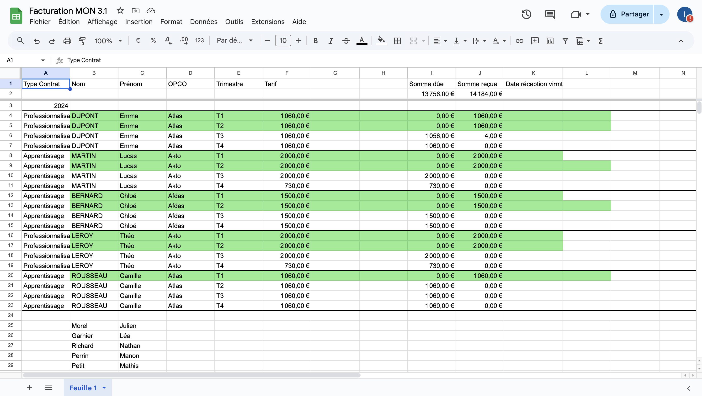
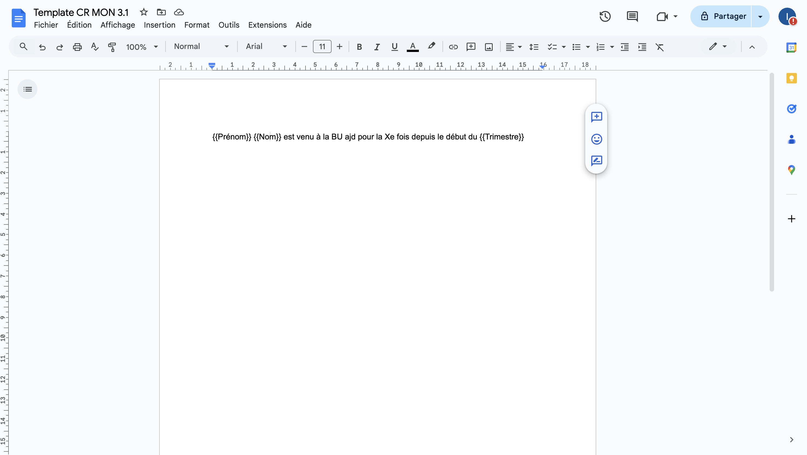
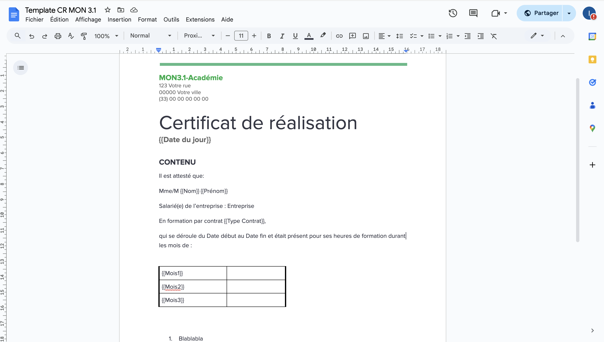
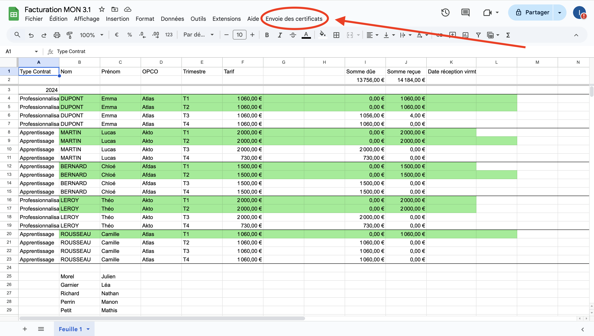
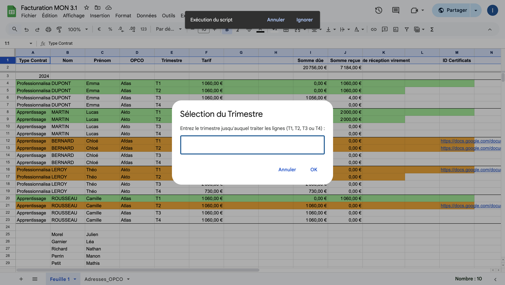
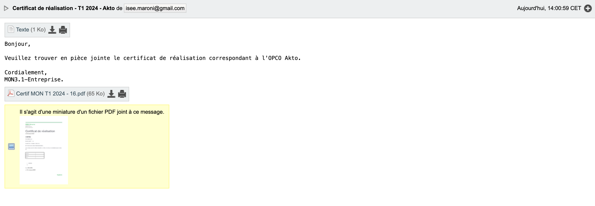
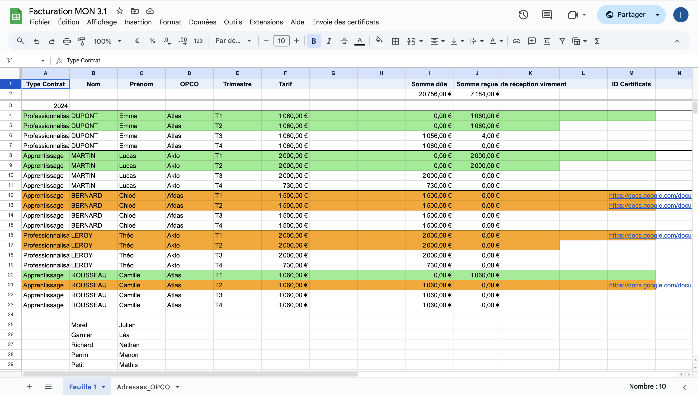
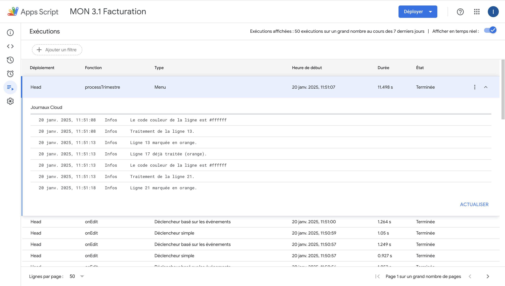



Aucun



- [`Drive du projet`](https://drive.google.com/drive/folders/1OblmFFQ12JwEWJjg4Qubddl3eAxdpAna?usp=sharing)
- [`Google Sheet du projet`](https://docs.google.com/spreadsheets/d/1eEKEn1KX_vBrW6po_FRRw5K27mNP0Zit1ZvLuVNVU6E/edit?usp=sharing)




- [`MON 2.1 de Mathis ADINOLFI : Création d'un EDT automatique avec Sheet et Appscript`]({{ site.url }}/promos/2024-2025/Adinolfi-Mathis/mon/temps-2.1/)
- [`MON 2.1 de Matthieu DUFORT : Automatisation avec Google App Script`]({{ site.url }}/promos/2024-2025/Matthieu-Dufort/mon/temps-2.1/)



L’objectif de ce MON est de me former à Google Apps Script afin d’automatiser les interactions entre Google Sheets, Google Docs, et Google Drive, tout en gérant l’envoi d’emails pour des tâches récurrentes et identiques. Cette démarche vise à optimiser les workflows et à réduire le temps consacré aux tâches répétitives.


[[toc]]


## Contexte

La mise en situation s’inspire d’une problématique rencontrée lors d’un précédent stage. Un centre de formation, appelé "MON3.1-Académie", propose des formations en alternance, où les élèves suivent un contrat de professionnalisation ou d’apprentissage au sein d’entreprises partenaires. Le financement des formations est assuré par les OPCO affiliés aux entreprises concernées, tels qu’Atlas, Afdas ou Akto. Ces organismes règlent les frais de formation à la fin de chaque trimestre, après réception de la confirmation de la présence de chaque élève à l’ensemble de ses heures de formation.

Chaque trimestre, le processus reste identique et comprend les étapes suivantes pour chaque élève :

- Vérification de la présence à toutes les heures de formation.
- Génération d’un certificat de présence.
- Envoi du certificat à l’OPCO.
- Suivi du virement correspondant.
Cette procédure, très répétitive et impliquant de nombreuses lignes de données, est sujette aux erreurs.

En cas de retard accumulé sur l’année précédente, il devient crucial de prioriser les envois. Par exemple, il peut être nécessaire d’organiser l’envoi par vagues, en traitant d’abord toutes les demandes du deuxième trimestre 2024. Une fois les paiements reçus, les demandes des troisième et quatrième trimestres peuvent être envoyées progressivement. Ce mécanisme garantit une gestion plus fluide et évite les retards supplémentaires.

## Vidéo de démonstration de la version finale

<video controls autoplay loop>
  <source src="./MON3.1_Facturation_fonctionnalites_V2.mov" type="video/mp4"/>
</video>


## Premiers Pas

Pour découvrir les premières fonctionnalités utiles d'Apps Script, ainsi qu'un aperçu des diverses applications possibles, j'ai visionné cette vidéo.


- [`Google Apps Script Comment ça marche ?`](https://www.youtube.com/watch?v=peE-2UrqEbI) de *Bande de Codeurs*



## L'interface utilisateur

La première étape consistait à construire une feuille Google Sheets pour gérer et suivre les informations décrites précédemment dans le contexte.



- En vert : les lignes correspondant aux paiements déjà reçus.
- En blanc : les lignes représentant les paiements encore en attente à ce jour.

*Première automatisation*

Lorsqu’un paiement est reçu et ajouté dans la colonne "Somme reçue", si celui-ci est complet, la ligne correspondante passe automatiquement en vert.


Cette étape m'a également permis de découvrir l'utilisation des *Logger*, un outil pratique pour consigner des traces dans le Journal d'exécution. (cf *Annexe*)



``````
function onEdit(e) {
  if (!e) return;
  Logger.log("Événement onEdit déclenché.");

  var sheet = e.source.getActiveSheet();
  var range = e.range;
  var row = range.getRow();
  var col = range.getColumn();

  // Récupère les noms des colonnes dans la première ligne
  var headers = sheet.getRange(1, 1, 1, sheet.getLastColumn()).getValues()[0];

  // Trouve les indices des colonnes "Tarif" et "Somme reçue"
  var tarifIndex = headers.indexOf("Tarif") + 1; // +1 car index commence à 0
  var sommeRecueIndex = headers.indexOf("Somme reçue") + 1;

  if (tarifIndex === 0 || sommeRecueIndex === 0) {
    Logger.log("Les colonnes 'Tarif' ou 'Somme reçue' sont introuvables.");
    return;
  }

  // Vérifie si l'édition concerne l'une des deux colonnes
  if (col === tarifIndex || col === sommeRecueIndex) {
    var valueTarif = sheet.getRange(row, tarifIndex).getValue();
    var valueSommeRecue = sheet.getRange(row, sommeRecueIndex).getValue();
    var rangeToCheck = sheet.getRange(row, 1, 1, sheet.getLastColumn());

    Logger.log(`Valeur Tarif : ${valueTarif}, Valeur Somme reçue : ${valueSommeRecue}`);

    if (valueTarif === valueSommeRecue && valueTarif !== "") {
      rangeToCheck.setBackground("lightgreen"); // Colore la ligne en vert
      Logger.log(`Les valeurs sont identiques`);
    } else {
      rangeToCheck.setBackground(null); // Réinitialise la couleur
      Logger.log("Les valeurs ne sont pas identiques ou sont vides.");
    }
  }
}
``````


## Edition des certificats

L'étape suivante consiste à générer des certificats personnalisés pour chaque élève en s'appuyant sur :

- Un template de certificat, disponible dans Google Drive.
- Les informations personnelles enregistrées dans la feuille Google Sheets.
Ce processus permet d'automatiser la création des certificats, en intégrant directement les données spécifiques à chaque élève depuis le GSheet dans le modèle.

Voici 2 versions successives du template :






``````


function fillTemplate(row) {
  var sheet = SpreadsheetApp.getActiveSpreadsheet().getActiveSheet();

   // Récupérer les noms des colonnes (première ligne)
  var headers = sheet.getRange(1, 1, 1, sheet.getLastColumn()).getValues()[0];

    // Identifier l'index de la colonne "ID_Certificats"
  var certIdIndex = headers.indexOf("ID Certificats");
  if (certIdIndex === -1) {
    Logger.log("La colonne 'ID Certificats' est introuvable.");
    return;
  }

  // Récupère les données de la ligne
  var data = sheet.getRange(row, 1, 1, sheet.getLastColumn()).getValues()[0];

  // Identifier les colonnes "Trimestre" et autres nécessaires
  var trimestreIndex = headers.indexOf("Trimestre"); // Pas besoin de +1 ici pour un tableau 0-indexé
  if (trimestreIndex === -1) {
    Logger.log("La colonne 'Trimestre' est introuvable.");
    return;
  }

  // Valeur du trimestre
  var trimestreValue = data[trimestreIndex];

  // Mappage des trimestres aux mois
  var trimestreToMois = {
    "T1": ["Janvier", "Février", "Mars"],
    "T2": ["Avril", "Mai", "Juin"],
    "T3": ["Juillet", "Août", "Septembre"],
    "T4": ["Octobre", "Novembre", "Décembre"]
  };

  // Mois correspondant au trimestre
  var mois = trimestreToMois[trimestreValue];
  if (!mois) {
    Logger.log(`Trimestre invalide ou absent pour la ligne ${row}`);
    return;
  }

  // Remplacez par l'ID de votre modèle Google Docs
  var templateId = "1Sgm1bQ69L1flDFVxyc3Pf-0t5tF4pKQV3hwd-oDpn28";
  var templateFile = DriveApp.getFileById(templateId);

  var newDoc = templateFile.makeCopy(`Certif MON ${trimestreValue} 2024 - ${row}`);

  var doc = DocumentApp.openById(newDoc.getId());

  var body = doc.getBody();

  // Remplacement des balises {{Mois1}}, {{Mois2}}, {{Mois3}}
  body.replaceText("{{Mois1}}", mois[0]);
  body.replaceText("{{Mois2}}", mois[1]);
  body.replaceText("{{Mois3}}", mois[2]);

  body.replaceText("{{Date du jour}}", Utilities.formatDate(new Date(), Session.getScriptTimeZone(), "dd MMMM yyyy"));


  // Remplacer les balises dynamiquement
  for (var i = 0; i < headers.length; i++) {
    var columnName = headers[i]; // Nom de la colonne (ex: "Prénom")
    var placeholder = `{{${columnName}}}`; // Balise attendue dans le modèle
    var value = data[i] || ""; // Valeur de la cellule correspondante
    body.replaceText(placeholder, value);
  }

  doc.saveAndClose();

  // Ajouter l'URL du document créé dans la colonne 'ID_Certificats'
  var docUrl = newDoc.getUrl();
  sheet.getRange(row, certIdIndex + 1).setValue(docUrl); // +1 car les indices commencent à 0
  Logger.log(`URL du document ajouté à la ligne ${row}: ${docUrl}`);

}


``````


## Sélection des trimestres à traiter et envoi des mails

La dernière étape consistait à rendre le lancement du script accessible directement depuis l'interface utilisateur. Pour cela, un menu personnalisé a été créé, accessible dès l'ouverture de la feuille Google Sheets. Ce menu permet de :

- Sélectionner les trimestres à traiter.
- Lancer l'envoi de l'édition des certificats (script *processTrimestre(trimestre)*).


``````
function onOpen() {

  helloWorldAlert();

  var ui = SpreadsheetApp.getUi();
  ui.createMenu("Envoie des certificats")
    .addItem('Say hello', 'helloWorldAlert')
    //.addItem('Lancer les T2', 'processTrimestre')
    .addItem('Lancer le traitement', 'showTrimestreDialog')
    .addToUi();

}
``````







``````
function showTrimestreDialog() {
  var ui = SpreadsheetApp.getUi();
  var response = ui.prompt(
    'Sélection du Trimestre',
    'Entrez le trimestre jusqu\'auquel traiter les lignes (T1, T2, T3 ou T4) :',
    ui.ButtonSet.OK_CANCEL
  );

  // Vérifiez si l'utilisateur a cliqué sur "OK"
  if (response.getSelectedButton() === ui.Button.OK) {
    var trimestre = response.getResponseText().toUpperCase();

    if (['T1', 'T2', 'T3', 'T4'].includes(trimestre)) {
      processTrimestre(trimestre); // Appelez le traitement des trimestres

    } else {
      ui.alert('Trimestre invalide. Veuillez entrer T1, T2, T3 ou T4.');
    }
  } else {
    ui.alert('Opération annulée.');
  }
}
``````



``````
function processTrimestre(trimestre) {
  var sheet = SpreadsheetApp.getActiveSpreadsheet().getActiveSheet();
  var headers = sheet.getRange(1, 1, 1, sheet.getLastColumn()).getValues()[0];
  var trimestreIndex = headers.indexOf("Trimestre") + 1; // Colonne "Trimestre"

  // Parcours des lignes
  var lastRow = sheet.getLastRow();
  for (var row = 2; row <= lastRow; row++) {
    var rowTrimestre = sheet.getRange(row, trimestreIndex).getValue(); // Trimestre de la ligne
    var bgColor = sheet.getRange(row, 1).getBackground(); // Couleur de la ligne (colonne 1)
    var isNotGreen = bgColor !== "#90ee90"; // Vérifie si ce n'est pas vert
    var isNotOrange = bgColor !== "#ffa500"; // Vérifie si ce n'est pas orange

    if (['T1', 'T2', 'T3', 'T4'].includes(rowTrimestre) &&
        isNotGreen &&
        isNotOrange) {
      if (rowTrimestre <= trimestre) {
        Logger.log(`Traitement de la ligne ${row} pour le trimestre ${rowTrimestre}`);
        fillTemplate(row); // Remplit le certificat
        SendEmail(row);
        sheet.getRange(row, 1, 1, sheet.getLastColumn()).setBackground("#ffa500"); // Colore en orange
      }
    } else {
      Logger.log(`Ligne ${row} ignorée (Trimestre: ${rowTrimestre}, Couleur: ${bgColor})`);
    }
  }
}
``````


Les certificats de réalisation sont ensuite envoyés par mail aux OPCO correspondants. Les adresses e-mail nécessaires sont répertoriées dans la deuxième feuille du classeur. Le script prévoit également :  e titre du mail,  ’objet, le corps du texte personnalisé pour chaque destinataire.


``````
function SendEmail(row) {
  var ss = SpreadsheetApp.getActiveSpreadsheet();
  var sheetData = ss.getActiveSheet(); // Feuille principale
  var sheetEmails = ss.getSheetByName("Adresses_OPCO"); // Feuille des adresses OPCO

  if (!sheetEmails) {
    Logger.log("La feuille 'Adresses_OPCO' est introuvable.");
    return;
  }

  // Récupérer les noms des colonnes (première ligne)
  var headers = sheetData.getRange(1, 1, 1, sheetData.getLastColumn()).getValues()[0];
  var opcoIndex = headers.indexOf("OPCO");
  var certIdIndex = headers.indexOf("ID Certificats");
  var trimestreIndex = headers.indexOf("Trimestre"); // Pas besoin de +1 ici pour un tableau 0-indexé

  if (opcoIndex === -1 || certIdIndex === -1) {
    Logger.log("Les colonnes 'OPCO' ou 'ID Certificats' sont introuvables.");
    return;
  }

  // Récupérer les données de la ligne
  var data = sheetData.getRange(row, 1, 1, sheetData.getLastColumn()).getValues()[0];
  var opco = data[opcoIndex];
  var certUrl = data[certIdIndex];
  var trimestreValue = data[trimestreIndex];


  if (!opco || !certUrl) {
    Logger.log(`Aucune URL ou OPCO trouvé pour la ligne ${row}.`);
    return;
  }

  // Charger les adresses e-mail depuis la feuille des e-mails
  var emailData = sheetEmails.getRange(2, 1, sheetEmails.getLastRow() - 1, 2).getValues();
  var emailMap = {};
  emailData.forEach(row => {
    emailMap[row[0]] = row[1]; // row[0] = OPCO, row[1] = Adresse Mail
  });

  if (!emailMap[opco]) {
    Logger.log(`Aucune adresse e-mail trouvée pour l'OPCO '${opco}'.`);
    return;
  }

  // Préparer l'envoi de l'e-mail
  var email = emailMap[opco];
  var subject = `Certificat de réalisation - ${trimestreValue} 2024 - ${opco}`;
  var bodyText = `Bonjour,\n\nVeuillez trouver en pièce jointe le certificat de réalisation correspondant à l'OPCO ${opco}.\n\nCordialement,\nMON3.1-Entreprise.`;

  try {
    var fileId = certUrl.match(/[-\w]{25,}/)[0]; // Extraire l'ID du fichier depuis l'URL
    var file = DriveApp.getFileById(fileId);

    // Envoyer l'e-mail avec le certificat attaché
    MailApp.sendEmail({
      to: email,
      subject: subject,
      body: bodyText,
      attachments: [file.getAs(MimeType.PDF)]
    });

    Logger.log(`E-mail envoyé à ${email} avec le certificat de l'OPCO '${opco}'.`);
  } catch (e) {
    Logger.log(`Erreur lors de l'envoi de l'e-mail : ${e.message}`);
  }
}
``````




Une fois le mail contenant les certificats envoyé, la ligne correspondante est mise en orange, indiquant qu’elle est en attente de validation. Lors de la réception du paiement, elle passe automatiquement en vert.




## Annexe : Exemple de Logger




