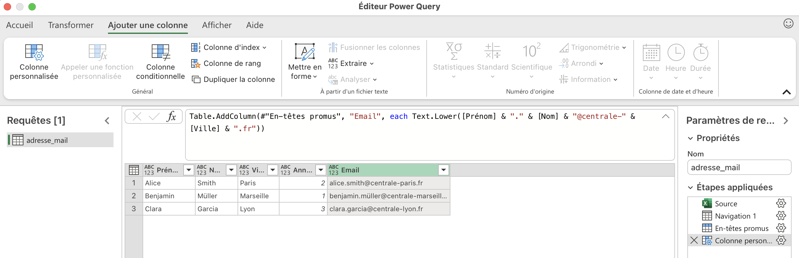
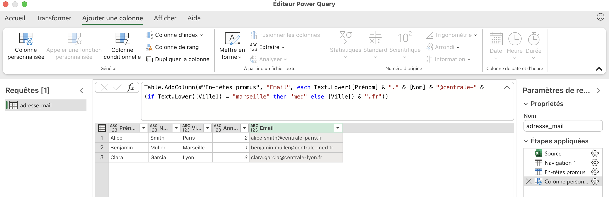
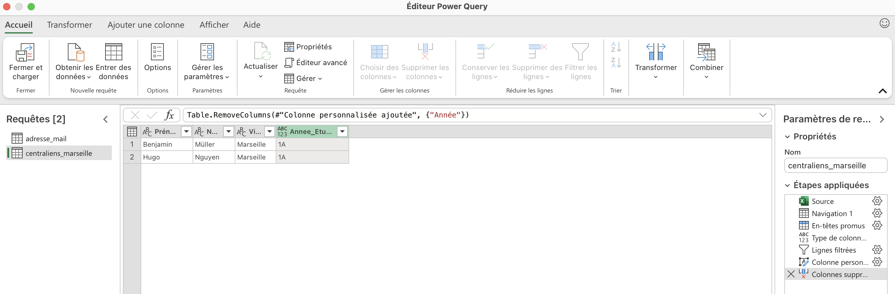



Aucun



Lien vers le [`MON 3.1`](https://do-it.aioli.ec-m.fr/promos/2023-2024/Khaoula-Belaaziz/mon/temps-3.1/) de Khaoula BELAAZIZ intitulé "Replonger dans le monde d'Excel.
Lien vers le [`MON 1.1`](https://do-it.aioli.ec-m.fr/promos/2024-2025/Charles-Cook/mon/temps-1.1/) de Charles Cook sur la découverte de VBA.




[[toc]]


Revoir les bases d'Excel et maîtriser ses usages classiques. Partir à la découverte de Power Query et relier son usage à l'utilisation de VBA.

## Contenu

### Excel

J’ai commencé par revoir les bases d’Excel pour une utilisation classique, ce qui m’a permis de découvrir plusieurs astuces et fonctionnalités dont j’ignorais l’existence, mais que je vais désormais apprécier utiliser.

Pour cela, je me suis appuyé sur les recommandations de Khaoula, qui suggérait dans son MON cette série de vidéos abordant l’essentiel de manière efficace : [`Cours complet Microsoft EXCEL`](https://www.youtube.com/playlist?list=PL8sQnj6qF1Lv6ejdklq25MGfPJFxThMw6). J’ai regardé l’intégralité de ces vidéos et les ai trouvées particulièrement utiles.

Les points suivants sont abordés :

- Les POURCENTAGES, Fcts Max/Min
- Créer un GRAPHIQUE avec EXCEL et l'améliorer
- TRIER et FILTRER une LISTE (base de données)
- Utiliser la MISE EN FORME automatique CONDITIONNELLE 
- NBVAL et NB.SI
- Les MINI-GRAPHIQUES d'une case (Graphiques Sparkline)
- Utiliser la FONCTION SI Condition à 2 possibilités, à 3 possibilités ou PLUS (si imbriqués)
- Les fonctions ET et OU + utilisation avec SI 
- ALEA, ALEA.ENTRE.BORNES et TABLEAU.ALEA (Les nombres aléatoires (tirage au sort))
- Créer une LISTE DÉROULANTE
- La VALIDATION des DONNÉES (Créer un formulaire sans erreur d'encodage)
- Les fonctions RECHERCHEV et RECHERCHEH 
- Créer un TABLEAU CROISÉ DYNAMIQUE + GRAPHIQUE
- La fonction RANG (établir un classement)
- Réaliser un CLASSEMENT AUTOMATIQUE 
- Créer une CARTE GÉOGRAPHIQUE automatique (statistiques par pays, régions et villes)
- CONVERTIR des DEVISES (convertisseur de monnaie automatique)
- L'ANALYSEUR de DONNÉES (Tableaux et graphiques automatiques)

### Power Query

#### Formation
En explorant le site de Do_It, j’ai remarqué que la plupart des MON sur Excel s’orientent vers VBA après avoir revu les bases. De mon côté, j’ai préféré me pencher sur Power Query, un outil intégré à l’onglet **Données** d’Excel depuis 2016.

Pour découvrir son utilisation, j’ai d’abord regardé cette [`vidéo`](https://www.youtube.com/watch?v=zHHItICsN6k), qui présente rapidement les manipulations possibles avec Power Query. Cependant, je ne la trouve pas très convaincante et ne la recommande pas.

En revanche, j’ai beaucoup apprécié cette série de quatre vidéos, que je recommande vivement : 
[`Formation Power Query`](https://www.youtube.com/watch?v=4rCgZX9jEnA)

#### Exercice
Pour mettre en pratique ce que j’ai appris, j’ai choisi de reproduire exactement le même résultat que Charles dans son [`MON`](https://do-it.aioli.ec-m.fr/promos/2024-2025/Charles-Cook/mon/temps-1.1/), mais en utilisant Power Query plutôt que VBA.

L’implémentation des deux requêtes suivantes dans Power Query n’a pris que 10-15 minutes, contre quelques heures en VBA :

- Création des adresses mail centraliennes
- Extraction des centraliens de Marseille

<i>Formule Power Query pour générer les adresses mail centraliennes</i>

<i>Prise en compte de l'exception "centrale-med" pour Marseille dans la formule</i>

<i>Formule Power Query pour extraire les centraliens de Marseille</i>

Les requêtes s'actualisent automatiquement en temps réel dès que de nouvelles lignes de données concernant les centraliens sont ajoutées au fichier Excel initial, comme illustré dans la vidéo ci-dessous. Ainsi, les tables manipulées par Power Query se mettent à jour sans intervention manuelle.
⚠️ Important : N'oubliez pas d' "Enregistrer" le fichier Excel avant de cliquer sur "Actualiser" dans l'onglet **Données**, comme montré dans la vidéo. Sinon, l'actualisation ne fonctionnera pas. J'ai mis un certain temps à réaliser que j'avais commis cette erreur, ce qui expliquait pourquoi l'actualisation ne fonctionnait pas.

#### Bonus : Power Query remplace-t-il VBA ?

J’aurais aimé approfondir la question de savoir si Power Query peut réellement remplacer VBA. Fa faute de temps, je partage ici une requête rapide effectuée avec ChatGPT, car ce sujet m'intéresse particulièrement.



➡️ Non, Power Query ne remplace pas totalement VBA, mais il permet d'automatiser de nombreuses tâches sans écrire de code complexe.

✅ Ce que Power Query peut faire mieux que VBA
Power Query est idéal pour :
✔ Importer et transformer des données (depuis Excel, CSV, SQL, API, etc.).
✔ Nettoyer et structurer les données (suppression des doublons, fusion, division…).
✔ Automatiser les mises à jour (un simple clic sur "Actualiser" suffit).
✔ Gérer de grandes quantités de données plus efficacement que VBA.

💡 Power Query = No Code : Il utilise une interface graphique et génère du code M (langage de requête) en arrière-plan, ce qui facilite son utilisation sans être développeur.

❌ Ce que VBA fait mieux que Power Query
VBA est plus puissant pour :
🔹 Interagir avec d’autres applications Office (Outlook, Word, PowerPoint…).
🔹 Créer des formulaires et interfaces utilisateur dynamiques.
🔹 Automatiser des tâches non liées aux données (impression, envoi d’e-mails…).
🔹 Gérer des boucles et des actions conditionnelles complexes.

🚀 Faut-il passer de VBA à Power Query ?
👉 Si tu fais surtout du traitement de données, Power Query est plus rapide, plus stable et plus simple que VBA.
👉 Si tu dois automatiser des actions avancées (ex : envoi d’e-mails, macros interactives), VBA reste indispensable.

💡 Meilleure approche ?
✅ Utiliser Power Query pour la gestion des données + VBA pour l'automatisation avancée ! 🎯


