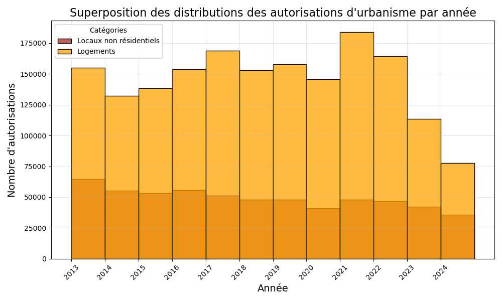
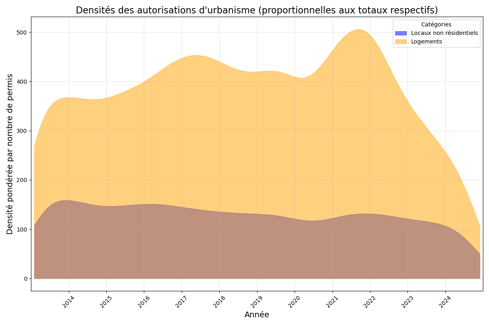
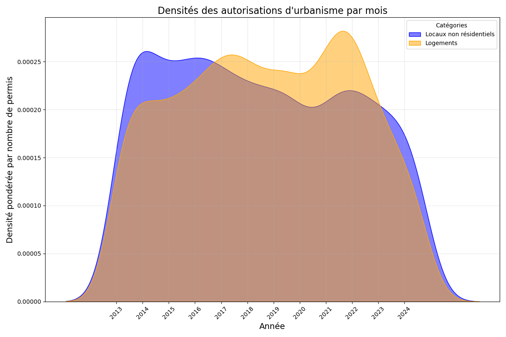
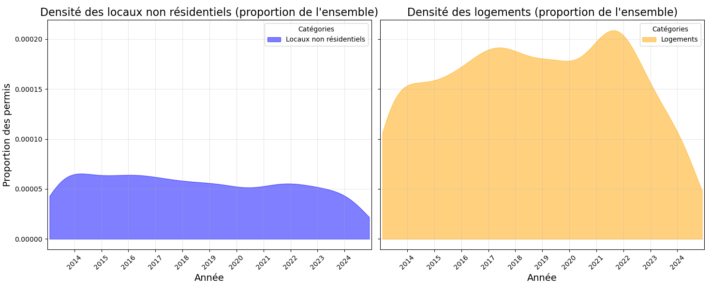
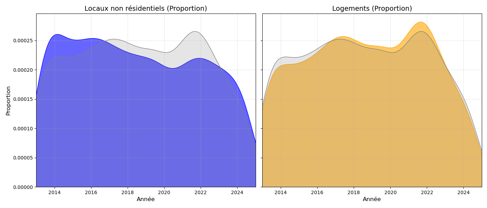



[`MON 2.2 : Datavisualisation et Sémiologie`](https://do-it.aioli.ec-m.fr/promos/2024-2025/Isee-Maroni/mon/temps-2.2/)




- **OpenData gouvernementales sur les permis de construire en France** \
*Catalogue Dido | Données et études statistiques.* https://www.statistiques.developpement-durable.gouv.fr/catalogue?page=dataset&datasetId=6513f0189d7d312c80ec5b5b.

- Wilke, Claus. *Fundamentals of Data Visualization: A Primer on Making Informative and Compelling Figures.* First edition, O’Reilly, 2019. [`version en ligne`](https://clauswilke.com/dataviz/)

- [`Github du projet`](https://github.com/iseemaroni/POK2_analyse_donnees.git)



Quelques phrases sur le contenu de ce POK:

Partir en exploration de la problématique suivante pour faire de l'analyse de données : « Est-ce que la vente de casques et baudriers est corrélée au nombre de permis de construire délivrés chaque année ? ».

Ne pas oublier de prendre en compte les éléments de datavisualisation appris lors du [`MON 2.2 : Datavisualisation et Sémiologie`](https://do-it.aioli.ec-m.fr/promos/2024-2025/Isee-Maroni/mon/temps-2.2/) concernant la visualisation de distributions de données ([`Fundamentals of Data Visualization`](https://clauswilke.com/dataviz/)).


En analyse de données, ne jamais modifier les données initiales !



[[toc]]


# Contenu

Le contenu du POK.

## Premier Sprint

J'ai trouvé des données sur les permis de construire en explorant les sites gouvernementaux d'OpenData. Elles se composent de deux jeux : l'un concernant des *autorisations d'urbanisme créant des locaux non résidentiels* et l'autre concernant les *autorisations d'urbanisme créant des logements*.


- [`Liste des autorisations d'urbanisme créant des locaux non résidentiels`](https://www.statistiques.developpement-durable.gouv.fr/catalogue?page=datafile&datafileRid=f8f0700f-806c-40a7-83b1-f21cf507e7c4)
- [`Liste des autorisations d'urbanisme créant des logements`](https://www.statistiques.developpement-durable.gouv.fr/catalogue?page=datafile&datafileRid=8b35affb-55fc-4c1f-915b-7750f974446a)



### Etape 1 

Ma première étape a été d'analyser l'évolution temporelle de ces deux types de permis de construire.

### Etape 2

Étant donné leurs différences d'échelle, j'ai ensuite cherché à comparer ces deux ensembles de données. Voici une première visualisation de cette comparaison :

Pour m'assurer que les bonnes informations étaient tracées, j'ai affiché quelques chiffres clés et vérifié leur correspondance.



’’’

Occurrences pour les locaux non résidentiels :
2013 : 64609 occurrences
2014 : 55096 occurrences
2015 : 53449 occurrences
2016 : 55520 occurrences
2017 : 51041 occurrences
2018 : 48106 occurrences
2019 : 47901 occurrences
2020 : 41141 occurrences
2021 : 48040 occurrences
2022 : 46876 occurrences
2023 : 42251 occurrences
2024 : 35574 occurrences

Occurrences pour les logements :
2013 : 155011 occurrences
2014 : 132322 occurrences
2015 : 138136 occurrences
2016 : 153550 occurrences
2017 : 168661 occurrences
2018 : 153035 occurrences
2019 : 157621 occurrences
2020 : 145437 occurrences
2021 : 183865 occurrences
2022 : 164308 occurrences
2023 : 113448 occurrences
2024 : 77716 occurrences

Total permis Locaux non résidentiels: 589604
Total permis Logements: 1743110

’’’



Un premier problème avec cette représentation visuelle est qu'il n'est pas toujours évident de déterminer où commencent exactement les barres : au point où la couleur change ou bien à zéro ? Ici, toutes les barres débutent à zéro, et l'utilisation de la transparence permet de mieux le voir.

### Etape 3 

En suivant les instructions de ce livre, toujours le même, et plus particulièrement celles de [`Fundamentals of Data Visualization - Visualizing distributions`](https://clauswilke.com/dataviz/histograms-density-plots.html#multiple-histograms-densities)

Voici donc mon approche suivante pour visualiser ces deux distributions :

J'ai eu beaucoup de mal à ajuster mon code pour que les aires sous les courbes de densité soient proportionnelles au nombre total de permis de construire, tant pour les locaux non résidentiels (Total permis : 589 604) que pour les logements (Total permis : 1 743 110).



*Explication*:
Si l'aire sous la courbe reste identique malgré la tentative de pondération, cela est dû au fonctionnement interne de Seaborn qui normalise automatiquement les densités. Pour contourner ce problème, il est nécessaire de manuellement ajuster la densité pour refléter les totaux des permis, en multipliant les densités obtenues par le total correspondant à chaque catégorie.

*Solution trouvée* :
1. Densités non normalisées :
La densité pour chaque catégorie est multipliée par le total correspondant (via kde1(x_ordinal) * total_permis1 et kde2(x_ordinal) * total_permis2).

2. Utilisation de gaussian_kde :
Cela permet un contrôle total sur la pondération et le calcul des densités, évitant la normalisation automatique de Seaborn.

def superpositionDensities():

’’’
    # Tracer les densités pondérées
    plt.figure(figsize=(12, 8))

    sns.kdeplot(
        data=permis_data1, 
        x='MOIS', 
        weights='Nombre de Permis', 
        label="Locaux non résidentiels", 
        fill=True, 
        alpha=0.5, 
        color="blue", 
        bw_adjust=0.5
    )
    sns.kdeplot(
        data=permis_data2, 
        x='MOIS', 
        weights='Nombre de Permis', 
        label="Logements", 
        fill=True, 
        alpha=0.5, 
        color="orange", 
        bw_adjust=0.5
    )
    
    # Ajuster les axes
    plt.title("Densités des autorisations d'urbanisme par mois", fontsize=16)
    plt.xlabel("Année", fontsize=14)
    plt.ylabel("Densité pondérée par nombre de permis", fontsize=14)
’’’

def superpositionDensities2():
’’’
    # Calculer les densités
    from scipy.stats import gaussian_kde
    kde1 = gaussian_kde(data1['MOIS'].map(pd.Timestamp.toordinal), bw_method=0.15)
    kde2 = gaussian_kde(data2['MOIS'].map(pd.Timestamp.toordinal), bw_method=0.15)
    
    # Calculer les densités ajustées
    density1 = kde1(x_ordinal) * total_permis1
    density2 = kde2(x_ordinal) * total_permis2

    print("Densité ajustée pour Locaux non résidentiels :", density1[:5])
    print("Densité ajustée pour Logements :", density2[:5])

    # Tracer les courbes
    plt.figure(figsize=(12, 8))

    plt.fill_between(x_range, density1, alpha=0.5, label="Locaux non résidentiels", color="blue",)
    plt.fill_between(x_range, density2, alpha=0.5, label="Logements", color="orange")

’’’



J'avais donc pendant longtemps des graphes qui ressemblaient à ça, mais cela ne transmettait pas le message visuel que je souhaitais. Cela donnait l'impression que les densités étaient similaires, alors que le nombre total de permis de construire pour les logements est plus du double de celui des locaux non résidentiels.

</figure>

  <figcaption>Densité des permis de construire</figcaption>
</figure>

<figure>
  
  <figcaption>Figure 1 : Densité des permis de construire essai src</figcaption>
</figure>

### Etape 4

Cependant, dans la version de l'étape 3, en raison de la distribution actuelle, on ne visualise pas correctement les couleurs d'une part, et d'autre part, il est difficile de voir quelle proportion du total des permis de construire chaque catégorie (locaux non résidentiels et logements) représente.

Voici une première version qui montre les densités respectives de manière plus distincte.

À l'heure actuelle, j'ai une deuxième version où les zones grises montrent la distribution globale des permis de construire. Cependant, cette version ne correspond pas à ce que je souhaite obtenir, car la zone grise ne représente pas la somme des deux densités (locaux non résidentiels et logements). De plus, les aires colorées ne sont plus proportionnelles au nombre total respectif de permis pour les locaux non résidentiels et les logements, contrairement à ce que j'avais réussi à obtenir dans la version précédente.

### Etude post-mortem

Ce que je retrouve dans les étapes 3 et 4, c'est que malgré une interprétation visuelle plus facile du contenu, il reste difficile de retrouver le chiffre exact de permis de construire pour les logements délivrés en 2020, par exemple, sans sortir une calculatrice et faire les calculs à la main.

*Pour la suite* : 
Je vais continuer l'étape 4 afin d’obtenir enfin une version avec les zones grises représentant la distribution globale des permis de construire.

## Second Sprint

# Tâches

### Sprints

"Est-ce que la vente de casques et baudriers est corrélée au nombre de permis de construire délivrés chaque année ?"

#### Sprint 1

Liste des taches que l'on pense faire. On coche si la tache est réalisée. A la fin du sprint on fait une petite étude post-mortem pour voir ce qui s'est passé et les ajustement à faire pour le prochain sprint, pok.

- [ ] Une tâche non réalisée
- [x] Une tâche réalisée

#### Sprint 2

- [ ] Une tâche non réalisée
- [x] Une tâche réalisée

Liste des taches que l'on pense faire. On coche si la tache est réalisée. A la fin du sprint on fait une petite étude post-mortem pour voir ce qui s'est passé et les ajustement à faire pour le prochain sprint, pok.

### Horodatage

Toutes les séances et le nombre d'heure que l'on y a passé.

| Date | Heures passées | Indications |
| -------- | -------- |-------- |
| Mardi 27/08  | 1H  | Travail sur la trame du site |
