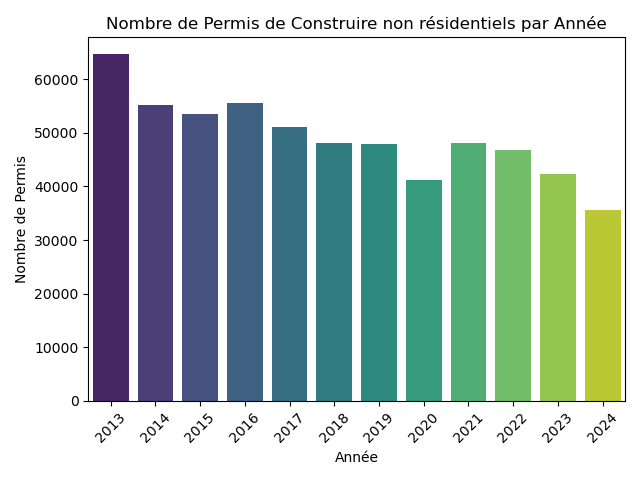
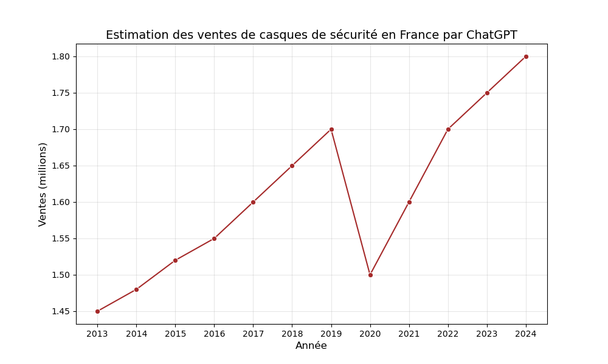
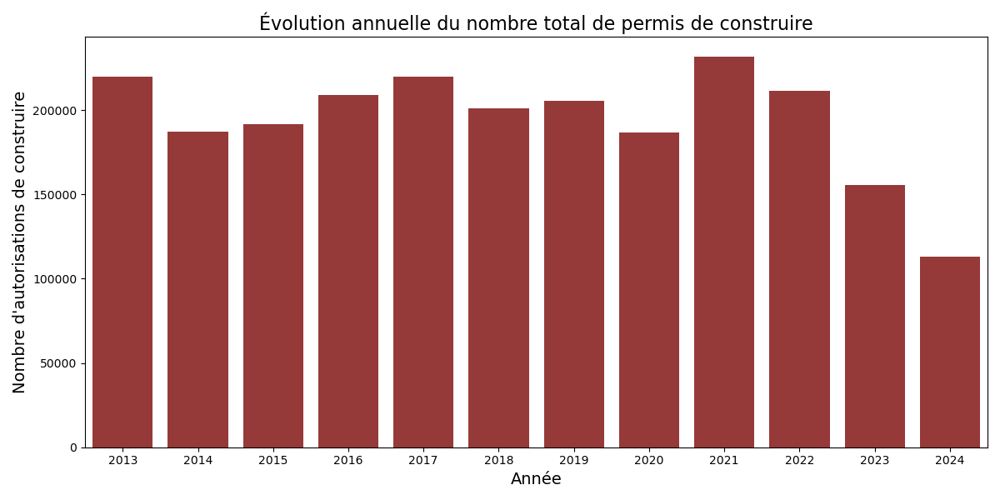
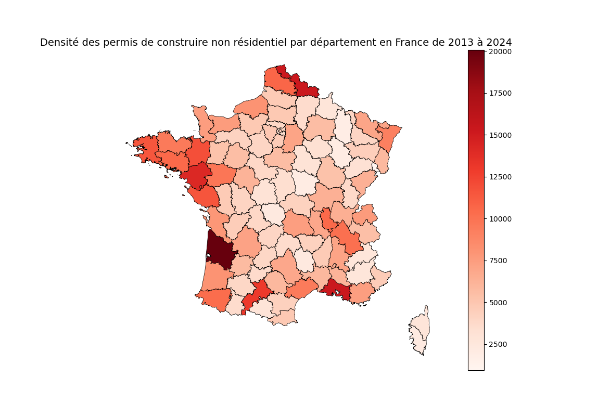
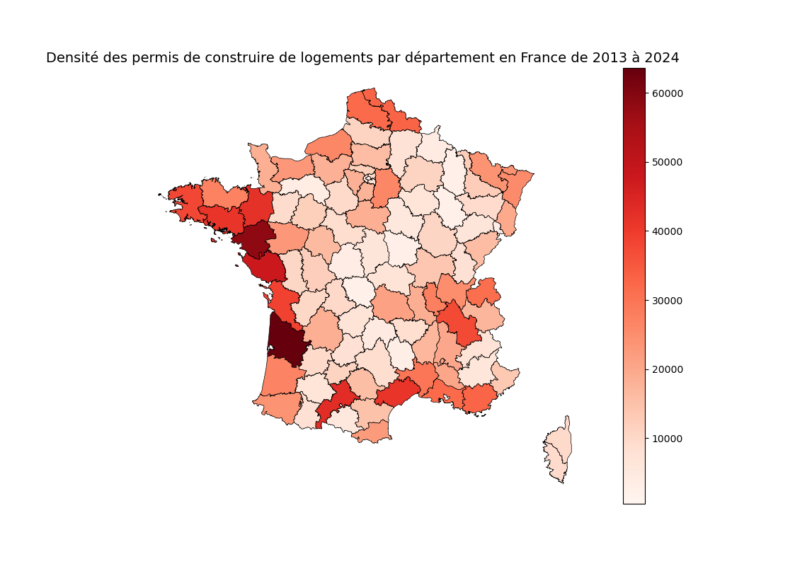



[`MON 2.2 : Datavisualisation et Sémiologie`](https://do-it.aioli.ec-m.fr/promos/2024-2025/Isee-Maroni/mon/temps-2.2/)




- **OpenData gouvernementales sur les permis de construire en France** \
*Catalogue Dido | Données et études statistiques.* https://www.statistiques.developpement-durable.gouv.fr/catalogue?page=dataset&datasetId=6513f0189d7d312c80ec5b5b.

- Wilke, Claus. *Fundamentals of Data Visualization: A Primer on Making Informative and Compelling Figures.* First edition, O’Reilly, 2019. [`version en ligne`](https://clauswilke.com/dataviz/)

- [`Github du projet`](https://github.com/iseemaroni/POK2_analyse_donnees.git)




Quelques phrases sur le contenu de ce POK:


Partir en exploration de la problématique suivante pour faire de l'analyse de données : « **Est-ce que la vente de casques et baudriers est corrélée au nombre de permis de construire délivrés chaque année ?** ».

Ne pas oublier de prendre en compte les éléments de datavisualisation appris lors du [`MON 2.2 : Datavisualisation et Sémiologie`](https://do-it.aioli.ec-m.fr/promos/2024-2025/Isee-Maroni/mon/temps-2.2/) concernant la visualisation de distributions de données ([`Fundamentals of Data Visualization`](https://clauswilke.com/dataviz/)).


En analyse de données, ne jamais modifier les données initiales !



[[toc]]


# Contenu

## Premier Sprint

J'ai trouvé des données sur les permis de construire en explorant les sites gouvernementaux d'OpenData. Elles se composent de deux jeux : l'un concernant des *autorisations d'urbanisme créant des locaux non résidentiels* et l'autre concernant les *autorisations d'urbanisme créant des logements*.



- [`Liste des autorisations d'urbanisme créant des locaux non résidentiels`](https://www.statistiques.developpement-durable.gouv.fr/catalogue?page=datafile&datafileRid=f8f0700f-806c-40a7-83b1-f21cf507e7c4)
- [`Liste des autorisations d'urbanisme créant des logements`](https://www.statistiques.developpement-durable.gouv.fr/catalogue?page=datafile&datafileRid=8b35affb-55fc-4c1f-915b-7750f974446a)




### Etape 1 

Ma première étape a été d'analyser l'évolution temporelle de ces deux types de permis de construire.

<div style="display:flex">
<div></div>
<div></div>
</div>

### Etape 2


Étant donné leurs différences d'échelle, j'ai ensuite cherché à comparer ces deux ensembles de données. Voici une première visualisation de cette comparaison :


Pour m'assurer que les bonnes informations étaient tracées, j'ai affiché quelques chiffres clés et vérifié leur correspondance.



``````

Occurrences pour les locaux non résidentiels :
2013 : 64609 occurrences
2014 : 55096 occurrences
2015 : 53449 occurrences
2016 : 55520 occurrences
2017 : 51041 occurrences
2018 : 48106 occurrences
2019 : 47901 occurrences
2020 : 41141 occurrences
2021 : 48040 occurrences
2022 : 46876 occurrences
2023 : 42251 occurrences
2024 : 35574 occurrences

Occurrences pour les logements :
2013 : 155011 occurrences
2014 : 132322 occurrences
2015 : 138136 occurrences
2016 : 153550 occurrences
2017 : 168661 occurrences
2018 : 153035 occurrences
2019 : 157621 occurrences
2020 : 145437 occurrences
2021 : 183865 occurrences
2022 : 164308 occurrences
2023 : 113448 occurrences
2024 : 77716 occurrences

Total permis Locaux non résidentiels: 589604
Total permis Logements: 1743110

``````



Un premier problème avec cette représentation visuelle est qu'il n'est pas toujours évident de déterminer où commencent exactement les barres : au point où la couleur change ou bien à zéro ? Ici, toutes les barres débutent à zéro, et l'utilisation de la transparence permet de mieux le voir.

### Etape 3 

En suivant les instructions de ce livre, toujours le même, et plus particulièrement celles de [`Fundamentals of Data Visualization - Visualizing distributions`](https://clauswilke.com/dataviz/histograms-density-plots.html#multiple-histograms-densities)


Voici donc mon approche suivante pour visualiser ces deux distributions :

<figure>
  
  <figcaption style="text-align: center;">Figure : Superposition des densités version 2</figcaption>
</figure>

J'ai eu beaucoup de mal à ajuster mon code pour que les aires sous les courbes de densité soient proportionnelles au nombre total de permis de construire, tant pour les locaux non résidentiels (Total permis : 589 604) que pour les logements (Total permis : 1 743 110).



*Explication*:
Si l'aire sous la courbe reste identique malgré la tentative de pondération, cela est dû au fonctionnement interne de Seaborn qui normalise automatiquement les densités. Pour contourner ce problème, il est nécessaire de manuellement ajuster la densité pour refléter les totaux des permis, en multipliant les densités obtenues par le total correspondant à chaque catégorie.

*Solution trouvée* :
1. Densités non normalisées :
La densité pour chaque catégorie est multipliée par le total correspondant (via kde1(x_ordinal) * total_permis1 et kde2(x_ordinal) * total_permis2).

2. Utilisation de gaussian_kde :
Cela permet un contrôle total sur la pondération et le calcul des densités, évitant la normalisation automatique de Seaborn.

``````
def superpositionDensities():

    # Tracer les densités pondérées
    plt.figure(figsize=(12, 8))

    sns.kdeplot(
        data=permis_data1, 
        x='MOIS', 
        weights='Nombre de Permis', 
        label="Locaux non résidentiels", 
        fill=True, 
        alpha=0.5, 
        color="blue", 
        bw_adjust=0.5
    )
    sns.kdeplot(
        data=permis_data2, 
        x='MOIS', 
        weights='Nombre de Permis', 
        label="Logements", 
        fill=True, 
        alpha=0.5, 
        color="orange", 
        bw_adjust=0.5
    )
    
    # Ajuster les axes
    plt.title("Densités des autorisations d'urbanisme par mois", fontsize=16)
    plt.xlabel("Année", fontsize=14)
    plt.ylabel("Densité pondérée par nombre de permis", fontsize=14)
``````

`````` 
def superpositionDensities2():
   # Calculer les densités
    from scipy.stats import gaussian_kde
    kde1 = gaussian_kde(data1['MOIS'].map(pd.Timestamp.toordinal), bw_method=0.15)
    kde2 = gaussian_kde(data2['MOIS'].map(pd.Timestamp.toordinal), bw_method=0.15)
    
    # Calculer les densités ajustées
    density1 = kde1(x_ordinal) * total_permis1
    density2 = kde2(x_ordinal) * total_permis2

    print("Densité ajustée pour Locaux non résidentiels :", density1[:5])
    print("Densité ajustée pour Logements :", density2[:5])

    # Tracer les courbes
    plt.figure(figsize=(12, 8))

    plt.fill_between(x_range, density1, alpha=0.5, label="Locaux non résidentiels", color="blue",)
    plt.fill_between(x_range, density2, alpha=0.5, label="Logements", color="orange")

``````




J'avais donc pendant longtemps des graphes qui ressemblaient à ça, mais cela ne transmettait pas le message visuel que je souhaitais. Cela donnait l'impression que les densités étaient similaires, alors que le nombre total de permis de construire pour les logements est plus du double de celui des locaux non résidentiels.

<figure>
  
  <figcaption style="text-align: center;">Figure : Superposition des densités version 1</figcaption>
</figure>

### Etape 4

Cependant, dans la version de l'étape 3, en raison de la distribution actuelle, on ne visualise pas correctement les couleurs d'une part, et d'autre part, il est difficile de voir quelle proportion du total des permis de construire chaque catégorie (locaux non résidentiels et logements) représente.

Voici une première version qui montre les densités respectives de manière plus distincte.


À l'heure actuelle, j'ai une deuxième version où les zones grises montrent la distribution globale des permis de construire. Cependant, cette version ne correspond pas à ce que je souhaite obtenir, car la zone grise ne représente pas la somme des deux densités (locaux non résidentiels et logements). De plus, les aires colorées ne sont plus proportionnelles au nombre total respectif de permis pour les locaux non résidentiels et les logements, contrairement à ce que j'avais réussi à obtenir dans la version précédente.


### Etude post-mortem

Ce que je retrouve dans les étapes 3 et 4, c'est que malgré une interprétation visuelle plus facile du contenu, il reste difficile de retrouver le chiffre exact de permis de construire pour les logements délivrés en 2020, par exemple, sans sortir une calculatrice et faire les calculs à la main.

*Pour la suite* : 
Je vais continuer l'étape 4 afin d’obtenir enfin une version avec les zones grises représentant la distribution globale des permis de construire.

## Second Sprint

Pour débuter ce second sprint je me suis retrouvée face à une complication. L'entreprise auprès de laquelle je comptais récupérer les résultats d'une tendance des ventes de casques et de baudriers ou au moins uen tendance car j'avais bien conscience que les données réelles de ventes sont confidentielles a finalement refusé de me les transmettre.

### Données fictives pour la vente de casques

Voulant quand même avancer ce projet, j'ai choisi de le continuer avec des données fictives. Et pour cela de demander à ChatGPT de les générer avec les tendances qu'ils pouvaient trouver en ligne ainsi que des évènements étant susceptible d'avoir impacté ces ventes. Voici ci-dessous ma requête et les résultats obtenus.




#### Based on what you know, can you provide an estimated number of hard hats and harnesses sold each year in France since 2013?


Estimating the annual sales of hard hats and safety harnesses in France since 2013 involves piecing together available data, as specific yearly figures are not comprehensively documented in public sources. Here's an estimation based on the information at hand:

**Hard Hats (Casques de Sécurité):**

- **Annual Sales Estimate**: Approximately 1.5 million units are sold annually in France.
*Source*: A 2011 report indicated that the French market for head protection was valued at €22.2 million, with construction helmets accounting for about one-third (€6.7 million). This corresponded to nearly 1.5 million units sold annually, with an increasing trend in recent years. 
[`BASELO PRESSE`](https://www.baselopresse.fr/batidistribution/produits/protection-de-la-tete/les-casques-de-securite-1333/pdf?utm_source=chatgpt.com)

- **Market Growth**: The market for Personal Protective Equipment (PPE) in France has experienced steady growth over the past decade, surpassing €1.5 billion in 2023. This growth is driven by stricter regulations, innovation, and heightened attention to workplace safety and well-being. 
[`MADEINFR.FR`](https://madeinfr.fr/etudes-de-marche/industrie/le-marche-des-equipements-de-protection-individuelle-epi-en-france/?utm_source=chatgpt.com)

**Safety Harnesses (Harnais de Sécurité):**

- **Market Size**: The global market for safety harnesses was valued at $1.41 billion in 2024 and is projected to reach $2.1 billion by 2032, with a Compound Annual Growth Rate (CAGR) of approximately 5.1% during the forecast period. 
[`BUSINESS RESEARCH INSIGHTS`](https://www.businessresearchinsights.com/fr/market-reports/safety-harnesses-market-107128?utm_source=chatgpt.com)

- **French Market Trends**: The safety harness market in France has been evolving, reflecting growing concerns about workplace safety and technological innovation. There has been a significant increase in demand for PPE, particularly in sectors like construction, industry, and emergency services. 
[`P MARKET RESEARCH`] (https://pmarketresearch.com/fr/rapports/rapport-detude-de-marche-mondial-et-francais-sur-les-harnais-de-protection-antichute/?utm_source=chatgpt.com)

**Estimation Approach:**

- **Hard Hats**: Assuming the annual sales of approximately 1.5 million units reported in 2011 have remained stable or grown slightly, it's reasonable to estimate that current annual sales are in the range of 1.5 to 1.8 million units, considering the overall growth in the PPE market.

- **Safety Harnesses**: Specific annual sales figures for France are not readily available. However, given the global market's growth trajectory and the increased emphasis on safety in industries like construction, it's plausible that the French market has experienced similar growth. If France's market aligns proportionally with global trends, and considering the country's industrial activities, an estimated annual sales figure could range between 100,000 to 200,000 units. This is a rough estimate and should be interpreted with caution.

**Conclusion:**

While precise annual sales data for hard hats and safety harnesses in France since 2013 is limited, available information suggests:

- **Hard Hats**: Approximately 1.5 to 1.8 million units sold annually.

- **Safety Harnesses**: An estimated 100,000 to 200,000 units sold annually, based on global market trends and industry demands.

For more accurate and detailed statistics, consulting industry-specific market research reports or trade associations specializing in PPE would be advisable.


#### Can you be more specific and provide the number of hard hats sold each year based on past trends and events during each year? I would like to have data for each year from 2013 to 2024

To estimate the number of **hard hats** sold in France annually from **2013 to 2024**, we will consider:

- **Market data trends**

1.5 million units were sold annually around 2011.
The PPE market has grown steadily, driven by increased safety regulations, industrial activity, and innovation.
Growth in construction and industrial sectors directly impacts sales.

- **Events impacting demand**

2015-2017: Economic recovery post-2008 crisis → more construction activity.
2020: COVID-19 pandemic → temporary slowdowns in construction but later recovery.
2021-2024: Strong focus on infrastructure & safety improvements → demand increase.


**Graph Interpretation**
A gradual increase from 1.45M (2013) to 1.8M (2024).
A dip in 2020 due to COVID-19, followed by recovery in 2021-2024.
Growth mainly driven by regulations, industrial demand, and construction projects.

#### Sources citées par Chat GPT

- https://www.baselopresse.fr/batidistribution/produits/protection-de-la-tete/les-casques-de-securite-1333/pdf?utm_source=chatgpt.com

- « le marché des Équipements de Protection Individuelle (EPI) en France ». Made in FR, https://madeinfr.fr/etudes-de-marche/industrie/le-marche-des-equipements-de-protection-individuelle-epi-en-france/. Consulté le 2 mars 2025.

- https://www.businessresearchinsights.com/fr/market-reports/safety-harnesses-market-107128?utm_source=chatgpt.com

- « Rapport d’étude de marché mondial et français sur les harnais de protection antichute ». Étude de Segments de Marché, https://pmarketresearch.com/fr/rapports/rapport-detude-de-marche-mondial-et-francais-sur-les-harnais-de-protection-antichute/. Consulté le 2 mars 2025.







### Corrélation & Régression linéaire

J’ai choisi d’analyser la corrélation entre le nombre de permis de construire et les ventes de casques, sans distinguer les permis destinés aux logements de ceux concernant des locaux non résidentiels.

Pour cela, j’ai additionné les données des deux bases afin d’obtenir le total des permis de construire délivrés chaque année.



Ensuite, j’ai représenté la relation entre les ventes de casques et le nombre de permis de construire afin d’évaluer leur corrélation. J’ai également superposé la droite de régression linéaire au nuage de points pour mieux visualiser la tendance.


Malheureusement, l’analyse s’est révélée décevante : aucune corrélation n’émerge entre ces données, du moins avec celles que j’ai pu exploiter. Cela se voit rapidement par une droite de régression linéaire quasiment horizontale et un coefficient de détermination R² proche de zéro.


💡 Pour quelques rappels et un approfondissement sur la corrélation et les régressions linéaires en analyse de données, ce [`cours`](https://github.com/FrancoisBrucker/cours_informatique/blob/main/docs/src/cours/analyse-donn%C3%A9es/notebooks-analyse/2_2_1_cours_r%C3%A9gression_et_corr%C3%A9lation.ipynb) offre une explication très complète.

### Exploration de de visualisation de données

Maintenant que j'avais commencé à explorer cette table, j’ai voulu tester différentes représentations visuelles avec les bibliothèques de pandas.

J’ai d’abord réalisé une carte de chaleur, qui permet d’identifier rapidement les années où le plus grand nombre de permis de construire ont été délivrés, ainsi que celles où ils ont été moins nombreux.


Ensuite, j’ai opté pour une répartition des permis de construire entre les différents départements, en cumulant les données de 2013 à 2024. Les différences entre les permis de construire pour les logements et ceux pour les bâtiments non résidentiels sont particulièrement intéressantes, notamment en fonction des départements : les zones les plus sollicitées ne sont pas les mêmes selon la catégorie de permis.


<div style="text-align: center;">
<div></div>
<div></div>
<i>Densité des permis de construire par département en France de 2013 à 2024</i>
</div>

### Etude post mortem

L’objectif de ce POK était avant tout de manipuler des jeux de données, d’effectuer des analyses et des visualisations, tout en réalisant de nombreux tests. Ainsi, même si la conclusion n’apporte ni réponse concrète ni réelle plus-value, l’objectif principal a été pleinement atteint.


# Tâches

### Sprints

#### Sprint 1

Liste des taches que l'on pense faire. On coche si la tache est réalisée. A la fin du sprint on fait une petite étude post-mortem pour voir ce qui s'est passé et les ajustement à faire pour le prochain sprint, pok.

- [x] Recherche d'open data sur les permis de construire en France 
- [x] Manipulation des bases de données
- [x] Amélioration des visualisations avec mon MON 2.2 et le livre Fundamentals of Data Visualization
- [x] Jeux sur les Histogrammes et Density plots pour voir ce qui est possible

#### Sprint 2

- [ ] Obtenir les données de ventes de casque de l'entreprise
- [ ] Nettoyage et tri des données
- [x] Recherche d'une corrélation 
- [x] Analyse de la régression linéaire et interprétation
- [ ] Expliquer le phénomène physiquement

Liste des taches que l'on pense faire. On coche si la tache est réalisée. A la fin du sprint on fait une petite étude post-mortem pour voir ce qui s'est passé et les ajustement à faire pour le prochain sprint, pok.

### Horodatage

Toutes les séances et le nombre d'heure que l'on y a passé.

| Date | Heures passées | Indications |
| -------- | -------- |-------- |
| Mercredi 22/01/25  | 30min | Relecture cours Analyse de données |
| Jeudi 23/01/25  | 3H | Recherche du jeu de donnnées et début du traitement |
| Dimanche 26/01/25  | 1H20 | Amélioration histogramme superposition des distributions |
| Mardi 28/01/25  | 1H | Overlapping density plots |
| Mardi 28/01/25  | 45min | Separate density plots with transparent gray shape at the back |
| Mardi 28/01/25  | 45min | Rédaction |
| Mercredi 29/01/25  | 2H | Rédaction |

| Dimanche 02/03/25  | 2H30| Données fictives chatGPT et analyse |
| Dimanche 09/03/25  | 2H30 | Corrélation & Régression |
| Dimanche 09/03/25  | 1H | Rédaction |
| Dimanche 09/03/25  | 2H | Autres visualisations |
| Lundi 10/03/25  | 1H | Rédaction et Github |