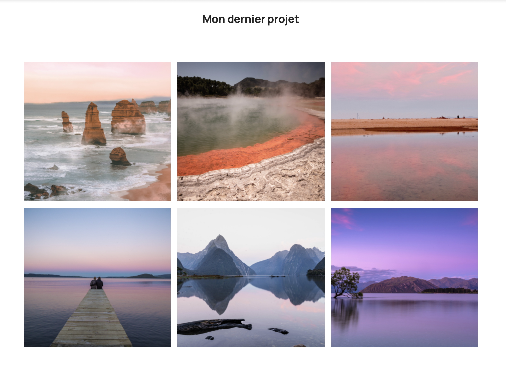
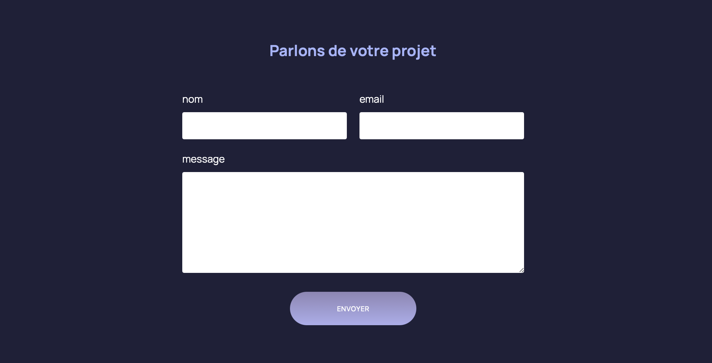



Aucun



## Contexte

Dans le cadre du projet 3A, il a fallu coder un site web. Ce dernier MON est l'occasion de comprendre et d'apprendre à utiliser les bases du HTML et du CSS. Le but est d'arriver à coder une page web, en réalisant sa structure, en adaptant les éléments, et en jouant sur les images et les zones de texte.

Il existe de nombreux MON sur le sujet. Après les avoir survolés, j'ai décidé de suivre l'un des cours déjà suivis par certains, qui m'a paru complet, notamment grâce à son exercice pratique en parallèle des leçons.

Pour introduire le sujet, j'ai commencé par regarder deux vidéos pour débutants afin de comprendre les grandes notions du langage.

## Contenu



[Apprendre HTML de zéro](https://youtu.be/68oSyuKVjeU?si=jfSQd7LniufvQS4w) et [Apprendre CSS de zéro](https://youtu.be/iSWjmVcfQGg?si=UmVjQt7SZn26VVur)



À travers ces vidéos, j'ai découvert les notions de bases du langage HTML et CSS.

**Le HTML (HyperText Markup Language)** est le langage de base qui permet de structurer le contenu d'une page web. Grâce à des éléments comme les titres, les paragraphes, les liens, les images et les listes, HTML définit la structure de la page et organise l'information de manière logique. Il utilise des balises pour marquer les différents types de contenu, et ces balises peuvent être imbriquées pour créer des hiérarchies complexes.

**Le CSS (Cascading Style Sheets)** est utilisé pour définir l'apparence et la mise en forme de cette structure. Grâce à CSS, tu peux contrôler la disposition des éléments, les couleurs, les polices, les espacements, les animations, et bien plus encore. Le CSS permet de séparer la présentation du contenu, ce qui rend ton code plus propre, plus modulaire et plus facile à maintenir.

Quelques **notions importantes** sont ressorties :

1. La structure de base d'une page HTML comporte toujours des balises comme !DOCTYPE, html, head, et body.

2. Les balises de structure de contenu souvent utilisées pour le texte et les images sont h1, p, a, ul, et img.

3. L'utilisation de classes et d’identifiants permet d'appliquer des styles spécifiques à certains éléments.

4. L’écriture de règles CSS sert à personnaliser l’apparence des éléments HTML, en utilisant des sélecteurs, des propriétés et des valeurs.

5. Le modèle de boîte CSS, qui définit la taille, les bordures, le padding et les marges des éléments permet de structurer une page.

6. Le navigateur est un logiciel qui permet de lire les langages du Web HTML et CSS. Tous les navigateurs embarquent des outils de développement, dont l'outil d'inspection qui permet d'accéder au HTML et au CSS d'une page.

7. La réactivité des éléments (responsive design), avec les médias queries permettant d’adapter les pages à différents appareils sont primordials pour le bon usage d'un site web.

HTML et CSS forment les **bases essentielles** pour construire des pages web modernes, bien structurées et esthétiquement plaisantes. Ces éléments permettent de créer un site statique simple facilement.



Pour trouver facilement et rapidement les réponses à tes questions, cette page web est un petit mémo du langage HTML, CSS et JavaScript. [MEMO](https://htmlcheatsheet.com)



Pour mettre en pratique et approfondir les outils, j'ai suivi le cours d'OpenClassrooms avec un exercice pratique permettant d'avancer étape par étape en complément des leçons, et avec des corrections pour ne jamais rester bloqué et comprendre les erreurs.



[Créez votre site web avec HTML5 et CSS3](https://openclassrooms.com/fr/courses/1603881-creez-votre-site-web-avec-html5-et-css3)



Ce cours a permis de créer un site avec plusieurs pages, de faire des liens entre les pages et vers d'autres sites web, d'agencer les éléments avec Flexbox, de créer des grilles, d'importer des images, de créer des effets au survol, de réaliser un formulaire et de jouer avec les éléments CSS.

## Conclusion

Ce MON m'a permis d'éclaircir ce sujet et d'apprendre à réaliser une page web. Assimiler le langage et s'habituer aux formules a pris du temps, mais l'exercice pratique a été très utile pour pratiquer. J'ai pu entamer le site de mon projet 3A avec les compétences nécessaires et plus de sérénité.