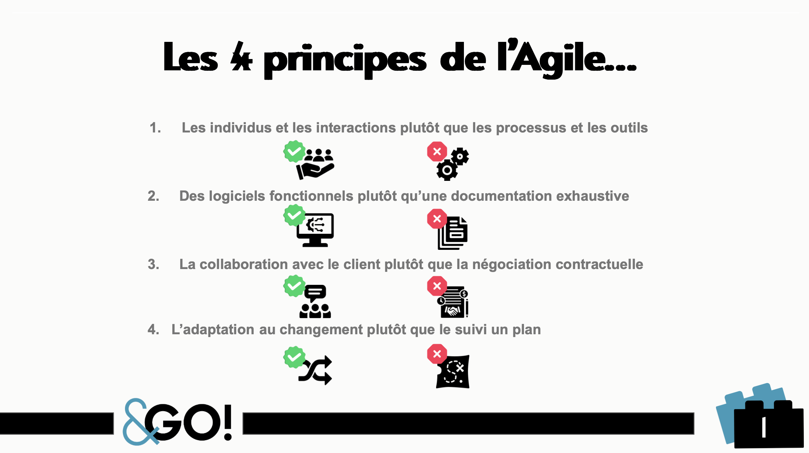
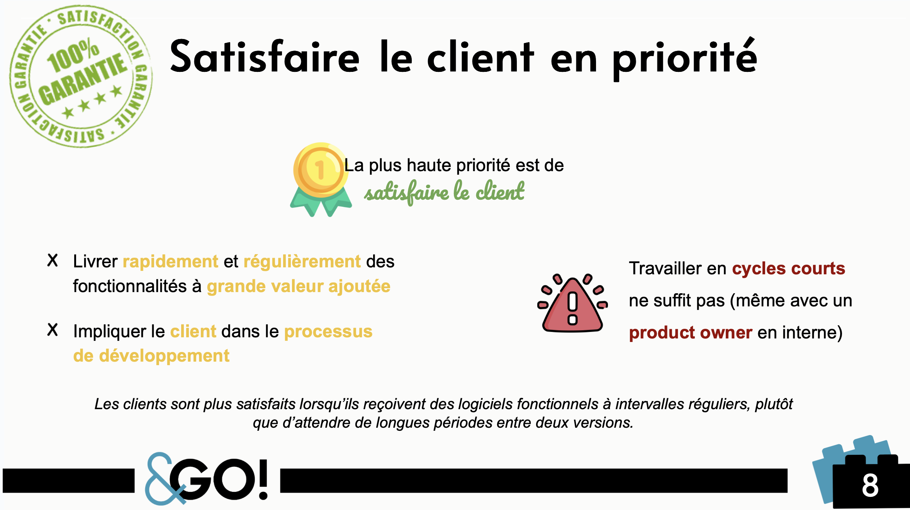
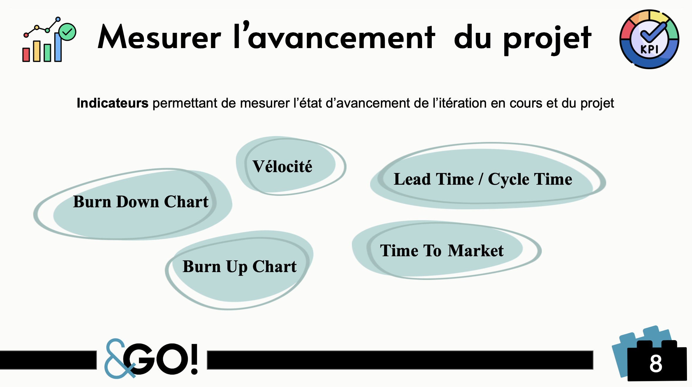
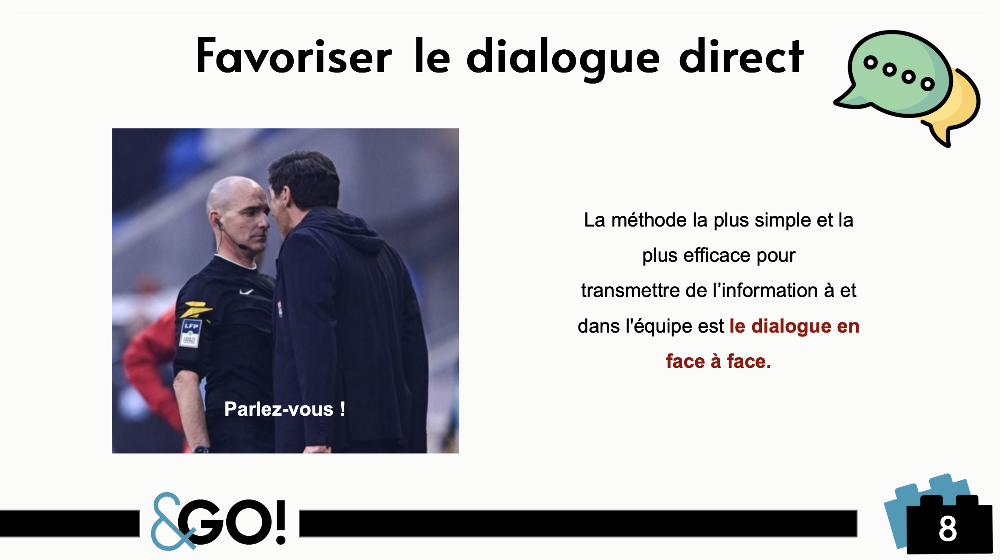
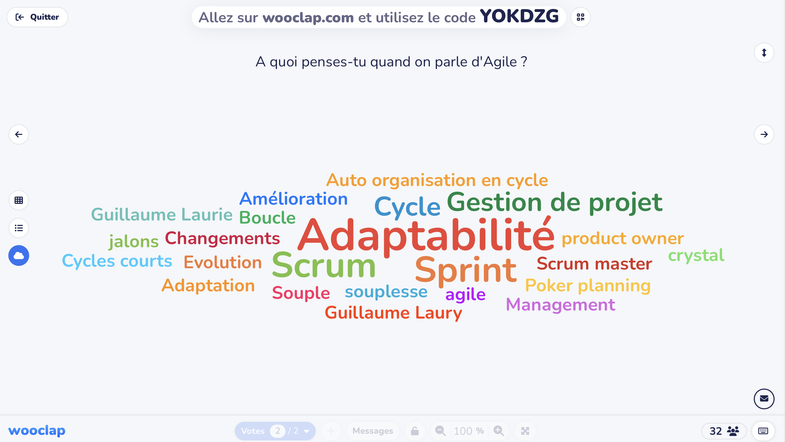



Avoir des notions sur la gestion de projet et les méthodes agiles.



## Contenu

Dans le cadre du projet de 2A, nous avons avec mon équipe projet, réalisé une formation action sur deux jours pour appliquer les principes de la gestion de projet agile en jouant avec des LEGO. Pour le besoin de Do-IT, nous avons réalisé cette formation en classe, mais il a fallu ajouter la partie théorique qui n'avait pas été faite par notre équipe. Il a fallu également l'adapter pour qu'elle ne dure qu'une journée. Ce MON m'a permis de prendre le temps de réaliser un support théorique complet, visuel et pédagogique pour venir compléter la formation et permettre à chacun d'en tirer le maximum.

Ce travail n'a pas été spécialement compliqué car mes connaissances sur l'agile sont suffisantes, mais ça a pris du temps pour trouver les bonnes informations à mettre en valeur et essayer de le rendre interactif sur les bons sujets pour essayer d'engager la classe et de le rendre moins pénible.

La formation se divise en quatre temps de jeu et chaque temps permet de revoir 3 parmi les 12 principes de l'Agile. Le cours se concentre donc sur les 4 valeurs de l'Agile et les 12 principes qui en découlent, associés à des petits quiz pour bien ancrer les notions.

<a href="./image32/CoursAGILE.pdf"
   download="Cours AgiLEGO.pdf">Voici les slides de cours !</a>

Quelques exemples de slides :

Quelques retour de cours :

## Conclusion

Ce MON a été très agréable à faire en parti parce qu'on sait que le résultat sert derrière. Il a servi de bonne préparation au cours sachant que ce n'était pas prévu. Le cours a été bien réussi, c'était une bonne expérience.