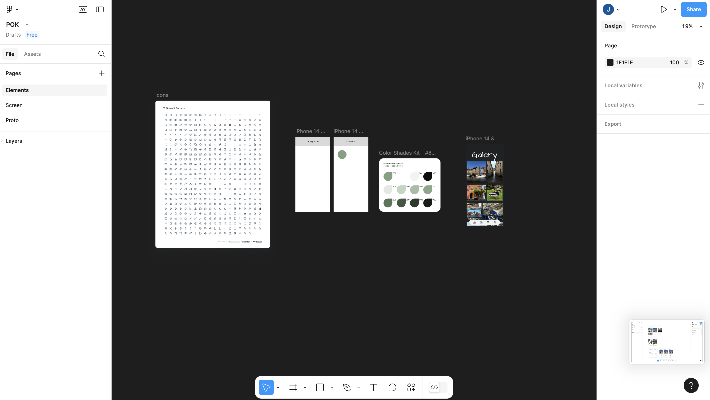



Aucun



## Objectif

Ce POK a pour but de reprendre les bases de Figma pour réaliser une maquette complète et pouvoir développer plus facilement un site web ou une application esthétique et complète par la suite.

#### Sprint 1

- [x] Revoir les bases de Figma
- [x] Etudier des fontcionnalités plus poussées
- [x] Commencer à imaginer la maquette
  
##### Horodatage

| Date | Heures passées | Indications |
| -------- | -------- |-------- |
| Jeudi 19/12 | 3H | Étude de plusieurs vidéos sur les bases de Figma |
| Jeudi 19/12 | 1H | Recherche de sites similaires pour trouver des inspirations |
| Vendredi 20/12 | 2H | Étude de l'esthétique de l'application |
| Vendredi 20/12 | 1H | Début de la maquette |
| Lundi 20/01 | 3H | Travail sur la maquette, les fonctions principales de l'application |

#### Sprint 2

- [x] Réaliser la maquette
- [x] Tester la maquette par d'autres utilisateurs
- [-] Améliorer la maquette
- [ ] Commencer à coder le site web

##### Horodatage

| Date | Heures passées | Indications |
| -------- | -------- |-------- |
| Mercredi 22/01 | 3H | Travail sur la maquette, les fonctionnalités plus poussées |
| Vendredi 31/01 | 2H | Phase de tests et liste des points d'amélioration |
| Lundi 03/03 | 3H | Travail d'amélioration de la maquette |
| Mercredi 05/03 | 2H | Travail sur la maquette et les diverses fonctionnalités |

## Contenu

### Premier Sprint

Après le cours d'UI Design, j'avais le sentiment de ne pas avoir pris le temps de pleinement travailler le sujet et l'envie d'en apprendre plus. J'ai donc commencé ce POK par un premier sprint pour revoir les notions de base de Figma et découvrir un maximum de fonctionnalités, outils et bonnes pratiques.

Cette partie a été un peu longue car je n'ai pas trouvé de formation complète sur le sujet, j'ai regardé diverses vidéos et parcouru certains sites, mais cela a été nécessaire pour se lancer dans le projet.

Ensuite, j'ai réfléchi au type de maquette que je souhaitais faire. Ayant de nombreuses photos de mon voyage en Europe durant mon année de césure, j'ai imaginé une application pour rassembler mes photos avec diverses fonctionnalités ludiques afin de pouvoir les observer et apprendre des choses sur les différentes villes visitées.

Travailler sur l'esthétique a été un peu long, car après avoir imaginé une première idée, il s'est avéré que le résultat ne rendait pas bien. J'ai voulu vite commencer la maquette, car finalement c'est en travaillant dessus que j'ai pu analyser quelles fonctionnalités mettre et comment les agencer, mais aussi quel design rendait mieux que la charte graphique utilisée.

Finalement, les parties théorique et esthétique ont pris moins de temps que prévu, et j'ai pu me lancer rapidement sur la maquette et retravailler ces aspects en cours de route.



Quelques liens vers les vidéos qui m'ont aidé notament des chaînes spécialisées dans l'UI :
https://www.youtube.com/@BastiUi
https://youtu.be/3cpjW6WquzU?si=LRaxcJ6ea0smjxKn
https://youtu.be/efTQFvxcGsQ?si=wbrpBfZQZXa0GAYp
https://youtu.be/OAnwgWAth2I?si=yHNGA_q5BbgqOJS2
https://youtu.be/d0p3_bucMPI?si=bJeKxE2ZQAUeGIqm



### Second Sprint

Durant le second sprint, j'ai continué le travail sur la maquette, qui a été plus long que prévu, car au fur et à mesure que la maquette avançait, je venais modifier certaines choses pensant les améliorer, puis finalement je revenais en arrière à force de modifications.

Après avoir obtenu une première version, j'ai testé la maquette pour vérifier les fonctionnalités, puis j'ai fait essayer la maquette à des personnes extérieures pour voir si l'expérience utilisateur était optimale et si le design pouvait être repensé ou amélioré. Avec ces retours, j'ai listé des points à modifier.

Malheureusement, le travail sur Figma a été très long, je n'ai pas eu le temps de tout modifier et améliorer. Actuellement, certaines fonctionnalités ne sont pas complètes et 100% fonctionnelles.

Je souhaitais commencer à coder la maquette pour pouvoir l'utiliser, malheureusement je n'ai pas eu le temps non plus.

Étant une application personnelle, je verrai à l'avenir si j'ai le temps, sur mon temps libre, de finir la maquette et coder le site web associé.

[Voici le prototype à la fin du sprint 2](https://www.figma.com/proto/4jnuS9CZ2nRCr6yJh5jtLv/POK?node-id=1-2&t=DvPQW2MQDlbWhsQt-1)

