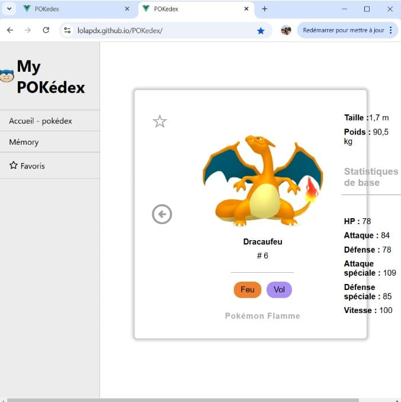
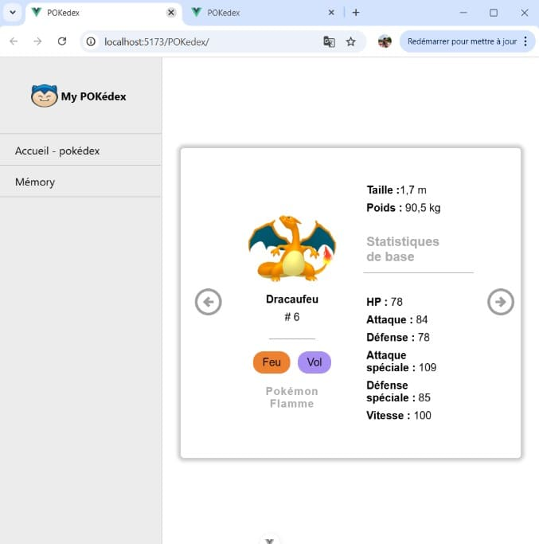
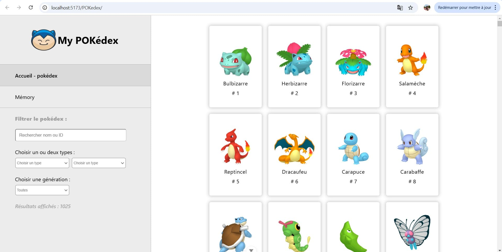



Avoir des bases de développement web front-end, notamment CSS.




- [Mon POK 3 :](https://do-it.aioli.ec-m.fr/promos/2024-2025/Lola-Perdrix/pok/temps-3/) pour comprendre ce qui constituera mon exemple d'application.
- [MON 1.1 de Guillaume :](https://do-it.aioli.ec-m.fr/promos/2024-2025/Oliana-Guillaume/mon/temps-1.1/) qui aborde les bases de CSS utiles ici.



## Introduction

L'objectif de ce MON est d'apprendre à faire du responsive, c'est-à-dire être capable d'adapter le contenu de son site web pour le rendre lisible sur n'importe quel type d'écran tout en conservant une bonne expérience utilisateur. C'est d'autant plus important depuis que la majorité des accès aux sites web ne sont plus sur un ordinateur mais depuis un téléphone portable.

J'ai souhaité faire ce MON car j'ai toujours rencontré des difficultés lors de mes précédents projets web pour rendre mes sites lisibles sur tous les écrans, en particulier pour mon POK 2, et je ne voulais pas que cela recommence pour mon POK 3.


Je vais me servir de mon site réalisé pendant mon [POK 3](https://do-it.aioli.ec-m.fr/promos/2024-2025/Lola-Perdrix/pok/temps-3/) avec Vue JS, auquel j'ai combiné entre temps mon [POK 2](https://do-it.aioli.ec-m.fr/promos/2024-2025/Lola-Perdrix/pok/temps-2/). Mon site est donc un pokédex qui propose aussi de jouer au mémory pour apprendre les pokémon. **L'objectif à la fin de ce MON est qu'il soit utilisable aussi bien via ordinateur et via téléphone portable**.


## Sommaire

  1. Dimensionnement dynamique
  2. Gestion des images
  3. Flex box et grilles CSS
  4. Media queries
  5. Responsive VS Adaptative
  6. Frameworks

## Dimensionnement dynamique

Dans un premier temps il est important que notre site ait la même allure malgré des changements légers de dimensions d'écrans. Même si on reste sur un format "ordinateur", les écrans d'ordinateurs ont tout de même des dimensions variables, c'est pourquoi il est recommandé de définir nos éléments **de manière dynamique** avec des **unités de mesures relatives**, qui vont dépendre de la taille de l'écran. L'objectif est entre autre de bannir le **scroll horizontal** peu importe la largeur de l'écran.

### Viewport

Pour travailler en fonction des dimensions de notre écran il est important de définir le viewport ainsi dans la section header du html :

`<meta name="viewport" content="width=device-width, initial-scale=1.0" />`

ce qui va permettre de dire au navigateur comment on veut qu'il contrôle les dimensions de la page, ici en se collant à la dimension de l'ordinateur et en mettant un zoom par défaut à 1 lors du chargement de la page.

### Unités CSS

- **px :** nombre de pixels, définit des longueurs fixes qui ne s'adaptent pas à l'écran (mais cela est quand même utile dans certains cas)
- **em et rem :** unités relatives à la taille de la police, de la racine du document (rem) ou bien de l'élément parent (em). Ne sert pas qu'à dimensionner des polices mais aussi des objets.
- **% :** unité qui calcule une proportion de l'élément parent. Pour les utiliser il faut faire attention à la définition de l'élément sélectionné et de l'élément parent (position, display, hauteurs définies ou non, etc.)
- **vh et vw :** unités relatives à la hauteur (vh) et à la largeur (vw) du viewport. Permet d'adapter les dimensions directement selon la taille de l'écran.
- **vmin et vmax :** prend le min ou le max entre vh ou vw selon la disposition de l'écran.
- **calc() :** permet de définir une dimension via un calcul qui peut combiner plusieurs unités, par exemple calc(50vh + 30px)

J’ai pu tester toutes ces unités à différents endroits, souvent à tâtons jusqu’à ce que je comprenne quelle unité était la meilleure dans telle ou telle situation. Ainsi j'ai appliqué des unités de mesures relatives partout où j'ai pu (là où cela m'avait échappé lors de la conception du site, c'est-à-dire à beaucoup d'endroits) jusqu'à ce que tout soit bien responsive et que le scroll horizontal ne se manifeste plus.

{% info "Attention entre vw et %" %}
Il peut y avoir des différences subtiles entre **vw et %**, par exemple 100vw et 100% en largeur ne rendent pas la même chose s'il y a une barre de scroll sur le côté de la page car celle-ci va être inclue dans le viewport mais pas dans la page... Idem pour la page de mémory censée être fixe (pas de scroll), la présence sur smartphone de la barre de recherche du navigateur en haut de l'écran va venir décaler le contenu de la page dont j'avais définie la hauteur sur 100vh, ce qui m'a embêté.


**Conclusion : bien choisir ses unités.**

### Max-width et min-width

Ces deux unités permettent de gérer efficacement certains problèmes de dimensionnement d'objets sur la page. On peut indiquer à certains éléments que à partir d'une certaine limite de taille, ceux-ci doivent maintenant garder une taille fixe. C'est très utile parfois alors qu'on y pense pas vraiment au début (en tant que "débutant").

### Taille de la police

La taille de la police a pour coutume d'être gérée par les unités em et rem, mais il est aussi possible d'utiliser des pourcentages pour gérer les polices. C'est notamment **utile pour les gros titres** qui peuvent rapidement pendre trop de place sur les petits écrans : j'ai personnellement opté pour `font-size: max(2vw,1rem);` pour mon titre, ce qui permet de le réduire si la largeur diminue, mais de conserver une taille minimale de 1rem tout de même pour empêcher que le titre devienne plus petit que le texte. Les paragraphes eux sont souvent de taille fixe et standardisée, mais qu'on peut tout de même réduire pour les téléphones (jusqu'à 0.8rem par exemple)

Une propriété utile que j'ai découverte est **`overflow: hidden`** qui permet de faire en sorte que le texte ne dépasse pas de son conteneur. Je l'ai utilisé notamment pour les boutons et les champs de saisie dans le menu latéral, car quand celui-ci rétrécissait, le texte dépassait.

### Exemple de redimensionnement

Sur cet exemple, on peut voir à quel point la mise en forme ne s'adaptait pas du tout à un écran différent. J'ai redimmensionné mes éléments pour que cela prenne la bonne place dans tous les cas, et ai opéré sur les polices, mais on verra plus tard que j'ai fini par enlever le menu latéral. Cela montre que l'utilisation des bonnes unités joue un rôle crucial pour faire un beau site.

| Avant | Après |
| :-----: | :-----: |
|  |  |

## Gestion des images

Gérer la taille des images est également quelque chose d'important pour le responsive. Souvent, on souhaite que les images conservent leur ratio d'origine. Dans mon cas, je veux aussi qu'elles diminuent de taille avec l'écran pour qu'elles occupent toujours la même proportion de l'écran. Voilà une méthode efficace pour gérer les images :

```css
  img {
    width: 100%;
    height: auto;
    max-width: 100%;
    min-width: 100px;
  }
```

- `height: auto` permet de conserver le ratio de l'image lors des rétrécissements et agrandissments donc c'est très utile.
- `max-width : 100%` signifie que les dimensions de l'image ne vont jamais dépasser sa taille d'origine mais pourra rétrécir.
- `min-width : 100px` signifie que les dimensions de l'image s'arrêteront de rétrécir en atteignant cette limite. C'est utile quand on ne veut pas que l'image devienne trop petite.

Néanmoins il faut faire attention à aussi prendre en compte les dimensions du conteneur de l'image pour que tout fonctionne bien.

J’ai appliqué ceci sur mes images dans la fiche détaillée qui restaient toujours énormes mais maintenant elles s'adaptent bien. En reparamétrant mes flex box j’ai ainsi pu obtenir une fiche détaillée de chaque pokémon qui s'affiche bien sur tous les écrans d'ordinateur (voir ci-dessous).

| Avant | Après |
| :-----: | :-----: |
|  |  |

## Flex box et grilles CSS

Les grilles CSS et les flex box permettent de nombreuses possibilités pour faire du responsive facilement, il est important de savoir s'en servir et de connaître les propriétés utiles.

### Flex box

J'ai déjà eu à passer beaucoup de temps pour revoir les bases des flex box pour mon POK 3, donc je n'ai pas eu à tout revoir, cependant j'ai quand même appris de nouvelles choses, comme par exemple le `flex-wrap: wrap` qui permet de revenir à la ligne quand les items sont trop nombreux / deviennent trop grands. Ou encore le `flex-grow` qui permet d'étendre nos items sur la place disponible.

Globalement, j’avais déjà essayé d’utiliser les flex box dès le début du développement du site mais j'ai trouvé encore des ajustements à faire par rapport à ma fiche détaillée notamment (voir ci-dessus).

### Grilles

Dans la même idée que les flex box, les grilles CSS offrent de nombreuses possibilités pour faire du responsive. Je les ai cependant un peu moins étudiées car je n'avais pas tant de temps pour le faire...

Mais j'ai pu quand même exploiter les propriétés des grilles en refaisant ma disposition du pokédex (liste des pokémon sur l'écran d'accueil).

Je voulais que le nombre de colonnes s'adapte à la largeur de l'écran pour ne pas déformer les cartes de chaque pokémon. Pour cela j'ai utilisé ces deux propriétés :

- `grid-template-columns: repeat(auto-fill, minmax(50px,175px));`
- `grid-template-columns: repeat(auto-fit, minmax(50px,175px));`

Ces deux propriétés se ressemblent, elles permettent de définir le nombre de colonnes en regardant l'espace disponible dans le conteneur : si il y a assez d'espace, les colonnes peuvent atteindre 175px chacune, si l'espace diminue, elles peuvent rétrécir jusqu'à 50px. Sinon, cela rajoute ou enlève une colonne.

La différence entre `auto-fill` et `auto-fit` est qu'avec `auto-fill`, s'il reste de l'espace disponible sur les côtés (comme le contenu est centré), celui-ci restera vide, tandis qu'avec `auto-fit`, les colonnes prendront tout l'espace jusqu'aux extrémités de la grille. J'ai choisi d'utiliser auto-fill pour la version odinateur mais auto-fit pour la version mobile, car on veut que le contenu soit le plus grossi possible.

Les grilles permettent de manière générale de structurer simplement en site en définissant des colonnes et des lignes avec les dimensions souhaitées grace aux `grid-template-columns` et les `grid-template-rows` et c'est très utilisé pour les sites ayant une structure bien définie (header, sidebar, footer, contenu sous forme de blocs...) et elles permettent de faire du responsive aisément donc il faut penser à bien les utiliser !

| Grille ordi (auto-fill) | Grille téléphone (auto-fit) |
| :-----: | :-----: |
|  |  |

## Media queries

### Défintion

Les media queries permettent d'adapter le style d'une page au type d'appreil utilisé. On peut choisir des points de rupture (dimensions limites pour la largeur ou hauteur) au delà desquels le style appliqué peut changer. On peut aussi mettre une condition sur l'utilisation du media en mode portrait ou en mode paysage pour vraiment tout prendre en compte. En bref, cela permet d'afficher le contenu de la page différemment en regardant sur quelle "catégorie" de média on se trouve !



Il suffit de rajouter dans notre feuille de style : `@media screen and (max-width: 800px){...}` (par exemple) et y insérer du CSS normalement mais qui sera pris en compte uniquement lorsque les conditions de dimensions seront respectées.

**Attention cependant à ne pas abuser du media queries car comme on l'a vu ci-dessus, il est déjà possible de faire beaucoup de choses en responsive sans y avoir recours. C'est plutôt nécessaire lorsque la disposition des éléments peut varier par exemple.**

### Outil Chrome

**À savoir :** Dans les outils de développement de Chrome on peut activer cette vue pratique qui nous permet de tester notre page sur plusieurs types d'écran, et c'est très pratique pour faire les tests. Je ne connaissais pas mais je m'en suis bien servie.



### Menu latéral

Pour mettre en application le principe des media queries, j'ai réalisé un gros travail sur le menu latéral de mon site qui n'était sans surprise pas adapté à un écran de téléphone. Pour cela je me suis aussi inspirée de [cette vidéo Youtube](https://youtu.be/Ul4KOXNQJSk?si=A1Z_O7OjB6qfQ29G). L'idée est que le menu latéral n’a pas lieu d’être affiché tout le temps, je voulais donc qu'il puisse se "rabattre" sur le côté pour conserver de l'espace.

J'ai donc mis en oeuvre les media queries en ne prenant qu'un seul point de rupture (800px de largeur) afin de ne considérer que la transition ordinateur / téléphone portable. J'ai également utilisé certaines propriétés de Vue qui m'ont bien été utiles.

De plus, on peut également indiquer à l'élément affiché (pokedex, fiche détaillée, ou mémory) de prendre non plus 70% de la page (à droite du menu), mais désormais toute la page avec le menu qui vient s'afficher par dessus. À partir de 800px de largeur l'écran redevient alors fixe sur le côté gauche.

| Avant | Après 1 | Après 2 |
| :-----: | :-----: | :----: |
|  |  |  |

### Carte détaillée

Un autre exemple de mise en oeuvre des media queries est celui-ci : les cartes détaillées étaient faites pour un **format paysage** mais devaient être réadaptées pour un **format portrait** afin d'être plus lisible sur téléphone.

Ce n'était pas évident de savoir quels élements modifier dans le CSS sans changer la structure de la carte pour que celle-ci s'affiche bien dans chacun des deux formats. C'est essentiellement en jouant sur la direction des flex box et sur les espaces entre les élements (gap, margin, padding...) que je suis parvenue à réaliser ce que je voulais.

| Avant | Après |
| :-----: | :-----: |
|  |  |

## Responsive VS adaptative

En réalité, j'ai un petit peu triché lorsque j'ai réadapté certaines choses. Il est possible de faire intervenir directement dans le script le paramètre de la largeur de l'écran pour inclure des conditions sur les éléments : `window.innerWidth > 800 ?`. En effectuant des modifications de cette manière, on n'agit **pas uniquement sur le style mais aussi sur le DOM**, et c'est ce qu'on appelle de **l'adaptative design** et non du **responsive design**. Je me suis donc entraînée sur les deux !

## Frameworks

Un autre moyen de faire du responsive est d'utiliser directement des frameworks proposant des modèles responsives que l’on peut reprendre et adapter : par exemple W3.CSS, ou Bootstrap.

## Conclusion

Si on ne fait pas attention au caractère responsive de notre site, celui-ci peut avoir une apparence catstrophique en changeant de media, comme j'ai pu le constater en contemplant mon POK sur téléphone...

Il existe de multiples outils pour réussir à adapter son site web à tous les écrans avec CSS, les plus importantes étant d'utiliser les **media queries**, **les objets adaptés (grilles, flex box...)** et des **unités relatives** que ce soit pour les objets, les photos, ou la police. Il y a tellement de propriétés CSS qu'il est toujours intéressant de jeter un oeil sur leur fonction car on tombe parfois sur des fonctions très utiles.

Pour ce MON, j'ai voulu faire des recherches sur les méthodes pour faire du responsive tout en essayant de mettre en application tout ce que je voyais sur mon projet personnel, en partie parce que lors de certains de mes anciens MON j'ai beaucoup recherché mais sans rien mettre en pratique. Le point négatif est que j'ai passé énormément de temps à corriger tout ce que je faisais pour mon site car je réussissais rarement du premier coup à mettre en oeuvre chaque chose, et donc cela a limité grandement les recherches que je voulais mener, bien que je n'ai pas l'impression qu'il y ait beaucoup plus de choses à apprendre pour déjà bien s'en sortir.

## Sources

- [Vidéo Youtube : Comment gérer le responsive en CSS](https://youtu.be/ds4P4AL-NGM?si=83VbbWkkhbzURskh)
- [W3schools : responsive web designs](https://www.w3schools.com/css/css_rwd_mediaqueries.asp)
- [Blog : Le guide du débutant pour un design web responsive](https://kinsta.com/fr/blog/design-web-responsive/)
- [Vidéo Youtube : Build an Animated Responsive Sidebar Menu with Vue JS, Vue Router, SCSS and Vite in 2022](https://youtu.be/Ul4KOXNQJSk?si=A1Z_O7OjB6qfQ29G)
