

Bases en développement web front-end



MON de Sophia : [Bases du front et du framework Vue](https://francoisbrucker.github.io/do-it/promos/2024-2025/Sophia-Capdevielle/mon/temps-1.1/)


Ce POK me sert de support pour apprendre à utiliser le framework **Vue js**, à travers la réalisation d'un application web sympathique répertoriant tous les pokémons / un pokédex, pour continuer sur ma lancée.

## Lien vers le code du site

- Projet sur Git Hub : [POKedex](https://github.com/lolapdx/POKedex)

- Lien du site : [POKedex](https://lolapdx.github.io/POKedex/)

## Planning

### Sprint 1

Phase de prise en main et de préparation :

- Découverte générale de Vue
- Prise en main de Vue
- Maquette du site

### Sprint 2

Phase de réalisation :

- Créer les composants de base qui seront utilisés pour les fiches pokémon
- Mettre en place les éléments ensemble
- Styliser
- Ajouter les fonctionnalités bonus


Au début de ce projet, je n'ai aucune idée de la complexité du framework et de ma capacité à prendre en main la techno, c'est pourquoi la gestion des tâches est très imprévisible...


## Premier Sprint

- [x] Découverte générale de Vue
- [x] Prise en main de Vue
- [x] Maquette du site

Non prévu :

- [X] Utilisation de l'API Pokémon
- [X] Création des composants principaux

### Horodatage

| Date | Heures passées | Indications |
|----|-----|-----|
| Jeudi 16 janvier | 1h30 | Découverte des autres MON, de la doc de Vue, et début du tutoriel proposé |
| Vendredi 17 janvier | 1h30 | Fin du tuto, initialisation d'un projet en local |
|  | 30min  | Recherche d'autres tutos et nettoyage du projet installé par défaut |
|  | 2h | Maquette Figma |
| Samedi 18 janvier | 1h | Lecture de la doc PokéAPI, récupération et affichage en vrac des données souhaitées |
|  | 1h | Changement d'API et débugage |
|  | 1h | Structuration du composant "fiche", tests des différentes fonctionnalités de Vue apprises sur mon composant |
|  | 30min | Ajout des boutons permettant de passer au suivant ou au précédent |
|  | 1h | Création d'un composant pour la liste non détaillée |

### Découverte de Vue

Je me suis essentiellement basée sur la [documentation officielle de Vue](https://fr.vuejs.org/guide/introduction.html), pour comprendre le fonctionnement global.

Ce qu'il faut retenir :

- Il y a deux façons d'écrire le code : avec **l'Options API** et la **Composition API**, j'ai choisi d'opter pour l'Options API car elle me semblait moins complexe à comprendre (ressenti personnel).
- L'intérêt de Vue est de rendre le **HTML dynamique** : notamment avec le rendu déclaratif qui associe le HTML avec les états du javascript.
- Le code s'écrit dans un **SFC : Single File Component** (ou composant mono-fichier). Le HTML (équivalent au template), le CSS (style), et le javascript (script), s'écrivent dans le même fichier.
- Le rendu global sera créé **à partir de différents composants** SFC.

Le **tutoriel** est très bien fait et nous fait pratiquer sur toutes les fonctionnalités essentielles : je conseille et je trouve que j'ai appris très vite.

### Initialisation du projet Vue

J'ai choisi de suivre la démarche explicitée sur le site de la doc :  [Quick Start](https://fr.vuejs.org/guide/quick-start.html).

Après avoir effectué les lignes de commande dans mon terminal, j'obtiens tous les fichiers nécessaires à mon projet avec une page créée par défaut.

J'ai ensuite supprimé tout ce qui était inutile pour repartir d'un projet vide.

### Maquette du site

Avant de me lançer directement dans la conception de mon site, j'ai réuni quelques inspirations et ai réfléchi au rendu voulu, puis j'ai donné vie à tout ça en créant ma maquette Figma.

**4 fonctionnalités recherchées :**

- Une liste de tous les pokémons présentés de manière macro (page par défaut)
- La possibilité de mettre des pokémons en favori
- La possibilité de filtrer les pokémons apparaissant sur la page selon plusieurs critères.
- Une fiche détaillée de chaque pokémon en cliquant dessus.

Le tout dans un design épuré avant tout fonctionnel.

| Page accueil | Favoris | Fiche détaillée |
|----|-----|-----|
| 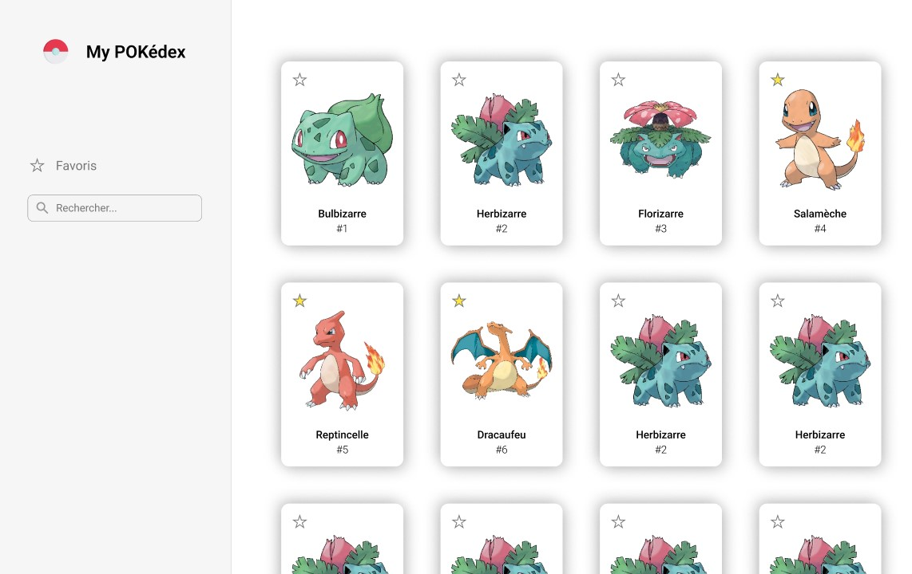 | 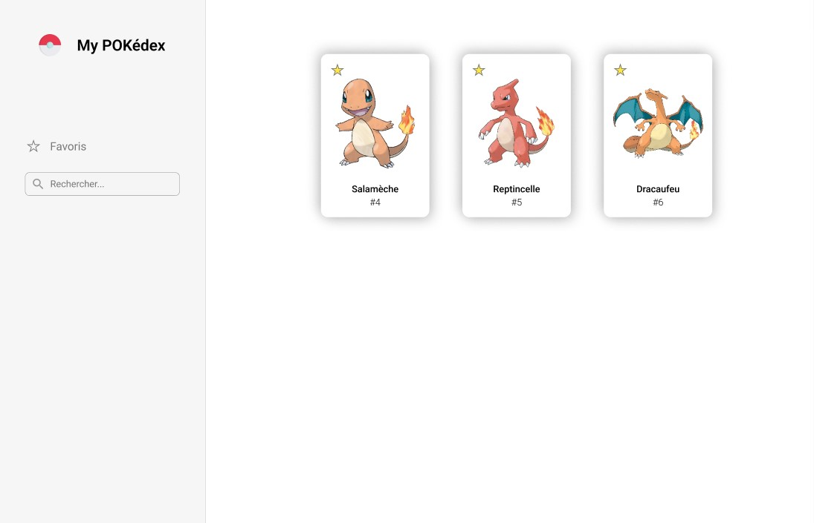 | 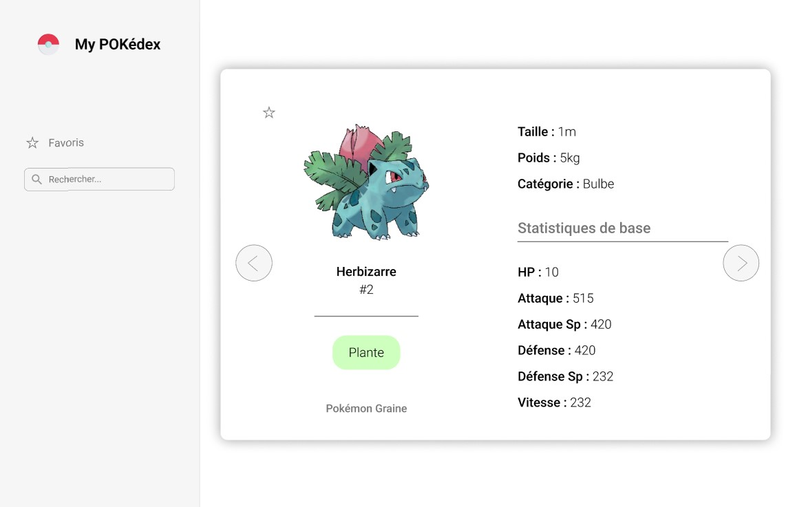 |

### Récupération des données

Pour récupérer les données spécifiques de tous les pokémons, je me suis premièrement dirigée vers la [PokéAPI](https://pokeapi.co/docs/v2) qui détient toutes les infos (il y en a vraiment plein !!) et les met à disposition gratuitement et simplement. J'ai passé un peu de temps à mettre en place ce que je voulais pour me rendre compte de différents **problèmes** :

- Bien qu'il y ait toutes les infos, elles n'étaient pas tout le temps accessibles par le même lien ou difficilement (je n'ai pas réussi à le faire simplement du moins)
- Les images disponibles n'étaient pas les plus belles, ou ne correspondaient pas au style recherché
- La plupart des données ne se récupérait qu'en anglais

C'est pourquoi j'ai finalement opté pour une autre API qui résoud tous les problèmes précédents : [Tyradex API](https://tyradex.vercel.app/docs/pokemon/pokedex)

En m'aidant du tuto Vue réalisé et des exemples fournis par la doc de Vue, j'ai été en mesure rapidement de récupérer et d'afficher de manière dynamique toutes les infos que je voulais pour mes fiches descriptives par pokémon. Il est aussi aisément possible grace à la syntaxe de Vue de passer d'un fiche à l'autre par de simple boutons. Cela donne ceci de manière brute :

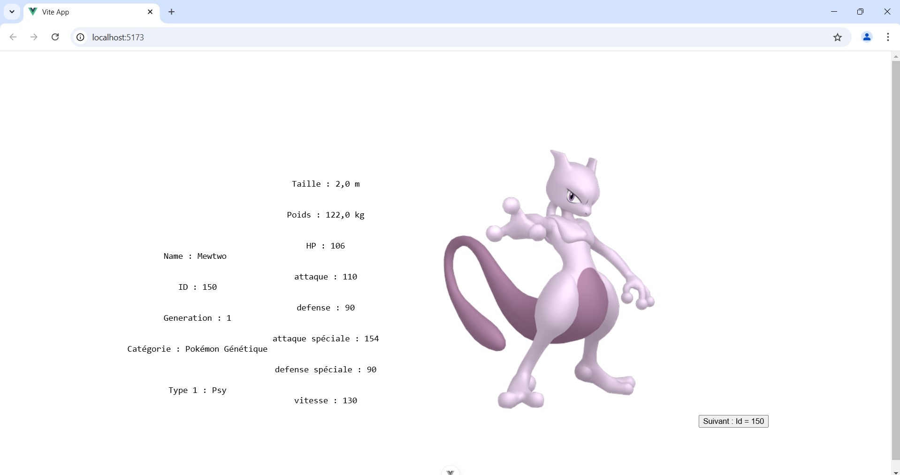

### Début de pokédex

Enfin, avec une boucle et quelques propriétés, j'ai créé la liste de tous les pokémons disposés dans une grille avec uniquement les infos principales pour faire la base de mon site. Et voilà !

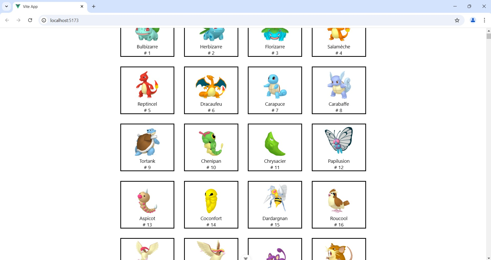

### Conclusion Sprint 1

Pour ce sprint, je n'ai pas rencontré de difficultés majeures, et ai même pu prendre un peu d'avance sur le prochain sprint car il me restait du temps et j'ai pris conscience que celui-ci serait chargé. La syntaxe de Vue a été plus rapidement prise en main que prévue et tant mieux. Je me rends compte que cela permet de faire de grands raccourcis dans le code !

Là où j'ai eu plus de mal, c'était avec la récupération des données, avec des soucis au niveau du choix et de l'utilisation des API, et ai eu pas mal de bugs avec l'affichage des données liés à la requête ou à la syntaxe rigoureuse de Vue pas encore totalement maîtrisée. Je pense rencontrer plus de difficultés dans le prochain sprint quand il faudra imbriquer les composants.

## Second Sprint

### Réajustement du sprint planning

Mettre en place le site final :

- [X] Créer un composant pour le volet latéral
- [X] Mettre en place les composants ensemble
- [X] Styliser
- [X] Ajouer les logiques de filtre (le plus possible)

### Horodatage Sprint 2

| Date | Heures passées | Indications |
|----|-----|-----|
| Mercredi 29 janvier | 2h30 | Composant side bar vierge et structure de la page principale |
| Jeudi 30 janvier | 2h15 | Style de la fiche détaillée |
| Samedi 01 février | 15 min | Style du pokédex |
|  | 15 min | Ajout logo side bar |
|  | 1h | Ajout navigation side bar |
|  | 2h30 | Ajout recherche manuelle side bar |
| Dimanche 02 février | 2h30 | Ajout des autres filtres side bar |

### Ajout du style sur les composants et sur la page principale

#### Reprendre les bases

Le style de mon site est quasiment ce qui m'a demandé **le plus de temps**. En effet j'ai eu du mal à agencer mes éléments sur la page comme je le voulais, et me suis rendue compte que j'avais de grosses **lacunes sur CSS** que je n'ai pas pu ignorer cette fois-ci. J'ai donc du me poser pour **revoir les bases** de CSS surtout au niveau des positions, des displays, en particulier les **flexbox** qui ont ensuite permis de construire la plupart des éléments du site.

J'y ai passé beaucoup de temps au début du sprint, pour ensuite appliquer l'agencement avec les flexbox tout au long du développement de mes fonctionnalités.

#### Style des composants

J'ai alors pu mettre ces connaissances en application en stylisant mes composants pour qu'ils correspondent à ma maquette Figma.

| Liste des cartes / Pokédex stylisé | Carte détaillée stylisée |
|----|-----|
| 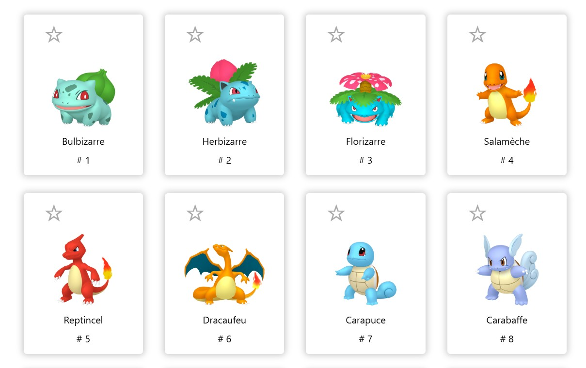 | 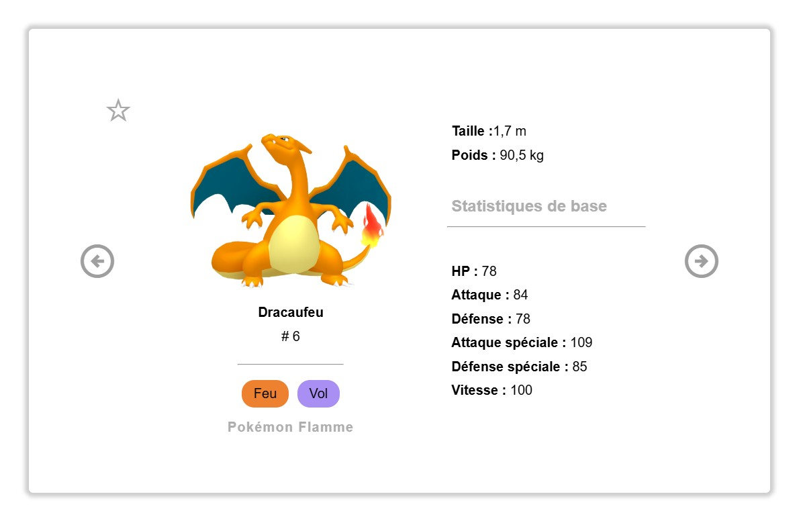 |


Pour la couleur de fond derrière les types, je les ai attribués dynamiquement selon un dictionnaire associant un type à une couleur spécifique.


### Volet latéral

Le 3e composant qu'il me fallait pour mon site était le volet latéral sur lequel trouver les boutons de navigation ainsi que les filtres. Pourquoi est-ce un composant à part entière ? Je ne sais pas trop comment j'ai défini quels éléments devaient être des composants, cela m'a semblé intuitif bien que je ne sois pas sûr que ce soit le mieux.

#### Structure de base

J'ai organisé mon menu en flex box verticales, en y ajoutant d'abord un logo et des barres de navigation permet de passer d'une vue à l'autre.

| Menu vierge | Logo | Navigation |
|----|-----|-----|
| 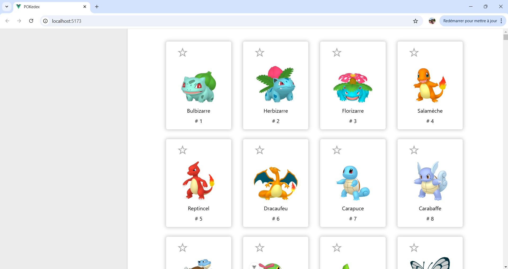 | 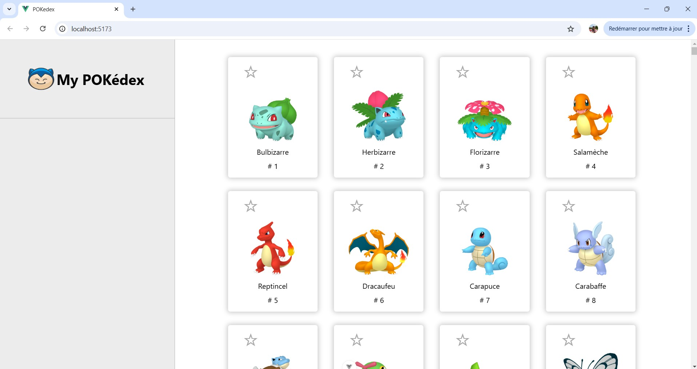 | 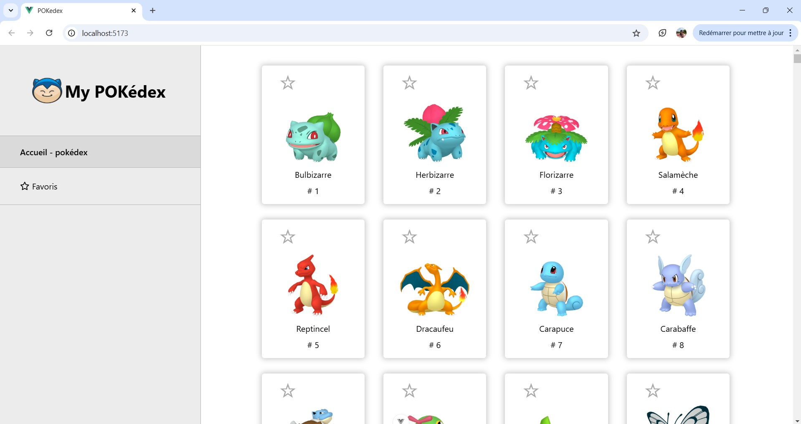 |

#### Favoris

J'ai laissé un onglet "favori" qui devrait servir à afficher uniquement nos pokémons mis en favori, cependant je me suis rendue compte pour cela que le site devait mémoriser ces pokémons en question en fonction des utilisateurs et donc cela nécessiterait la **création d'une base de données** et une **gestion des utilisateurs** que je n'ai **pas du tout le temps de traiter durant ce POK...** C'est donc un bouton désactivé pour l'instant.

#### Recherche manuelle

La recherche manuelle était une fonctionnalité essentielle de mon site. Pour la réaliser, je me suis inspiré de cas similaires sur la documentation : [exemple - grille avec filtre](https://fr.vuejs.org/examples/#grid).

Le fonctionnement repose sur cette logique :

- On ajoute un input dans le composant "menu latéral" que l'on synchronise avec une variable "SearchQuery" grace à l'attribut `v-model` (dès que l'input change, SearchQuery se synchronise avec la nouvelle valeur)
- On écoute l'évènement `input`, qui à chaque déclenchement va envoyer un ordre à l'élément parent (c'est-à-dire l'application globale) de mettre à jour lui aussi sa variable SearchQuery. Ainsi, à chaque changement de l'input, l'élément parent voit aussi sa SearchQuery se mettre à jour.
- Grace à une [propriété calculée](https://fr.vuejs.org/guide/essentials/computed.html), la liste des pokémons se met à jour en même temps que les changements de notre SearchQuery. On filtre nos données pour qu'elles ne gardent plus que les pokémon dont le nom commencent par notre SearchQuery.
- On fait passer cette donnée filtrée à notre composant qui va les afficher.
- On ajoute aussi un bouton en forme de croix qui apparaît à condition que l'input soit non vide, puis si on clique dessus, cela aura pour effet de réinitiliser notre SearchQuery à un mot vide '' et donc d'annuler le filtre.

J'ai aussi rajouté ultérieurment la possibilité d'entrer un numéro d'identifiant dans la recherche manuelle pour permettre de rechercher par numéro de pokédex, il fallait juste rajouter une condition "OU" au filtre.

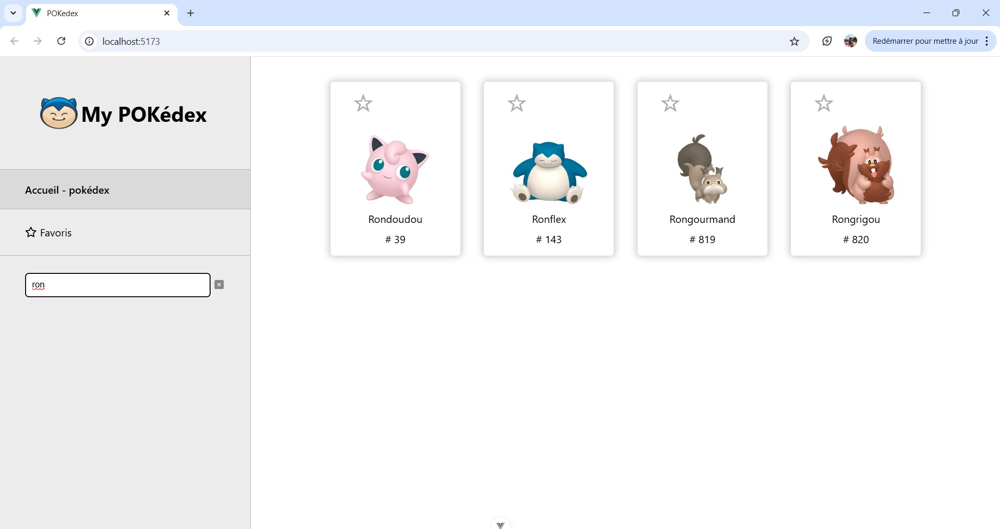

#### Autres filtres

Pour les autres filtres, j'ai procédé plus ou moins de la même manière avec un autre type d'input. Je le synchronise à une variable, que je synchronise elle-même avec une variable de l'élément parent avec un écouteur d'événement, qui va actualiser la liste filtrée en rajoutant une condition de filtres aux précédentes.

Ainsi, on peut accumuler plusieurs filtres, cela aura pour effet de superposer les conditions de filtrage.

J'ai aussi rajouté le nombre de résultats retournés en bas du volet car je trouvais cela fonctionnel.

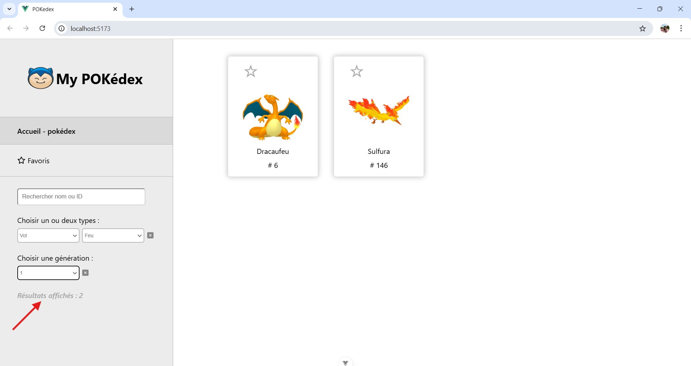

### Conclusion Sprint 2

Pour ce deuxième sprint, j'ai comme prévu rencontré plus de difficultés, notamment **au niveau du style de la page** avec les flex box que j'ai du réétudier un moment, mais aussi pour **agencer les composants entre eux** et réussir à **faire passer des données ou des propriétés d'un composant à l'autre.**

Hélas, j'ai du un peu déborder sur le planning et c'est notamment du à mon envie de faire quelque chose de propre malgré le temps imparti...

Même si j'ai du abandonner le système de favoris, mon travail correspond bien à mes attentes et j'ai appris plein de nouvelles choses notamment sur les mécanismes spécifiques au framework Vue js, ce qui était l'objectif !

## A Suivre

Lors de mon tout dernier MON, je vais étudier les techniques pour rendre un site responsive. J'espère alors pouvoir appliquer ce que je vais apprendre à ce POK pour permettre de l'améliorer et de le rendre utilisable depuis un smartphone.

L'idéal serait aussi d'y implémenter mon mémory réalisé durant le POK 2, sur mon temps libre avant de commencer mon MON pour plus de challenge.

## Sources

- [Documentation de Vue :](https://fr.vuejs.org/guide/introduction.html)
  - [Tutoriel Vue](https://fr.vuejs.org/tutorial/#step-1)
  - [Démarrage d'un projet Vue](https://fr.vuejs.org/guide/quick-start.html)
  - [Exemples de syntaxes Vue](https://fr.vuejs.org/examples/#hello-world)
- [Tyradex API](https://tyradex.vercel.app/docs/pokemon/pokedex)
