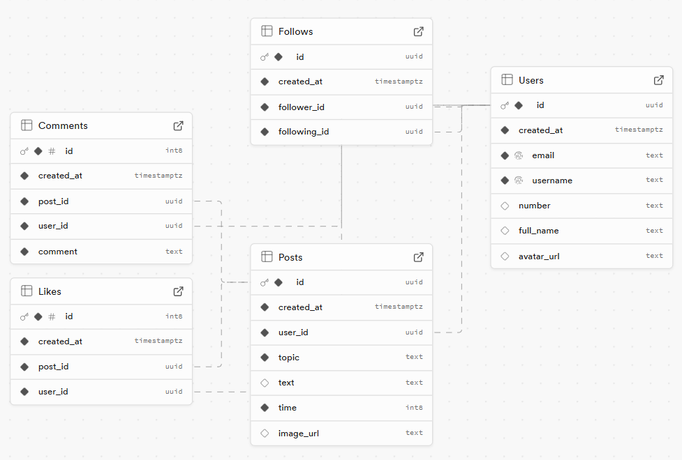



Il y a pas de prérequis pour ce MON




[Supabase Database Doc](ttps://supabase.com/docs/guides/database/overview)
[Supabase Google Login Doc](https://supabase.com/docs/guides/auth/social-login/auth-google)
[Supabase Kotlin Integration Doc](https://supabase.com/docs/reference/kotlin/introduction)
[Learn Supabase - Full Tutorial for Beginners](https://www.youtube.com/watch?v=dU7GwCOgvNY)
[Firebase vs Supabase](https://www.youtube.com/watch?v=yGbGxWMv9KA)
[Create a project with Supabase](https://www.youtube.com/watch?v=-jISW-jVG-s&list=PL8HkCX2C5h0W-Fr3NEfOprzTRHICMGyOX)
[Mon POK3](https://do-it.aioli.ec-m.fr/promos/2024-2025/Manuela-Barreto/pok/temps-3/)



# Contenu

## **1. Objectif de l'Étude**
Ce rapport documente mon étude sur Supabase, une alternative open-source à Firebase. L'objectif était de comprendre les concepts principaux, de configurer et d'utiliser une base de données sur Supabase, et d'apprendre comment l'intégrer avec un projet Android en Kotlin dans Android Studio pour pouvoir l'utiliser dans mon POK3.

---

## **2. Structure du Rapport**
- **Objectif de l'Étude**
- **Concepts Principaux**
- **Outils et Configuration**
- **Étapes de l'Étude**
- **Projet Pratique (POK3)**
- **Conclusion**

---

## **3. Concepts Principaux**
Supabase est une plateforme qui offre des solutions complètes pour des applications modernes, comme la gestion de base de données, l'authentification, le stockage et les fonctions serverless. Les principaux concepts abordés sont :

1. **Base de Données**
   - Supabase utilise PostgreSQL, l'un des systèmes de gestion de bases de données relationnelles les plus robustes et populaires.
   - Concepts clés étudiés :
     - Tables : Structures pour organiser les données.
     - Requêtes SQL : Méthode pour manipuler et rechercher des informations dans la base de données.
     - Relations : Connexions entre les tables (ex. : 1:N, N:N).

2. **Authentification**
   - Supabase dispose d'un support intégré pour l'authentification des utilisateurs (e-mail, mot de passe, OAuth).
   - Les règles de sécurité sont configurées à l'aide de RLS (Row-Level Security), permettant de contrôler l'accès aux données de manière détaillée.

3. **API**
   - Supabase génère automatiquement une API REST pour interagir avec la base de données.
   - Il supporte également GraphQL pour les requêtes et mutations.
   - Les opérations CRUD (Créer, Lire, Mettre à jour, Supprimer) sont effectuées directement via l'API.

4. **Stockage**
   - Il propose un stockage de fichiers pour les téléchargements (images, documents, etc.).
   - L'URL des fichiers peut être stockée dans la base de données pour référence.

5. **Fonctions Serverless (Edge Functions)**
   - Permet de créer des fonctions personnalisées côté serveur, déclenchées par des événements ou accessibles via l'API.

---

## **4. Outils et Configuration**
Les principaux outils utilisés étaient :
- **Supabase** : Pour la configuration de la base de données et du backend.
- **Android Studio** : Environnement de développement pour créer l'application en Kotlin.
- **supabase-kt** : Bibliothèque recommandée pour intégrer Supabase avec Kotlin, facilitant la communication avec les services de Supabase.
- **Postman** : Pour tester les points de terminaison pendant le développement.

---

## **5. Étapes de l'Étude**

1. **Introduction à Supabase**
   - Étude de ce qu'est Supabase et de ses principales fonctionnalités.
   - Création d'un compte sur le tableau de bord de Supabase.

2. **Base de Données PostgreSQL sur Supabase**
   - Configuration initiale du projet et création des tables.
   - Exécution de requêtes basiques (SQL) directement sur le tableau de bord.
   - Configuration des relations entre les tables.

3. **Authentification et Sécurité**
   - Configuration de l'authentification des utilisateurs sur Supabase.
   - Étude et mise en place des règles de sécurité avec RLS.

4. **Intégration avec Kotlin et Android Studio**
   - Étude des API REST générées automatiquement par Supabase.
   - Étude de la bibliothèque **supabase-kt** pour intégrer Supabase avec Kotlin.

5. **Stockage de Fichiers**
   - Étude et configuration des buckets pour le téléchargement de fichiers.

---

## **6. Projet Pratique (POK3)**
**Description Brève du Projet :**
Mon POK3 consiste à développer une application similaire à Strava, mais axée sur l'enregistrement des sessions d'étude plutôt que des activités physiques. Les utilisateurs peuvent :
- Se connecter et créer un compte.
- Enregistrer des sessions d'étude, en indiquant la durée et le sujet étudié.
- Créer des publications pour partager leur progression dans les études.
- Commenter les publications des autres utilisateurs.
- Aimer des publications et suivre d'autres utilisateurs.

**Structure de la Base de Données :**
Pour répondre aux exigences de l'application, la structure suivante a été créée sur Supabase :
- **`users`** – Stocke les informations des utilisateurs.
- **`posts`** – Publications des utilisateurs concernant leurs études.
- **`comments`** – Commentaires sur les publications.
- **`likes`** – Enregistre les likes sur les publications.
- **`follows`** – Pour le système de suivi des utilisateurs.

**Intégration avec Kotlin et Android Studio :**
**supabase-kt** est une bibliothèque officielle de Supabase pour Kotlin. Elle facilite l'intégration des services Supabase dans des applications Kotlin et Android. Voici son fonctionnement :
- **Connexion à Supabase** : Après avoir ajouté la bibliothèque supabase-kt au projet Android, on peut facilement configurer la connexion à l'instance Supabase à l'aide des clés API.
- **Opérations CRUD** : La bibliothèque permet d'effectuer des opérations CRUD (Créer, Lire, Mettre à jour, Supprimer) directement avec la base de données Supabase. Elle prend en charge la gestion des utilisateurs, la récupération de données et l'envoi de requêtes SQL.
- **Authentification** : On peut gérer l'authentification des utilisateurs directement dans l'application, y compris l'inscription, la connexion, la réinitialisation des mots de passe, etc.
- **Stockage de Fichiers** : Avec supabase-kt, l'intégration du stockage de fichiers est simplifiée. On peut télécharger des fichiers, obtenir leurs URL et les gérer dans l'application.
- **Gestion des sessions et des erreurs** : La bibliothèque offre une gestion transparente des sessions utilisateur et des erreurs, ce qui simplifie l'intégration avec l'application Android.

**Stockage de Fichiers :**
Supabase propose un système de stockage de fichiers pouvant être utilisé pour stocker des images de profil, des pièces jointes d'étude, etc.
- **Buckets :** Ce sont des dossiers organisés dans le Supabase Storage où les fichiers sont stockés.
- **Téléchargement de Fichiers :** Réalisé via des requêtes HTTP vers l'API de Supabase.
- **Obtention de l'URL :** Après le téléchargement, Supabase génère une URL publique (si autorisé) ou protégée pour accéder au fichier.
- **Intégration avec Kotlin :** Pour envoyer et récupérer des fichiers, on peut utiliser la bibliothèque supabase-kt pour effectuer des requêtes HTTP.

---

#### **7. Améliorations Possibles pendant le POK3**
Pendant la conception de la base de données, quelques améliorations et fonctionnalités futures ont été identifiées :
- **Notifications** : Implémenter un système de notifications pour avertir les utilisateurs des nouveaux likes, commentaires et abonnés.
- **Amélioration de la Confidentialité** : Ajouter des paramètres permettant aux utilisateurs de définir qui peut voir leurs publications et sessions d'étude (modifications dans RLS).
- **Filtres et Statistiques** : Créer des tableaux de bord avec des statistiques sur le temps total d'étude, les matières les plus étudiées et les progrès au fil du temps.

---

#### **8. Conclusion**
Cette étude a été essentielle pour comprendre comment utiliser Supabase comme backend pour des projets. Il offre une solution robuste, facile à configurer et remplie de fonctionnalités, telles que l'authentification intégrée, le stockage de fichiers et les fonctions serverless. En plus de son intégration avec Kotlin, il offre de nombreuses autres possibilités d'intégration avec le frontend. De plus, il propose une version gratuite très complète et utile.
