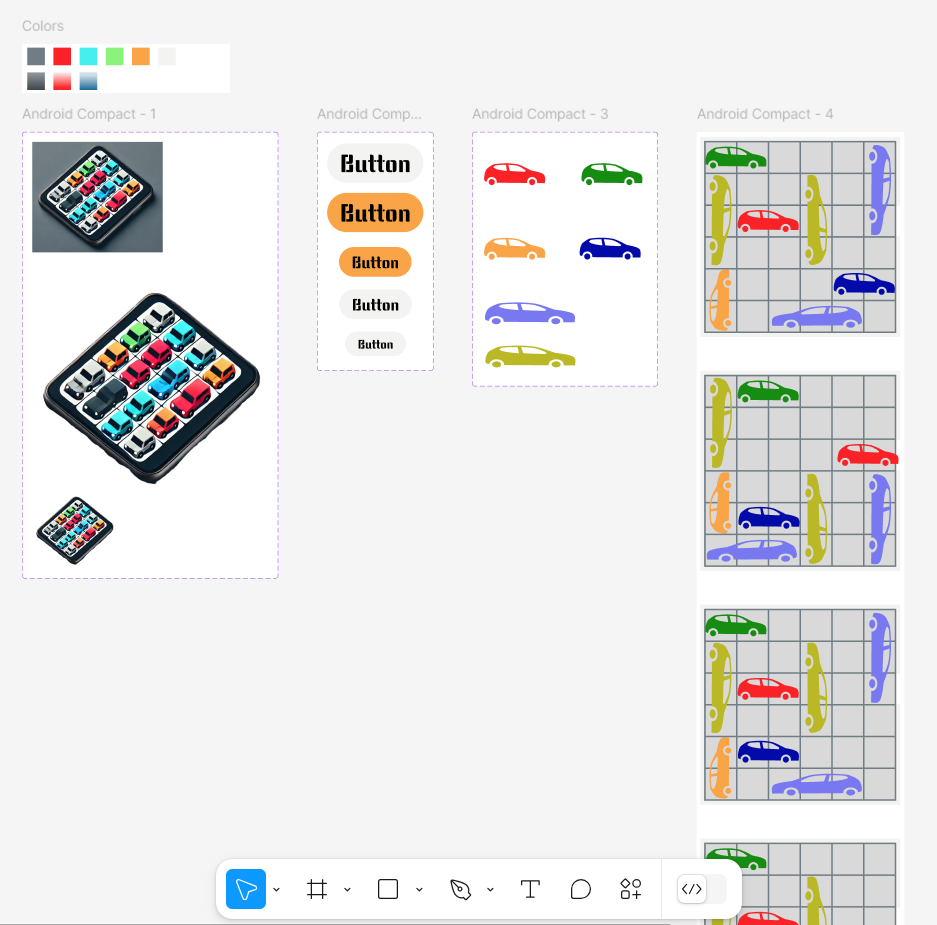
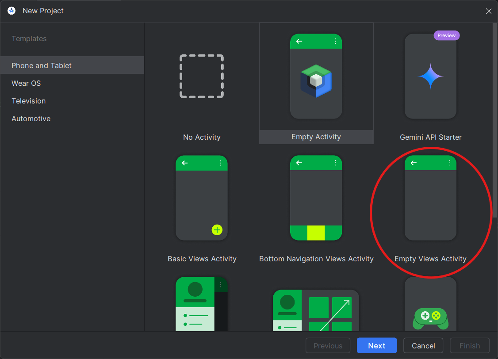
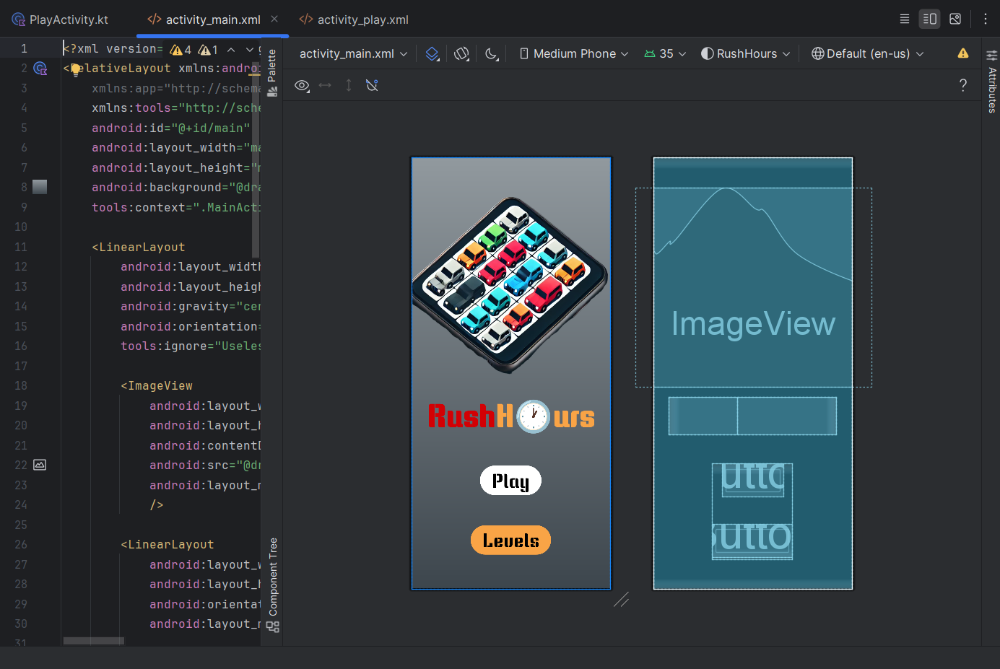



Liste des prérequis du POK ET/OU MON




Les lien utiles pour la compréhension de celui-ci.



Création d'un jeu mobile qui met les joueurs au défi de résoudre des énigmes logiques sur un plateau de 6x6 rempli de voitures stratégiquement placées.

## Objectif

Développer une application mobile pour un jeu simple qui met les joueurs au défi de résoudre des énigmes logiques sur un plateau de 6x6 rempli de voitures stratégiquement placées. L'objectif est de déplacer les véhicules le moins possible pour libérer le passage et permettre à la voiture rouge d'atteindre la sortie. Chaque niveau comporte un modèle et les niveaux deviennent progressivement plus difficiles.

## Tâches

### Sprints

#### Sprint 1

| Tâche | Durée Prévue | Durée Réel | Tâche Réalisée|
| :---: | :----: | :----------: | :--------: |
| Création du design de l'application sur figma | 2H | 2H30 | X |
| Développement de l'écran d'accueil | 1H30 | 2H | X |
| Créer les objets/personnages | 1H | 1H | X |
| Créer l'écran de niveau (hardcoded) | 3H | 2H30 | X |
| Mettre en œuvre la logique de base pour déplacer un bloc | 2H |  |  |
| Documentation du sprint 1 | 1H | 1H | X |
| *Résoudre problème de l'emulateur* | *-* | *2H* | *X* |
| **TOTAL** | **10H30** | **11H** |  |

#### Sprint 2

| Tâche | Durée Prévue | Durée Réel | Tâche Réalisée|
| :---: | :----: | :----------: | :--------: |
| Mettre en œuvre la logique de base pour déplacer un bloc | 2H |  |  |
| Créer la base des données stocker les niveaux | 2H30 |  |  |
| Mettre les niveaux dans la base des données| 0H30 |  |  |
| Créer la page des niveaux | 2H |  |  |
| Tester et corriger les éventuelles erreurs | 3H|  |  |
| **TOTAL** | **10H** |  |  |

### Horodatage

| Date | Heures passées | Indications |
| :--: | :------------: | :---------: |
| Samedi 19/10 | 2H30 | Travail sur le design sur Figma |
| Lundi 21/10 | 1H30 | Travail sur le développement de l'écran d'accueil |
| Lundi 21/10 | 2H |  Travail sur l'émulateur (Il ne fonctionnait pas) |
| Samedi 02/11 | 0H30 |  Travail sur les boutons de l'écran d'accueil |
| Samedi 02/11 | 3H30 |  Travail sur le développement de l'écran des niveaux (y compris la création des objets/personnages)|
| Mardi 19/11 | 1H | Travail sur la documentation |
| **TOTAL** | **11H** |  |

## Sommaire

- [Le Design de l'Application](#le-design-de-l-application)
- [Développement - Premier Sprint](#développement-premier-sprint)
- [Post-Mortem - Premier Sprint](#post-mortem-premier-sprint)
- [Résultat Intermédiaire](#resultat-intermédiaire)

## Le Design de l'Application 

Pour concevoir le design de l’application, j’ai commencé par expliquer à ChatGPT le concept du jeu que je souhaitais créer et je lui ai demandé de réaliser le logo de mon app. Voici le logo qu’il a conçu :

Ensuite, j’ai commencé à développer l’aspect visuel de l’application sur Figma. La première étape a été de choisir une palette de couleurs, en sélectionnant des tons directement issus du logo. Une fois les couleurs définies, j’ai créé les principaux composants, comme les boutons et le plateau de jeu, tout en avançant dans la conception des écrans. Voici le résultat des composants :

Une fois les écrans finalisés, j’ai créé les liens entre eux pour rendre la navigation fonctionnelle. Le produit final peut être vu dans la vidéo ci-dessous :

<video width="200" controls>
  <source src="./assets/figma.mp4" type="video/mp4">
</video>

## Développement - Premier Sprint 

### La création du projet sur Android Studio

Pour savoir comment installer Android Studio, consultez mon **MON1.1**.  

Une fois Android Studio installé, commencez par créer un nouveau projet. Lors de la configuration initiale, sélectionnez l'option **"Empty Views Activity"**. Cette option génère un projet de base contenant un fichier XML, où vous pourrez concevoir le layout de votre application.  

### La Page d'Accueil  

Pour construire la page d'accueil, j'ai utilisé deux fichiers principaux :  

- **`MainActivity`** : ce fichier définit le fonctionnement de l'écran, notamment les actions associées aux boutons.  
- **`activity_main.xml`** : ce fichier gère le layout de la page.  

En complément, j'ai également utilisé des fichiers de ressources pour définir les textes affichés, les couleurs, la police et les images utilisées. Voici le résultat final du layout :  

  

### La Page du Niveau  

Pour construire la page du niveau, j'ai utilisé les fichiers suivants :  

- **`PlayActivity`** : ce fichier contrôle non seulement les actions des boutons, mais également le fonctionnement du chronomètre et les mouvements des objets présents sur la page.  
- **`activity_play.xml`** : ce fichier s'occupe de créer le layout de la page.  

Comme pour la page d'accueil, des fichiers de ressources ont été utilisés pour gérer les textes, les couleurs, la police et les images. Voici le résultat final du layout :  

  

### La Création des Objets du Jeu  

Pour créer les objets du jeu utilisés dans la page du niveau, j'ai suivi les étapes suivantes :  
- J'ai capturé une image (screenshot) du plateau de jeu que j'avais conçu dans Figma.  
- J'ai photographié les petites voitures du jeu physique que je possède, puis j'ai supprimé les arrière-plans et retouché les images pour les adapter au design numérique.  

### Problème Rencontré  

Dans Android Studio, nous disposons d’émulateurs permettant de simuler le fonctionnement d’un smartphone pour tester le comportement de l’application. (Pour en savoir plus sur les émulateurs, consultez mon **MON1.1**).  

En essayant d’utiliser l’émulateur, celui-ci fonctionnait correctement, mais mon application refusait de se lancer. Après plusieurs heures de recherches sur Internet (environ 2 heures), j’ai identifié deux problèmes :  

1. **Problème avec le SDK**  
   Le SDK (Software Development Kit) est un ensemble d’outils et de bibliothèques nécessaires pour développer des applications sur une plateforme spécifique. Dans mon cas, le fichier `build.gradle.kts` spécifiait le SDK 34, alors que mon application nécessitait la version 35. J’ai donc modifié cette configuration pour corriger l’erreur.  

2. **Problème d’emplacement du projet**  
   J’avais créé mon projet dans un dossier situé dans OneDrive, ce qui a entraîné des problèmes d’accès pour Android Studio. Pour résoudre cela, j’ai déplacé le projet vers un dossier local sur mon disque dur, éliminant ainsi tout problème d’accès.  

### Post-Mortem Premier Sprint  

#### **Problèmes Rencontrés**  

1. **Incompatibilité du SDK**  
   Le SDK configuré (version 34) n’était pas compatible avec mon application (version 35). Cela a empêché l’application de fonctionner sur l’émulateur.  

2. **Problème de Localisation du Projet**  
   Le projet était enregistré dans un dossier OneDrive, ce qui a causé des problèmes d’accès dans Android Studio. J’ai dû déplacer le projet dans un dossier local pour résoudre ce problème.  

#### **Activités Non Prévues**  

- **Recherche sur les Erreurs Techniques** : Passé plusieurs heures à chercher des solutions en ligne pour résoudre les erreurs liées à l’environnement de développement, ce qui a ralenti l’avancement du projet.  

#### **Leçons Apprises pour la Prochaine Sprint et Projets Futurs**  

1. **Vérification Initiale des Configurations**  
   Avant de commencer, il est important de vérifier les versions du SDK et d’éviter de travailler dans des dossiers synchronisés (comme OneDrive) pour éviter les problèmes d’accès.  

2. **Automatisation et Documentation**  
   Mettre en place des processus pour automatiser certaines tâches et documenter les solutions aux problèmes rencontrés afin de gagner du temps et de partager les apprentissages avec l’équipe.  

3. **Préparation aux Imprévus**  
   Prévoir un temps supplémentaire pour résoudre les problèmes techniques imprévus, surtout ceux liés à l’environnement de développement.  

### Post-Mortem - Deuxième Sprint 

Avec la conclusion de cette deuxième sprint, je termine également l'ensemble du projet. Globalement, je suis satisfaite du travail accompli, en particulier dans la réalisation des objectifs définis. La phase finale a été marquée par des défis techniques et des ajustements, mais elle a également permis de mettre en place les principales fonctionnalités du site web, notamment la page des flashcards.

Cependant, il y a plusieurs **leçons à retenir** de cette dernière phase de développement. Le premier point concerne les **imprévus techniques** rencontrés. L'erreur liée à la politique CORS lors de l’utilisation de l’API `fetch` a entraîné un retard d’environ une heure, durant laquelle j’ai exploré plusieurs solutions alternatives sans succès, avant de pouvoir résoudre le problème avec l'accès à un autre ordinateur. Bien que le problème ait été finalement résolu, cela souligne l’importance de prévoir des **temps de contingence pour les imprévus techniques** dans les futures planifications de projets.

Un autre point à améliorer est lié à la **planification des fonctionnalités de la page des flashcards**. Le choix initial de ne pas inclure immédiatement l’option d’affichage de la traduction a conduit à un retravail conséquent sur le HTML et le CSS, notamment pour intégrer un effet de rotation des flashcards lors de l’affichage de la traduction. Ce contretemps a occasionné une perte de temps qui aurait pu être évitée avec une planification plus approfondie dès le départ.

Malgré ces défis, cette deuxième sprint a également montré des **améliorations notables**, notamment en ce qui concerne la **qualité et l'organisation du code**. Contrairement à la première sprint, où l’apprentissage du JavaScript a nécessité de faire des compromis sur la structuration du code, cette phase a intégré une étape dédiée à l’optimisation du code. Cette prévoyance a non seulement facilité le travail final mais a également contribué à un développement plus fluide et à une meilleure lisibilité du projet.

En conclusion, bien que le projet ait connu quelques difficultés, je considère que les **objectifs principaux ont été atteints**. La création du site web avec des flashcards interactives bilingues (français/portugais) et une navigation fluide entre les termes a été réalisée avec succès. Les **principales améliorations pour de futurs projets** incluraient une meilleure anticipation des contraintes techniques et un **détail plus précis des fonctionnalités dès le début du processus**, afin de minimiser le retravail.

Je quitte ce projet avec une meilleure compréhension des **principes de développement web**, des **techniques de gestion des imprévus** et une compétence accrue en **JavaScript et en structuration de code**. Ces apprentissages seront essentiels pour mes futurs projets.

## Résultat Intermédiaire 

<video width="200" controls>
  <source src="./assets/resultat_intermediaire.webm" type="video/webm">
</video>