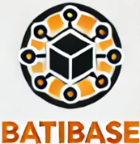
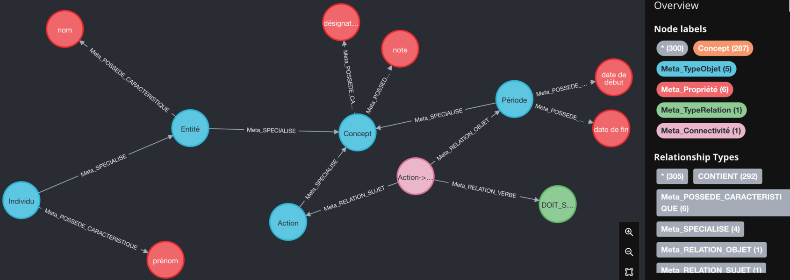
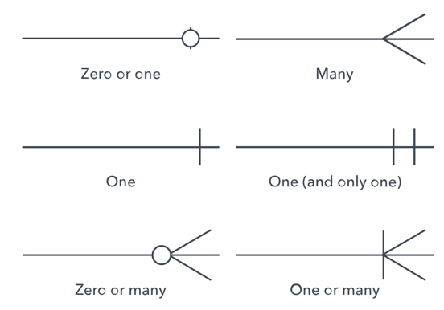
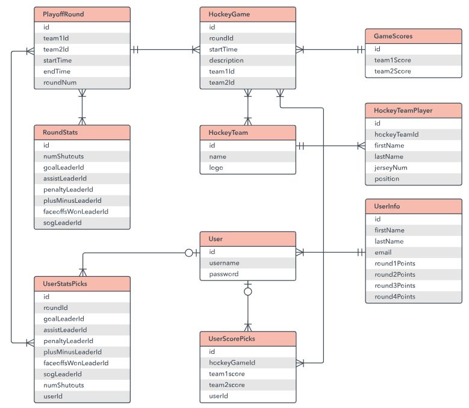
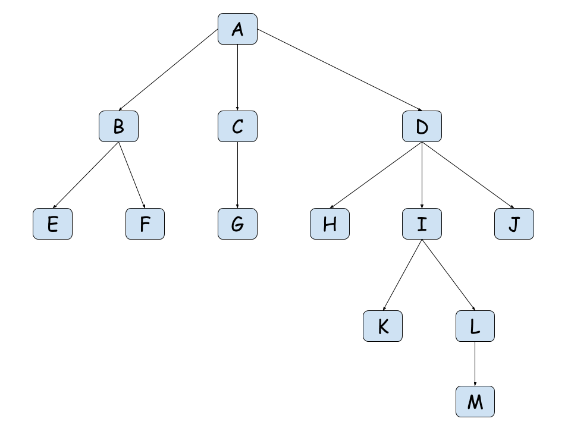
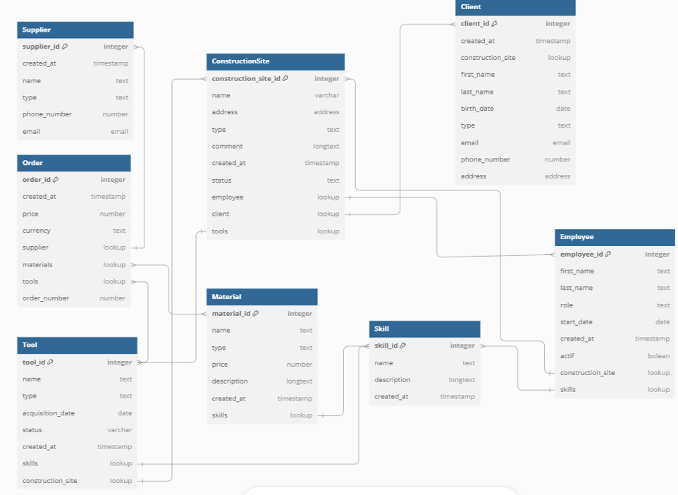

Ce POK a pour but de retracer toute la conception d'une base de données, en partant de sa définition pour ensuite la visualiser et l'organiser. Il se séparera en deux parties : une plus théorique et une partie pratique.

## Tâches

- Définition et utilisation d'une base de données
- Format d'une base de données
- Representations possibles
- Bonnes pratiques dans l'architecture
- Création d'une base de données en python sur un cas pratique
- Exploitation rapide de cette base
- Révision du SQL sur cette base

### Sprints

Le but final de ce POK est d'avoir une bonne connsaissance sur la création de base de données pertinente et scalable.

#### Sprint 1

- [x] Définir d'une base de données ainsi que son utilisation et l'intérêt
- [x] Définir le Format et les éléments qui constituent la base
- [x] Aborder les représentations possibles d'une base de données
- [x] Définir des bonnes pratiques pour créer une base de données
- [x] Définir Les façons de garantir la fiabilité d'une base pour éviter un rattrapage

#### Sprint 2

- [x] Imaginer une entreprise fictive pour travailler dessus
- [x] Etudier et représenter les données qu'elle traite
- [x] Imaginer et construire en diagramme sa base de données
- [x] Construire la base de données à l'aide de python
- [x] Exploiter rapidement la base de données en faisant des requêtes dessus

### Horodatage

Toutes les séances et le nombre d'heure que l'on y a passé.

| Date | Heures passées | Indications |
| -------- | -------- |-------- |
| Mercredi 11/09  | 4h  | Définition base de données + début structures des bases + un peu d'histoire + trouver un exemple |
|Mardi 16/09 | 5h30 |fin structure base + structures transactionnels, mise au propre du markdown + fiabilité + relecture|
|Mercredi 17/09 | 2h | Représentation d'une base + Définir les bonnes pratiques + Bilan sprint |
|Samedi 12/10 | 4h | Etudier, représenter la base |
|Lundi 14/10 | 4h | Construire la base de donnée |
|Mardi 14/10 | 2h | Exploiter la base de données |
| **TOTAL** | **21h30**

# Contenu

## Introduction générale

Dans ce POK, nous allons étudier dans toutes ses dimensions les bases de données. Le but est de mieux comprendre leur architecture et leur fonctionnement afin de les rendre plus optimales et évolutives pour l'avenir d'une entreprise.

Pour ce POK, nous allons travailler dans le cadre d'une entreprise fictive de **construction de bâtiment**. Nous allons ensuite développer tous les aspects de la base de données en l'orientant sur cette entreprise afin d'imaginer leur architecture, leur fonctionnement...

# Premier Sprint

## Définition générale d'une base de données

Une base de données est un moyen de stockage digital qui permet de stocker des informations ou des données. Elle peut avoir différentes structures globales que nous aborderons plus en détail dans la partie sur la structure :

- **Structuré** : Organisation précise permettant de bien identifier chaque type de données pour chacun des utilisateurs.
- **Semi-Structuré** : Organisation intermédiaire entre une structure complète et une base sans structure.
- **Brute** : Un ensemble de données sans structure (informations mélangées sans catégorie).

Une base de données est manipulable et modifiable ; on peut ajouter des données, en supprimer et en modifier en fonction des besoins d'un utilisateur. Une base de données est visionnable mais peut avoir des règles de sécurité qui restreignent la vue des utilisateurs.

Pour les données sensibles, une base est soumise aux conditions du RGPD.

Si plusieurs bases de données fonctionnent en collection, on parle de banque de données.

## Présentation de l'entreprise exemple fictive

L'entreprise exemple fictive que nous allons utiliser tout au long de l'exercice se nomme **BatiBase**. C'est une entreprise qui travaille dans le secteur du bâtiment en faisant du génie civil. Elle intervient sur de grands chantiers partout en France et ne possède actuellement pas de système digital 🥵. En effet, elle s'est développée très vite après sa création et n'a pas eu le temps de mettre à jour ses systèmes. Il faut donc urgemment y remédier !

Pour cela, BatiBase a fait appel à nous afin de construire leur base de données. Ils ne connaissent pas bien les bases de données et nous laissent donc libre choix sur tout, tant que cela couvre leur activité et que la base est scalable. Nous allons donc devoir choisir un modèle d'architecture et le construire en suivant les recommandations d'experts.

*(ChatGPT)*

## Utilisation d'une base de données

Elle est utilisée dans le monde digital pour conserver des données sur des personnes physiques, morales, ainsi que sur des objets, etc.

Elle permet à la personne qui collecte les données d'analyser des comportements, de savoir qui sont ses clients, etc. Les exemples d'utilisation sont infinis.

Pour notre entreprise de construction, la base de données est nécessaire afin de contrôler plusieurs choses :

- Les clients
- Les fournisseurs de matériaux
- Les matériaux
- Les chantiers
- Les outils
- Les employés

La base de données va permettre de stocker tout ceci en les liant afin de savoir où se situent chacune des parties prenantes.

## Intérêt d'une base de donnée

L'intérêt principal d'utiliser une base de données est qu'elle permet de centraliser toutes les informations d'une entreprise afin de faciliter la communication et l'échange d'informations. Il n'est donc plus nécessaire, par exemple, d'appeler tous les chefs de chantier pour savoir où se trouve un camion, car son utilisation sera stockée dans la base.

De plus, tout le monde peut se connecter à une base de données à tout moment. Cela permet de gagner un temps considérable et d'améliorer l'efficacité, car les données sont disponibles pour tous.

Cela permet aussi de sécuriser les données avec des processus communs en installant des pare-feu pour l'entreprise dans son ensemble, plutôt que d'utiliser des solutions locales comme Google Drive dans une agence ou Microsoft dans une autre. Toutes les données seront protégées et contrôlées de façon homogène. Il est alors également possible de faire des sauvegardes pour éviter la perte d'une feuille de calcul.

Enfin, cela permet de centraliser le système à l'échelle de l'entreprise et non plus département par département, agence par agence. BatiBase n'a aujourd'hui aucun moyen de réfléchir à l'échelle de la France et ne peut donc pas se baser sur des KPI solides pour suivre la croissance.

## Structure des bases

Pour le choix de la structure de la base de données de BatiBase, nous allons d'abord étudier les modèles possibles :

### Base de données relationnelle

Ce modèle de données date de 1960 et a été proposé par Edgar Frank Codd.



Edgar Frank Codd était un informaticien britannique chez IBM qui a reçu le prix Turing pour son système de base de données. Ce prix est attribué chaque année à une personne sélectionnée pour sa contribution à la communauté informatique.



Monsieur Codd est parti du constat que les bases de données traditionnelles ne permettaient pas de représenter et d'exploiter correctement les liens entre les objets. Pour changer cela, il organise les informations des bases sous forme de tableaux à deux dimensions : les lignes sont les enregistrements et les colonnes sont les attributs.

On utilise essentiellement le SQL pour exploiter ces données, car le SQL est basé sur l'algèbre relationnelle, qui permet d'effectuer des jonctions entre les objets à l'aide de clés.

Ce système atteint cependant ses limites pour les très grandes entreprises, car il se base sur les propriétés ACID *(voir structure transactionnelle)*.

Voici un schéma de cette représentation :

*(File : RDBMS structure.png - Wikimedia Commons, 2010)*

On observe bien le procédé de stockage sous forme de tableau. On peut aussi voir le fonctionnement plus classique d'une base de données avec les processus qui se déroulent dans une instance et qui sont ensuite reportés sur le disque de la base tout en conservant des logs.

### Base de données NoSQL

Cette architecture est née suite à un problème de quantité de données et de gestion multiple. En effet, certaines entreprises (Google, Facebook, Amazon, etc.) ont commencé à avoir des besoins de gestion de données en quantité astronomique, et un modèle de données relationnelles sur un serveur ne peut pas répondre à ces besoins en raison de limites comme les règles ACID ou le besoin de travailler sur de nombreux serveurs en même temps. Il en est alors résulté ce modèle qui se base davantage sur la quantité de données que sur leur organisation. On retrouve donc un modèle à une dimension avec souvent des tableaux associatifs (une clé et une valeur) et des millions d'entrées par jour.

On peut citer les systèmes de base de données de Google : BigTable ; Amazon : Dynamo ; LinkedIn : Voldemort ; Facebook : HBase.

Si l'on se penche sur le fonctionnement de LinkedIn, par exemple, on retrouve un système de clé qui s'associe à un index, lui-même associé à la clé et à la valeur, comme sur le schéma ci-dessous :

*(File : HASHTB08.svg — Wikimedia Commons, s. d.)*

Le tableau n'a alors pas d'ordre et l'on retrouve l'index très rapidement pour ensuite accéder au reste. Ceci permet de gagner en efficacité et en temps tout en permettant la répartition des données sur différents serveurs. Pour constituer ce genre de tableau, on utilise des fonctions de hachage que l'on doit définir de sorte à éviter les duplicats et à garantir que deux clés n'aient pas le même index.

### Base de données orientée document

Une base de données orientée document est une base de données semi-structurée qui stocke les données par collection présentant des propriétés et des types différents. Les données sont donc organisées par groupe, et le principal désavantage est qu'elles ne sont pas organisées entre elles. Cependant, la flexibilité de cette base la rend très utile pour stocker des données hétérogènes. Ce modèle répond donc très bien aux demandee d'agilité actuelles.

### Base de données orientée Graph

Cette base a une organisation sous la forme de graphique où chaque entité correspond à un nœud, et les entités sont liées entre elles par des branches. Le but de ce type de base de données est de représenter les données de façon interconnectée. L'avantage principal de ce modèle est qu'il permet de fouiller en profondeur dans des bases sans avoir à utiliser une infinité de jointures. Cette base permet aux utilisateurs de se promener dans le graphique facilement pour passer d'un enregistrement à un autre. On peut associer cela aux connexions des réseaux sociaux où les personnes se connectent entre elles.

*(Vauquier, 2022)*

## Structure transactionnelle

Une transaction est l'action de passer une donnée d'un endroit à l'autre (cela comprend l'envoi, le trajet, la réception et la création de la donnée au nouvel endroit).

### ACID

ACID (**Atomicité**, **Cohérence**, **Isolation**, **Durabilité**) correspond a des propriétés de base de données sur les transactions.

Propriétés :

- *Atomicité* : Il faut que la transaction doit soit arriver à son endroit final, soit être conservée dans l'endroit initial. Il ne peut y avoir ni perte ni modification si la transaction n'aboutit pas.
- *Cohérence* : Garantie que même si des actions sont effectuées en simultané, les données restent cohérentes, accessibles à tous et sans doublon partout.
- *Isolation* : Une transaction concernant un enregistrement peut nécessiter que la transaction précédente sur le même enregistrement soit réalisée avant de s'exécuter.
- *Durabilité* : Toutes les transactions validées sont conservées, même en cas de panne du système.

Ces règles peuvent rendre le procédé lourd pour une entreprise gérant des milliards de données chaque jour, car la cohérence constante ne peut pas être maintenue tout en conservant la vitesse de transaction.

Elles sont cependant nécessaires pour garantir une absence totale d'erreur, et c'est pourquoi on retrouve ce système dans les banques, par exemple, pour la gestion des comptes.

### BASE

BASE est l'oppossé de ACID : **basically available**, **soft state**, **eventually consistent** (fondamentalement disponible, état souple et finalement cohérent)

Propriétés :

- *Fondamentalement disponible* : La validation des transactions peut se faire simultanément pour plusieurs utilisateurs sans avoir à attendre que la précédente soit terminée.
- *Etat souple* : Il peut exister des états de transition si un enregistrement est modifié par plusieurs personnes en même temps. La transaction se fera lorsque tout le monde aura terminé.
- *Finalement cohérent* : La cohérence est respectée lorsque toutes les transactions simultanées sur un enregistrement sont terminées.

Ces règles sont beaucoup plus souples que les règles ACID et sont, par exemple, utilisées par des sites de commerce en ligne : plusieurs personnes peuvent commander un produit en même temps, et le stock sera modifié plus tard.

La flexibilité, la performance, l'évolutivité et la synchronisation sont beaucoup plus chronophages et demandeuses en termes de puissance pour les systèmes ACID que pour les systèmes BASE. Cependant, le traitement ACID, plus rigide, permet de garantir une absence totale d'erreur.

## Représentations possibles d'une base de données

### Diagramme entité-relation

Dans ce type de diagramme, il existe les objets, leurs associations et les attributs. Il peut être utilisé pour représenter une base de données, mais aussi une organisation d'entreprise ou autre. Les objets sont sous forme de carrés, et leur façon d'interagir ensemble passe par un losange représentant leur lien. On peut ensuite ajouter des attributs sur les objets en utilisant des ronds.

On précise dans ce modèle le type de lien entre les objets (1, n), (n, 1), (n, n).

*(Database-design — Diagrammes de Modèle D’entité-relation Dans Visio, s. d.)*

### Diagramme de structure de données

Ce diagramme est apparenté au modèle entité-association, mais il est plus focalisé sur la représentation des bases de données. Ce diagramme se concentre sur les liens entre les éléments à l'intérieur des entités, et non plus sur les entités en général.

Il utilise une convention bien précise pour définir les liens entre les éléments. Il est possible de personaliser ces liens en simplifiant en utilisant la convention précédente de (1, n), (n, 1), (n, n) :

*(Qu’est-ce Qu’un Diagramme Entité-association ? , s. d.)*

Ce qui permet d'aboutir à des diagrammes très précis qui permettent de bien comprendre la conception de la base de données. Il peut être intéressant de commencer par un diagramme entité-relation avant de passer à ce type de diagramme pour bien illustrer tous les procédés et liens facilement, puis se pencher ensuite sur le côté plus technique.

*(Qu’est-ce Qu’un Diagramme Entité-association ? , s. d.)*

### Arbre de données

Cette représentation permet de montrer la hiérarchie qu'il existe entre des objets. On peut l'utiliser pour représenter tout ce qui découle d'un certain objet des diagrammes précédents ou plus directement pour une base particulièrement centrée sur un objet.

*(Structures de Données Hiérarchiques : Les Arbres, s. d.)*

## Bonnes pratiques pour la réalisation d'un base

Pour une base de données bien réalisée, il est essentiel d'éviter les données erronées qui falsifient par la suite l'utilisation de la base. Il faut donc garantir la fiabilité des données avec les méthodes du paragraphe suivant.

Pour une bonne conception d'architecture, il est recommandé de se centrer sur les objets afin d'organiser proprement les informations. Il faut ensuite bien considérer et créer tous les liens nécessaires aux utilisateurs entre les objets en utilisant une clé unique. En effet, une base bien conçue doit permettre aux utilisateurs d'accéder à toutes les informations dont ils ont besoin à tout moment. Il est donc important de bien comprendre tous les processus d'une entreprise avant de concevoir leur base de données.

Il faut ensuite penser à l'utilisation directe de la base avec les procédés de reporting, etc.

## Garantir la fiabilité de la donnée

Pour garantir la fiabilité des données, il existe plusieurs façons de pousser un utilisateur à remplir les champs dans un format particulier.

En premier, il faut garantir **l'unicité des données**. Pour cela, il faut que chaque enregistrement de la base ait un ID ou une clé unique. Il est également nécessaire d'appliquer des règles d'identification des doublons. Pour cela, il faut protéger la base au niveau de l'instance avec :

- Il est possible de demander une vérification (par exemple, pour la création d'un compte).
- Il est possible d'appliquer des règles de détection automatique qui, basées sur certains critères, peuvent supprimer les enregistrements doublons ou envoyer une alerte au gestionnaire de la base.
- Il est aussi possible de créer des validations en se basant sur de nombreux critères pour le même enregistrement (nom, numéro, date de naissance, ville, etc.).

Ensuite, il faut garantir le **bon remplissage des champs** demandés. Pour cela, l'interface utilisateur peut déjà être d'une grande aide, par exemple avec des suggestions grises sur le format à remplir ou encore la fragmentation du remplissage (sélection du code de pays pour le numéro de téléphone dans un menu déroulant, puis champ pour le numéro).

Au-delà de l'interface utilisateur, il est aussi possible de créer au niveau de l'instance des règles de validation n'autorisant que certains formats pour valider, ou encore d'ajouter des automatismes qui corrigent les données avant leur création dans la base.

Il existe encore d'autres façons de procéder, plus spécifiques à certains champs (comme l'utilisation d'une API Google Maps pour rechercher et remplir les champs d'adresse), mais étant très spécifiques, nous les verrons au cas par cas lors de la création de la base de données dans le sprint 2.



Pour ce Sprint, j'ai sous-estimé le temps passé sur cette première phase d'analyse générale des bases de données. En effet, je suis vite tombé sur beaucoup plus d'informations que je ne pensais. J'ai beaucoup apprécié découvrir l'histoire des bases de données évoluant en même temps que les besoins et les avancées technologiques, mais je me suis donc un peu perdu là-dedans en apprenant beaucoup de choses pas forcément très utiles dans la réalisation de ce POK, mais intéressantes pour la culture. J'ai aussi dû faire une étape du sprint 2 afin d'être plus concret dans la partie 1 du sprint 1. Ceci va par contre me permettre de rester dans les temps pour faire le sprint 2, je l'espère, sur 10h.

J'ai aussi mal réparti mon temps en travaillant dessus beaucoup au dernier moment, ce qui a fait un sprint un peu lourd.



# Second Sprint

## Analyse des données fictives de BatiBase

L'entreprise BatiBase est une entreprise de construction classique qui a besoin de gérer plusieurs choses liées entre elles :

- Les clients
- Les fournisseurs de matériaux
- Les commandes
- Les matériaux (le stock)
- Les chantiers
- Les outils et machines
- Les employés
- Les compétences

Cela va nous permettre de créer une première base qui pourra bien sûr être améliorée par la suite.

Ces objets sont tous liés entre eux afin de pouvoir bien gérer les informations.

Les clients seront liés aux chantiers pour permettre au chef de chantier de communiquer avec eux si besoin, grâce à leurs informations sur leur fiche client dans la base.

Les fournisseurs de matériaux seront liés aux matériaux et aux commandes. En effet, cela permettra de savoir qui a fourni quels matériaux en cas de problème, mais aussi de pouvoir commander des matériaux.

L'objet commande permet de demander quelque chose au fournisseur. Une fois la commande passée, le matériau commandé entre en stock réel. L'objet commande sera donc lié au matériau, en plus de son lien avec le fournisseur. On peut aussi ajouter un lien avec le chantier afin de savoir pour quel chantier la commande est passée.

Comme vu précédemment, les matériaux sont liés aux fournisseurs et aux chantiers.

Les chantiers sont liés aux clients, aux matériaux, aux outils, mais aussi aux employés. Cela permet de savoir qui travaille où et avec quels outils.

Les outils sont liés aux chantiers, et il en est de même pour les employés.

Enfin, les compétences permettront de choisir les employés nécessaires en fonction de leurs expériences, pour la bonne réalisation d'un chantier. Chaque matériau et machine nécessitent des compétences pour pouvoir les utiliser. Tous ces objets seront donc liés entre eux.

Ainsi, nous allons pouvoir créer une première représentation de la base sous forme de diagramme entité-relation, puis de diagramme de structure de données.

## Représentation en diagramme entité relation

*(Diagramme entité relation de la société BatiBase)*

Ce diagramme permet d'avoir déjà un premier bon aperçu du fonctionnement de la base de données pour ensuite entrer dans le détail.

Réaliser ce diagramme permet aussi de prendre conscience des manquements ou des erreurs potentiels dans les liens. C'est en faisant ce diagramme que j'ai pu observer l'absence d'un objet liant les machines aux employés pour savoir quel ouvrier peut conduire quelle machine. L'objet compétence permet donc de créer ce lien.

Nous allons maintenant pouvoir entrer dans le détail.

## Représentation en diagramme de structure de données

Pour réaliser ce diagramme, nous allons commencer à réfléchir a tous les champs de chaque objet.

Pour faire cela, j'ai décidé d'utiliser le site [dbdiagram](https://dbdiagram.io/d). Je n'ai jamais utilisé ce site. Cependant grâce à la [documentation](https://dbml.dbdiagram.io/docs) et aux exemples en ligne j'ai pu le prendre en main rapidement. Il permet de faire un rendu propre d'une base de données afin de pouvoir la construire ensuite rapidement.

*(Diagramme de structure de données de la société BatiBase)*

Le code de ce schéma est retrouvable [ici](DataBaseFile.zip).

Le but de ce schéma est de pouvoir visualiser tous les liens, les clés et les champs de la base de données afin de pouvoir la construire. Ce schéma permet aussi de transmettre au futur équipe qui travailleront dessus un plan clair du fonctionnement de la base afin de pouvoir la faire évoluer en cas de besoin.

## Construction de la base de données

Pour télécharger le fichier python complet : [Fichier python base de donnée](PythonFile.zip)

Pour construire cette base de données, j'ai choisi d'utiliser python avec sa library Pony de base de données car je n'ai pour l'instant eu que l'occasion d'en construire en no-code (Airtable, Salesforce ...). Je souhaitais donc en construire une en partant un peu plus de zéro. Pour cela, j'ai utilisé la [documentation](https://ponyorm.readthedocs.io/en/latest/firststeps.html). J'ai donc construit ma base de données en commençant par faire le model de données.

J'ai donc créé chacun des objets en utilisant des lignes de la forme :

``` python
class Material(db.Entity):
    material_id = orm.PrimaryKey(int , auto = True)
    name = orm.Required(str)
    type = orm.Required(str)
    price = orm.Required(float)
    description = orm.Required(str)
    created_at = orm.Required(str)
    skills = orm.Required(Skill)
    Order = orm.Set("Order")
```

Chacun des champs de l'objet est défini avec un type de façon obligatoire car l'on souhaite que tous les champs soient remplis. Pour créer des liens entre les objets, il faut les définir avec le type de l'objet que l'on veut lier et utiliser la fonction set sur l'objet lié.

Pour une relation en many to many, pony créer automatiquement l'objet intérmédiaire et il suffit de définir sur chacun des objets à lié l'autre objet en utilisant la fonction *set* sur les deux.

Ensuite, j'ai créé la base de données à l'aide du model défini précédement :

```python
from pony import orm
from DataModel import Tool, Employee, Supplier, Order, Skill, Client, Material, ConstructionSite, db

db.bind('sqlite', 'database.sqlite', create_db=True)
orm.sql_debug(True)
db.generate_mapping(create_tables=True)
```

Grâce a ceci, la table se créer et l'on va pouvoir surveiller les requètes SQL graçe au mode debug. Ainsi, avant les réponses dans le terminal de commande, j'obtiens les requètes effectuées.

## Création de données dans la base

Maintenant, je vais créer de la donnée dans la base afin d'être sur de son bon fonctionnement pour pouvoir intéragir avec :

```python
    ConstructionSite1 = ConstructionSite(
        name="Maison4",
        address='Rue des patates',
        type="Maison",
        comment='Réparation cuisine',
        created_at="14/10/2024",
        status="En cours"
    )

    ConstructionSite1.clients.add(Client1)
    ConstructionSite1.tools.add(Tool1)
    ConstructionSite1.employees.add(Employee1)

    db.commit()
```

J'ai aussi créé chacun des autres objets en utilisant toujours la typographie NomDeLaClasse1. Une fois tous les liens et les champs remplis, il faut insérer le tout dans la base afin de créer la data avec la fonction *commit*

Il est temps d'intéragir avec pour vérifier le bon fonctionnement !

## Intéraction avec la base de données

Pour intéragir avec la base de donnée, il est possible d'utiliser du language python :

```python
from pony import orm
from DataModel import db, Client

db.bind('sqlite', 'database.sqlite', create_db=True)
db.generate_mapping()

with orm.db_session:
    client = Client.get(first_name='Patrick', last_name='Oudi')

    if client:
        print(f"{client.first_name} {client.last_name}, Email: {client.email}")
    else:
        print("Le client n'existe pas")
```

Grâce à ceci, on obtient bien le client cherché avec ses informations. Il est aussi possible de faire des requètes légèrement plus technique :

```python
with orm.db_session:
    sql = """
    SELECT o.order_id, o.created_at, o.price, o.currency,
           s.name AS supplier_name, s.phone_number AS supplier_phone
    FROM "Order" AS o
    JOIN "Supplier" AS s ON o.supplier = s.supplier_id
    """

    result = db.execute(sql)

    for row in result:
        print(f"Order ID: {row[0]}, Created At: {row[1]}, Price: {row[2]}, Currency: {row[3]}, "
              f"Supplier: {row[4]}, Phone: {row[5]}")
```



Pour ce Sprint, j'ai réussi a plutôt bien répartir mon temps mais je ne suis pas allé aussi loin que je le souhaitais. J'ai cependant rempli l'essentiel de mes objectifs et j'ai pu apprendre a maitriser la bibliothèque Pony pour gérer les bases de données. J'ai découvert une autre façon de les gérer qui est quand même moins visuel et intuitive que du no code mais tout autant intéressante. Je reste un peu sur ma fin sur l'utilisation de la base car je n'ai pas eu assez de temps pour vraiment plonger dedans et jouer avec. Cependant, je pense avoir bien compris le fonctionnement.

Globalement sur ce POK je pense avoir vraiment approndi le sujet dans sa globalité comme je le voulais. En effet je travail avec beaucoup de base de données mais je n'ai jamais pris le temps de connaitre leur fonctionnement et d'apprendre à les représenter.

