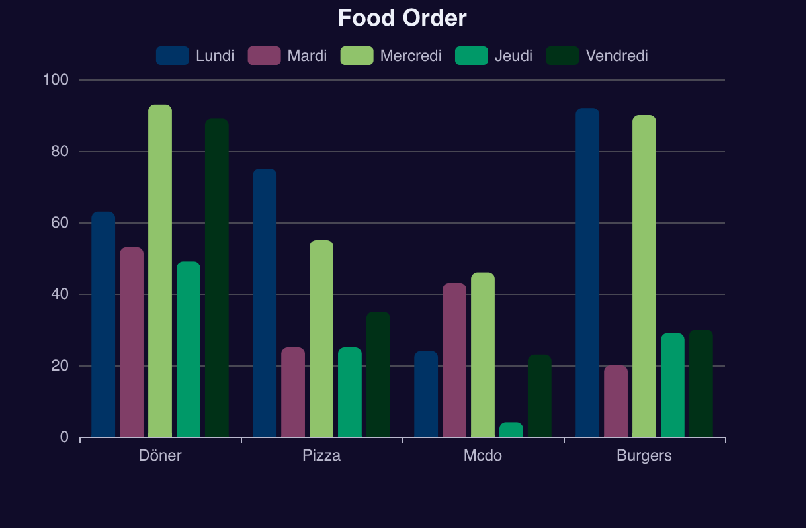
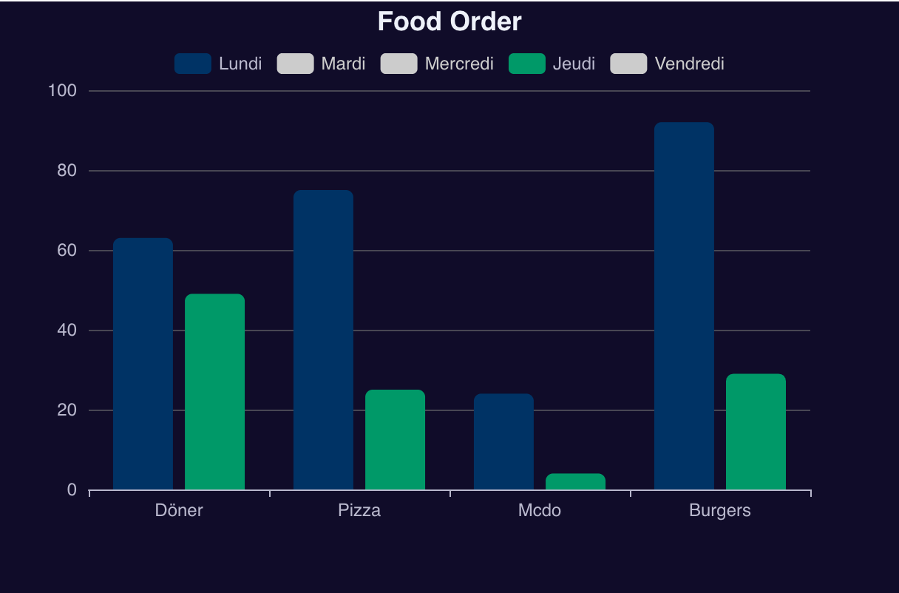
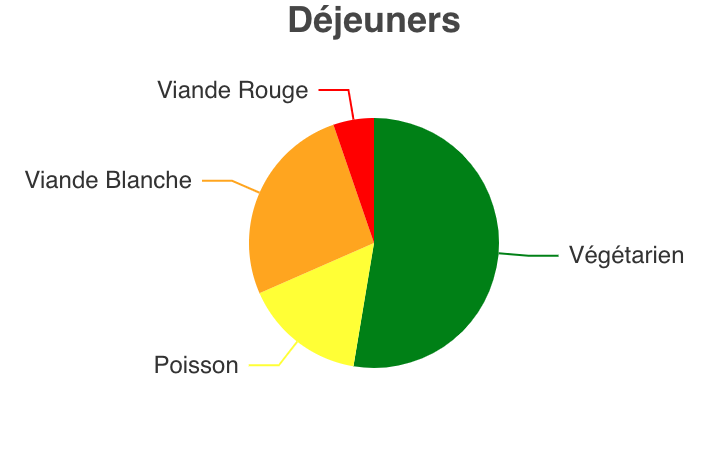
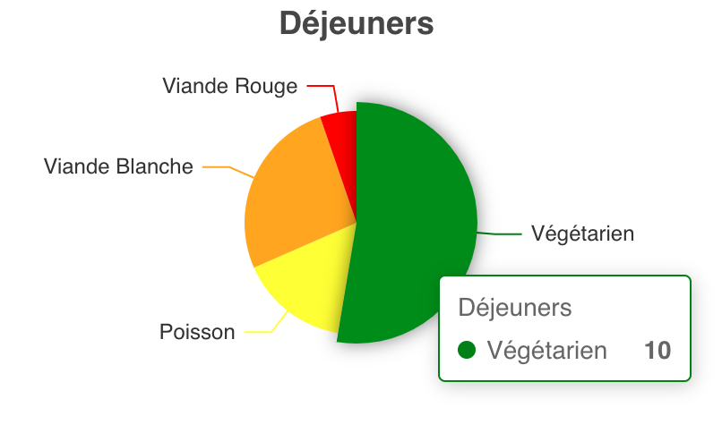



Avoir des bases en JS




[`Exemple de datavisualisation`](https://echarts.apache.org/examples/en/index.html#chart-type-line)
[`Documentation de Echart`](https://echarts.apache.org/en/option.html#title)


## Contenu

Après mon POK sur la datavisualisation grâce à Looker studio, j'étais curieuse de découvrir d'autres outils avec lesquels, on pouvait faire encore plus de graphiques différents, le tout gratuitement.
J'ai une amie qui m'a parlé de Echart qu'elle allait peut-etre utiliser pour son alternance. J'ai donc regardé et il y a un grand nombre de choix de style de graphique.

J'ai donc d'abord créé un nouveau projet pour tester les fonctionnalités de cette librairie.

Pour installer echart il faut utiliser la commande `npm install echarts vue-echarts `

Pour un diagramme de barres, on peut notemment personaliser le titre, les couleurs, la légende, la donnée que l'on voit au survol, le style du titre ...

En cliquant sur une catégorie dans la légende, on peut afficher ou cacher des données.

Je me suis donc entrainée en testant plusieurs option afin de bien les comprendres

Exemple de visualisation de données

Exemple de séléction de données grâce à la légende:

Je me suis en suite intéressée au diagrammes 'Camembert' que je voulais utiliser sur mon POK. Et après avoir fait des essais avec de fausses données sur des ventes d'équipements de sport, j'ai utilisé ce que j'avais appris dans mon POK pour que les utilisateurs puissent visualiser leurs données.

Malheureusement, j'ai eu du mal à traiter les données que j'avais dans ma base de données pour les afficher ainsi qu'à gérer des problèmes liés aux fonctions asynchrones et j'ai donc perdu beaucoup de temps. Néanmoins, j'ai réussi à faire apparaitre des graphiques pour lesquels, j'ai mis une légende et un titre différents en fonction du tracker que l'on regarde.

On peut cliquer sur les différentes 'parts' du camembert pour savoir le nombre exact de fois où cette carétogie a été choisie.

