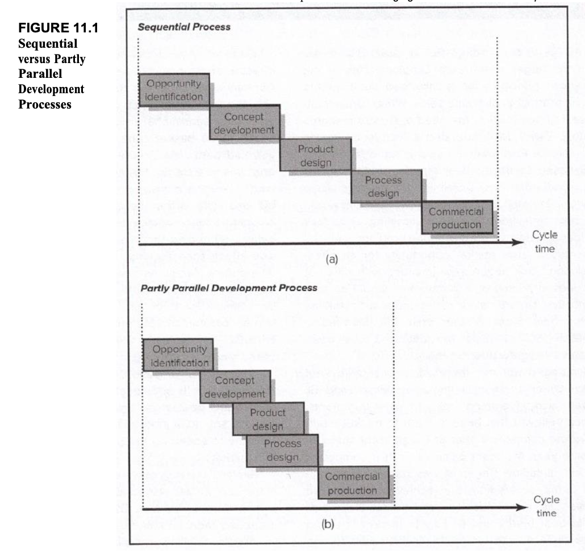
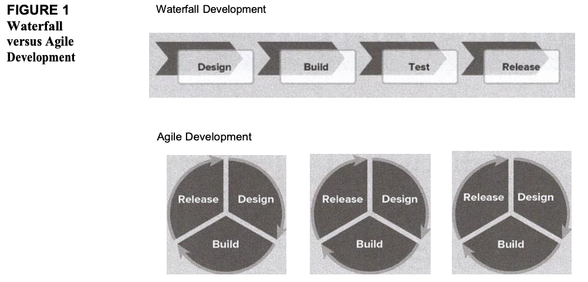
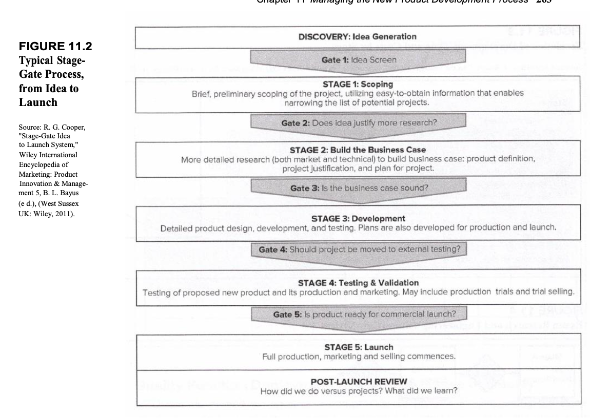
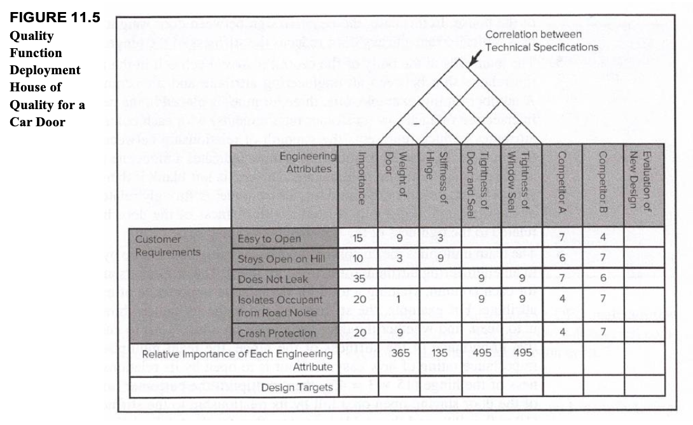



1. [`Innovation Management : Who innovate ?`](https://francoisbrucker.github.io/do-it/promos/2024-2025/Merle-Thomas/mon/temps-2.2)
2. [`Innovation Management : How to protect and make the Innovation viable ?`](https://francoisbrucker.github.io/do-it/promos/2024-2025/Merle-Thomas/mon/temps-3.1)
3. Connaissances de base en innovation:

* Compréhension des concepts clés : innovation incrémentale, radicale, disruptive.
* Familiarité avec les outils de gestion de l'innovation (roadmapping, gestion de projets, R&D)

1. Maîtrise des outils de propriété intellectuelle




* [`Innovation Management : Who innovate ?`](https://francoisbrucker.github.io/do-it/promos/2024-2025/Merle-Thomas/mon/temps-2.2)
* [`Innovation Management : How to protect and make the Innovation viable ?`](https://francoisbrucker.github.io/do-it/promos/2024-2025/Merle-Thomas/mon/temps-3.1)


* le niveau et les prérequis nécessaires en utilisant la balise [`prerequis`](/cs/contribuer-au-site/#prerequis)
* les autres POK & MON en rapport en utilisant la balise [`lien`](/cs/contribuer-au-site/#lien)


Objectifs :

1. Comprendre les défis du développement de nouveaux produits
2. Optimiser la prise de décision dans les projets innovants
3. Mesurer et améliorer la performance des processus de développement
4. Explorer des stratégies collaboratives et ouvertes
5. Adopter une approche stratégique du développement produit 
6. Stimuler la capacité d'innovation des entreprises
   


---

## Table des matières

- [Table des matières](#table-des-matières)
- [1 : Objectifs stratégiques du développement de produits](#1-objectifs-stratégiques-du-développement-de-produits)
  - [1.1. Maximiser l’adéquation avec les besoins des clients](#11-maximiser-ladéquation-avec-les-besoins-des-clients)
  - [1.2. Minimiser le temps de développement](#12-minimiser-le-temps-de-développement)
  - [1.3. Contrôler les coûts de développement](#13-contrôler-les-coûts-de-développement)
- [2 : Processus et approches de développement](#2-processus-et-approches-de-développement)
  - [2.1. Les méthodes de développement séquentiel et parallèle](#21-les-méthodes-de-développement-séquentiel-et-parallèle)
  - [2.2. L’agilité avec les méthodes agiles](#22-lagilité-avec-les-méthodes-agiles)
  - [2.3. Les processus de validation : Stage-Gate Process](#23-les-processus-de-validation--stage-gate-process)
- [3 : Implication des parties prenantes](#3-implication-des-parties-prenantes)
  - [3.1. Rôle des clients](#31-rôle-des-clients)
  - [3.2. Collaboration avec les fournisseurs](#32-collaboration-avec-les-fournisseurs)
  - [3.3. Crowdsourcing](#33-crowdsourcing)
- [4 : Outils d’optimisation du développement](#4-outils-doptimisation-du-développement)
  - [4.1. Quality Function Deployment (QFD)](#41-quality-function-deployment-qfd)
  - [4.2. Design for Manufacturing (DFM)](#42-design-for-manufacturing-dfm)
  - [4.3. Failure Modes and Effects Analysis (FMEA)](#43-failure-modes-and-effects-analysis-fmea)
- [Conclusion](#conclusion)
- [Sources](#sources)
- [Horodateur](#horodateur)

---

La capacité à développer rapidement et efficacement des produits innovants constitue un levier essentiel pour assurer la compétitivité des entreprises. Cependant, les échecs restent nombreux : plus de **95 %** des projets de développement de nouveaux produits n’apportent pas de retour économique positif. Cette réalité soulève la question centrale suivante : **comment optimiser le processus de développement de produits afin d’améliorer la performance des entreprises et leur aptitude à innover ?**

## 1 : Objectifs stratégiques du développement de produits

Pour maximiser les chances de succès d’un projet d’innovation, trois objectifs stratégiques doivent être poursuivis simultanément :

### 1.1. Maximiser l’adéquation avec les besoins des clients

Le succès d’un produit dépend de sa capacité à offrir des fonctionnalités pertinentes, une qualité supérieure ou un prix attractif.

* **Définitions clés** :

  * **Adéquation produit/marché** : correspond à la mesure dans laquelle un produit satisfait les attentes des clients cibles.
  * **Sur-conception** : ajouter des fonctionnalités inutiles qui augmentent le coût sans apporter de valeur supplémentaire.
  * **Analyse des besoins clients** : une méthode systématique pour recueillir et comprendre les préférences des utilisateurs.

* **Outils recommandés** :
  * **Focus groups** : permettent de recueillir des feedbacks qualitatifs sur les idées de produits.
  * **Minimum Viable Product (MVP)** : tester rapidement une version simplifiée du produit.

### 1.2. Minimiser le temps de développement

L’avantage du premier arrivant sur un marché reste déterminant pour établir une base d’utilisateurs fidèle et capturer des ressources stratégiques.

* **Définitions clés** :
  * **Time to Market (TTM)** : délai entre le début du développement et la commercialisation.
  * **Prototypage rapide** : création de modèles fonctionnels à moindre coût et en un temps court.

* *Recommandations* :
  * Utiliser des approches agiles pour accélérer les itérations.
  * Favoriser le prototypage rapide pour valider les idées.

### 1.3. Contrôler les coûts de développement

Un produit peut être innovant et parfaitement adapté au marché tout en étant économiquement non viable si ses coûts de développement sont trop élevés.

* **Définitions clés** :
  * **Coûts fixes** : dépenses qui restent constantes indépendamment du volume de production.
  * **Coûts variables** : dépenses directement liées à la production.
  * **Budget prévisionnel** : estimation des coûts totaux d’un projet.

* *Recommandations* :
  * **Déployer des outils de suivi budgétaire.
  * Prioriser les fonctionnalités essentielles.
  * Utiliser des techniques de Design to Cost (DTC) pour concevoir des produits conformes aux contraintes budgétaires.

---

## 2 : Processus et approches de développement

### 2.1. Les méthodes de développement séquentiel et parallèle

1. **Développement séquentiel** : chaque étape (analyse, conception, prototypage, test) est menée de manière linéaire. Cette approche garantit une structure claire mais peut entraîner des retards et un manque de flexibilité.

2. **Développement parallèle** : plusieurs étapes sont réalisées simultanément, permettant une meilleure coordination entre les équipes. Cette méthode réduit les temps de cycle mais peut engendrer des conflits si les dépendances ne sont pas bien gérées.

*Recommandation* : favoriser le développement parallèle pour réduire les itérations chronophages tout en maintenant une coordination rigoureuse.

### 2.2. L’agilité avec les méthodes agiles

Les méthodes agiles reposent sur des cycles courts appelés sprints, une forte collaboration entre équipes et une remise en question continue des solutions.

* **Définition**:
**Agile development** = A process commonly usedin software whereby the overall product is broken down into smaller independent pieces that are worked on by autonomous, self-organizing teams. Features are developed and presented to customers quickly so that the overall product can be rapidly and continuously adapted.

* **Concepts clés** :
  * **Scrum** : cadre agile organisé autour de sprints de deux à quatre semaines.
  * **Product Owner** : responsable de la vision produit et de la priorité des tâches.
  * **Sprint Review** : évaluation de l’avancement et ajustements nécessaires.
  * **Rétrospective** : analyse post-sprint pour identifier les points d’amélioration.

* *Recommandations* :
  * Mettre en place des réunions quotidiennes (daily stand-ups) pour synchroniser les efforts.
  * Favoriser une forte implication des parties prenantes pour des ajustements rapides.

### 2.3. Les processus de validation : Stage-Gate Process

Le modèle Stage-Gate segmente le développement en étapes successives ponctuées de points de décision (gates). Chaque gate permet de valider la progression du projet, de réaliser des ajustements ou d’arrêter le projet.

* *Définition*:
  **go/kill decision points** = Des points de décision sont établis dans le processus de développement, où les gestionnaires doivent décider s'ils mettent fin au projet ou le laissent continuer.

*Recommandation* : utiliser ces points pour valider la pertinence du projet et réduire les risques liés à un développement inefficace.

---

## 3 : Implication des parties prenantes

### 3.1. Rôle des clients

Les clients peuvent intervenir en tant que sources d’informations ou co-développeurs.

Types d’implication client :

* **Consultation** : recueil de feedbacks via des enquêtes ou entretiens.
* **Co-conception** : participation active à la définition des fonctionnalités du produit.
* **Beta-tests** : tests réalisés par les utilisateurs avant la sortie commerciale.

*Exemple* : les programmes bêta-tests permettent d’impliquer directement les utilisateurs finaux et d’obtenir des retours précieux.

*Recommandation* : intégrer les utilisateurs clés dès les premières phases du développement.

### 3.2. Collaboration avec les fournisseurs

Les fournisseurs peuvent contribuer à optimiser la conception des produits en proposant des solutions techniques innovantes ou en adaptant leurs propres processus.

* **Avantages** :

  1. Réduction des coûts de production.
  2. Amélioration de la qualité des composants.
  3. Accélération des délais de livraison.

*Exemple* : Boeing a intégré ses fournisseurs dans le développement du 777, ce qui a permis une meilleure compatibilité des pièces et une réduction des coûts.

*Recommandation* : créer des partenariats stratégiques avec les fournisseurs pour stimuler l’innovation.

### 3.3. Crowdsourcing

Le **crowdsourcing** est une approche de résolution de problèmes ou de production qui fait appel à un large groupe de personnes, souvent via une plateforme en ligne. Les participants contribuent volontairement par des idées, des compétences ou des ressources en échange de récompenses, de reconnaissance ou simplement du plaisir de participer.

* 4 étapes du crowdsourcing:
  1. **Définition du besoin (Need Translation)** : Une déclaration claire et concise du besoin est formulée en supprimant tout jargon industriel. L'objectif est de traduire le défi en termes scientifiques simples pour attirer des solutions provenant de divers domaines, parfois inattendus. 
  2. **Connexion (Connecting)** : Le défi d'innovation est diffusé au sein d'un réseau de fournisseurs de solutions
  3. **Evaluation (Evaluation/Selection)** : Les propositions soumises sont examinées en profondeur. Les solutions les plus prometteuses sont compilées dans un rapport.
  4. **Acquisition** : L'entreprise engage des négociations avec le fournisseur de la solution choisie pour conclure un accord portant sur le transfert de connaissances, une licence, un brevet, etc. Il peut également être nécessaire d'adapter la solution à ses besoins spécifiques.

*Exemples de plateformes* :
  * Topcoder : accès à une communauté de développeurs et experts techniques.
  * InnoCentive : résolution de problèmes scientifiques.

**Avantages** :
  * Diversité des idées.
  * Rapidité de résolution.

*Recommandation* : solliciter des plateformes spécialisées pour accéder à des experts mondiaux et bénéficier d’idées novatrices.

---
## 4 : Outils d’optimisation du développement

### 4.1. Quality Function Deployment (QFD)

**Le Quality Function Deployment** (QFD), également appelé « maison de la qualité », est une méthode structurée qui permet de traduire les exigences des clients en caractéristiques techniques du produit. Cette approche vise à aligner les objectifs de conception sur les besoins réels des utilisateurs.

* **Étapes principales** :

  1. Identifier les attentes et besoins des clients.
  2. Hiérarchiser ces besoins en fonction de leur importance.
  3. Traduire les besoins clients en spécifications techniques.
  4. Analyser les relations entre les spécifications techniques.
  5. Comparer les performances du produit avec celles des concurrents.

* **Avantages** :
  * Meilleure adéquation produit/marché.
  * Identification précoce des compromis techniques nécessaires.
  * Amélioration de la communication entre les départements.

* *Recommandation* : utiliser cette méthode pour aligner les objectifs techniques avec les attentes clients et renforcer la compétitivité du produit.

### 4.2. Design for Manufacturing (DFM)

**Le Design for Manufacturing** (DFM) est une approche qui vise à concevoir des produits de manière à faciliter leur fabrication tout en réduisant les coûts et les erreurs de production.

* **Principes clés** :
  * Réduire le nombre de pièces pour simplifier l'assemblage.
  * Standardiser les composants.
  * Faciliter l'accès pour les opérations d'assemblage et de maintenance.
  * Utiliser des matériaux adaptés aux procédés de fabrication.

* **Avantages** :
  * Diminution des coûts de production.
  * Réduction du temps d'assemblage.
  * Amélioration de la qualité des produits.

*Exemple* : NCR a réduit de 75 % le temps d’assemblage d’une caisse enregistreuse grâce à l’application du DFM.

*Recommandation* : intégrer cette méthode dès les premières phases de conception pour réduire les coûts et les délais de fabrication.

### 4.3. Failure Modes and Effects Analysis (FMEA)

La **Failure Modes and Effects Analysis** (FMEA) est une méthode proactive utilisée pour identifier les potentielles défaillances d'un produit ou d'un processus, évaluer leur gravité, leur fréquence d'apparition et leur détectabilité, puis mettre en place des actions correctives pour les prévenir.

* **Étapes principales**

  1. Identifier les modes de défaillance possibles.
  2. Évaluer chaque défaillance selon trois critères : gravité, occurrence et détectabilité.
  3. Calculer un Risk Priority Number (RPN) : Gravité x Occurrence x Détectabilité.
  4. Prioriser les défaillances à traiter.
  5. Proposer des actions correctives pour réduire les risques.

* **Avantages** :
  * Identification précoce des risques.
  * Réduction des coûts liés aux défauts.
  * Amélioration continue des produits et processus.

*Exemple* : La NASA utilise la FMEA pour sécuriser ses missions spatiales.

*Recommandation* : adopter le FMEA pour les projets critiques nécessitant une gestion rigoureuse des risques.

Cette méthode identifie les potentielles défaillances et établit des priorités pour leur prévention.

## Conclusion 

Les entreprises utilisent divers indicateurs pour mesurer l'efficacité et l'efficience de leurs processus de développement de nouveaux produits. Ces métriques permettent d'évaluer leur capacité à mener les projets de manière optimale, de la conception à la mise sur le marché.

1. Évaluation du Processus de Développement :
Les questions clés incluent :
   * Quel est le temps moyen de développement (cycle de vie) des projets, et comment varie-t-il selon qu'il s'agit de projets de rupture, de plateformes ou dérivés ?
   * Quel pourcentage de projets respectent les délais fixés ?
   * Quel pourcentage de projets restent dans le budget prévu ?
   * Quel pourcentage de projets aboutissent à un produit finalisé ?

2. Évaluation de la Performance Globale de l'Innovation :
Les entreprises évaluent aussi la rentabilité globale de leurs efforts d'innovation, notamment par :
   * Le retour sur innovation (rapport entre les bénéfices tirés des nouveaux produits et les dépenses associées, telles que R&D, fabrication, commercialisation).
   * Le pourcentage de projets atteignant leurs objectifs de vente.
   * La proportion de revenus générés par des produits développés au cours des cinq dernières années.
   * Le ratio de projets réussis par rapport au total des projets lancés.

Ces indicateurs offrent aux entreprises une vision complète de la valeur générée par leurs efforts d'innovation, tout en identifiant les axes d'amélioration pour renforcer leur compétitivité.

---

## Sources

- Schilling, Melissa A. *Strategic Management of Technological Innovation.*, Chap.11,  McGraw-Hill Education.
- Cooper, Robert G. *Winning at New Products: Creating Value Through Innovation.* Basic Books.
- NineSigma et InnoCentive: Plateformes pour le crowdsourcing de l'innovation.

---

## Horodateur

Toutes les séances et le nombre d'heures que l'on y a passé.

| Date | Heures passées | Indications |
| -------- | -------- |-------- |
| 24/01 | 2H | **Définition des objectifs stratégiques** : Recherche et rédaction des sections sur l’adéquation aux besoins des clients, la minimisation du temps de développement et le contrôle des coûts. |
| 25/01 | 3H | **Processus et approches de développement** : Explication des méthodes séquentielles et parallèles et introduction des principes agiles et étude du processus Stage-Gate. |
| 31/01 | 2H | **Implication des parties prenantes** : clients, fournisseurs et analyse approfondie du concept de crowdsourcing |
| 01/02 | 3H | **Outils d’optimisation du développement** : QFD, DFM, FMEA |
| 03/02 | 1H | **Conclusion et synthèse** |
