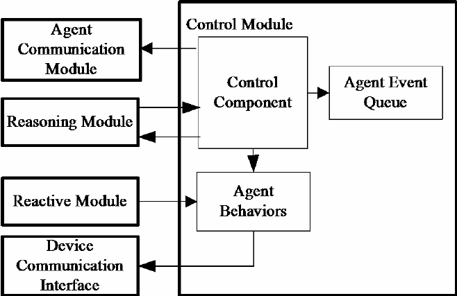
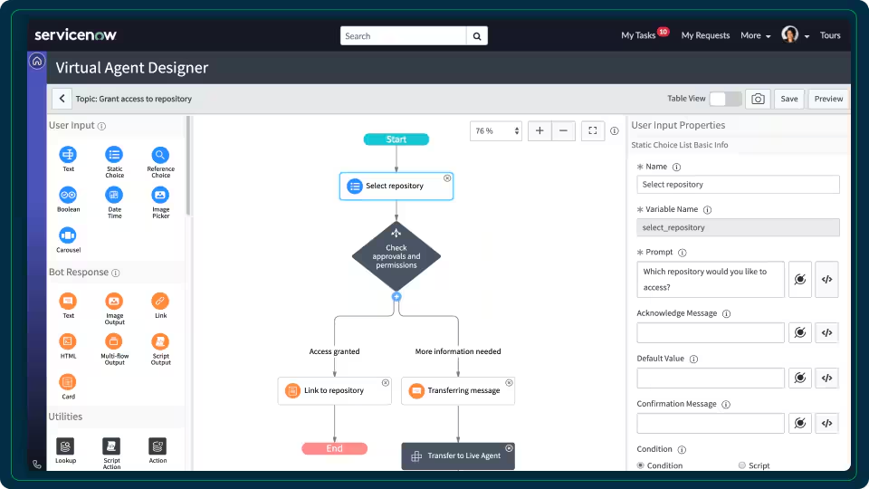
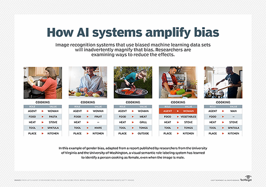






[Amazon AI Agents](https://aws.amazon.com/fr/what-is/ai-agents/)

[Wikipédia : Les Agents intelligents](https://fr.wikipedia.org/wiki/Agent_intelligent)



## Contenu

### Introduction

Les agents d’intelligence artificielle (IA) jouent un rôle central dans les avancées technologiques actuelles. Ce terme désigne des systèmes capables d’interagir avec leur environnement, de prendre des décisions et d’agir de façon autonome pour atteindre des objectifs spécifiques. Ces agents ne se limitent pas à des commandes simples : ils apprennent de leurs expériences, ce qui les rend utiles dans des contextes complexes et dynamiques.

L’idée d’automatiser des tâches grâce à des entités intelligentes remonte au milieu du XXᵉ siècle avec des pionniers comme Alan Turing et John McCarthy. Les premiers systèmes étaient limités, mais ils ont ouvert la voie aux agents modernes, capables d’autonomie et d’adaptation.

Aujourd’hui, ces agents sont présents dans de nombreux secteurs. Ils traitent des volumes massifs de données, automatisent des tâches répétitives et fournissent des solutions en temps réel. Cependant, leur montée en puissance soulève des questions éthiques et techniques liées à leur autonomie, leur transparence et leur impact. Ce projet explore les types, le fonctionnement, les applications et les enjeux des agents IA.

### Typologie des agents IA

Les agents IA se distinguent par leur capacité à percevoir leur environnement, à prendre des décisions autonomes et à agir. Ils sont classés selon leur complexité :

- **Agents à réflexes simples** : réagissent directement aux stimuli via des règles fixes. Efficaces dans des environnements simples.
- **Agents basés sur des modèles** : intègrent une représentation interne de l’environnement, leur permettant d’anticiper les conséquences de leurs actions.
- **Agents orientés objectifs** : évaluent plusieurs options pour atteindre un objectif spécifique, comme optimiser des itinéraires.
- **Agents d’apprentissage** : améliorent leurs performances grâce à l’apprentissage automatique. Exemples : assistants vocaux comme Alexa ou Siri.
- **Systèmes multi-agents** : plusieurs agents collaborent pour accomplir des tâches complexes, comme la gestion de trafic urbain.

Cette classification illustre la diversité des agents et leurs domaines d’application.

### Composants et architecture des agents IA

Les agents IA reposent sur plusieurs composants interconnectés :

- **Perception** : collecte d’informations via capteurs ou données numériques. Exemple : un assistant vocal interprète la voix de l’utilisateur.
- **Raisonnement et prise de décision** : analyse des données pour décider d’une action, en utilisant des règles simples ou des algorithmes complexes comme les réseaux neuronaux.
- **Action** : exécution des décisions via commandes physiques ou numériques. Exemple : un drone ajuste sa trajectoire.
- **Apprentissage** : adaptation aux environnements changeants grâce à des méthodes d’apprentissage supervisé ou par renforcement.

Ces composants interagissent pour permettre à l’agent de percevoir, décider, agir et apprendre en boucle.

### Applications pratiques des agents IA

62 % des utilisateurs préfèrent interagir avec un chatbot de service client plutôt que d'attendre la réponse d'un agent humain.

Les agents d’intelligence artificielle transforment profondément la gestion du service client en automatisant des interactions courantes, tout en maintenant un niveau élevé de personnalisation. Ces systèmes, souvent déployés sous forme de chatbots ou d’assistants virtuels, permettent aux entreprises de répondre instantanément aux demandes des clients, de jour comme de nuit. Ils réduisent les délais d’attente et libèrent les équipes humaines pour se concentrer sur des cas plus complexes.

Un exemple concret est l’utilisation de l’IA par **IKEA**, qui a déployé un chatbot intelligent nommé **Billy**. Ce chatbot, alimenté par des technologies d’apprentissage automatique, répond aux questions des clients concernant les produits, les stocks ou les politiques de retour. Billy est capable de comprendre des requêtes formulées en langage naturel, ce qui facilite les échanges. Par exemple, un client peut demander : "Quels sont vos canapés les mieux notés en stock ?" et recevoir une réponse rapide et précise.

De plus, Billy intègre des fonctionnalités d’apprentissage : à mesure qu’il interagit avec les clients, il améliore sa compréhension des questions les plus fréquentes et ajuste ses réponses pour mieux répondre aux attentes. IKEA utilise également l’IA pour prédire les besoins des clients en fonction de leurs historiques d’achat, leur proposant des recommandations personnalisées via des notifications ou des e-mails.

Selon le PDG de ServiceNow, Bill McDermott, les agents IA permettent actuellement aux employés d'économiser environ une journée de travail par semaine. Il prévoit qu'à l'horizon 2026, cette économie passera à 2,5 jours par semaine, offrant ainsi aux entreprises l'opportunité de repenser les rôles des employés pour se concentrer davantage sur l'innovation et la création de valeur.
Source : Cloudwars.com

ServiceNow a également lancé une galerie d’agents IA, présentant plus de 60 cas d’usage, compétences IA et solutions développés par la société. Cette ressource fournit des exemples concrets de la manière dont les agents IA peuvent être mis en œuvre pour résoudre des défis professionnels et atteindre les objectifs organisationnels.

En tirant parti des agents IA, les entreprises peuvent automatiser des tâches routinières, améliorer leur productivité et permettre aux employés de se concentrer sur des activités à plus forte valeur ajoutée.

#### Autres domaines d'application

En finance, les agents IA optimisent les décisions d’investissement et détectent les fraudes en analysant des transactions en temps réel. Dans la santé, ils assistent au diagnostic médical, analysent des données complexes comme des radiographies, et aident au suivi des patients. En logistique, ils coordonnent les livraisons, optimisent les itinéraires et réduisent les coûts de gestion des chaînes d’approvisionnement.

L’impact des agents IA s’étend également à l’éducation, à l’agriculture et au divertissement, rendant ces technologies incontournables dans de nombreux secteurs.

### Défis et considérations éthiques

Les agents IA soulèvent des défis importants. Les biais dans les données peuvent entraîner des discriminations dans les décisions. Leur fonctionnement opaque pose des problèmes de transparence, notamment dans des domaines sensibles comme la santé ou la justice. La sécurité des systèmes est essentielle face aux risques d’attaques. Enfin, l’automatisation peut impacter l’emploi, nécessitant des politiques d’accompagnement. Une réglementation adaptée est indispensable pour assurer une utilisation responsable.

### Résumé

Les agents IA, issus des avancées en informatique depuis le XXᵉ siècle, sont des outils puissants capables d’automatiser des tâches complexes dans de nombreux secteurs. Cependant, des défis techniques, éthiques et réglementaires restent à relever pour garantir une utilisation responsable et équitable.
