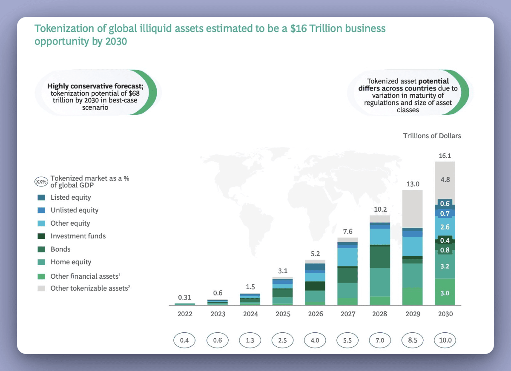
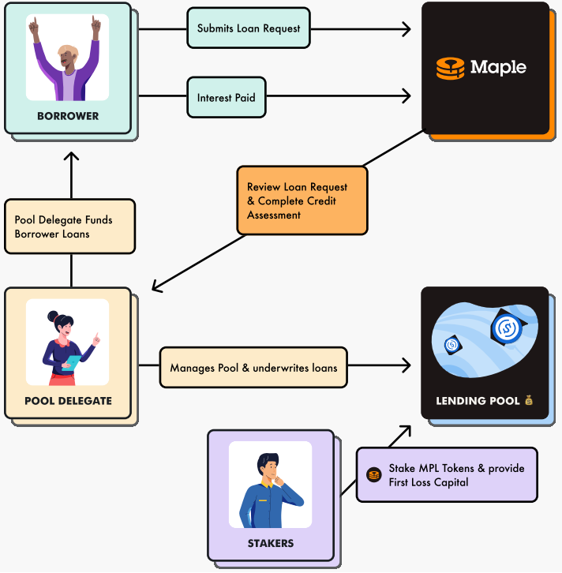



- Une connaissance de base en blockchain et en finance traditionnelle.
- Des notions fondamentales sur les smart contracts et la décentralisation (voir mon MON2.2).
- Une familiarité avec les actifs réels (immobilier, matières premières, crédits) et leur marché traditionnel.




- [MAPLE Finance](https://www.maple.finance)
- [RIO Tokenisation](https://www.riotoken.com)
- [La Tokenisation des Actifs : Impacts et Opportunités](https://www.brookings.edu/research/blockchain-and-the-future-of-financial-services/)
- [Les Fondements de la Tokenisation des Actifs Réels](https://www.coindesk.com/business/2021/06/04/real-world-assets-and-tokenization/)
- [BlackRock’s Future Vision on Tokenization](https://www.blackrock.com/corporate/about-us/press-releases/2021-blackrock-tokenization)



# Introduction

Je vais au cours de ce rendu essayer de définir des chapitres pour séparer de façon bien distincteles notions abordées.

La tokenisation des actifs réels représente une avancée majeure dans le domaine de la finance, de l'investissement et de la gestion des biens. Cette technologie repose sur l'utilisation de la blockchain pour convertir des actifs physiques ou réels, tels que l'immobilier, les œuvres d'art, ou les matières premières, en tokens numériques. Ces tokens peuvent ensuite être échangés, fractionnés et transférés de manière plus fluide, transparente et sécurisée.

## Explication des termes clés :

* **Token** : Un token est une unité de valeur numérique qui représente un actif réel ou un droit associé à cet actif. Chaque token peut avoir une valeur correspondante à un bien physique ou intangible. Par exemple, un token peut représenter une part d'un bien immobilier ou une portion d'une œuvre d'art.

* **Blockchain** : La blockchain est une technologie de registre distribué qui garantit l'immuabilité et la transparence des informations, sans nécessiter d'intermédiaire de confiance centralisé. C'est la pierre angulaire de la tokenisation, permettant l'enregistrement sécurisé et public des transactions.

* **Smart contracts** : Les smart contracts (ou contrats intelligents) sont des programmes autonomes qui s'exécutent automatiquement selon les termes préétablis. Ils facilitent et automatisent les transactions sans nécessiter d'intervention humaine, réduisant ainsi les coûts et les risques d'erreurs.

## Contexte historique et évolution de la tokenisation

La tokenisation des actifs réels a émergé avec l'essor des technologies blockchain et des crypto-monnaies dans les années 2010. En permettant la numérisation des actifs physiques, elle a ouvert la voie à des modèles d'investissement plus accessibles et plus liquides. Des entreprises et startups ont vu dans cette technologie une réponse à des problèmes existants, notamment la faible liquidité de certains marchés d'actifs réels (comme l'immobilier ou l'art). Aujourd'hui, la tokenisation se développe rapidement et pourrait bouleverser le marché de l'investissement en rendant les actifs plus accessibles, flexibles et transparents.

# Chapitre 1 : Qu'est-ce que la tokenisation des actifs réels ?

La tokenisation des actifs réels est un processus innovant qui consiste à convertir un bien physique ou une ressource en une unité numérique échangeable sur la blockchain. Cette pratique permet non seulement de faciliter l'accès à ces actifs, mais également de résoudre certains problèmes de liquidité et d'intermédiation.

## Définition et principes de base de la tokenisation

Le processus de tokenisation consiste à attribuer un ou plusieurs tokens numériques à un actif physique ou intangible, tout en conservant la valeur intrinsèque de ce bien. Ces tokens peuvent être transférés, échangés ou utilisés dans des transactions sans qu'il soit nécessaire d'avoir une propriété physique de l'actif. La blockchain sert de support, garantissant la sécurité et la traçabilité des échanges.

## Processus de conversion des actifs réels en tokens numériques

1. **Identification de l'actif réel** : Un actif réel est sélectionné, qu'il s'agisse d'un bien immobilier, d'une œuvre d'art, ou même de matières premières.
2. **Création de la représentation numérique** : L'actif est numérisé sous forme de tokens. Par exemple, une propriété immobilière peut être fractionnée en plusieurs tokens, chaque token représentant une part de l'actif.
3. **Enregistrement sur la blockchain** : Les tokens sont enregistrés sur la blockchain, un registre distribué public et immuable, garantissant que chaque transaction et transfert de tokens est sécurisé et transparent.

## Blockchain comme technologie sous-jacente

La blockchain, en tant que technologie décentralisée, est essentielle dans la tokenisation. Elle permet de valider et d'enregistrer chaque transaction de manière transparente, sécurisée et sans intermédiaire centralisé. De plus, elle offre une traçabilité en temps réel de chaque token, renforçant la confiance des investisseurs et des parties prenantes dans le processus de tokenisation.

## Utilisation des smart contracts pour automatiser les transactions

Les smart contracts, des programmes autonomes intégrés à la blockchain, facilitent l'exécution des transactions de manière automatisée. Une fois que certaines conditions sont remplies, les smart contracts exécutent des actions spécifiques, telles que le transfert de tokens ou le paiement de dividendes. Cela réduit les coûts et améliore l'efficacité des transactions en supprimant le besoin d'intermédiaires traditionnels.

## Exemples d'actifs réels

### Immobilier

La tokenisation de l'immobilier est l'un des cas les plus prometteurs. Des biens immobiliers de grande valeur peuvent être fractionnés en plusieurs tokens, permettant ainsi à un large éventail d'investisseurs d'accéder à des parts d'immeubles commerciaux ou résidentiels. Par exemple, un immeuble d'une valeur de 1 million d'euros peut être représenté par 1 000 tokens, chaque token ayant une valeur de 1 000 euros.

### Œuvres d'art

Les œuvres d'art ont longtemps été considérées comme des investissements réservés aux élites. Grâce à la tokenisation, il devient possible de diviser une œuvre d'art en parts, permettant à des investisseurs plus modestes de participer au marché de l'art. Ce processus augmente la liquidité et facilite l'accès à ce type d'investissement.

### Matières premières

Les matières premières, telles que l'or, l'argent ou le pétrole, peuvent également être tokenisées. En divisant ces actifs en tokens, il devient possible d'échanger de petites quantités de ces ressources, tout en maintenant leur valeur. Cette tokenisation permet de faciliter la gestion des portefeuilles d'actifs tangibles et d'améliorer l'efficience des transactions sur ces marchés.

En résumé, la tokenisation des actifs réels est un processus qui permet de rendre des actifs traditionnels plus accessibles, tout en offrant une plus grande liquidité et transparence grâce à la blockchain et aux smart contracts. Cela ouvre la voie à de nouvelles possibilités d'investissement et transforme les marchés financiers traditionnels.

# Chapitre 2 : Fonctionnement technique de la tokenisation

Le processus de tokenisation repose sur des principes techniques qui assurent la sécurité, la transparence et l'efficacité des transactions. Au cœur de ce mécanisme se trouvent deux technologies fondamentales : la blockchain et les smart contracts. Ce chapitre détaille le fonctionnement technique de la tokenisation en explorant le rôle de la blockchain, l'automatisation des transactions via les smart contracts, ainsi que les technologies sous-jacentes qui permettent la tokenisation.

## Blockchain : Rôle dans la sécurité, l'immuabilité et la transparence des transactions

La blockchain est la base technique qui permet à la tokenisation de fonctionner de manière décentralisée, sécurisée et transparente. C'est un registre distribué qui enregistre les transactions de manière chronologique et immuable. Cela signifie que, une fois qu'une transaction est enregistrée sur la blockchain, elle ne peut plus être modifiée, offrant ainsi un haut niveau de sécurité.

### Sécurité

La blockchain utilise des techniques cryptographiques avancées pour sécuriser les données. Chaque transaction est validée par un processus de consensus entre les nœuds du réseau, ce qui garantit qu'aucune transaction frauduleuse ne puisse être inscrite. Cela permet de protéger les tokens des attaques externes et de garantir que seules des personnes autorisées puissent modifier ou déplacer ces tokens.

### Immuabilité

L'immuabilité de la blockchain signifie qu'une fois qu'une transaction est enregistrée, elle est fixée à jamais dans le registre. Cela rend extrêmement difficile de falsifier les transactions ou de manipuler les données. Cette caractéristique est essentielle pour la tokenisation, car elle garantit l'intégrité des actifs numériques et assure la traçabilité complète de chaque token.

### Transparence

La blockchain permet à tous les participants d'accéder à l'historique des transactions de manière publique et transparente. Les transactions sont visibles pour tous les utilisateurs du réseau, ce qui favorise la confiance et permet à chacun de vérifier l'exactitude des informations sans avoir besoin d'un intermédiaire centralisé.

## Smart contracts : Automatisation des transactions et réduction des coûts

Les smart contracts sont des programmes autonomes qui s'exécutent automatiquement lorsque certaines conditions sont remplies. Ils sont intégrés dans les blockchains et permettent d'automatiser des processus, en éliminant les étapes manuelles et les intermédiaires. Cela rend les transactions plus rapides, moins coûteuses et moins sujettes à des erreurs humaines.

### Automatisation des transactions

Les smart contracts permettent la mise en œuvre automatique d'accords ou de transactions sans qu'une autorité centrale ou un tiers de confiance ne soit nécessaire. Par exemple, dans un processus de tokenisation d'un bien immobilier, un smart contract pourrait automatiquement transférer un token à un investisseur dès qu'un paiement est effectué, tout en mettant à jour le registre de la blockchain. Ce processus est non seulement rapide mais aussi fiable.

### Réduction des coûts

En supprimant les intermédiaires traditionnels (tels que les notaires, les courtiers ou les avocats), les smart contracts permettent de réduire considérablement les coûts liés aux transactions. Ils minimisent également les risques de fraude, car ils s'exécutent uniquement lorsque toutes les conditions sont remplies, assurant ainsi un processus fluide et sans erreur.

### Exécution des conditions prédéfinies

Un smart contract peut contenir des conditions spécifiques, comme des délais de paiement ou des critères d'éligibilité, et s'exécuter uniquement lorsque ces conditions sont respectées. Cela permet de réduire les litiges et d'assurer que chaque partie respectera ses engagements sans nécessiter une intervention extérieure.

## Technologies utilisées dans la tokenisation

Les technologies sous-jacentes à la tokenisation sont cruciales pour assurer la réussite du processus. Parmi les plateformes blockchain les plus couramment utilisées, on trouve Ethereum et Polkadot, chacune offrant des fonctionnalités spécifiques adaptées aux besoins de la tokenisation des actifs réels.

### Ethereum

Ethereum est l'une des premières plateformes à avoir introduit les smart contracts et reste l'un des choix les plus populaires pour la tokenisation. Sa large adoption et sa capacité à exécuter des contrats intelligents en font une solution idéale pour la création de tokens. Ethereum permet également la création de tokens personnalisés via son standard ERC-20, largement utilisé pour la création de tokens d'actifs.

### Polkadot

Polkadot est une autre plateforme blockchain qui offre une architecture différente de celle d'Ethereum. Elle permet l'interopérabilité entre plusieurs blockchains, ce qui peut être utile pour les projets de tokenisation qui nécessitent la communication entre différentes chaînes. Polkadot favorise également la scalabilité, un aspect crucial pour les projets de grande envergure qui impliquent une tokenisation massive d'actifs.

### Autres technologies

D'autres blockchains comme Binance Smart Chain, Solana, ou encore Tezos sont également utilisées pour la tokenisation. Chaque blockchain présente des avantages en termes de vitesse, de frais de transaction et de sécurité, et peut être choisie en fonction des besoins spécifiques du projet de tokenisation.

## Étapes de la tokenisation d'un actif réel : de l'asset à la fraction numérique

Le processus de tokenisation d'un actif réel se déroule généralement en plusieurs étapes, allant de l'identification de l'actif à sa conversion en tokens numériques et à la gestion des transactions. Voici un aperçu de ce processus :

### 1. Identification et évaluation de l'actif

Avant de tokeniser un actif, il est nécessaire de l'identifier et de l'évaluer. Par exemple, dans le cas d'un bien immobilier, une évaluation précise du marché et de la valeur de l'actif est essentielle. Cette étape permet de déterminer la quantité de tokens à émettre et leur valeur respective.

### 2. Conversion de l'actif en tokens numériques

Une fois l'actif évalué, il est divisé en fractions numériques sous forme de tokens. Ces tokens représentent des parts de l'actif et sont enregistrés sur la blockchain. La création de ces tokens peut suivre des normes de l'industrie, telles que l'ERC-20 ou l'ERC-721 pour les actifs uniques, comme les œuvres d'art.

### 3. Enregistrement sur la blockchain

Les tokens sont ensuite enregistrés sur la blockchain, créant ainsi un lien transparent et sécurisé entre l'actif réel et ses représentations numériques. Chaque transaction de tokenisation est inscrite de manière immuable, garantissant que les droits de propriété et les échanges sont vérifiables.

### 4. Gestion et échanges

Une fois que les tokens ont été créés, ils peuvent être échangés sur des plateformes décentralisées (DEX) ou centralisées, en fonction des règles du projet. Les investisseurs peuvent acheter, vendre ou transférer des tokens représentant une fraction d'un actif réel, permettant ainsi une liquidité accrue.

### 5. Suivi et gestion des tokens

Le suivi des tokens est assuré par la blockchain, qui permet de consulter en temps réel l'historique des transactions et de vérifier la validité des échanges. Les smart contracts peuvent également être utilisés pour gérer des événements futurs, tels que la distribution de dividendes ou de paiements liés à l'actif sous-jacent.

Ainsi, la tokenisation d'un actif réel, de la création du token à son échange, repose sur des technologies robustes comme la blockchain et les smart contracts, qui assurent un processus transparent, sécurisé et automatisé.

# Chapitre 3 : Cas d'étude concret de projet de tokenisation

## Exemple 1 : MAPLE - Tokenisation des prêts immobiliers commerciaux

### Objectifs du projet MAPLE

Le projet MAPLE vise à améliorer l'accès aux investissements immobiliers commerciaux en les rendant plus accessibles à un plus grand nombre d'investisseurs, grâce à la tokenisation des prêts immobiliers. Cela permet de fractionner des prêts immobiliers commerciaux en tokens, offrant ainsi la possibilité à des investisseurs de participer avec des montants plus modestes tout en bénéficiant de la rentabilité des investissements immobiliers.

### Processus de tokenisation dans ce projet

Le processus de tokenisation dans MAPLE commence par la création de prêts immobiliers sous forme de tokens sur la blockchain. Ces tokens représentent des parts de ces prêts, permettant ainsi de fractionaliser un actif qui serait traditionnellement réservé aux grands investisseurs. Les investisseurs peuvent acheter ces tokens, qui leur donnent droit à une part des revenus générés par les prêts. Ce processus est rendu possible grâce à des smart contracts qui gèrent la distribution des rendements et garantissent la sécurité et l'immuabilité des transactions.

### Impacts sur la liquidité et l'accessibilité des investissements

L'un des impacts majeurs du projet MAPLE est l'amélioration de la liquidité des investissements immobiliers. Traditionnellement, l'immobilier commercial est un marché peu liquide, où les investissements sont souvent bloqués pendant plusieurs années. La tokenisation permet de rendre ces investissements plus liquides en facilitant l'échange de tokens sur des plateformes spécialisées, permettant ainsi aux investisseurs de vendre leurs parts à tout moment, réduisant ainsi le verrouillage des investissements.

L'accessibilité est également améliorée, car les investisseurs n'ont plus besoin de disposer de sommes importantes pour participer au marché immobilier commercial. En fractionnant les prêts en tokens, MAPLE permet à des investisseurs individuels de participer avec des montants plus petits, démocratisant ainsi l'accès à des actifs auparavant réservés aux investisseurs institutionnels.

# Chapitre 4 : Les acteurs majeurs du marché et leur rôle

## Acteurs financiers et institutionnels soutenant la tokenisation

La tokenisation des actifs réels n'aurait pas atteint l'ampleur actuelle sans l'implication d'acteurs financiers majeurs, des institutions établies aux nouvelles entreprises du secteur. Ces derniers jouent un rôle clé dans l'adoption et la légitimité de la tokenisation. Parmi eux, on trouve de grandes institutions financières traditionnelles comme BlackRock, JPMorgan, et Goldman Sachs, qui ont non seulement investi dans cette technologie, mais l'ont également intégrée dans leurs modèles d'affaires.

### BlackRock

BlackRock, le plus grand gestionnaire d'actifs au monde, est un acteur majeur dans le domaine de la tokenisation, en particulier dans l'immobilier. L'entreprise a exploré des opportunités d'investissement dans la blockchain pour améliorer la liquidité des actifs immobiliers et ouvrir de nouveaux marchés d'investissement.

### JPMorgan

JPMorgan, un autre titan de la finance, a investi dans plusieurs projets blockchain, dont ceux liés à la tokenisation des actifs réels. La banque a été l'une des premières grandes institutions financières à tester les transactions en blockchain à travers sa propre crypto-monnaie, le JPM Coin. En parallèle, JPMorgan explore les possibilités de tokenisation dans les secteurs de l'immobilier, des matières premières et des titres financiers. Sa participation active dans ces projets vise à simplifier la gestion d'actifs et à rendre le processus plus efficace.

### Goldman Sachs

Goldman Sachs a également adopté la tokenisation des actifs réels en tant qu'outil de diversification pour ses clients institutionnels. La banque a développé des solutions permettant de faciliter l'achat, la vente et la gestion de tokens représentant des actifs réels comme l'immobilier et les œuvres d'art. Goldman Sachs est un des leaders dans la création de produits financiers innovants qui combinent des technologies traditionnelles et des technologies émergentes telles que la blockchain, et elle joue un rôle clé dans l'établissement de standards pour la tokenisation.

## Initiatives de ces entreprises dans la tokenisation

Ces géants de la finance ont contribué à la mise en place d'un cadre institutionnel favorable à la tokenisation des actifs réels. L'une de leurs principales contributions est la création de produits financiers tokenisés, qui permettent à leurs clients de diversifier leur portefeuille tout en minimisant les risques liés à la gestion traditionnelle des actifs. Ces initiatives incluent la mise en place de plateformes de tokenisation permettant aux investisseurs institutionnels d'acheter et de vendre des fractions d'actifs en toute sécurité.

## Startups et entreprises spécialisées dans la tokenisation

Les startups spécialisées dans la tokenisation jouent également un rôle important dans l'écosystème. Ces entreprises apportent une expertise spécifique dans le développement des technologies nécessaires à la tokenisation et à l'émission de tokens sur des blockchains publiques et privées. Parmi les plus connues, on trouve RealT et Tokeny Solutions.

## Rôle des régulateurs

Les régulateurs, tels que la Securities and Exchange Commission (SEC) aux États-Unis ou l'Autorité des Marchés Financiers (AMF) en France, commencent à définir des lignes directrices pour la tokenisation des actifs réels. Ils sont particulièrement préoccupés par la façon dont les tokens sont émis et échangés sur le marché, s'assurant que les investisseurs soient protégés et que la fraude soit minimisée. Ces régulations sont essentielles pour permettre la croissance du marché tout en garantissant la sécurité des investisseurs.

## Défis réglementaires

L'un des défis majeurs est de savoir comment classifier les tokens : sont-ils des actions, des obligations, des titres de créance ou des actifs immobiliers ? Ce flou juridique nécessite des clarifications, et les régulateurs travaillent activement pour établir des normes adaptées à la tokenisation. En attendant, certaines juridictions, comme Singapour et la Suisse, ont pris l'initiative d'adopter des régulations favorables à la blockchain et à la tokenisation, créant ainsi un environnement propice à l'innovation.

# Chapitre 5 : Avantages, défis et obstacles de la tokenisation des actifs réels

La tokenisation des actifs réels présente un large éventail d'avantages, mais elle soulève également plusieurs défis. Ce chapitre explore les avantages potentiels de cette technologie, tout en abordant les obstacles et difficultés qui peuvent limiter son adoption et sa mise en œuvre à grande échelle.

## 5.1 Avantages de la tokenisation

### Accessibilité accrue pour les petits investisseurs
L'un des principaux avantages de la tokenisation est la possibilité de rendre des actifs auparavant inaccessibles aux petits investisseurs beaucoup plus accessibles. Grâce à la fractionnement des actifs en tokens numériques, un bien immobilier de grande valeur, une œuvre d'art ou des matières premières peuvent être divisés en petites unités. Ces unités peuvent être achetées et vendues, permettant ainsi à un plus large éventail de personnes de participer à des investissements qui étaient autrefois réservés aux investisseurs institutionnels ou fortunés. Par exemple, dans l'immobilier, des plateformes comme RealT permettent à des investisseurs de posséder une fraction d'un bien immobilier, tout en bénéficiant de revenus passifs générés par la location.

### Amélioration de la liquidité
Les actifs traditionnels, tels que l'immobilier ou les œuvres d'art, souffrent souvent de problèmes de liquidité. Leur vente nécessite des processus longs et complexes, ainsi que des intermédiaires. La tokenisation permet d'améliorer considérablement la liquidité de ces actifs. En créant un marché secondaire sur lequel les tokens peuvent être échangés, la tokenisation facilite l'achat et la vente rapides des fractions d'actifs. Cela permet aux investisseurs de sortir de leurs positions plus facilement et de bénéficier d'une plus grande flexibilité dans la gestion de leur portefeuille.

### Réduction des coûts
La tokenisation permet également de réduire les coûts associés à la gestion des transactions. Les processus traditionnels de gestion des actifs, qui impliquent des intermédiaires tels que des courtiers, des avocats et des notaires, sont coûteux et prennent du temps. En automatisant les transactions via des smart contracts sur une blockchain, ces coûts peuvent être largement réduits. De plus, la transparence et l'immuabilité des enregistrements sur la blockchain permettent d'éviter des frais supplémentaires liés aux litiges ou à la falsification des documents.

### Transparence et sécurité
La blockchain, en tant que technologie sous-jacente de la tokenisation, offre une transparence inégalée. Chaque transaction est enregistrée de manière publique et immuable, ce qui réduit le risque de fraude ou de manipulation des informations. Les parties prenantes peuvent vérifier l'historique des transactions et la provenance des actifs, renforçant ainsi la confiance dans les investissements. De plus, la sécurité des données est assurée par des mécanismes cryptographiques avancés, garantissant que les informations sensibles sont protégées contre les cyberattaques et les violations de données.

### Accessibilité mondiale
La tokenisation permet de lever les barrières géographiques qui existent sur les marchés financiers traditionnels. En facilitant les transactions transfrontalières via des plateformes numériques, elle ouvre les marchés à des investisseurs du monde entier. Un investisseur basé en Asie peut facilement acheter des tokens représentant des actifs immobiliers situés en Europe ou aux États-Unis, contribuant ainsi à l'internationalisation des marchés des actifs réels.

## 5.2 Défis et obstacles de la tokenisation

### Problèmes de régulation
L'un des défis majeurs de la tokenisation réside dans l'absence de cadre réglementaire clair et global. Les régulations varient d'un pays à l'autre, et dans de nombreux cas, les législations existantes ne couvrent pas adéquatement les actifs numériques ou les smart contracts. Cela crée une incertitude juridique, tant pour les entreprises que pour les investisseurs. De plus, certaines régulations financières et fiscales sont encore en cours d'élaboration, ce qui peut freiner l'adoption à grande échelle de la tokenisation. Les autorités doivent trouver un équilibre entre la protection des investisseurs et la stimulation de l'innovation dans ce domaine émergent.

### Problèmes technologiques
La tokenisation repose sur des technologies de blockchain et de smart contracts qui, bien que prometteuses, rencontrent encore plusieurs défis techniques. La scalabilité des plateformes de blockchain est l'un de ces défis. De nombreuses blockchains, en particulier celles basées sur des mécanismes de consensus énergivores comme la preuve de travail (Proof of Work), ne peuvent pas encore supporter un nombre élevé de transactions par seconde, ce qui pourrait limiter leur utilisation dans des secteurs où de grandes quantités de transactions sont nécessaires. D'autres défis incluent l'interopérabilité entre différentes blockchains et la sécurisation des plateformes de trading pour éviter les piratages et les fraudes.

### Problèmes de liquidité
Bien que la tokenisation puisse améliorer la liquidité des actifs, elle n'élimine pas complètement les obstacles liés à la liquidité. La mise en place d'un marché secondaire efficace pour les tokens est complexe et nécessite un nombre suffisant d'acheteurs et de vendeurs pour garantir des transactions fluides. De plus, la valorisation des actifs tokenisés, notamment dans des secteurs moins liquides comme l'art ou l'immobilier, peut être difficile, ce qui entraîne des fluctuations importantes des prix et des risques pour les investisseurs.

### Enjeux de confiance
La tokenisation des actifs réels nécessite un haut niveau de confiance de la part des investisseurs, en particulier ceux des secteurs traditionnels comme l'immobilier, les matières premières ou les institutions financières. Les investisseurs institutionnels, en particulier, ont tendance à être réticents à adopter des technologies émergentes si elles ne sont pas soutenues par des régulations et des infrastructures éprouvées. De plus, les inquiétudes concernant la sécurité des plateformes de tokenisation et les risques associés à l'usage de la blockchain peuvent limiter l'engouement pour ces technologies, même si elles offrent des avantages indéniables.
