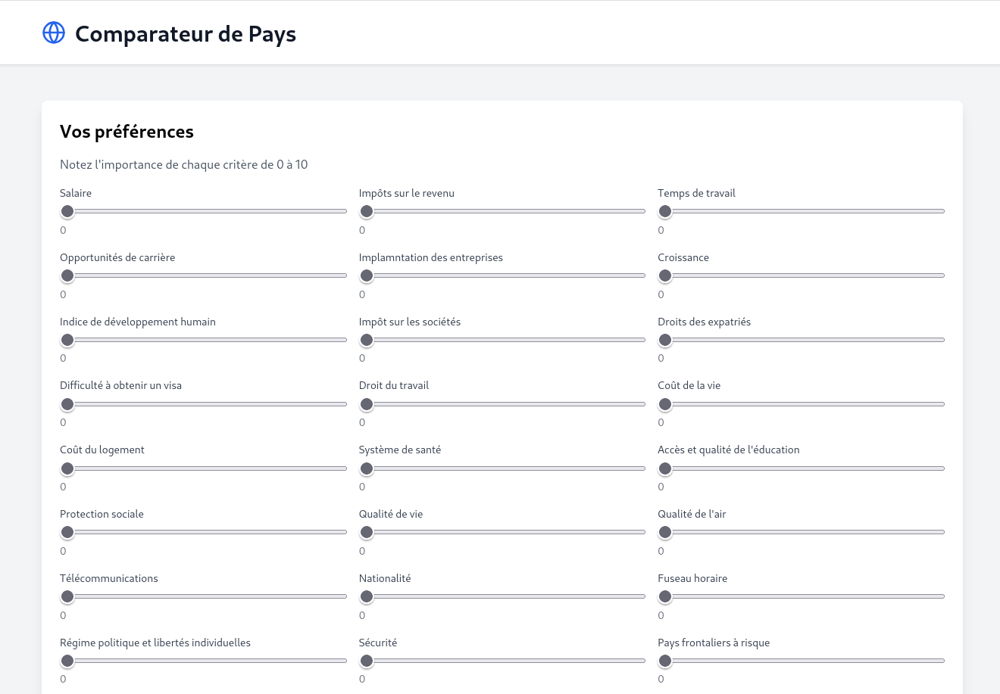
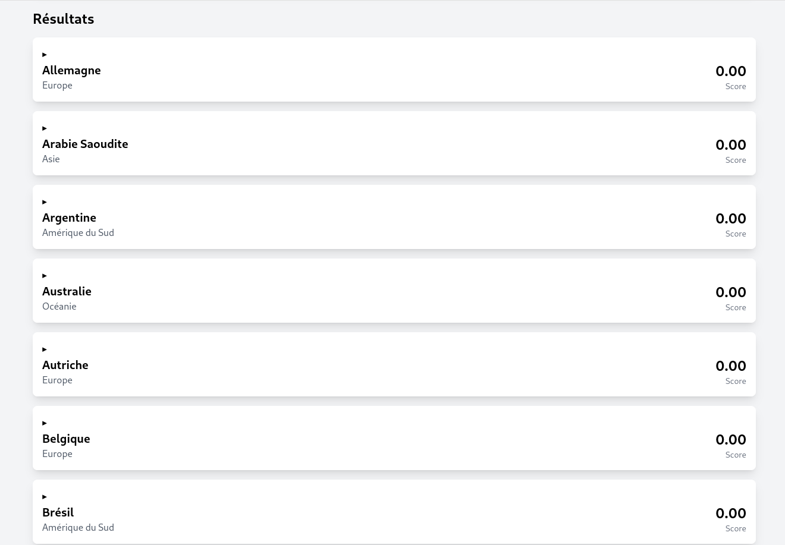
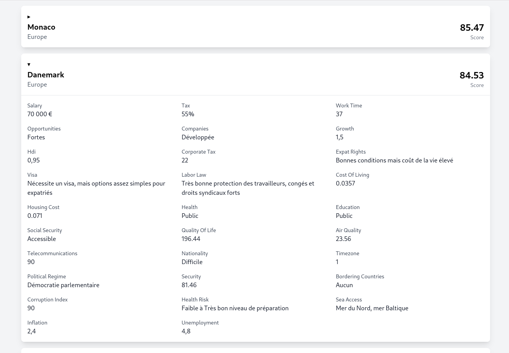



- Connaissances de base en développement web (HTML, CSS, JavaScript)
- Familiarité avec React et TypeScript
- Connaissance de Netlify pour le déploiement






- [Documentation de Vite](https://vitejs.dev/)
- [Documentation de React](https://reactjs.org/)
- [Documentation de TypeScript](https://www.typescriptlang.org/)
- [Documentation de Netlify](https://docs.netlify.com/)



L'idée est de créer un comparateur de pays basé sur différents paramètres. L'objectif est triple : Réfléchir à des critères de notation qui pousseraient la plupart à choisir d'habiter dans un pays plutôt qu'un autre, créer une base de données répertoriant tous ces critères, et créer une interface pour permettre aux utilisateurs de faire leurs propres recherches selon leurs préférences.

Le comparateur est disponible en suivant le lien suivant : https://steady-pudding-ad483b.netlify.app/

## Tâches

### Sprints

#### Sprint 1

- [x] Identifier et sélectionner les 28 paramètres clés pour l'expatriation
- [x] Rechercher et collecter les données pour chaque pays
- [x] Normaliser les données pour permettre une comparaison équitable
- [x] Structurer les données dans un fichier JSON

#### Sprint 2

- [x] Configurer le projet avec Vite, React et TypeScript
- [x] Développer les composants principaux de l'application
- [x] Implémenter la logique de calcul des scores basée sur les préférences de l'utilisateur
- [x] Déployer l'application sur Netlify

### Horodatage

Toutes les séances et le nombre d'heures que j'y ai passé.

| Date | Heures passées | Indications |
| -------- | -------- |-------- |
| Mercredi 13/02 | 5H | Recherche et sélection des paramètres |
| Jeudi 14/02 | 5H | Normalisation des données |
| Vendredi 15/02 | 2H | Structuration des données en JSON |
| Lundi 18/02 | 4H | Configuration du projet avec Vite et développement des composants |
| Mardi 19/02 | 3H | Implémentation de la logique de calcul des scores |
| Mercredi 20/02 | 1H | Déploiement sur Netlify |
| Jeudi 21/02 | 1H | Finalisation de la rédaction du compte rendu |

## Contenu

### Premier Sprint

#### Identification des paramètres

Avant de commencer à réfléchir à l'application en elle-même, il me fallait créer ou trouver une base de données me permettant de faire ce comparatif entre pays. J'ai cherché pendant plusieurs heures mais n'ai pas trouvé de BDD complète qui répondait aux besoins de ce projet.
J'ai donc entrepris de la recréer moi-même, à partir de base de données plus spécifiques que j'avais trouvé pendant mes recherches.
J'ai identifié 28 paramètres clés qui influencent la décision de s'expatrier, tels que le salaire, les impôts sur le revenu, l'indice de développement humain (IDH), le taux de chômage, le coût de la vie, la qualité de l'air, le système de santé, les droits des expatriés, le régime politique, la sécurité, etc.

#### Collecte des données

Vu la quantité de données que j'avais à trouver et formater, j'ai commencé par faire des recherches sur les sources qui existaient pour les différents paramètres de ma BDD. J'ai ensuite télécharger toutes ces sources, et utiliser une IA pour les concaténer.
Cette tâche était vraiment très longue et fastidieuse du fait de la quantité de données manipulée, mais cela m'a permis de débuter le projet avec une base de donnée de paramètres bien définis et pertinents pour le calcul des scores des pays.
Ci dessous la liste détaillée des sources utilisées ou consultées pour construire la base de données.

#### **1️⃣ Économie & Travail**
| Paramètre | Source officielle |
|-----------|------------------|
| **Salaire moyen** | [OECD](https://data.oecd.org/earnwage/average-wages.htm), [World Bank](https://databank.worldbank.org/source/world-development-indicators) |
| **Impôt sur le revenu** | [OECD Tax Database](https://www.oecd.org/tax/tax-policy/tax-database/), [KPMG Tax Rates](https://home.kpmg/xx/en/home/services/tax/tax-tools-and-resources/tax-rates-online.html) |
| **Temps de travail** | [OECD - Hours Worked](https://stats.oecd.org/index.aspx?DataSetCode=ANHRS) |
| **Opportunités d'emploi** | [World Economic Forum - Future of Jobs Report](https://www.weforum.org/reports/) |
| **Taux de chômage** | [ILO](https://ilostat.ilo.org/data/), [World Bank](https://data.worldbank.org/indicator/SL.UEM.TOTL.ZS) |
| **Croissance économique** | [IMF - World Economic Outlook](https://www.imf.org/en/Publications/WEO) |

#### **2️⃣ Fiscalité & Entrepreneuriat**
| Paramètre | Source officielle |
|-----------|------------------|
| **Impôt sur les sociétés** | [OECD Corporate Tax Rates](https://stats.oecd.org/index.aspx?DataSetCode=CTS_CIT) |
| **Facilité de faire des affaires** | [World Bank - Ease of Doing Business](https://www.doingbusiness.org/) |

#### **3️⃣ Qualité de Vie & Services**
| Paramètre | Source officielle |
|-----------|------------------|
| **Indice de développement humain (IDH)** | [UNDP](http://hdr.undp.org/en/content/human-development-index-hdi) |
| **Coût de la vie** | [Numbeo](https://www.numbeo.com/cost-of-living/), [World Bank](https://data.worldbank.org/) |
| **Coût du logement** | [Numbeo](https://www.numbeo.com/property-investment/) |
| **Système de santé** | [WHO - Global Health Observatory](https://www.who.int/data/gho) |
| **Accès & coût de l’éducation** | [UNESCO](http://uis.unesco.org/) |
| **Protection sociale & retraite expatrié** | [OECD Pensions at a Glance](https://www.oecd.org/els/public-pensions/PAG-2019-country-profiles.pdf) |

#### **4️⃣ Environnement & Infrastructure**
| Paramètre | Source officielle |
|-----------|------------------|
| **Qualité de l’air** | [IQAir - World Air Quality Report](https://www.iqair.com/world-air-quality-ranking) |
| **Télécommunications** | [ITU - ICT Development Index](https://www.itu.int/en/ITU-D/Statistics/Pages/publications/mis2017.aspx) |

#### **5️⃣ Législation & Expatriation**
| Paramètre | Source officielle |
|-----------|------------------|
| **Droits des expatriés & visa** | [Henley Passport Index](https://www.henleyglobal.com/passport-index) |
| **Droit du travail** | [ILO](https://www.ilo.org/global/statistics-and-databases/lang--en/index.htm) |
| **Facilité d’obtenir la nationalité** | [Migration Policy Institute](https://www.migrationpolicy.org/) |
| **Sécurité** | [Global Peace Index](https://www.visionofhumanity.org/maps/#/) |

#### **6️⃣ Politique & Géographie**
| Paramètre | Source officielle |
|-----------|------------------|
| **Régime politique** | [Freedom House](https://freedomhouse.org/report/freedom-world) |
| **Indice de corruption** | [Transparency International](https://www.transparency.org/en/cpi) |
| **Risque sanitaire** | [WHO - Health Emergency Dashboard](https://www.who.int/emergencies/dashboard) |
| **Accès à la mer** | [UN Geospatial Information Section](https://www.un.org/geospatial/) |

#### **7️⃣ Facteurs Macroéconomiques**
| Paramètre | Source officielle |
|-----------|------------------|
| **Inflation** | [IMF - Inflation Data](https://www.imf.org/en/Publications/WEO) |
| **Pays frontaliers à risque** | [Global Conflict Tracker - Council on Foreign Relations](https://www.cfr.org/global-conflict-tracker/) |

Pour les données que je ne trouvais pas ou qui me paraissait fausses, j'ai fait mes propres recherches en utilisant les fonctions recherches web d'IA comme chat gpt pour gagner du temps (exemple : demander le salaire moyen pour le titre "ingénieur" sur glassdoor dans plusieurs pays)

Il reste cependant des données approximées mais l'ensemble reste cohérent après plusieurs tests de calculs de score des pays.
---


#### Normalisation des données

Il a fallut ensuite normaliser les parametres pour pouvoir les comparer et leur attribuer les coefficients choisis par l'utilisateur de l'app.

Pour comparer des paramètres hétérogènes, j'ai normalisé chaque paramètre sur une échelle de 0 à 100.

Voici quelques exemples des formules ou règles utilisées pour normer ces données :

## Normalisation des paramètres numériques
### 1. Salaire
Pour normaliser les salaires, une échelle linéaire a été utilisée en fonction des valeurs minimales et maximales de la base de données.

### Formule utilisée :
\[
\text{Salaire normalisé} = \left( \frac{\text{Salaire} - \text{Salaire min}}{\text{Salaire max} - \text{Salaire min}} \right) \times 100
\]

### Exemple de calcul :
- Salaire minimum dans la base de données : 5 000 €
- Salaire maximum dans la base de données : 100 000 €
- Salaire à normaliser : 60 000 €

$$
\text{Salaire normalisé} = \left( \frac{60 000 - 5 000}{100 000 - 5 000} \right) \times 100 = 57,89
$$

Résultat : Un salaire de 60 000 € obtient un score normalisé de 57,89.

---

## Normalisation des paramètres non numériques
### 2. Régime politique
Les scores sont attribués en fonction du niveau de liberté politique et de stabilité.

| Type de régime | Score |
|---------------|-------|
| Démocratie parlementaire | 100 |
| Monarchie constitutionnelle | 75 |
| Régime autoritaire | 50 |
| Régime communiste | 25 |
| Régime instable ou fragmenté | 0 |

---

### 3. Protection sociale
Les scores sont attribués en fonction de l’accessibilité et de la qualité des services sociaux.

| Niveau de protection sociale | Score |
|-----------------------------|-------|
| Accessible et solide | 100 |
| Accessible mais limitée | 75 |
| Non accessible | 50 |
| Très limitée | 25 |
| Inexistante | 0 |

---

Ces critères permettent une comparaison objective entre les pays en appliquant une normalisation cohérente.

J'ai ensuite formaté tous ces paramètres dans un fichier tsx nommé data.tsx dans mon projet, le format est le suivant :


```javascript

export const countriesData = [
  {
    name: "Allemagne",
    continent: "Europe",
    salary: 72,
    tax: 35,
    workTime: 80,
    opportunities: 90,
    companies: 90,
    growth: 55,
    hdi: 90,
    corporateTax: 45,
    expatRights: 60,
    visa: 65,
    laborLaw: 90,
    costOfLiving: 91,
    housingCost: 45.7,
    health: 85,
    education: 85,
    socialSecurity: 90,
    qualityOfLife: 90,
    airQuality: 80,
    telecommunications: 90,
    nationality: 75,
    timezone: 85,
    politicalRegime: 90,
    security: 66.93,
    borderingCountries: 100,
    corruptionIndex: 79,
    healthRisk: 66,
    seaAccess: 100,
    inflation: 85,
    unemployment: 85
  },

export const countryDetails = [
  {
    name: "Allemagne",
    continent: "Europe",
    salary: "57 600 €",
    tax: "45%",
    workTime: "38",
    opportunities: "Très fortes",
    companies: "Très développée",
    growth: "1,5",
    hdi: "0,95",
    corporateTax: "29,94",
    expatRights: "Bonnes protections sociales et fiscales pour les expatriés",
    visa: "Nécessite un visa de travail, mais processus relativement simple",
    laborLaw: "Forte législation de protection des salariés, droits sociaux étendus",
    costOfLiving: "0.0545",
    housingCost: "0.078",
    health: "Public",
    education: "Public",
    socialSecurity: "Accessible",
    qualityOfLife: "180.48",
    airQuality: "41.35",
    telecommunications: "90",
    nationality: "Difficile",
    timezone: "1",
    politicalRegime: "Démocratie parlementaire",
    security: "66.93",
    borderingCountries: "Aucun",
    corruptionIndex: "79",
    healthRisk: "Faible à Système de santé robuste et réactif",
    seaAccess: "Mer du Nord, mer Baltique",
    inflation: "2,4",
    unemployment: "3,2"
  },
  ```


### Second Sprint

#### Configuration du projet

J'ai configuré le projet avec Vite, React et TypeScript. J'ai également utilisé Tailwind CSS pour le style de l'application. Je ne suis pas très à l'aise avec le développement web, j'ai donc repris mon POK précédent pour la configuration d'un projet React+TS, et essayé de suivre des tutos youtube sur des apps qui pouvaient ressembler à ce que je voulais faire. En toute transparence j'ai beaucoup utilisé des IA comme chatGPT pour coutourner les erreurs que je rencontrais et surtout pour le front end que je considère comme ayant peu de valeur ajoutée dans ce projet et dans d'autres, sachant que les IA sont totalement capables de répondre à ce besoin ça ne me semble pas être une compétence d'avenir que je souhaiterais développer ici.

#### Développement des composants et logique de calcul

### CountryList

Le composant **CountryList** prend en entrée une liste de pays, des détails sur ces pays et les préférences de l'utilisateur sous forme de pondération des critères.

- Il **calcule un score** pour chaque pays en effectuant une moyenne pondérée des critères selon les poids définis par l'utilisateur.
- Il **classe les pays** du meilleur au moins bon en fonction du score calculé.
- Il **affiche la liste des pays** sous forme de blocs extensibles (`<details>`), contenant :
  - Le **nom du pays** et son **continent**.
  - Le **score calculé**.
  - Lorsqu'un pays est ouvert, ses **détails** (ex : qualité de vie, fiscalité, etc.) sont affichés sous forme de grille.

### RatingForm

Le composant **RatingForm** permet à l'utilisateur d'exprimer ses préférences en attribuant une importance (de 0 à 10) à différents critères.

- Il **initialise les pondérations** des critères à 0.
- Il **affiche une liste de curseurs (`<input type="range">`)**, un par critère, permettant de définir leur importance.
- Lorsqu'un curseur est modifié, il **met à jour la pondération** et **transmet les nouvelles valeurs** au parent via `onRatingsChange`.

Ces pondérations sont ensuite utilisées dans **CountryList** pour évaluer et classer les pays.







### Déploiement de l'application

Lors de mes précédents POK&MON, j'avais pendant mes recherches découvert Netlify qui permet très simplement depuis un repo GitHub de déployer une app.

Pour déployer mon application sur Netlify depuis GitHub, j'ai d'abord préparé la version de production de l'application

Ensuite, je me suis rendu sur Netlify et j'ai connecté mon compte GitHub à la plateforme. J'ai autorisé Netlify à accéder à mes dépôts GitHub. Une fois la connexion établie, j'ai sélectionné le dépôt contenant mon application, et Netlify a automatiquement détecté la configuration du projet pour procéder à la construction et au déploiement.

Après le déploiement, j'ai configuré quelques paramètres supplémentaires, comme les variables d'environnement, puis Netlify m'a fourni une URL publique pour accéder à mon application en ligne. Le déploiement étant lié à mon dépôt GitHub, chaque nouveau push déclenche automatiquement une mise à jour de l'application sur Netlify.


