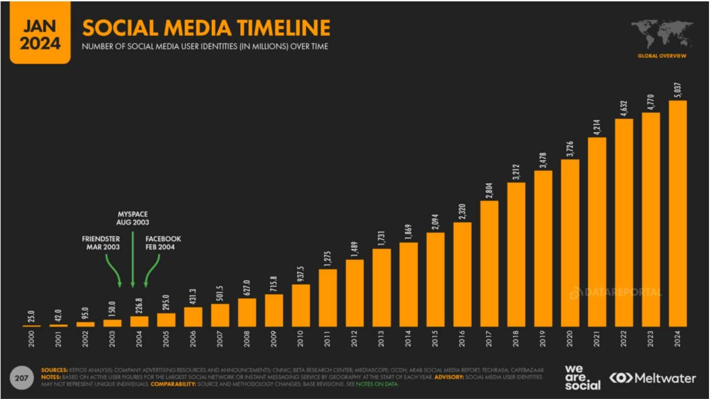
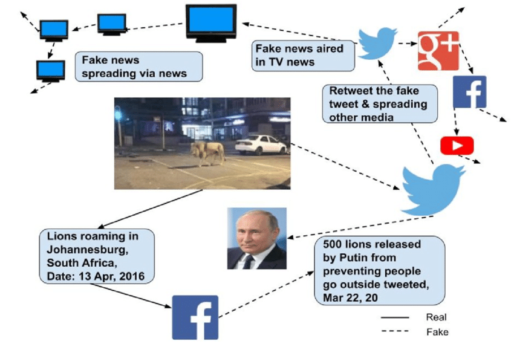



- Notions de base sur le fonctionnement des principaux réseaux sociaux.  
- Intérêt pour les questions de société, de communication et de politique.





- [CNRS - Études sur les mouvements sociaux en ligne](https://www.cnrs.fr/)  
- [DataReportal - Digital 2023 (Statistiques sur l’usage d’internet et des réseaux sociaux)](https://datareportal.com/)  
- [Pew Research Center - Social Media & Political Engagement](https://www.pewresearch.org/internet/)  
- [Article BBC - Cambridge Analytica: A quick guide to the scandal](https://www.bbc.com/news/technology-55951942)
- [Podcast France Inter - Pourquoi X est devenu toxique pour les scientifiques](https://www.radiofrance.fr/franceinter/podcasts/la-terre-au-carre/la-terre-au-carre-du-mercredi-05-fevrier-2025-3233441)



---

## Objectifs

1. Comprendre l’évolution de la participation citoyenne à l’ère numérique.  
2. Analyser le rôle des réseaux sociaux dans la mobilisation politique (pétitions, manifestations, etc.).  
3. Identifier les opportunités offertes par ces plateformes (accès à l’information, sensibilisation).  
4. Découvrir les risques et limites liés à la désinformation, aux bulles de filtres et à la manipulation des données.  
5. Étudier des cas concrets de mobilisation citoyenne menée (ou amplifiée) via les réseaux sociaux.

---
## 1. Comprendre l’évolution de la participation citoyenne à l’ère numérique

### 1.1 Définition de la participation citoyenne
La participation citoyenne regroupe l’ensemble des actions entreprises par les citoyens pour influencer ou contribuer à la vie publique, qu’il s’agisse de voter, de militer, de manifester, de signer des pétitions ou de participer à des débats publics. Dans une démocratie, cette participation est un indicateur essentiel de la vitalité du débat politique.

### 1.2 Avant l’ère numérique : une participation fondée sur la proximité
- **Formes traditionnelles de participation** : Le vote, la présence à des réunions publiques, la distribution de tracts, le porte-à-porte.  
- **Rôle des médias classiques** : Journaux, télévision et radio jouaient un rôle important pour diffuser les informations et encadrer le débat public.  
- **Limitations** : Les mobilisations massives (manifs, campagnes d’opinion) étaient plus coûteuses et plus longues à organiser (logistique, impression, transports).

### 1.3 Les prémices de la participation citoyenne en ligne (années 1990-2000)
- **Internet comme forum d’échange** : L’e-mail et les premiers forums ont permis d’organiser des collectifs à distance et de signer des pétitions en ligne.  
- **Les blogs** : Ils ont ouvert la voie à un journalisme citoyen et à un espace d’expression non soumis aux médias traditionnels.

### 1.4 L’émergence des réseaux sociaux : un tournant majeur
- **Facebook (2004), Twitter (2006), Instagram (2010), TikTok (2016)** : La diffusion est devenue instantanée et planétaire, décentralisant le flux d’informations.  
- **Massification de l’accès** : Selon le [Pew Research Center (2022)](https://www.pewresearch.org/internet/), plus de 70% des adultes dans les pays développés utilisent au moins un réseau social.  
- **Nouveaux modes de débat** : Les interactions sont plus horizontales, laissant davantage de place à l’opinion individuelle et à la mobilisation spontanée.

#### Graphique 1 : Évolution du nombre d’utilisateurs des réseaux sociaux (2000-2024)

*(Description : une courbe montre la croissance exponentielle du nombre d’utilisateurs des reseaux sociaux, d’environ 25 millions en 2000 à plus de 5 milliards en 2025.)*

---

## 2. Analyser le rôle des réseaux sociaux dans la mobilisation politique

### 2.1 Les pétitions en ligne
- **Facilité de création et de diffusion** : Des plateformes comme [Change.org](https://www.change.org/) ou [Avaaz](https://www.avaaz.org/) rendent la création et la signature de pétitions quasi instantanées.  
- **Exemple récent** : Une pétition visant à interdire certains plastiques à usage unique a récolté plusieurs millions de signatures en quelques jours, poussant des acteurs industriels à réévaluer leurs pratiques.

### 2.2 Les manifestations et protestations
- **Rassemblements coordonnés** : Les récentes marches pour le climat (inspirées par Greta Thunberg) ou le Printemps arabe (2010-2011) se sont largement organisés grâce à Facebook et Twitter.  
- **Mobilisation rapide** : Un simple post ou hashtag peut déclencher une réaction en chaîne (likes, partages, vidéos), facilitant la mise en place d’actions dans l’espace public.

### 2.3 Les campagnes électorales et le militantisme politique
- **Communication directe** : Les candidats politiques utilisent les réseaux pour s’adresser directement à leurs potentiels électeurs (lives Facebook, fils Twitter, vidéos TikTok).  
- **Mobilisation de fonds et de bénévoles** : Les plateformes permettent de collecter des dons et de recruter des militants plus facilement (ActBlue aux États-Unis, par exemple).  
- **Étude de cas** : La campagne d’Obama (2008) est souvent citée comme la première “campagne 2.0” de grande ampleur, intégrant réseaux sociaux et micro-dons en ligne.

---

## 3. Identifier les opportunités offertes par ces plateformes

### 3.1 Accès rapide et généralisé à l’information
- **Instantanéité** : Les réseaux sociaux diffusent des actualités en temps réel, avec un potentiel de viralité considérable.  
- **Démocratisation de la parole** : Tout citoyen peut devenir “créateur de contenu” et partager des informations, vidéos, points de vue, sans passer par un média traditionnel.

### 3.2 Sensibilisation et éducation politique
- **Visibilité internationale** : Des ONG ou des collectifs trouvent un écho mondial pour sensibiliser à leurs causes (droits de l’homme, environnement, etc.).  
- **Influenceurs et vulgarisateurs** : YouTubeurs, streamers ou personnalités publiques explicatives qui décryptent l’actualité et rendent des sujets politiques plus accessibles.

### 3.3 Nouveaux outils de participation et de consultation
- **Consultations en ligne** : Mairies et collectivités locales mettent parfois en place des plateformes (ex. Decidim à Barcelone) pour recueillir l’avis des citoyens.  
- **E-pétitions et e-démocratie** : Dans certains pays, un certain nombre de signatures en ligne peut déclencher des débats parlementaires.

---

## 4. Découvrir les risques et limites liés à la désinformation, aux bulles de filtres et à la manipulation des données

### 4.1 La désinformation et les fake news
- **Propagation virale** : Une étude du MIT (2018) révèle que les fausses informations se diffusent **jusqu’à 6 fois plus vite** que les vraies nouvelles sur Twitter.  
- **Effets sur la participation citoyenne** : En polarisant le débat, la désinformation peut dissuader certains de s’engager ou, au contraire, radicaliser des groupes entiers.

> « Les fake news ne deviennent pas virales par hasard. Les algorithmes favorisent ce qui suscite la plus forte réaction émotionnelle. »  
> *(Tristan Harris, ex-ingénieur Google, cité dans “The Social Dilemma”)*  

### 4.2 Les bulles de filtres et l’écho-chamber
- **Principe** : Les algorithmes recommandent du contenu conforme à nos goûts, renforçant nos croyances et minimisant l’exposition aux points de vue opposés.  
- **Risques** : Polarisation accrue de la société, difficulté à instaurer un dialogue constructif et raisonnable entre différents camps politiques.

### 4.3 La manipulation des données et le micro-ciblage
- **Collecte massive de données** : Les profils psychologiques, historiques de navigation, centres d’intérêt sont utilisés pour cibler des messages politiques de manière ultra-précise.  
- **Influence sur des scrutins majeurs** :  
  - Le scandale Cambridge Analytica a montré comment le **Brexit (2016)** et l’**élection de Donald Trump (2016)** ont pu être impactés par du micro-ciblage électoral.  
  - Dans *The Great Hack*, Brittany Kaiser (ex-Cambridge Analytica) raconte :  
    > « Un simple quiz Facebook pouvait révéler la personnalité profonde des utilisateurs, qu’on exploitait ensuite pour les influencer. »  
  - Christopher Wylie, lanceur d’alerte dans la même affaire, évoque le ciblage des électeurs “hésitants” dans des zones-clés, expliquant :  
    > « Nous n’avions pas besoin d’influencer tout le monde. On se concentrait sur un segment précis pour faire basculer une élection. »

### 4.4 L’importance de la modération des contenus

**Focus : Désinformation climatique et modération**

- **Hausse de la désinformation liée au climat** : Selon l’émission *La Terre au Carré* (France Inter, 05 février 2025), la propagation de théories climato-sceptiques et de fausses informations environnementales a fortement augmenté sur les plateformes où la modération est faible (X/Twitter, pages Facebook non surveillées, etc.).

- **Impact sur l’engagement citoyen** : Les experts interrogés estiment que ces campagnes de désinformation environnementale freinent la mobilisation en semant le doute, et peuvent décourager des actions concrètes (écogestes, participation à des marches pour le climat).

- **Responsabilité des plateformes** : Même si certaines entreprises affirment renforcer le “fact-checking”, le podcast rappelle que sans volonté politique et économique forte, le volume et la vitesse de diffusion de contenus trompeurs restent difficilement contrôlables.

- **Pistes d’amélioration** : L’émission plaide pour une **formation à l’esprit critique** et des mécanismes de **signalement simplifiés**, ainsi qu’une **collaboration avec des organismes scientifiques** (instituts de recherche, ONG environnementales) pour valider ou infirmer les contenus viraux.

**Cas extrême : la crise des Rohingyas en Birmanie (2017)**  
- **Rôle de Facebook** : Dans ce contexte, Facebook a été accusé d’héberger et de laisser circuler des discours de haine et des appels à la violence à l’encontre de la minorité Rohingya, sans réagir de manière adéquate.  
- **Manque de modération** : L’ONU a explicitement pointé la responsabilité de la plateforme, considérant que l’absence de régulation et de modération adaptée avait permis la diffusion rapide de contenus incitant à la haine.  
- **Conséquences tragiques** : Cette désinformation et ces appels à la violence en ligne ont participé à alimenter des persécutions et des violences de masse, provoquant l’exode forcé de centaines de milliers de Rohingyas et faisant de nombreuses victimes.  
- **Leçons à retenir** : Cet exemple illustre le risque majeur d’une modération laxiste ou insuffisante dans des contextes géopolitiques sensibles. Il souligne la nécessité d’équipes de modération maîtrisant la langue locale et la culture, afin d’identifier rapidement le contenu problématique et de limiter sa portée.

#### Graphique 2 : Mécanismes de diffusion de la désinformation

*(Description : un schéma illustre le rôle combiné des algorithmes et de bots automatisés dans la propagation massive de contenus faux ou trompeurs.)*

---

## 5. Étudier des cas concrets de mobilisation citoyenne menée (ou amplifiée) via les réseaux sociaux

### 5.1 Le Printemps Arabe (2010-2011)
- **Contexte** : Série de soulèvements contre des régimes autoritaires (Tunisie, Égypte, Libye, etc.).  
- **Rôle de Facebook et Twitter** : Organisation rapide des manifestations, diffusion de témoignages, contournement de la censure médiatique.  
- **Aboutissement** : Chute de certains régimes, mais transition politique inégale selon les pays concernés.

### 5.2 Le mouvement #BlackLivesMatter
- **Origine** : Dénonciation des violences policières contre les Afro-Américains aux États-Unis.  
- **Hashtag et mobilisation** : En quelques heures, les images et témoignages ont fait le tour du monde via Twitter, Instagram et Facebook, suscitant des manifestations mondiales.  
- **Résonance internationale** : Réformes réclamées dans plusieurs pays concernant les pratiques policières et le racisme systémique.

### 5.3 Les “Gilets Jaunes” en France
- **Déclencheur** : Hausse des taxes sur le carburant et sentiment d’injustice fiscale.  
- **Organisation via Facebook** : Groupes, pages et “Lives” ont coordonné des blocages et manifestations hebdomadaires.  
- **Ambivalence** : Mobilisation massive et rapide, mais également diffusion de rumeurs ou vidéos non vérifiées, amplifiant parfois la polarisation.

### 5.4 Mouvement “Fridays For Future” et mobilisation climatique
- **Origine** : Greta Thunberg, une lycéenne suédoise, entame une “grève scolaire pour le climat”.  
- **Amplification** : Les hashtags #FridaysForFuture et #ClimateStrike deviennent vite viraux, générant des mouvements de foule chaque vendredi dans plusieurs pays.  
- **Impact** : Mise sous pression des gouvernements et des institutions pour adopter des politiques environnementales plus ambitieuses.

---

## Conclusion

Les réseaux sociaux ont profondément métamorphosé la participation citoyenne. D’un côté, ils constituent un puissant outil d’information, de sensibilisation et de mobilisation. Ils rendent possible l’émergence spontanée de mouvements à grande échelle, libèrent la parole et favorisent l’innovation démocratique. De l’autre, ils créent des risques réels pour la cohésion sociale et la fiabilité du débat public : désinformation, manipulation de l’opinion via la collecte de données, bulles de filtres.  

**Comme le rappellent à leur manière** :  
- *The Social Dilemma*, à travers la voix de Tristan Harris (ancien ingénieur Google), insiste sur le fait que l’utilisateur devient rapidement un “produit” vendu à des annonceurs, et qu’il est nécessaire de comprendre les mécanismes de l’économie de l’attention pour en limiter les effets néfastes.  
- *The Great Hack* dévoile la dimension politique du micro-ciblage, illustrée par les témoignages de Brittany Kaiser et Christopher Wylie, montrant comment des données personnelles peuvent faire basculer des scrutins majeurs (Brexit, élection de Donald Trump, etc.).

Afin de préserver une démocratie saine et une participation citoyenne éclairée, il est impératif de développer l’esprit critique des usagers, de réguler les pratiques de ces grandes plateformes et de concevoir de nouvelles formes d’engagement numérique plus transparentes et responsables.

---

## Bibliographie sélective et sources utiles

1. **Pew Research Center** – [pewresearch.org](https://www.pewresearch.org/)  
2. **Change.org** – [change.org](https://www.change.org/)  
3. **Avaaz** – [avaaz.org](https://www.avaaz.org/)  
4. **Decidim** : Plateforme open source pour la participation citoyenne (Ville de Barcelone).  
5. **Rapport “Digital 2025”** (We Are Social & Hootsuite) : Statistiques mondiales sur l’usage d’Internet et des réseaux sociaux.  
6. **Étude du MIT (2018)** : *"The spread of true and false news online"* (Vosoughi, Roy, Aral).  
7. **Cialdini, R.** (2001). *Influence: Science and Practice*.  
8. **The Social Dilemma** (2020) – Réalisé par Jeff Orlowski (Netflix).  
9. **The Great Hack** (2019) – Réalisé par Karim Amer et Jehane Noujaim.  
10. **O’Reilly, T.** (2005). *What Is Web 2.0?*  

---

## Horodateur

| Date   | Heures passées | Indications                                                                                 |
|--------|----------------|---------------------------------------------------------------------------------------------|
| 11/01  | 4h             | Recherche et synthèse des sources initiales (dont 2h30 pour les films) (articles académiques, rapports Pew, etc.)     |
| 12/01  | 2H             | Ébauche du plan général, rédaction de la section 1 (évolution de la participation citoyenne) |
| 18/01  | 2H30           | Rédaction des sections 2 et 3 (mobilisation politique, opportunités)                        |
| 19/01  | 2H15           | Intégration des risques/dérives (désinformation, bulles de filtres, micro-ciblage)         |
| 09/02  | 2H             | Ajout de la partie sur la modération (inspirée du podcast “La Terre au Carré”) et conclusion |

---