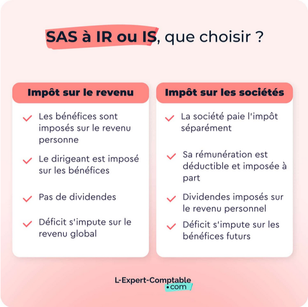



Motivation
Détermination
Compétences exploitables en Freelance



## Pourquoi devenir Freelance ?

Un jeune ingénieur a de nombreuses compétences, une capacité importante d'encaisser de la charge de travail, une aisance plus ou moins développée en communication, des connaissances développées en gestion de projet et des notions en comptabilité, gestion et formalités administratives. Pour toutes ces raisons, les ingénieurs ont des profils parfaitement propices au lancement dans une activité de freelance, que ce soit en complément de revenus ou en activité principale à temps plein. Ce mode de travail peut s'avérer très attirant pour la liberté qu'il apporte et les perspectives de rémunération qu'il peut permettre dans certains cas. En revanche, il implique aussi sa dose de défis que ce soit en gestion administrative, en démarchage de clients ou au niveau de la stabilité financière. L'objectif est de comprendre au fur et à mesure de ce MON les formalités et les modalités inhérents au mode de travail en freelance.

## Peut-on cumuler freelance et salariat ? 

Il est assez courant d'avoir une activité en freelance tout en conservant son emploi salarié. C’est une stratégie prudente qui permet de tester le marché sans prendre de risques financiers ou simplement de mettre du beurre dans ses épinards. Cependant, quelques règles sont à respecter :

- **Vérifier son contrat de travail** : absence de clause d’exclusivité ou de non-concurrence.
- **Ne pas utiliser le matériel de l’employeur** pour son activité parallèle.
- **Respecter les horaires de travail** et ne pas empiéter sur le temps de travail salarié.
- **Informer son employeur** si nécessaire, certaines entreprises demandant une déclaration préalable. (Attention notamment dans la fonction publique)

### Administrativement, comment je fais ? 

Pour pouvoir exercer une activité professionnelle en freelance, il faut obligatoirement le faire dans le cadre d'une "entreprise". Dans le cas du freelance en parallèle d'une activité salariée, le statut d'entreprise le plus adapté est dans la majorité des cas le statut de **micro-entrepreuneur** : 

- Inscription simple et rapide (URSSAF en ligne),
- Comptabilité simplifiée,
- Charges sociales proportionnelles au chiffre d’affaires,
- Pas de TVA sous certains seuils,
- Compte bancaire dédié obligatoire dès le lancement de l’activité, mais compte bancaire professionnel n'est requis uniquement si le chiffre d’affaires dépasse 10 000 € par an pendant deux années consécutives.
- Possibilité d'opter pour l'impôt libératoire sous conditions de revenus, ce qui permet de payer directement l'impôt sur le chiffre d'affaires plutôt qu'en fin d'année. (souvent avantageux fiscalement)

NB : En cas de revenus élevés, on peut assez rapidement envisager d'autres statuts comme l'EURL ou la SASU pour optimiser sa fiscalité notamment. 

## Et si j'ai envie de passer en freelance à temps plein ?

Quand le freelance devient plus rentable et stable, il est tentant de quitter le salariat pour s’y consacrer pleinement. Avant de sauter le pas, il y a pas mal de choses à prendre en compte. 

### Les aides financières pour la transition

- **ACRE** (aide à la création ou à la reprise d’entreprise) : Exonération partielle de cotisations sociales pendant la première année.
- **ARCE** (Aide à la Reprise ou à la Création d’Entreprise) : Possibilité de percevoir une partie de ses allocations chômage sous forme de capital.
- **Maintien des ARE** (aide au retour à l'emploi) : Cumul possible avec les revenus de freelance sous certaines conditions.
- **Congé sans solde pour création d'entreprise** : Il est possible de demander un congé d’un an (renouvelable une fois) pour tester son activité tout en conservant son poste en cas d’échec.

### Quel statut juridique choisir pour son entreprise ?

- **Micro-entreprise** : Le même statut que dans le cas précédent avec le cumul du salariat. Idéal pour un lancement rapide, mais les plafonds de chiffre d’affaires sont vite limitants.
- **EURL / SASU** (entreprise unipersonnelle à responsabilité limitée / société par actions simplifiée unipersonnelle): Intéressants si le chiffre d’affaires devient conséquent et/ou pour limiter sa responsabilité.

## Comment gérer mon activité de freelance : Comptabilité, fiscalité et organisation

Faire du freelance ce n'est pas uniquement la réalisation de missions et de prestations rémunérées pour des clients, c'est aussi gérer son entreprise ! Cela implique différentes obligations :

### Les obligations administratives

- **Immatriculation** au registre national des entreprises (RNE) + obtention du SIRET,
- **Ouverture d'un compte bancaire dédié** : Obligatoire dès la création de l’activité. Si le chiffre d’affaires dépasse 10 000 €/an pendant 2 ans, il faut même ouvrir un compte bancaire professionnel.
- **Assurances** : il faut souscrire à une responsabilité civile professionnelle (RC Pro), éventuellement une complémentaire santé et une prévoyance. Pour certains métiers (ex. BTP), une assurance décennale est obligatoire.


Dans le cas de la micro-entreprise si les revenus sont assez faibles, il n'est pas totalement obligatoire d'ouvrir un compte bancaire dédié. Cependant, cela nécessite de tenir une comptabilité ultra rigoureuse et il est fortement conseillé de passer sur un compte bancaire dédié dès la création de la micro-entreprise pour éviter tout litige en cas de contrôle fiscal.


### La Comptabilité et la Fiscalité

- **Déclaration de chiffre d’affaires** : Mensuelle ou trimestrielle (micro-entreprise) ou via un expert-comptable (EURL/SASU).
- **TVA** : Franchise en base pour les micro-entrepreneurs, sinon obligation de facturation.
- **Optimisation fiscale** : Comparaison entre impôt sur le revenu (IR) et impôt sur les sociétés (IS) pour les structures plus complexes.


**En cas de faibles revenus** pour les mirco-entrepreneurs uniquement, il existe l'impôt libératoire. Il faut répondre à certaines conditions, notamment être en-dessous de certains plafonds de revenus (redéfinis régulièrement dans les règlementation). Ce régime consiste en un prélèvement fiscal simplifié directement sur le chiffre d'affaires. Il est avantageux dans la grande majorité des cas éligibles.


#### L'impôt sur le revenu (IRPP) ou l'impôt sur les sociétés (IS), quelles différences ? Quel régime choisir ?

En résumé, la première grande différence entre les deux régimes est la déduction des charges du revenu imposable. On ne peut pas déduire les mêmes charges du revenu imposable en fonction du régime IS ou IRPP. La deuxième grande différence qui définit souvent le choix entre les deux régimes réside dans le déficit, qui s'impute dans le revenu global dans le cas de l'IRPP (permet dans certains cas de descendre de tranche d'imposition) alors qu'il s'impute sur les bénéfices futurs pour l'IS.


Notez qu'en fonction du statut d'entreprise choisit, vous n'avez pas toujours le choix entre ces deux régimes. Par exemple, une EURL peut être soumise à l'IRPP alors qu'une SASU ne peut l'être que pour 5ans maximum sous certaines condition. En revanche, dès lors que l'EURL fait le choix de passer à l'IS, il est impossible de revenir à un régime IRPP.



Pour aider les entrepreneurs à choisir leur régime d'imposition, certains simulateurs existent sur internet comme celui de [L'expert-comptable.com](https://www.l-expert-comptable.com/calculateurs/ir-ou-que-choisir.html).
Naturellement, il est toujours possible de se rapprocher d'un expert comptable pour y voir plus clair en cas de besoin.


#### Prévisionnel financier

Même avec des notions de comptabilité, il est important d’anticiper les principales dépenses :

- Charges sociales et fiscales : Cotisations URSSAF, impôts.
- Dépenses fixes : Matériel, logiciels, abonnements.
- Assurances : Mutuelle, prévoyance, RC Pro.
- Trésorerie : Anticiper les délais de paiement et le BFR (besoin en fonds de roulement).

### Protection sociale et mutuelle

En tant qu'auto-entrepreneur, il faut s'inscrire au régime général de la Sécurité sociale des indépendants (anciennement régime social des indépendants (RSI)). De plus, contrairement aux salariés, les freelances ne bénéficient pas d’une mutuelle d’entreprise ni d’un arrêt maladie rémunéré par leur employeur. Il est donc recommandé de souscrire à une **mutuelle santé** pour couvrir les frais médicaux ainsi qu'à une **prévoyance** pour pallier les pertes de revenus en cas d’arrêt de travail prolongé.

### Comment définir mon tarif ?

En freelance, on choisit soi-même le prix auquel on "vend" notre travail ou nos prestations. On parle souvent du **TJM** (Tarif Journalier Moyen). Pour le calculer, la méthode la plus conseillée est de prendre en compte son salaire cible ainsi que les différentes charges mentionnées précédemment et de diviser ce chiffre par le nombre de jours facturables (généralement aux alentours de 220 jours par an). Une fois cette première estimation obtenue, il est important de comparer son TJM avec ceux pratiqués par vos concurrents sur le marché. L'objectif est d'être compétitif tout en s'assurant une bonne rentabilité. 


Pour se comparer aux pris du marché, il est nécessaire de cerner précisément son propre profil et d'être honnête avec soi même. Il faut particulièrement s'interroger sur son expérience, la rareté de ses compétences et la demande dans son domaine. Ces critères dictent le marché et influent fortement sur les tarifs pratiqués par chacun.


Par ailleurs, le TJM n'est pas l'unique méthode de tarification. Vous pouvez faire des prix à la mission par exemple ou pour chaque livrable réalisé. En revanche, il faut porter une attention particulière à la rédaction du contrat ! Si vous êtes payé à la mission, mais que vous assurez une "garantie" sur le travail fait, définissez dès le contrat les limites de cette garantie, ou le tarif horaire de la maintenance éventuelle post mission.

## Le portage salariale : une alternative sécurisée.

Le portage salarial est une solution intermédiaire entre le salariat classique et le freelancing. Il permet à un indépendant de travailler pour ses clients tout en conservant un statut de salarié auprès d’une entreprise de portage.

### Avantages du portage salarial

- Sécurité sociale identique à un salarié (mutuelle d’entreprise, chômage, retraite).
- Moins de gestion administrative : pas besoin de créer d’entreprise, la société de portage s’occupe de la facturation et des cotisations.
- Accès plus facile à certains clients qui préfèrent contractualiser avec une entreprise plutôt qu’un indépendant.

### Inconvénients

- Coût élevé : La société de portage prélève une commission sur le chiffre d’affaires (5 à 10 % en général).
- Moins de flexibilité fiscale que via une structure juridique propre.

## Conclusion

Finalement, un ingénieur généraliste ou un ingénieur centralien a un profil bien adapté au freelance. En effet, notre parcours de formation que l'on colore chacun en fonction de nos goûts en approfondissant des matières spécifiques qui nous plaisent sont ponctués de différents modules de tronc commun, parmi lesquels une introduction à la comptabilité et la gestion, mais aussi de la formation à la gestion de projet. Cerise sur le gâteau, notre parcours de formation nous amène à de multiples reprises à effectuer des présentations orales, ce qui développe nos capacités en communication et nous donne les clefs pour un démarchage et un contact efficace et adapté avec les clients. Toutes ces compétences plus ou moins "soft" mêlées à nos compétences métier et nos connaissances théoriques justifient donc l'attrait d'une partie d'entre nous pour le freelance ainsi que notre capacité de mener à bien notre activité d'auto-entrepreneur.



- [Legalplace](https://www.legalplace.fr/guides/devenir-freelance/)
- [entreprendre.service-public.fr](https://entreprendre.service-public.fr/vosdroits/F36244)
- [Le coin des entrepreneurs](https://www.lecoindesentrepreneurs.fr/demarrer-une-activite-de-freelance/)
- [Le coin des entrepreneurs](https://www.lecoindesentrepreneurs.fr/creation-d-entreprise-options-fiscales-benefices-tva/)
- [L'expert-comptable.com](https://www.l-expert-comptable.com/a/37735-le-choix-entre-l-et-l-ir.html)
- [Freelance Infos](https://freelanceinfos.fr/salarie-freelance-en-meme-temps-peut-on-cumuler-les-deux-statuts/)
- [Legalstart](https://www.legalstart.fr/fiches-pratiques/devenir-freelance/portage-salarial-ou-freelance/)

