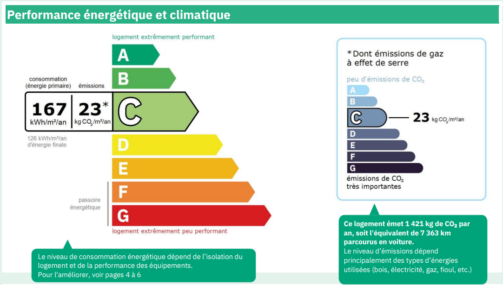
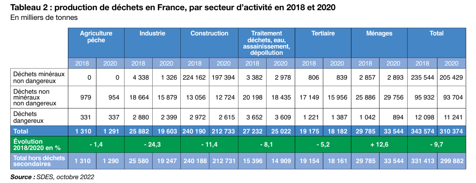
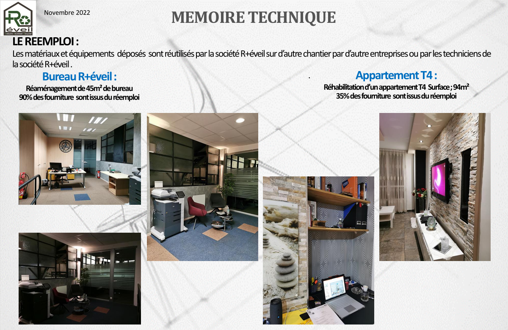
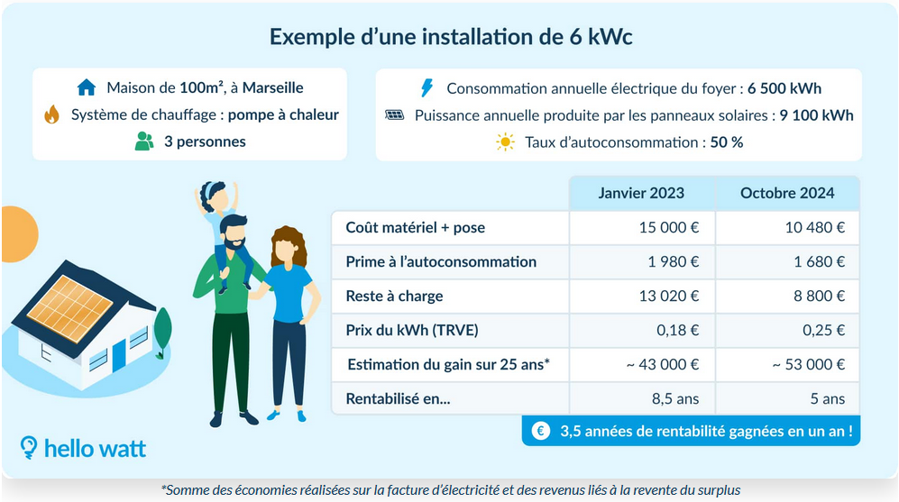



Pas de prérequis



## Sprints

Le but de ce POK est de mieux comprendre ce qui fait qu'un bâtiment est performant écologiquement parlant, et comment ces performances sont régulées par la loi.

### Sprint 1

- [x] Se documenter sur les différentes normes autour de la performance thermique/écologique des bâtiments
- [x] Identifier les facteurs mesurables visés dans ces normes (Qu'est ce qui fait qu'un bâtiment est performant ou non selon ces normes)
- [x] Comprendre ces facteurs de performance et les illustrer

### Sprint 2

- [x] Identifier les leviers sur lesquels on peut agir pour rendre un bâtiment performant écologiquement et thermiquement
- [x] Illustrer leur impact ainsi que leur coût et difficulté de mise en place

## Premier Sprint : Performance climatique et legislation

Depuis le 1er janvier 2025, il est désormais interdit de mettre en location les logements qualifiés de "passoires thermiques", c'est-à-dire les logements qui ont un DPE (Diagnostique de perfomances énergétiques) inférieur ou égal à G. Ce boulversement du marché locatif dont on entend parler est le résultat de la loi Climat et Résilience de 2021. Quelles lois et normes définissent les performances énergétiques et plus largement les performances écologiques en France ?

### Les Lois et normes

#### Arrêté du 3 mai 2007 relatif aux caractéristiques thermiques et à la performance énergétique des bâtiments existants

Cet arrêté concerne les bâtiments existants dans lesquels des travaux concernant un de ces postes sont entrepris (peu importe l'ampleur des travaux en question) :

Les murs/toits/planchers
Les parois vitrées
le chauffage/le refroidissement
l'eau chaude sanitaire
la ventilation
l'éclairage
les énergies renouvelables

Concrètement, si des travaux de rénovations sont faits dans un bâtiment concernant un des éléments listés ci-dessus, le maître d'ouvrage doit obligatoirement respecter pour ces éléments des caractéristiques minimales fixés par l'arrêté, afin d'assurer une certaine performance thermique minimale. Les caractéristiques à respecter ont été réadaptées par un arrêté au premier janvier 2018 afin d'augmenter les performances minimales à respecter.

#### La Loi énergie-climat

Adoptée le 8 Novembre 2019, cette loi constitue une action concrète pour réduire l'emprunte carbone de la France. Elle est assez transverse et concerne entre autres, la balance énergétique de la France entre énregies fossiles et renouvelables, mais aussi la lutte contre les logements considérés comme "passoires thermmiques".

Concrètement, pour le bâtiment, cette loi a interdit d'augmenter les loyers des logements énergivores dès 2021. A partir de 2022, il est devenu obligatoire de réaliser un audit énergétique de tout bien dit "passoire thermique" au préalable de sa vente ou mise en location. Tout celà pour inciter les propriétaires à réaliser des travaux d'amélioration des performances énergétiques de leurs biens. Par la même occasion, quelques problématiques plus sociales ont été évoquées dans cette loi au-delà des seules problématiques écologiques en définissant, par exemple, des critères de décense des logements, obligatoires à valider pour tout nouveau contrat de location.

#### La loi Climat et Résilience

Ce fameux texte qui fait parler de lui en ce début d'année 2025 avec lequel j'ai introduit cette partie. Datant du 24 août 2021, son entrée en vigueur est progressive. Cette loi vient, entre autres, compléter et préciser la loi énergie-climat décrite précédemment.

Tout d'abord, cette loi a confirmé l'interdiction d'augmenter les loyers des passoires thermiques avec une entrée en viugueur de cette mesure en août 2022.

Ensuite, cette loi prévoit une interdiction progressive de la mise en location des logements aux mauvaises performances thermiques (ayant une mauvaise note de DPE), d'où l'interdiction de mettre en location un logement classé G à partir de janvier 2025.

Ces deux lois (énergie-Climat et Climat-Résilience) ont surtout pour effet d'inciter, voire forcer les propriétaires à engager des travaux de rénovation énergétiques des bâtiments existants. En ce qui concerne la construction neuve, des règlementations aussi imposent des objectifs de performance énergétique.

#### La RE2020

Principale législation sur les performances énergétiques des constrictions neuves, elle rigidifie depuis janvier 2022 les mesures déjà présentes dans sa prédécesseure la RE2012. Concrètement, toute construction neuve doit respecter des standards et des performances en terme d'isolation thermique ou encore de moyen de chauffage et de production d'eau chaude sanitaire. A titre d'exemple, les chaudières à gaz qui étaient la "formule magique" de certains maîtres d'ouvrage pour faire rentrer leurs opérations de logement dans les critères de la RE2012 ne sont plus aussi avantageuses selon les critères de la RE2020.


La RE2012 prenait en compte deux cirtères principaux dans le calcul de la performance d'un logement :

- sa consommation électrique estimée
- ses émissions de Gaz à effet de serre (GES)

Installer une chaudière à gaz permet de réduire la consommation électrique d'un logement, donc à améliorer sa performance selon ce critère. En revanche, cette même chaudière à gaz dégrade fortement la performance concernant les émissions de GES ! C'est là-dessus que jouaient les maîtres d'ouvrage : ils "équilibraient" les défauts des logements en les répartissant sur ces deux critères de calcul différents, ce qui permettait aux logements d'être facilement conformes selon la RE2012. C'est un des points qui est corrigé et endurci dans la RE2020.


Par ailleurs, le réchauffement climatique faisant son bonhomme de chemin et les vagues de chaleur étant de plus en plus fréquentes en France, la RE2020 s'intéresse aussi beaucoup plus au confort d'été des bâtiments que la RE2012.

**La construction, la rénovation, la mise en location et la vente de bâtiments ou biens immobiliers sont donc règlementés dans le but de forcer l'amélioration progressive des performances énergétiques des bâtiments en France. La plupart de ces normes s'intéressent notamment au DPE des bâtiments, voyons de quoi il s'agit plus précisément !**

### Le DPE

Il est souvent question dans les normes sur les performances écologiques des bâtiments du fameux DPE. Le Diagnostique de Performance Energétique (DPE) est en effet un outil mis en place pour avoir un indicateur officiel et uniforme des performances énergétiques d'un bâtiment en France. Sans cet indicateur, il était difficile de mesurer les performances d'un logement ou d'un bâtiment, cela rendait donc difficile la règlementation de ces performances.

#### Que doit contenir un DPE ?

Tout d'abord, le DPE commence par rappeler la surface habitable (considérée comme chauffée) du logement, ainsi que ses caractéristiques générales jugées pertinentes par le diagnostiqueur.

Ensuite, le diagnostique attribue deux notes au logement correspondant à sa performance énergétique et à sa performance climatique, comme sur l'image ci-dessous extraite d'un DPE

Comme le but du DPE est aussi d'informer les locataires lorsqu'ils cherchent un logement, il doit être compréhensible et concret pour le plus grand nombre. Ces notes de performances doivent donc être accompagnées d'une estimation des dépenses énergétiques annuelles du logement.


Cette estimation reste très générique et approximative. la facture réelle d'énergie dépendra aussi du mode de vie de chacun, de la température à laquelle le logement est chauffé l'hiver, les parties que l'on décide de chauffer ou pas, etc

De plus, même si le climat est pris en compte dans le calcul du DPE, l'estimation des dépenses liées au chauffage va souvent s'avérer exagérée par le DPE pour un appartement à Marseille tandis qu'elle sera régulièrement dépassée pour un logement à Lille ou à Brest !


La suite du DPE s'arrête sur les performances de l'isolation du logement, son système de ventilation, son confort en période estivale et sa production aventuelle d'énergie renouvelable.

Enfin, le DPE propose une vue d'ensemble des caractéristiques et des équipements du logement avant de proposer pour terminer des suggestions d'amélioration des performances énergétiques et climatiques du logement en précisant pour chaque poste d'amélioration proposé le coût estimé des travaux et leurs répercutions sur la note du logement.

Le DPE doit toujours être accompagné en annexe d'un détail technique listant les mesures et relevés effectués ainsi que les caractéristiques du logement observées et prises en compte.

#### Quelles sont les données d'entrée pour calculer un DPE ?

Plus concrètement encore, pour rentrer dans l'aspect technique, listons plus en détail les données concrètes qui entrent dans le calcul du DPE.

##### Les murs

Tous les murs entourant le logement sont identifiés et analysés. Les diagnostiqueur relève en particuier la surface de chaque mur, le matériau qui le compose, son épaisseur, l'isolation s'il y en a et le local adjascent. Ces relevés permettent surtout d'observer les performances en terme d'inertie thermique du logement. Ainsi, un mur isolé donnant sur un local chauffé (un autre appartement par exemple) ne sera quasiment pas source de perte de chaleur pour l'appartement tandis qu'un mur, pas forcément isolé, en contact avec l'extérieur le sera beaucoup plus.

##### Les sols et plafonds

Ils sont analysés au même titre que les murs pour identifier les pertes de chaleur éventuelles au niveau de ces surfaces.

##### Les ouvertures

Toutes les portes et fenêtres donnant sur l'extérieur sont répertoriées dans le DPE et analysées. Le diagnostiqueur relève, entre autres, la surface de chaque ouverture, son orientation (Nord, Sud, etc), s'il s'agit de simple ou double vitrage, le type de menuiserie (PVC, alu, bois, etc) ou encore le type de pose de la menuiserie (en applique ou en tunnel par exemple)

##### Les ponts thermiques

A partir de l'analyse des murs et des ouvertures, le diagnostiqueur va pouvoir lister les différents ponts thermiques du logement, pour les prendre en compte dans les performances d'inertie thermique calculées pour établir les notes du DPE.

##### Les systèmes de ventilation

Il s'agit d'indiquer la présence d'une VMC ou non et si le logement est traversant. En effet, un logement ayant des ouvertures sur plusieurs façades permet une ventilation naturelle efficace, ce qui rattrappe bien la note du DPE en cas d'absence de VMC. Une ventilation optimale est indispensable pour garder un logement sain. Sans bonne ventilation, le logement sera beaucoup plus exposé à des risques d'humidité (donc de moisissures), ce qui nuit aussi au confort thermique en plus d'être malsain pour les habitants.

##### Les systèmes de chauffage et de production d'eau chaude

La dernière donnée d'entrée importante d'un DPE est l'identification du système de chauffage et de production d'eau chaude sanitaire. Il s'agit de savoir si le logement est chauffé au gaz, au fioul, à l'électricité ou autrement. L'âge et l'état des systèmes de chauffages entrent également en compte dans le calcul. En effet, une chaudière récente sera souvent beaucoup plus performante et économique qu'une ancienne chaudière, de par sa conception ou même son usure.

### Analyse Post-Mortem du premier Sprint

La principale difficulté de ce sprint fût de se plonger dans les différentes législation et se les approprier suffisamment pour pouvoir les résumer et les vulgariser. Je m'attendais à cette difficulté, car les textes de lois sont toujours rédigés de manière très spécifique et sont rarement clairs et concis pour un lecteur non initié au droit. En parallèle, c'était intéressant de constater l'évolution des législations, qui montre l'intérêt croissant porté par l'Etat sur la problématique environnementale. Cela s'est d'ailleurs confronté à mes a prioris et mon sentiment global de départ qui tendait à croire en une inaction de l'Etat face à ces problématiques. Je n'en reste pas moins convaincu que ça ne bouge pas assez vite.

## Second Sprint : Au-delà des minima légaux, comment réduire l'impact environnemental d'un bâtiment ?

### Focus sur la contruction du bâtiment

Les législtations vues précédemment sont surtout articulées autour de la consommation énergétique d'un bâtiment à l'usage. Un autre levier non négligeable pour diminuer l'impact environnemental réside simplement dans sa construction. Notamment, le choix des matériaux de construction utilisés ou encore la gestion des déchets du chantier peuvent influer significativement sur l'impact d'une construction.

#### La production de déchets

Tout d'abord en ce qui concerne les déchets, le secteur du BTP est connu et clairement identifié pour la quantité monstrueuse de déchets qu'il produit. En 2020, le secteur de la construction représente presque 70% de la production de déchets en France selon le Bilan 2020 de la production de déchets en France publié par le Ministère de la transition écologique et de la cohésion des territoires.

Conscient de cet enjeu, l'état français a instauré une politique de pollueur-payeur. Ce principe oblige tous les "producteurs" à contribuer à la gestion des déchets éventuels engendrés par leur produit. Concrètement, les producteurs doivent verser une éco-contribution financière à certains organismes précis, souvent des organismes de traitement de déchet, pour participer au traitement des déchets engendrés par leur produit. Ainsi, plus un produit est fait à partir de matières recyclables, moins cette éco-contribution sera chère. Cette contrainte vise à favoriser l'éco-conception des produits car moins de déchets implique moins d'éco-contribution !

Dans le cas précis de la construction, des éco-organismes comme [Valobat](https://www.valobat.fr/) se sont créés pour accompagner les entreprises et artisans dans l'application de cette norme. Ils proposent l'accompagnement des fabricants et distibuteurs pour la mise en place de l'éco-contribution des produits qu'ils vendent mais aussi les entreprises et artisans du BTP pour collecter leurs déchets et les rediriger dans les filières de recyclage et revalorisations adaptées.

Aujourd'hui, de plus en plus de déchets du BTP sont recyclés et le réemploi se développe de plus en plus pour limiter la production de déchets. Par exemple avec [CycleUp](https://www.cycle-up.fr/home), une entreprise peut mettre en vente des matériaux commandés en trop, déposés proprements de bâtiments existants, ou installés provisoirement sur des espaces tampons mis en place pendant la durée d'un chantier entre autres. D'autres entreprises ou artisans peuvent alors acheter ces matériaux d'occasion pour les installer sur d'autres chantiers. C'est un très bon moyen d'allier économie et écologie ! 

Du côté de la revalorisation, de plus en plus de filières spécialisées se développent, comme chez [Tarkett](https://professionnels.tarkett.fr/fr_FR/node/recyclage-dalles-de-moquette-boucler-la-boucle-13211), un fabriquant français de moquettes qui rayonne à l'échelle mondiale. Ce producteur est le parfait exemple de l'intérêt de l'éco-contribution. Cette taxe sur la production de déchets a encouragé l'entreprise à investir sérieusement dans la recherche et le développement et ils sont capables aujourd'hui de produire des dalles de moquettes qu'ils savent recycler à 100% une fois la dalle en fin de vie. Plus généralement, Tarkett a introduit tant que faire se peut des matériaux recyclés ou biosourcés dans la production de leurs revêtements de sol.

Enfin, quelques artisans et entreprises se spécialisent dans le réemploi et la rénovation durable. On peut citer la petite entreprise Marseillaise R+Eveil, qui récupère de nombreux matériaux de seconde main à l'occasion du curage de bâtiments existants à rénover puis qui réutilise un maximum de ces matériaux sur d'autres chantiers en tous genre. Ils ont travaillé sur les chantiers du MUCEM, de la Friche Belle de Mai, d'un centre médical à Castellane et j'en passe ! Ci-dessous quelques photos de deux projets qu'ils ont menés :

#### Le choix des matériaux

Une fois que l'on a réduit au maximum la production de déchets d'un chantier et fait en sorte de trier, revaloriser et réemployer au maximum les déchets restants, un autre poste peut être étudié sérieusement pour réduire l'impact environnemental d'un bâtiment et notamment son empreinte carbone : les matériaux utilisés pour sa construction et/ou sa rénovation. En effet, les matériaux utilisés peuvent avoir deux influences différentes : une influence directe à la construction et une au long terme mesurable sur l'usage du bâtiment. Ce-dernier impact est notamment celui visé par les DPE présenté lors du premier sprint. Il s'agit de produire le moins d'émissions carbone possible à l'usage, notamment pour le chauffage ou les différents appareils électroménagers.

Le trio d'[Ad'A](https://www.anatomiesdarchitecture.com/) composé de deux architectes et un anthropologue a beaucoup étudié ce sujet. Aujourd'hui ils proposent des expositions où ils présentent leurs nombreux constats mais également des chantiers de formation sur lesquels ils forment en quelques jours des artisans et des particuliers à certaines techniques éco-responsables qu'ils préconisent. Par exemple, à Marseille, ils ont proposé des formations sur la fabrication et l'application d'une isolation à base de terre et de paille pour les murs extérieurs. Cette isolation a le premier avantage d'être performante thermiquement. Son principal atout en terme d'environnement est la provenance biosourcée et locale des matériaux qui la composent, ainsi que son processus de fabrication très économe en émissions carbone. Toujours à Marseille, ils ont réalisé au Tiers-Lab des transitions un appenti contruit avec des briques en terre crue qu'ils ont réalisé sur place avec de l'argile locale et un séchage naturel. Les facteurs qui rendent leurs solutions très performantes sont la provenance ultra-locale des matériaux utilisés, qui plus est sont biosourcés et dont la production n'émet quasiment pas de carbone. Un combo gagnant en somme !

On l'aura donc bien compris, le secret d'un matériau économe en émissions carbone réside dans la combinaison du biosourcé et du local. L'[INRAE](https://www.inrae.fr/dossiers/biosource-va-t-il-verdir-batiment/9-materiaux-biosources-batir-demain) (Institut National de Recherche pour l'Argiculture, l'Alimentation et l'Environnement) a étudié et recensé plusieurs procédés biosourcés comme le béton de chanvre ou le bardage en bois sous ses différentes formes (bois tropical importé VS bois local voire bois reconstitué à partir de déchêts de bois de hêtre). Leurs rapports évoquent même l'utilisation de certains champignons pour la production de certains matériaux à partir de résidus agricoles.

En parallèle des matériaux biosourcés, d'autres solutions sont aussi explorées pour réduire l'empreinte carbone d'un bâtiment à sa construction, notamment pour économiser le maximum de matières premières polluantes. Ainsi, l'entreprise [Modulatio](https://www.modulatio.fr/modula_dalle.php) est en train de développer et tester un principe innovant de dalle béton qui permet de réduire considérablement la quantité de béton utilisée dans la construction de dalles et structures. Cette solution a pour objectif de ne pas être plus couteuse qu'une construction en béton classique car l'ambition est de compenser le coût du "moule à béton" avec l'économie sur la quantité de béton. Ainsi, l'objectif est que cette solution permette de réduire l'empreinte carbone et lutilisation de matière première sans augmenter nécessairement le coût de mise en oeuvre.

Ces quelques exemples permettent de se rendre compte que les solutions en termes de matériaux pour réduire l'empreinte carbone d'un bâtiment à sa construction sont nombreuses et variées. Cependant, elles restent des produits de niche développés par des startups et des petites structures. La démocratisation de ces solutions fait face à de nombreux freins : certains sont compliqués à mettre en place à "grande échelle" en ce qui concerne la quantité de production. La plupart ne sont pas (ou pas encore) compétitifs financièrement par rapport à leur substitut standard utilisé communément dont les coûts de production ont été réduits et optimisés au maximum grâce à une production en massse et une généralisation de leur utilisation. D'autres encore sont trop récents et donc difficilement utilisables dans des projets de constructions car, sans recul sur la viabilité dans le temps d'un matériau ou d'un procédé, il est délicat de miser dessus pour la structure ou l'isolation d'un bâtiment. En effet, si un procédé novateur de béton est utilisé trop précipitamment sur une construction et qu'il s'avère mal vieillir dans le temps, on met les occupants du bâtiment en danger, c'est inenvisageable. Enfin, certains procédés de production à partir de résidus agricoles ou de chutes de bois sont intéressants car ils permettent de revaloriser des chutes et résidus mais offrent une capacité de production limitée par la production actuelle de ces résidus.

### Focus sur l'usage du bâtiment

Réduire l'empreinte environnementale d'un bâtiment dûe à son utilisation quotidienne est un autre front que celui des matériaux et procédés de construction qui peut s'avérer tout aussi puissant en terme d'efficacité. C'est un combat qui est déjà bien entamé par les règlementations actuelles en France présentées précédemment comme la RE2020 ou les différentes obligations liées au DPE. En effet, le premier vecteur d'efficacité environnementale d'un bâtiment concernant son usage est sa performance thermique donc son isolation et son moyen de chauffage.

Un aspect qui a moins été développé dans la première partie sur le cadre légal est l'autosuffisance d'un bâtiment. En effet, si aujourd'hui on est capable de pousser la performance thermique d'un bâtiment à des niveaux époustouflants, cela implique que le bâtiment en question sera très économe en électricité. Dès lors, il devient envisageable de s'approcher de l'autosuffisance énergétique avec une installation photovoltaïque correctement dimentionnée par exemple. Encore une fois, le facteur économique étant très souvent prédominant dans les prises de décisions, il est important de souligner que l'on peut espérer rembourser l'investissement initial de son installation solaire grâce aux économies réalisées sur sa facture mensuelle d'électricité, et ce sur une période souvent réaliste vis-à-vis de la durée de vie théorique des panneaux photovoltaïques. Bien sûr, cela reste souvent un gros investissement initial pour un retour sur investissement à l'échelle d'une à deux décennie(s). Pour autant, avec le prix croissant de l'électricité ces dernières années et la réduction progressive des coûts d'installation de panneaux photovoltaïques, le remboursement de l'investissement initial tend à s'envisager sur une période inférieure à 10ans dans de plus en plus de cas, comme celui présenté dans l'article d'Hello Watt affiché ci-dessous.

A l'usage, il y a une autre ressource que l'on peut économiser : l'eau ! D'autant plus que cette ressource fait partie des neufs limites planétaires identifiées. Pour économiser l'eau, comme pour toute économie la sobriété de l'utilisateur reste primordiale. Pour autant, certaines installations permettent d'économiser de l'eau presque sans s'en rendre compte. Par exemple, installer une bonne robinetterie avec des mousseurs adaptés permet d'utiliser un débit d'eau plus faible tout en gardant le même confort d'utilisation. Ainsi, quand un pommeau de douche classique a un débit de 15 à 20 litres d'eau par minute, de nombreux pommeaux de douches spécifiques premettent aujourd'hui de réduire ce débit aux alentours de 10 litres par minute. C'est une économie notable au long terme, particulièrement si elle est généralisée à grande échelle ! Par ailleurs, on peut également prévoir dès la conception d'un bâtiment de récupérer les eaux de pluie pour les chasses d'eau ou l'arrosage des espaces verts et potagers. Lors d'une rénovation c'est toujours plus délicat de repenser l'installation de plomberie pour stocker l'eau de pluie d'une part et l'utiliser pour les chasses d'eau ensuite, même si cela reste possible selon les cas et la motivation.

### Analyse Post-Mortem du second sprint

Ce second sprint a été surprenant en terme de quantité de solutions trouvées. J'en ai présenté quelques unes qui paraissaient plus concrètes et dans un état d'avancement plus abouti. Le constat global reste que de nombreuses petites initiatives venant de grandes entreprises, d'associations ou encore de startups se multiplient chacune de leur côté pour répondre chacunes à des besoins très spécifiques et rares sont celles qui réussissent vraiment à se démocratiser. Probablement que la plupart d'entre elles ne sont pas suffisamment viables pour être généralisées, mais pour les autres, un manque d'organisation et de mise en commun de ces solutions à plus grande échelle bloque souvent leur démocratisation. Ce souci commence à être résolu du côté de la gestion des déchets et de sa multitude de filière de revalorisation des déchets avec la mise en place des éco-organismes comme Valobat que j'ai présenté dans ce sprint, qui assurent l'intermédiaire entre toutes les solutions plus ou moins connues de revalorisation de déchets et les chantiers. Enfin, une difficulté rencontrée dans ce sprint reste de faire la part des choses entre des arguments commerciaux d'une entreprises qui vend sa solution miracle et les vraies caractéristiques techniques proposées par la solution en question.

## Sources



- <https://www.ecologie.gouv.fr/politiques-publiques/exigences-reglementaires-thermiques-batiments-existants>
- <https://www.izi-by-edf-renov.fr/blog/loi-renovation-energetique>
- <https://www.service-public.fr/particuliers/vosdroits/F16096>
- <https://www.legifrance.gouv.fr/loda/id/JORFTEXT000043353335>
- <https://www.ecologie.gouv.fr/politiques-publiques/cadre-general-filieres-responsabilite-elargie-producteurs#le-fonctionnement-des-eco-organismes-1>
- <https://www.inrae.fr/dossiers/biosource-va-t-il-verdir-batiment/9-materiaux-biosources-batir-demain>
- <https://www.laplateformedelarenovation.fr/comment-economiser-eau-maison-guide/>
- <https://waterout.fr/blogs/actualite-plomberie-tutoriel/faire-des-economies-d-eau-a-la-maison#economiser>
- <https://www.hellowatt.fr/blog/3-ans-rentabilite-solaire/?utm_source=hw&utm_medium=email&utm_campaign=tempo24&utm_content=mail10>



## Horodatage

Toutes les séances et le nombre d'heure que l'on y a passé.

| Date | Heures passées | Indications |
| -------- | -------- |-------- |
| Mercredi 15/01/2025  | 3H  | Recherche de sources exploitables |
| Jeudi 16/01/2025  | 2H  | Lecture et documentation |
| Mardi 21/01/2025  | 2H  | recherche + lecture |
| Dimanche 26/01/2025  | 3H  |  synthèse et rédaction |
| Mardi 04/02/2025  | 2H  | recherche et documentation |
| Mercredi 05/02/2025  | 2H  | recherche et documentation |
| Samedi 08/02/2025  | 2H  | Recherche et documentation |
|  24/02/2025  | 2H  | Synthèse et Rédaction |
| Mardi 04/03/2025  | 2H  | Rédaction |