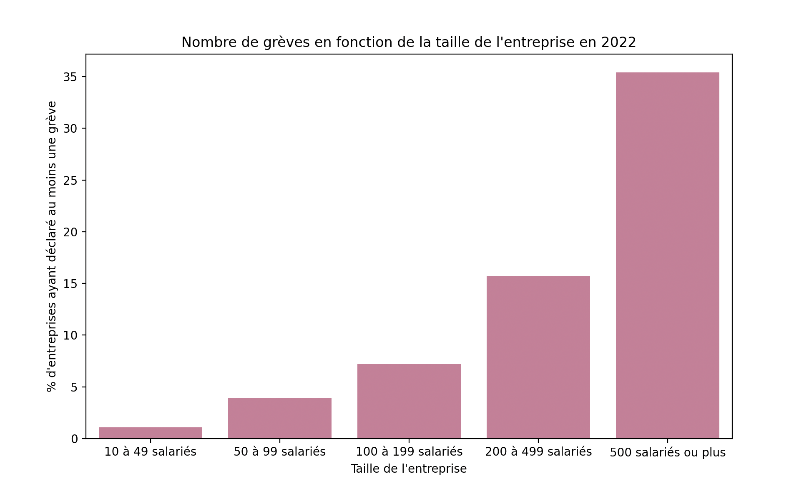
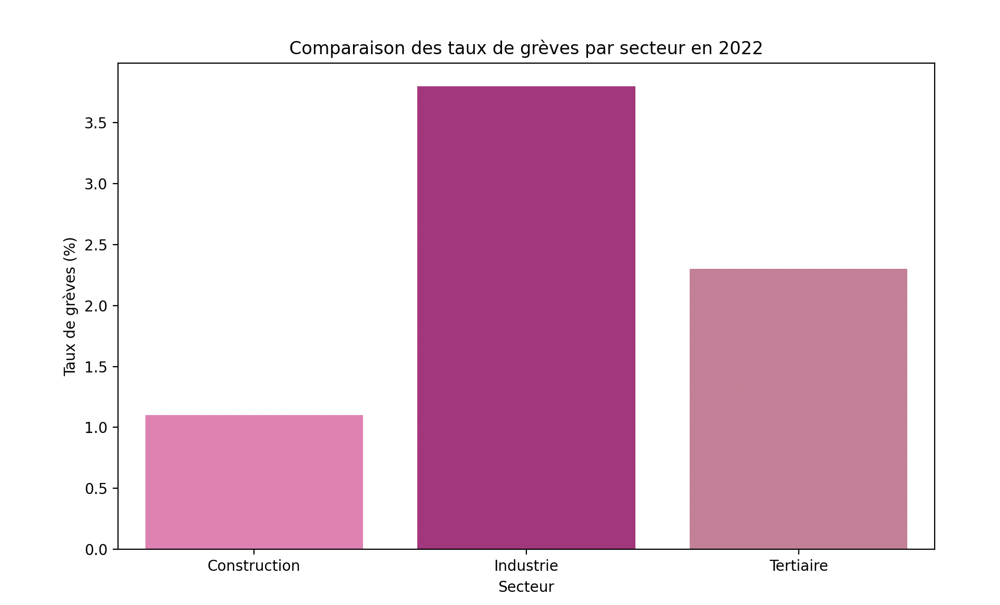



Les lien utiles pour la compréhension de celui-ci.



Quelques phrases permettant de connaître, sans jargon ni blabla, le contenu de ce POK. On oubliera pas de donner :

- le niveau et les prérequis nécessaires en utilisant la balise [`prerequis`](/contribuer/shortcodes/#prerequis)
- les autres POK & MON en rapport en utilisant la balise [`lien`](/contribuer/shortcodes/#lien)

## Tâches

### Sprints

#### Sprint 1

- [x] Cadrer l'étude
- [x] Formuler des questions auxquelles répondre
- [x] Collecter des données
- [x] Nettoyer et préparer les jeux de données pour l'analyse
- [x] Documentation librairies Python

#### Sprint 2

- [x] Continuer documentation libraries Python
- [x] Analyse de données et réponse aux questions formulées
- [ ] Data Visualisation

### Horodatage

Toutes les séances et le nombre d'heure que l'on y a passé.

| Date           | Heures passées | Indications                                                        |
| -------------- | -------------- | ------------------------------------------------------------------ |
| Jeudi 16/01    | 2H             | Cadrage de l'étude et recherche jeux de données                    |
| Mercredi 22/01 | 2H             | Recherche données et nettoyage / préparation                       |
| Dimanche 26/01 | 3H             | Nettoyage / préparation données et documentation librairies Python |
| Mercredi 29/01 | 1H             | Documentation Python et début code                                 |
| Mercredi 19/02 | 2H             | Documentation Bibliothèques Python                                 |
| Jeudi 20/02    | 2H             | Premiers graphes                                                   |
| Vendredi 21/02 | 2H             | Suites graphes                                                     |
| Samedi 01/03   | 3H             | Suite graphes et autres jeux de données                            |
| Vendredi 07/03 | 2H             | Suite                                                              |
| Mardi 11/03    | 1H             | Rédaction                                                          |

## Contenu

### Premier Sprint

Dans cette première phase, mon objectif était de cadrer l’étude en définissant clairement les questions auxquelles je souhaite répondre:

Il y en a bcp car je ne suis pas sûre de pouvoir répondre à tout avec les jeux de données trouvés.

- résultats de la grève (accords,...) en fonction de la longueur de la grève
- résultats de la grève en fonction de la date de la grève
- taux de grèves en france vs autres pays
- comparaison entre les différents secteurs: grèves et mobilisations
- taux de mobilisation en fonction de la date de la grève
- taux de mobilisation en fonction de la longueur de la grève
- comparatif entre les différents syndicats: qui initie le plus de négociations/ grèves
- nombre de grèves en fonction de la taille de l’entreprise
- comparaison thèmes discutés durant les mobilisations
- durée moyenne des grèves par secteur ou par pays
- fréquences des grèves en fonction de la date
- corrélation entre la taille des entreprises et la réussite des grèves
- évolution des grèves dans le temps
- analyse géographique des grèves en France
- taux de participation des salariés selon le secteur ou l'entreprise

Pour répondre à ces questions, j’ai sélectionné plusieurs jeux de données issus de sources officielles :

INSEE:

- 2022
- France Hors Mayotte
- Entreprises de 10 salariés ou plus du secteur marchand non agricole
  (mêmes paramètres que DARES )
  [INSEE Grèves](https://www.insee.fr/fr/statistiques/7767085?sommaire=7767424&q=gr%C3%A8ve)

DARES:

- Échantillon de 16 500 entreprises, dont environ 11 000 sont répondantes, représentatif des 265 000 entreprises de 10 salariés ou plus du secteur privé non agricole en France métropolitaine jusqu'en 2017, France métropolitaine et Drom (hors Mayotte) à partir de 2018, qui emploient environ 16,0 millions de salariés. Les entreprises ont été
  interrogées en 2023 sur leur situation en 2022
  [DARES Grèves](https://dares.travail-emploi.gouv.fr/publication/les-greves-en-2022)
- Autre jeu de données sur les JINT (Journées individuelles non travaillées)
  [DARES JINT](https://dares.travail-emploi.gouv.fr/donnees/les-journees-individuelles-non-travaillees-jint)

Ces sources ont été choisies pour leur fiabilité et leur complémentarité.

Autres jeux de données à potentielleùment utiliser. Histoire de pouvoir répondre aux questions posées préalablement, j'ai cherché des données plus précises (longueur des grèves, taux de mobilisation, dates, syndicats) et j'ai trouvé des données de la SNCF à analyser sur les mouvements sociaux depuis plusieurs années (.csv)

Une fois les données collectées, j’ai commencé un travail de préparation :

- Compréhension des données: unités, signification,...

- Nettoyage des données : suppression des valeurs manquantes.

- Refaire les tableaux sous des formes simplifiées pour que l'analyse avec Python soit plus simple par la suite

- Renommer les lignes et colonnes de façon claire

Une fois que j'ai refait mes tableaux tout beaux et bien structurés, je me suis renseignée sur comment faire de l'analyse de données avec Python (j'ai jamais fait). Librairies principales que j'ai exploré:

- Pandas : Permet de manipuler les données sous forme de tableaux, de filtrer, transformer les informations facilement. J’ai appris à charger mes fichiers CSV et à effectuer des premières analyses descriptives.

- Matplotlib & Seaborn : Pour la visualisation des données. J’ai exploré comment représenter graphiquement les tendances, les comparaisons et les distributions de variables.

L’objectif est maintenant d’appliquer ces outils à mon jeu de données et de produire mes premières visualisations et analyses.

### Second Sprint

Dans ce second sprint, j'ai continué la documentation sur les différentes librairies python utiles pour l'analyse de données. J'ai notamment regader les cours de M. Brucker pour me guider car je ne savais pas par où commencer.

Ensuite, je suis passée aux graphiques. En voici deux exemples:

```
import pandas as pd
import matplotlib.pyplot as plt
import seaborn as sns
import os

dares_path = "./DARES"
insee_path = "./INSEE"


def load_csv_from_folder(folder_path):
    dataframes = {}
    for filename in os.listdir(folder_path):
        if filename.endswith('.csv'):
            file_path = os.path.join(folder_path, filename)
            df = pd.read_csv(file_path, sep=';')
            df.replace('NR', pd.NA, inplace=True)
            for col in df.columns:
                try:
                    df[col] = pd.to_numeric(df[col].str.replace(',', '.'), errors='raise')
                except (ValueError, AttributeError):
                    pass
            dataframes[filename[:-4]] = df
    return dataframes

dares_data = load_csv_from_folder(dares_path)
insee_data = load_csv_from_folder(insee_path)


# Nombre de grèves en fonction de la taille de l'entreprise

greve_taille = dares_data['Grève taille entreprise']

plt.figure(figsize=(10, 6))
sns.barplot(x='Taille', y='2022', data=greve_taille, color='#DB7093')
plt.title('Nombre de grèves en fonction de la taille de l\'entreprise en 2022')
plt.xlabel('Taille de l\'entreprise')
plt.ylabel("% d'entreprises ayant déclaré au moins une grève")
plt.show()

# Comparaison entre les différents secteurs d'activité

greve_construction = dares_data['Grève secteur construction']
greve_industrie = dares_data['Grève secteur industrie']
greve_tertiaire = dares_data['Grève secteur tertiaire']

greve_construction_2022 = greve_construction[['Entreprises', '2022']]
greve_industrie_2022 = greve_industrie[['Entreprises', '2022']]
greve_tertiaire_2022 = greve_tertiaire[['Entreprises', '2022']]

industrie_total_2022 = greve_industrie_2022[greve_industrie_2022['Entreprises'] == 'Industrie total']
tertiaire_total_2022 = greve_tertiaire_2022[greve_tertiaire_2022['Entreprises'] == 'Activités tertiaires total']

greve_construction_2022['Secteur'] = 'Construction'
industrie_total_2022['Secteur'] = 'Industrie'
tertiaire_total_2022['Secteur'] = 'Tertiaire'

greve_secteurs_2022 = pd.concat([greve_construction_2022, industrie_total_2022, tertiaire_total_2022], ignore_index=True)


plt.figure(figsize=(10, 6))
sns.barplot(x='Secteur', y='2022', data=greve_secteurs_2022, palette=['#FF69B4', '#C71585', '#DB7093'])
plt.title('Comparaison des taux de grèves par secteur en 2022')
plt.xlabel('Secteur')
plt.ylabel('Taux de grèves (%)')
plt.show()
```

Ce qui nous donne les graphes suivants:


On voit bien que plus l'entreprise compte de salariés, plus elle compte de grèves


Comme historiquement, le secteur de l'industrie est celui qui compte le plus de grèves.

Aussi, j'ai touché à d'autres jeux de données et notamment ceux de la SNCF qui sont présentés différemments et plus précis.

## Analyse Post-Mortem

J'ai pas du tout aimé mon POK, j'ai eu du mal à m'y mettre à chaque fois et à avancer. Je pense que l'une des raisons est que je n'y connaissais rien et je ne savais pas par où commencer, j'avais 0 bases. Je m'y suis mal prise j'aurais dû demander de l'aide. Sinon juste je pense que ça ne m'a pas intéressée aussi et c'est pour ça que c'était compliqué d'avancer. Enfin, le thème des données était intéressant et j'ai aimé avoir des chiffres en tête sur ces sujets là et en apprendre plus mais pas faire avec Python.
