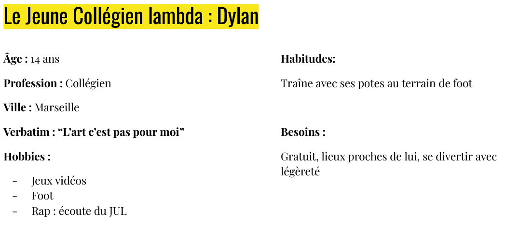
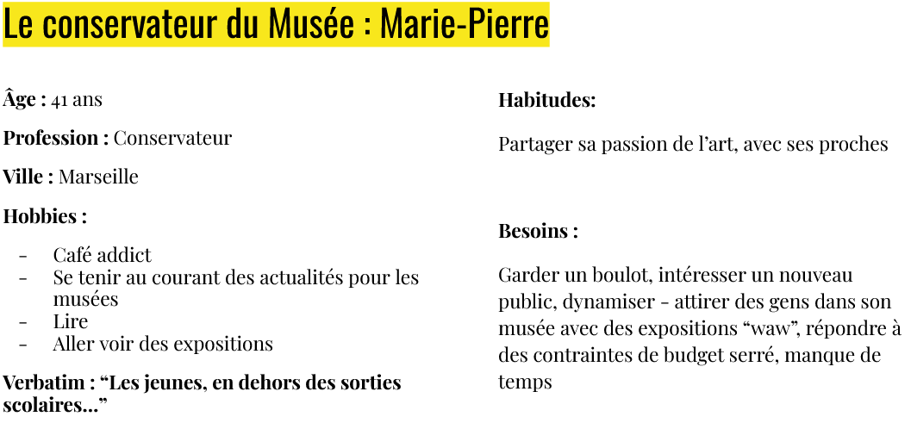
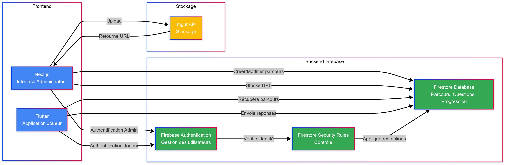

Ce projet a pour but d'améliorer les audioguides que l'on connaît aujourd'hui dans les musées pour rendre l'art plus accessible à des publics a priori peu sensibles aux formes d'art "classiques" comme les tableaux, peintures et sculptures.

## Contexte

L’art est présent partout dans notre vie, des graffitis urbains aux musiques que l’on écoute en passant par les bâtiments et monuments remarquables qui ponctuent les villes. Pour autant, tout un volet de la richesse artistique que le monde a à proposer est conservé précieusement dans des musées. Nous avons fait le constat que visiter ces musées était considéré comme un hobby d’ « élite », réservé à une partie plus aisée de la société et que de nombreuses personnes ne sont ni habituées à fréquenter ce genre de lieux, ni attirées par ceux-ci. Et pour cause, même si de nombreux musées proposent des parcours toujours plus pédagogues et/ou interactifs, le mode de visite le plus courant aujourd’hui est le tour avec audioguide. Bien que riches en explications, les audioguides sont souvent lassants et nécessitent un effort particulier de concentration de la part du visiteur s’il veut suivre tout le contenu qu’on lui propose dans le musée. Notre premier objectif a donc été de réfléchir à un mode de visite de musées plus captivant afin de rendre les visites de musées plus accessibles à un public le plus large possible. Un problème subsistait tout de même si on ne garde que cet objectif seul : c’est très bien de rendre la visite ludique et interactive mais il reste l’enjeu d’attirer les visiteurs dans les musées. Ainsi, c’est en visant conjointement ce double objectif que nous avons travaillé sur notre projet GérArt.

Pour répondre à ces objectifs, nous avons pensé une application mobile, sur laquelle les musées pourraient créer des parcours de visite. Ces parcours seraient comme des chasses au trésor à travers le musée, guidant le visiteur d’une œuvre à une autre en lui posant des questions et lui proposant des défis à réaliser pour avancer dans sa quête. On tenait ici le côté ludique de la visite. Pour attirer les visiteurs, nous avons intégré une carte interactive sur l’application, sur laquelle l’utilisateur peut voir les musées proches de lui (ou partout ailleurs s’il le souhaite). Ainsi, les utilisateurs de l’application peuvent très rapidement savoir où et quand ils peuvent faire l’expérience d’une visite interactive ! Pour fidéliser l’utilisateur dans le temps et éviter qu’il ne se lasse trop vite de l’application, nous avons pensé à intégrer la dimension de collection dans l’application. Au fur et à mesure de ses visites, l’utilisateur débloque des œuvres d’art qui s’ajoutent à sa collection. Au-delà de l’effet de récompense, comme avec des badges de réussite, cette collection sert aussi d’historique et permet à l’utilisateur de garder très facilement une trace des musées qu’il a vus, des œuvres, des artistes et des styles qu’il a aimé ou non. L’idée à terme serait de créer des liens pour l’utilisateur, par exemple s’il voit une œuvre de Klimt au Louvre à Paris, il aurait une petite notification lui rappelant qu’il avait déjà vu d’autres œuvres de ce même artiste 2 ans plus tôt à Vienne.

## Phase d'idéation

Pour l’idéation, nous avons mené plusieurs fronts en parallèle. D’une part, nous avons effectué quelques recherches dans la littérature de sociologie pour approfondir un peu mieux la question de l’accessibilité de l’art et des musées. D’autre part, nous avons fait des recherches sur des solutions déjà existantes ou des projets similaires. Enfin, nous avons également affiné notre réflexion en rencontrant des collégiens pour confirmer ou infirmer nos premiers choix ainsi que nous ouvrir éventuellement à des problématiques ou des solutions que nous n’avions pas envisagées.

### L'Etat des lieux de l'existant

En recherchant les différentes solutions déjà mises en place pour rendre des visites de musées attrayantes et pédagogiques à l’aide un outil technologique, nous avons pu voir de nombreux exemples d’utilisation de casques de réalité virtuelle comme pour la [visite d’une villa romaine de Pompéi] (https://www.grandpalais.fr/fr/expo-pompei-la-realite-virtuelle) proposée par le Grand Palais à Paris. A l’aide d’un casque de réalité virtuelle, on peut se promener dans la reconstitution d’une maison de Pompéi telle qu’elle pouvait être avant l’éruption du Vésuve. Ce genre d’expositions rencontre actuellement un certain succès, pour autant, il ne nous a pas paru pertinent d’approfondir dans ce sens, dans la mesure où le dispositif reste très coûteux à mettre en place. Peu de musées ont suffisamment de moyens pour envisager d’intégrer de la réalité virtuelle à leurs visites. Ainsi, pour notre volonté d’accessibilité de la solution et de démocratiser l’accès au musée, cette piste qui nous a mis quelques étoiles dans les yeux n’était pas la plus pertinente.
En outre, nous avons aussi pris connaissance de nombreux exemples d’utilisation de la réalité augmentée pour enrichir l’expérience du visiteur dans les musées comme pour [l’exposition du Louvre sur l’Egypte Antique](https://www.louvre.fr/decouvrir/vie-du-musee/l-egypte-augmentee-un-nouveau-regard-sur-les-antiquites-egyptiennes)  qui a bénéficié de la réalité augmenté élaborée en collaboration avec snapchat. Certains ont déjà fait de ce filon leur business comme [Muséopic]( https://www.museopic.com/realite-augmentee/) qui propose aux musées d’intégrer de la réalité augmentée dans leur parcours visiteur. Ce qui nous a beaucoup plu dans ces solutions c’était la possibilité pour le visiteur d’utiliser son propre smartphone pour bénéficier des différentes animations et explications apportées par les modules de réalité augmentée.

### Rencontres avec les collégiens

Pour s’assurer que l’on ne faisait pas fausse route et de la pertinence de nos choix pour notre future application, nous avons échangé avec des collégiens par le biais de l’association Echanges Phocéens. Cela nous a permis de les sonder sur leurs centres d’intérêts, leur utilisation quotidienne de leurs smartphones et leur rapport avec les musées. Un premier constat évident : les collégiens vont au musée soit avec leur famille, soit en sortie scolaire. Deuxième constat, ils n’utilisent pas tant que ça les réseaux sociaux, sauf pour y suivre éventuellement des célébrités et influenceurs mais ils postent très peu de contenu privé, entre amis. Cela ne les intéresse pas vraiment, d’autant plus qu’ils sont conscients de l’empreinte indélébile de chaque post que l’on peut faire sur les réseaux sociaux. Nous avons pu nous rendre compte aussi que dans leur utilisation quotidienne de leur smartphone, les applications et jeux de type histoire interactive ou visual novels étaient assez courantes et populaires.

### Recherche sociologique sur l'accession à l'Art et aux Musées

### Conclusion

En résultat de cette phase d’idéation, nous avons fait le choix d’orienter notre application vers un guidage à travers le musée qui se sert du principe des histoires interactives pour amener le visiteur d’une étape à la suivante. Tout cela ponctué de quizz et d’énigmes type chasse aux trésors. Par exemple, on remplacerait l’invitation de l’audioguide à “avancer vers la tapisserie médiévale au fond de la salle numéro 4” par un petit défi comme “pour continuer ta visite, trouve une scène de guerre au mur”. Pour vérifier que le visiteur a bien trouvé la tapisserie qui représente une scène de guerre avant de lui donner des explications dessus et accentuer son attention portée sur l'œuvre, on lui poserait une question comme “Combien de fanions sont brandis en l’air du côté des français ?” ou bien “quelle bataille est représentée sur cette tapisserie ?”. Le visiteur doit alors chercher la réponse en comptant certains éléments représentés sur la tapisserie (ici les drapeaux) ou en s’intéressant au titre ou à la courte description de l'œuvre. Ce “gameplay” serait complété par la partie carte interactive qui permet d’identifier les différentes expositions à proximité de l’utilisateur et la partie collection dans laquelle l’utilisateur peut conserver en souvenir des récompenses pour chaque visite faite, et ainsi garder même un meilleur souvenir de la visite en question. Comme les collégiens sont amenés à visiter des musées dans le cadre scolaire, nous nous sommes interrogés sur la pertinence de proposer à quiconque le souhaiterait une manière simplifiée de créer un parcours. Ainsi, nous avons pensé d’un autre côté une interface via laquelle un enseignant peut créer son propre parcours et guider comme il le souhaite ses élèves dans un musée ou un monument, avec des questions et des explications qui peuvent faire directement écho au cours. Cette interaction permet de renforcer l’utilité pédagogique de notre application, mais aussi de la faire découvrir à de nombreux élèves, qui pourront par la suite l’utiliser lors de leurs visites personnelles.

## Les livrables

### Le Design

Pour réaliser l'application, nous avons au préalable travaillé sur son design. Nous avons pu pour cela se reposer solidement sur les apports des cours d'UI/UX et de formation à Figma reçus pendant le semestre de Do_It. Lors de ces cours, nous avons pu particulièrement réfléchir à la cohérence graphique de notre projet en créant notre [Brief graphique](https://docs.google.com/presentation/d/1wtlK4gU-qPavxk_zKXaQPgRU3Ix-SEF9AVhG7DyoTo8/edit?usp=sharing).

Par ailleurs, ces cours de Design ont aussi été l'occasion de construire un Personae plus précis, ce qui nous a mené à travailler pour Dylan et Marie-Pierre sur la suite du projet. 

### Les sondages complémentaires

Pendant la phase d'idéation, nous avions consulté des collégiens pour explorer le potentiel de nos idées et orienter notre réflexion et nos priorités dans l'application à créer. Au cours du projet, notre tutrice Laetitia PIET nous a régulièrement, et à juste titre, redirigés et reconcentrés sur nos objectifs principaux alors que nous avions parfois tendance à nous perdre dans certaines fonctionnalités plus anecdotiques ou dans des problématiques techniques car nous avions un peu trop la tête dans le guidon. Pour confirmer à nouveau notre direction et s'assurer que nous ne faisions pas mauvaise piste, nous avons décidé de faire un nouveau sondage via un [google forms](https://forms.gle/kohm17kA1XP9DSfM9) que nous avons partagé à certains collégiens et lycéens via Echanges Phocéens mais aussi à des étudiants via nos connaissances. La conclusion de ce sondage nous a surtout confirmé un gros doute que nous avions sur notre personae. Nous nous étions concentrés sur un public cible de collégiens mais notre application pouvait aussi être tout à fait pertinente pour des lycéens, des étudiants et des jeunes actifs ! D'autant plus qu'un collégien a beaucoup moins de choix sur ses propres activités qu'un lycéen ou un étudiant. Il dépend encore beaucoup du programme de sa famille pour ses sorties. Ce n'était donc peut être pas la cible idéale pour attirer les visiteurs dans les musées. Sans délaisser ce public, nous avons à partir de ce moment été plus vigilant sur l'attrait de notre application pour une tranche d'âge suffisament large.

### L'application et son site internet

Enfin, nos livrables principaux restent l'application en elle-même avec son site internet lié qui permet de configurer les parcours de visite accessibles ensuite sur l'application. 



[Pour télécharger l'application](https://drive.google.com/file/d/1wVs6JsmV0Q7Ti1EQ2DlTZbhStiX8H8K0/view?usp=drive_link)

[Pour accéder au site de getsion des parcours de visite](https://gerart.vercel.app/)


## Spécification technique de l'application et du site web

Le projet repose sur une architecture client-serveur, utilisant Firebase comme backend, Next.js pour l'interface web d'administration, Flutter pour l'application mobile des joueurs, et Imgur API pour le stockage des images.

L'architecture est divisée en deux parties principales:  
- Le Backend : Gestion des données, de l'authentification et du stockage  
- Le Frontend : Interface utilisateur pour les administrateurs et les joueurs  

### Présentation Générale du Fonctionnement de l'Application
L’application fonctionne de la manière suivante :

1. Les administrateurs créent des parcours composés d’instructions, de questions et de quizz via l’interface web (développée en Next.js).  
2. Les données des parcours sont stockées dans Firestore, qui permet de gérer ces informations de manière centralisée.  
3. Les joueurs accèdent aux parcours via l’application mobile (développée en Flutter), qui récupère les informations depuis Firebase.  
4. L’authentification est gérée par Firebase Authentication qui permet un contrôle sécurisé des accès.  
5. Les images associées aux parcours, aux questions et aux quizz sont hébergées sur Imgur API, évitant ainsi les coûts liés à Firebase Storage.  

### Backend : Firebase et Imgur API
Le backend repose principalement sur Firebase pour la gestion des données et l’authentification, ainsi que sur Imgur API pour le stockage des images.

#### Pourquoi Firebase ?
Firebase a été choisi pour trois raisons techniques majeures :

1. Adaptabilité avec Flutter 
2. Base de Données en Temps Réel et Scalabilité Automatique  
3. Déploiement et Hébergement Simplifiés

#### Pourquoi Imgur API ?
1. Firebase Storage facture chaque Go utilisé, alors qu’Imgur permet d’héberger les images gratuitement avec un quota très élevé.

2. Gestion simplifiée du stockage
   
   - Un fichier est simplement envoyé via une requête API REST.  
   - L’API retourne une URL directe de l’image, qui est ensuite stockée dans Firestore, évitant ainsi toute gestion de fichiers côté serveur.  

### Frontend : Flutter et Next.js

#### Pourquoi Flutter ?
Flutter a été choisi car il permet une migration facile vers une version web et fonctionne nativement sur Android et iOS.

#### Pourquoi Next.js ?
L’administration des parcours est réalisée via une application web Next.js, qui qui permet une exécution rapide et un support Firebase. 
Aussi, l’intégration des API Routes de Next.js permet d’exécuter certaines logiques côté serveur sans configurer un backend supplémentaire.

| Technologie | Raison principale |
|------------|----------------|
| Firebase | Facilité d’intégration avec Flutter, scalabilité automatique |
| Imgur API | Alternative gratuite à Firebase Storage |
| Flutter | Développement multiplateforme, rendu natif, compatibilité Firebase |
| Next.js | Exécution rapide, Server-Side Rendering, intégration fluide avec Firebase |

Voici les repos du projet : 

- App mobile : [GerArt-Visiteur](https://github.com/MbayeSyAmar/Museum)
- Site Web : [GerArt-Admin](https://github.com/MbayeSyAmar/museum-admin--1-)
## Organisation de projet et retours d'expérience

### L'organisation du groupe

Au sein du groupe, chacun était référent sur une partie spécifique mais nous avons tous participé aux différentes tâches et nous sommes entraidés en fonction des charges de travail de chacun sur le projet au fil du temps.

- Mbaye est responsable du code de l'application
- Ines est responsable du Design
- Victor est responsable du sondage des publics et de la recherche sur des bases de données accessibles de musées.

### Les Objectifs

- [X] Carte interactive avec les musées
- [X] Page de collection
- [X] Parcours avec quizz et explications (1 seul)
- [ ] Lien avec les oeuvres déjà vues
- [X] possibilité de “liker” une oeuvre vue dans un parcours
- [ ] Contacter des conservateurs de musée pour affiner le concept
- [ ] Implémenter un moyen de vérifier que l’utilisateur “n’arnaque pas l’application” comme un scan de QR code ou la vérification des coordonnées GPS pour attester qu’il est bien dans le musée concerné ou sur le lieu de l’exposition.

### Analyse des écarts entre nos objectifs et nos réalisations

Au début du projet, nous avions de nombreuses idées de fonctionnalités à intégrer à notre application. Cependant, nous avons dû dans un premier temps prioriser  et définir quelques fonctionnalités “essentielles” qui nous permettaient d’avoir une version de démo suffisamment convaincante, sur laquelle on pouvait par la suite ajouter des fonctionnalités supplémentaires en fonction de l’avancée du projet. Au terme de ce semestre, nous avons atteint l’objectif principal de pouvoir présenter une version utilisable de l’application avec des parcours tests opérationnels. Les objectifs qui n’ont pas été atteints sont principalement des fonctionnalités en plus que nous aurions aimé intégrer dans le jeu, mais que nous n’avons malheureusement pas eu le temps de mettre en place. Une autre lacune principale par rapport à nos objectifs est l’ouverture vers l’extérieur. Nous avons manqué de temps sur la fin du projet pour avoir l’occasion de présenter notre application à des utilisateurs potentiels ou à des conservateurs de musées. Ce serait la première étape à réaliser pour aller plus loin dans ce projet.

### Apprentissages et retours d'expérience

Nous n’avions jamais codé d’application donc ce n’était pas facile d’estimer le temps nécessaire à chaque tâche. Certaines tâches du planning ont donc été prolongées et des échéances repoussées. 

Par ailleurs, c’était intéressant de se rendre compte que les obstacles sont parfois des opportunités. Certaines contraintes techniques nous ont parfois poussés à revoir certains fonctionnement de notre application, et parfois cela améliorait le concept final d'une manière que l’on n’avait pas envisagé.

En outre, nous avons tous les trois énormément apprise sur le travail en groupe bien que ce ne soit pas notre premier projet de groupe. En effet, on s'est vite rendus compte de la difficulté de coder de manière collaborative, surtout avec un langage qui n'est pas maîtrisé au départ. Nous avons pu aussi se rendre compte de nos difficultés de communication sur lesquelles nous avons progressivement travaillé tout au long du projet.

Enfin, à de nombreuses reprises l'application codée s'avérait significativement différente du design de la maquette. Cela nous a permis de nous rendre compte de l'importance de prendre en compte dès le design les spécifications et contraintes techniques auxquelles nous sommes soumis, afin de faciliter la compréhension et la transmission entre le design et le développement de l'application.

## Pour aller plus loin dans ce projet

Pour mener ce projet au-delà du prototype créé dans le cadre de ce projet 3A, une étape importante serait de démarcher des conservateurs de musée avec le prototype pour créer des parcours de test dans certain musée et avoir un retour d’expérience de leur part qui orienterait la suite du développement de l’appli en prenant en compte leurs connaissances métier. D’autre part, nous avons travaillé avec des collégiens sur le concept de l’application pendant la phase d’idéation, il serait très intéressant de faire tester l’application par des collégiens ou lycéens avec leurs professeurs à l’occasion d’une sortie scolaire par exemple. Cela apporterait un retour d’expérience du point de vue utilisateur qui pourrait aussi permettre d’ajuster les fonctionnalités de l’application. Un aspect plus technique qui pourrait être développé si le projet devait être poursuivi serait l’utilisation des coordonnées GPS de l’utilisateur pour le localiser sur la carte avec les actualités des musées mais aussi pour vérifier qu’il est bien sur le lieu adapté au parcours qu’il souhaite réaliser. En outre, l’application a actuellement besoin d’une connexion internet permanente pour fonctionner, car elle échange en permanence avec Firebase, il nous semble intéressant de réfléchir à une possibilité de suivre un parcours entier hors connexion, en téléchargeant ce parcours précis au préalable par exemple. Cela améliorerait l’accessibilité de l’application.

## Remerciements

Pour terminer ce compte-rendu, il nous paraissait indispensable de remercier à nouveau notre tutrice de projet Laetitia PIET, qui a su nous guider et nous remettre dans les bons rails au besoin en nous accompagnant tout au long du semestre.