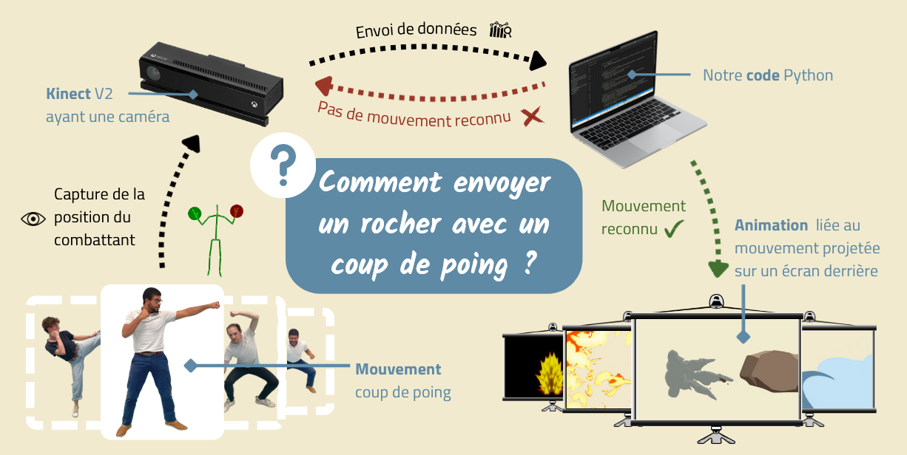

Comment sublimer les arts martiaux avec l'informatique ?


[Github](https://github.com/KevinBERNARD1901/Avat-Art)



## Speech

Qui n'a jamais rêvé de contrôler les éléments (feu🔥, air🌀, eau💧, terre🏔️) en donnant son meilleur coup droit 👊 ?

Quand deux **combattants s'affrontent**, des **élements projetés sur un écran derrière eux** viennent sublimer le combat.
Concrètement, quand le combattant A donne un coup de poing dans la direction du combattant B, une animation (vague🌊, tornade🌪️, rocher🪨, boule de feu💥) parcourt l'écran dans la même direction.

## Solution technique

Grâce à des **capteurs** nous pouvons comparer le mouvement du combattant à une **base de données** qui nous donnera alors l'animation adaptée au mouvement.

**TO DO :**
- Faire un budget prévisionnel (liste du 'matos')
- Choix de l'art martial
- Choix du capteur (statique, dynamique)
- Choix du design (animation)
- Choix de l'interface Graphisme-Capteur (Arduino, code utilisé ??)
- Choix et utilisation de la base de données (Besoin de l'IA ??)
- Prototypage de l'équipement de détection du mouvement
- Diffusion des animations en temps "réel"

## Art is Tic

Intrinsèquement, les **arts martiaux** sont l'art de faire la guerre. Néanmoins leur apprentissage fait intervenir des chorégrapies (katas), des mises en scène qui en font un véritable spectacle dans notre culture moderne.

La partie **informatique** de ce projet vient de la détection et du traitement des mouvements qui permettent le déclenchement des animations.



## Membres de l'équipe

- Kévin Bernard  
- Clarisse Francese  
- Damien Wolbert  
- Tuteur : Guillaume Laurie

## Résumé

Le but du projet est de **sublimer les arts martiaux** en déclenchant des **animations projetées sur un écran** derrière les combattants en fonction de **leurs mouvements**.

Pour cela nous utilisons la **Kinect** de la Xbox One qui **capte les mouvements** du combattant. Puis nous récupérons ces données et vérifions certaines **conditions** dans un **fichier python**qui **déclenche** alors les **animations** associées (mp4) projetées sur le mur/tableau derrière les combattants.

## Contexte

Nous avons eu cette idée en partant d’un **rêve d’enfant** commun issu du dessin animé **Avatar le dernier maître de l’air**. Nous avons tous les 3 un jour rêvés de voir des boules de feu jaillir de nos coups de poings.

## Cadrage

Dans le thème **Informatique dans l’art et art dans l’informatique**, nous avons lié **arts martiaux** et **art audio-visuels**. Appuyés et conseillés par Guillaume LAURIE, nous avons d'abord fixé nos **principales deadlines** ce qui nous a permis de fonctionner sous forme d'**itérations** en fixant chaque semaine les **objectifs pour la réunion suivante** ; ainsi que sur les compétences et appétences de chacun :  

- Kévin : Animation & Responsable programmation  
- Clarisse : Etude de mouvements, Programmation & Responsable de séance  
- Damien : Etude de mouvements, Programmation & Responsable montage vidéo

## Livrables

- [Drive avec les livrables](https://drive.google.com/drive/u/0/folders/1q3jvw2VKnErtgD7eApBFK9RxqUqMe0i9)

## Résultats

Schéma du dispositif
  

  <video src="media/Video demo (1).mp4" style="max-height: min(50vh, 300px)" controls loop>
    Votre navigateur ne supporte pas la balise video.
  </video>
  
Vidéo de démonstration du dispositif

## Conclusion

**Tous les objectifs** fixés lors des phases de **cadrage** du projet ont été **remplis**. Nous avons réussi à détecter des **mouvements différents** ainsi qu’un **enchaînement**. Nous avons également réussi à créer des **animations** de notre cru. En outre, ce projet a été l’occasion d’appliquer les différentes méthodes et outils de **gestion de projet** de manière complète et réelle (rétro planning, gestion des réunions, utilisation de GitHub…). Il a également permis à chacun de tirer des conclusions sur son **positionnement au sein des projets** et les **méthodes** lui convenant.


[[toc]]
