  

- [Projet Github](https://github.com/lolapdx/projet-3A.git)
- [Lien vers notre site](https://basilic.aioli.ec-m.fr/static/)



## Contexte,  Objectifs et  proposition de valeur

### Contexte

Notre projet s’inscrit dans la thématique de cette année, à savoir Art et Informatique. Nous disposions de 4 heures par semaine pendant 18 semaines pour réaliser ce projet.

### Notre équipe

- Lola Perdrix
- Juliette Kocupyr
- Esther Henry
- Titouan Corne
- François Brucker (notre tuteur)

### Objectifs

L'objectif de notre projet était de créer une série d'œuvres d'art basées sur des données météorologiques, représentant chacune des villes des Écoles Centrales en France : Paris, Lille, Lyon, Nantes et Marseille.

Nous souhaitions concevoir des œuvres à la fois esthétiques et porteuses de sens, en traduisant des données météo réelles en représentations abstraites. Le projet visait à produire une œuvre d'art évolutive, générée quotidiennement à partir des conditions météorologiques. Pour ce faire, nous avons décidé de créer un tableau chaque jour, pour chaque ville, offrant ainsi une vision dynamique de l'environnement.

### Proposition de valeur

On ne s’improvise pas artiste, alors bien que nous ayons mis à profit nos compétences artistiques, nous n’avons pas inventé le pixel art, ni révolutionné le monde de l’art. Notre valeur ajoutée se cache ailleurs, dans d’autres détails.

En effet, nos tableaux, de par leur multitude et la facilité de créer de nouveaux grâce à notre code, permettent une modélisation artistique de l’évolution des données climatiques et un moyen de comparaison visuelle qui diffère de ce qui a déjà été vu. On peut générer un grand nombre d’œuvres, notre seule limite étant l’historique des données de Météo France. Mais, on peut s’en soucier en remontant sur les 10 dernières années pour nos stations.

Par ailleurs, ce projet s'inscrit dans un objectif de cohésion entre les Écoles Centrales en métropole, où la comparaison de la météo de chaque ville peut être réalisée en quelques clics (plus aucun doute sur le fait qu’il fait mieux vivre sous le soleil marseillais que dans les autres centrales).

Nous proposons notamment une visualisation de celles-ci via notre site internet, qui permet en un coup d’œil de visualiser l’ensemble des tableaux de l’année précédente pour une ville, la comparaison des 5 tableaux associés à chaque ville en un jour précis, ou simplement l’œuvre du jour pour votre ville préférée.

Enfin, nous fournissons notre code, qui permet à chacun disposant d’un compte Météo France (gratuit) de réaliser les œuvres pour la ville et la date de son choix.

## Organisation du projet 

### Méthode projet 

Nous avons réalisé ce projet en mode **agile**, car c’est ce qui nous a paru le plus adapté à ce projet informatique, qui devait être réalisé dans un temps limité de 6 mois. Nous avons réalisé des runs d’une durée moyenne de 1 à 2 semaines. Au début de chaque run, nous avons fait le bilan du run précédent et nous avons défini nos objectifs pour le run en cours.  

Nous nous sommes, pour chaque run, réparti les tâches en fonction des compétences et des envies de chacun. Ce travail en mode agile a été facilité par une organisation en présentiel. Chaque semaine nous nous sommes réunis sur le créneau projet, ce qui facilitait les échanges directs et la collaboration en cas de besoin, notamment en ce qui concerne la résolution de bugs, par exemple.  

  

Le bien-être au travail étant essentiel pour notre équipe, chaque réunion de projet était accompagnée d’une tisane et d’un paquet de cookies afin de favoriser l’efficacité des membres de l’équipe 😊



### Planning 

Travaillant en mode agile, nous n’avions pas défini de planning strict pour chaque semaine, mais plutôt de grandes deadlines avec, à chaque fois, un objectif à atteindre pour pouvoir obtenir le résultat final mi-mars.  

- Fin octobre : avoir une première version du code fonctionnel (visuel des oeuvres)
- Fin novembre : être capable d’exploiter la base de données  
- Fin décembre : avoir une première œuvre présentable via requête API 
- Fin du projet : rendu final (site web) 

### Outils de travail 

Nous avons travaillé majoritairement avec deux outils collaboratifs, à savoir **GitHub** et **Google Drive**.  

Nous avons d’abord créé un drive projet dans lequel nous avons pu nous partager tous les documents de travail (guide d'utilisation de l'API Météo-France, inspirations pour les œuvres, etc.), ainsi que les comptes rendus de réunions de travail.  

Une fois la partie développement commencée, nous avons aussi créé un projet GitHub pour pouvoir collaborer efficacement sur les fichiers de code. Ceci s’est avéré fortement utile, notamment pour la réalisation de notre site internet pour le rendu final.  

### Organisation avec notre tuteur projet

Pour ce qui est de l’organisation avec notre tuteur projet, après un premier point en début de projet, nous avons convenu de nous organiser comme suit. Nous avons fait un point en présentiel dans son bureau au moins une fois pour chaque passage de jalon, et après chaque réunion, nous prévoyions la prochaine pour ne jamais être dans le flou ou oublier de caler une réunion, même si, comme dans tout projet, certains oublis arrivent.  

En parallèle de ces points en présentiel, nous avions toujours la possibilité d’échanger par mail, que ce soit pour discuter de points de blocage ou partager des idées.  

## Livrables

### Œuvres

Notre premier livrable concerne nos œuvres générées dans un premier temps pour l’année 2024 pour les cinq villes.

#### Nos premières idées

Pour l’aspect ésthétique de nos œuvres, nous avons fait plusieurs propositions à notre tuteur, avant de nous décider au sein de l’équipe projet sur le visuel définitif. 

Voici une galerie non exhaustive des idées que nous avons pu proposer en jouant avec nos différents paramètres et les différentes fonctionnalités de Python : 

| 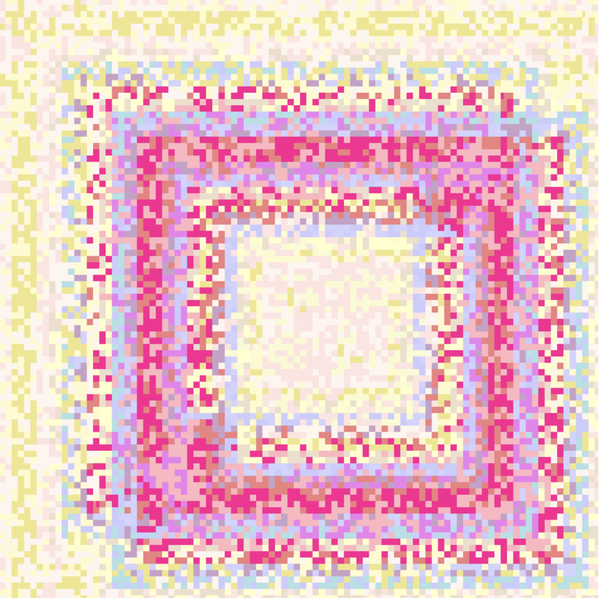 | 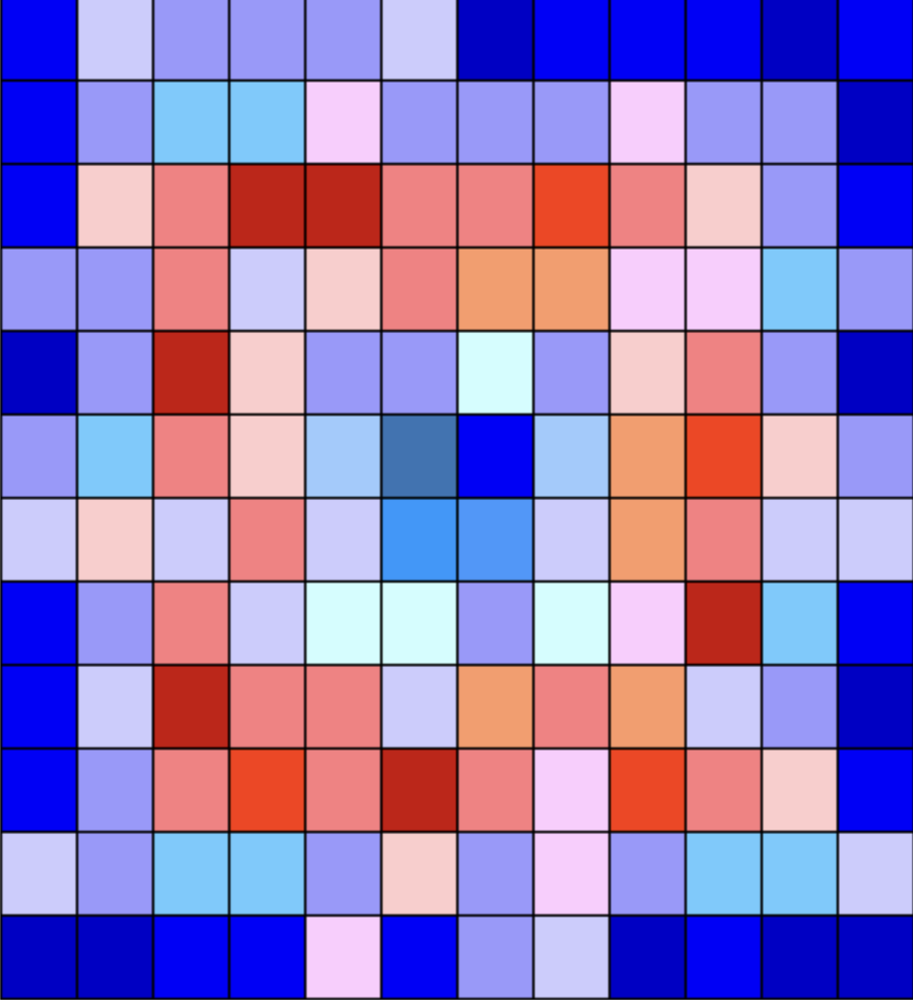 | 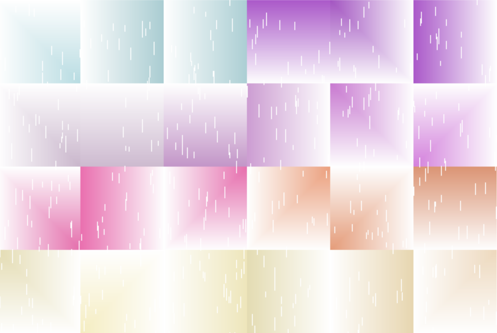 |
|------------------------------------|------------------------------------|------------------------------------|
| 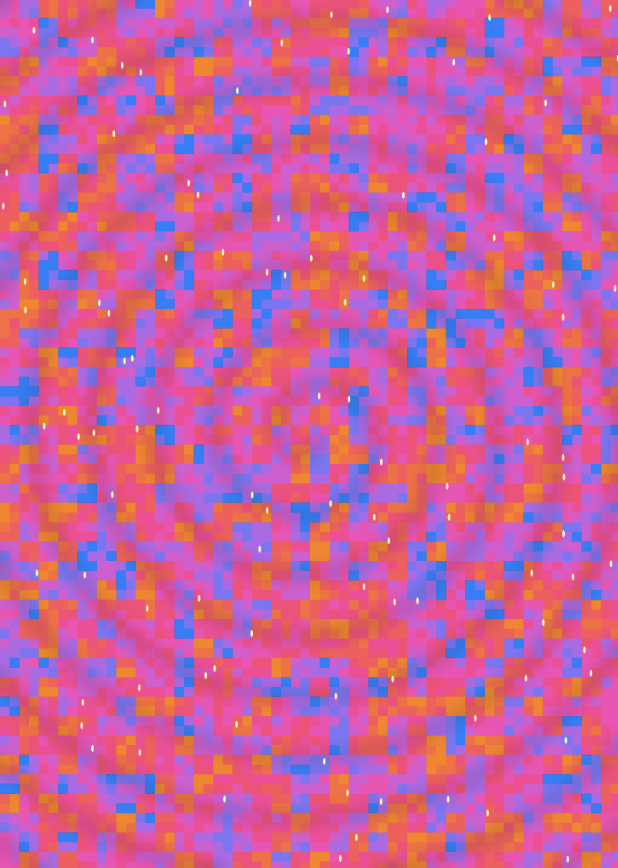 | 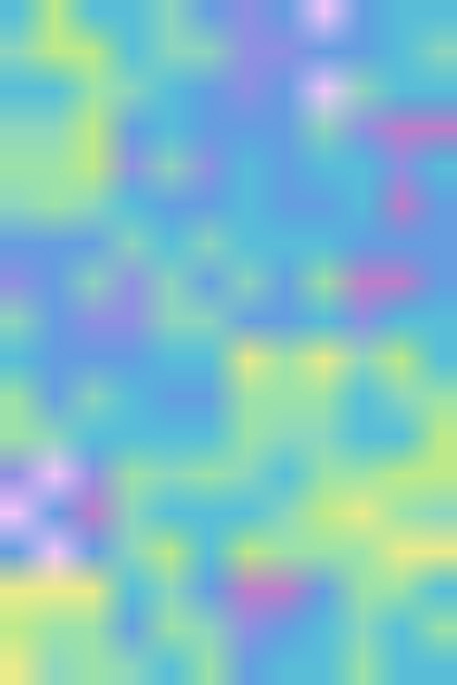 | 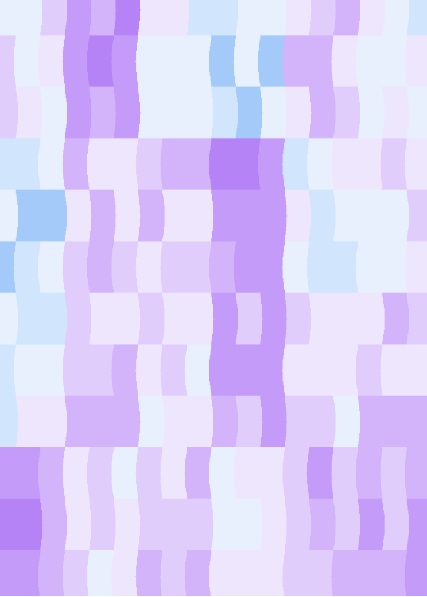 |

#### Comment sont générées nos œuvres

Avant toute chose, une explication de nos œuvres s’impose.

Nous avons réalisé nos œuvres grâce à un code Python récupérant des données via l’API de Météo France. Celle-ci étant utilisable gratuitement, il suffit de se créer un compte sur leur portail puis de générer une clé ou un token afin de récupérer automatiquement ces données.

Pour comprendre nos œuvres, chacune d’entre elles représente une journée de 24h où chaque heure est représentée par un carré principal de l’image (celui-ci recoupé en plus petits).

Nous avons choisi de travailler avec 4 paramètres principaux à savoir :

- La température en °C
- La couverture nuageuse via la nébulosité
- Le vent : sa vitesse en m/s et son orientation en radians
- Les millimètres de précipitations

La **température** est représentée par la couleur de fond des grands carrés. En effet, on vient récupérer la température réelle mesurée pour chaque heure, puis via une palette de couleurs pour chaque groupe de 3 degrés, on vient colorier aléatoirement les carrés de chaque heure.

La **couverture nuageuse** est représentée chaque heure par un éclaircissement ou un assombrissement de chaque grand carré. La nébulosité étant mesurée sur une échelle de 0 à 8, nous avons créé une proportionnalité entre cette nébulosité et l’éclaircissement de nos pixels.

Le **vent** est représenté moyenné sur la journée. En effet, on va venir moyenner sa force et sa direction sur une journée entière afin que cette force soit appliquée à l’ensemble de l’image via une déformation de ces pixels.

La **pluie** est représentée par la somme de millimètres de pluie sur la journée. Selon cette somme, on va venir blanchir ou ajouter des traits blancs sur un certain pourcentage de l’image du jour via une proportionnalité préalablement établie.

La succession de ces différents paramètres donne par exemple les résultats suivants, rapidement décryptés : 

11/08/2024 Marseille : temperature élévée, lumineux, vent orienté Est léger, pas de pluie 

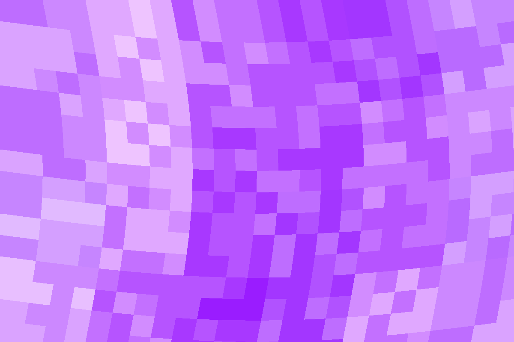

19/11/2024 Paris : temperature plutôt basse, sombre, vent orienté Est plus fort, pluie modérée 

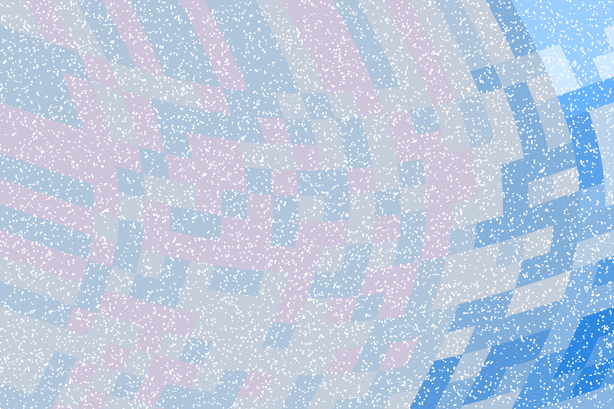

17/01/2024 Paris : temperature basse, lumineux, pas de vent, pluie élevée

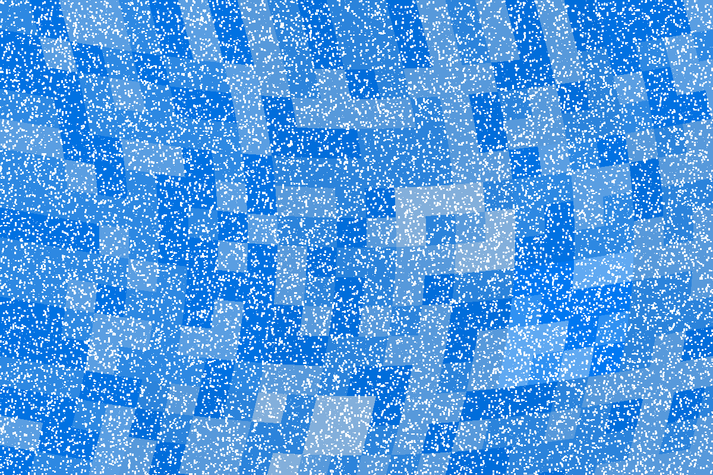

10/04/2024 Marseille : temperature moderée, lumineux, vent orienté sud élevé, pas de pluie

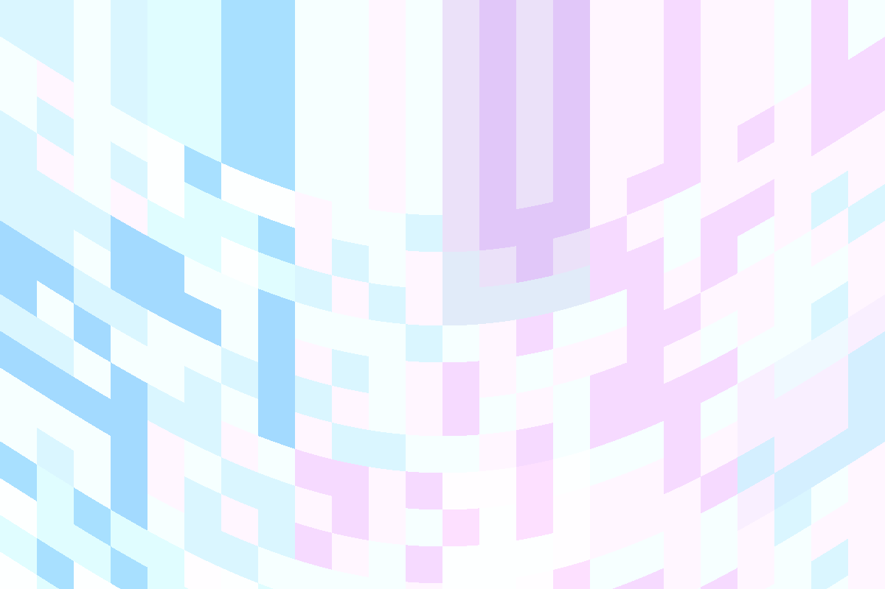

### Le code 

En plus de ces images, nous fournissons le code qui permet de générer séparément chacune d’entre elles.

Pour utiliser ce code, il faut se créer un compte gratuit sur le portail API de Météo France puis générer un code pour l’API utilisée. Une fois ce token récupéré, il suffit de le copier dans le paramètre correspondant dans le code Python. Ensuite, il faut chercher via la documentation Météo France le code de la station de la ville voulue (nous ne garantissons pas l’existence des données pour d’autres villes que les cinq citées plus haut). C’est ce code de station qui devra être copié dans notre code Python à l’endroit attendu. Enfin, il faudra saisir la date souhaitée avant de lancer le code, qui générera votre image.

### Le site

Enfin, notre dernier livrable est le site internet qui permet trois visualisations des œuvres.

En cliquant sur la ville choisie, vous pouvez visualiser l’œuvre du jour, puis en glissant vers le bas, vous accédez au calendrier de l’année précédente avec toutes les œuvres de l’année.

Sur la page d’accueil, si vous glissez vers le bas, vous pouvez aussi visualiser l’œuvre du jour ou n’importe quel jour pour l’ensemble des cinq villes, ce qui permet une comparaison rapide entre les villes.

Notre site a été codé en HTML, CSS et JavaScript pour le front, et en Python pour le back en utilisant FastAPI. Nous avons également hébergé notre site sur le serveur Aïoli.

## Atteinte des objectifs

Dans l’ensemble, on peut considérer que nous avons effectivement atteint nos objectifs.  

## Oeuvres

À la suite du premier point avec notre tuteur, nous avons décidé que la première étape à atteindre était d’avoir un visuel pour nos œuvres, c’est-à-dire penser, d’un point de vue artistique, quelles données météo nous voulions utiliser et comment nous voulions les représenter.

Nous avons donc commencé par brainstormer en équipe, d’abord sur papier, puis via des codes Python simples en simulant nos données nous-mêmes pour nous concentrer d’abord sur le visuel.

Nous avons fait trois propositions, puis nous avons choisi de nous concentrer sur celle qui nous plaisait le plus pour les étapes suivantes.

Nous avions donc atteint l’objectif d’avoir des représentations visuelles de nos œuvres.  

## Codes et récupération de données

Notre objectif était de s’approprier les données de Météo France et de réussir à utiliser l’**API de Météo France** afin d’exploiter ces données via un **code en Python**.

Nous nous sommes, dans un premier temps, approprié la documentation de Météo France sur le sujet pour voir quelles données nous allions choisir d’exploiter, puis, dans un second temps, comment les récupérer via l’API.

Nous avons effectivement réussi à le faire, bien que l’appel des données via l’API n’ait pas été évident. Le travail a fini par payer, et nous avons pu récupérer automatiquement les données que nous avions choisi d’utiliser.  

Nous avons ensuite réussi à adapter notre code Python, qui générait l’œuvre via des tableaux de données réalisés à la main via des listes, afin qu’il génère une image en faisant un appel à l’API pour récupérer les données.

Plus tard, nous avons rencontré des difficultés liées à un changement de structure des réponses fournies par l’API, qui n’a pas été facile à déceler, mais qui est désormais corrigé. À l’avenir, si un autre changement de structure s’effectue une nouvelle fois dans les données retournées par l’API, nous pourrions être amenés à rencontrer le même problème, c’est pourquoi sans maintenance nous ne sommes pas sûrs que le code restera fonctionnel.

## Site internet pour visualiser les oeuvres

### Maquette Figma

Nous avons dans un premier temps réaliser une maquette figma de ce que nous voulions pour notre site.

La page d’accueil :

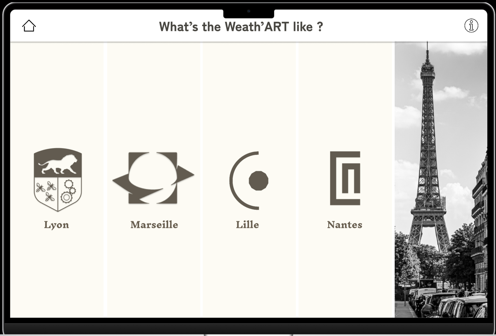

La page par ville avec l’eouvre du jour, puis la visualisation de l’année :

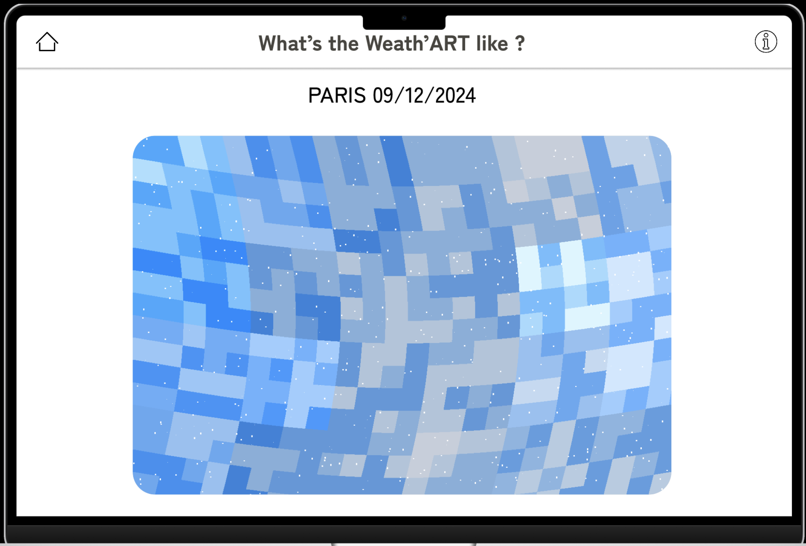
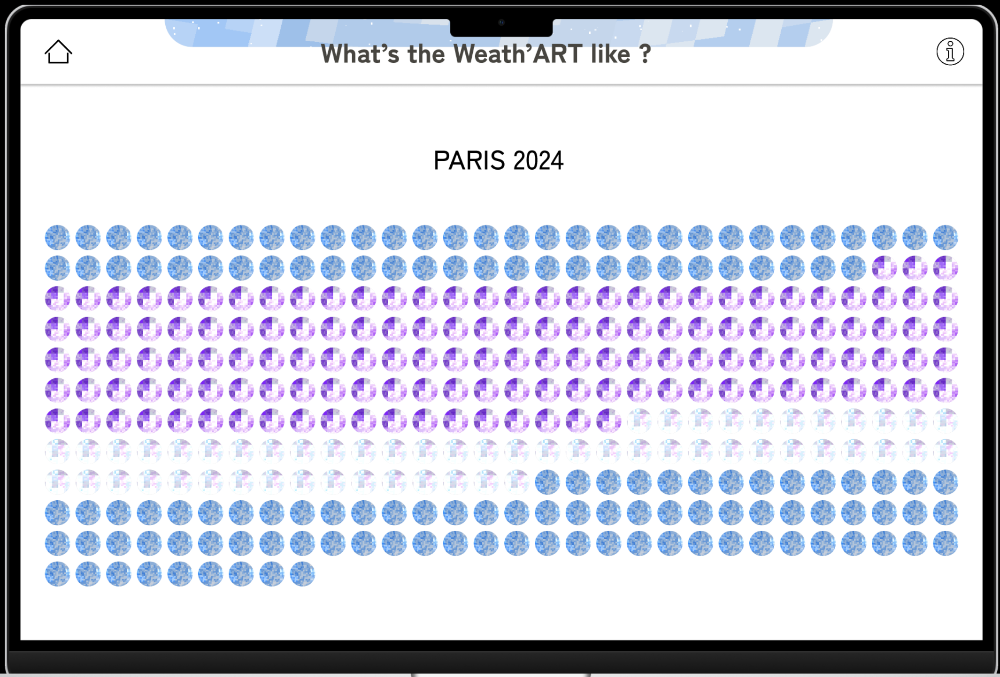

Une page d’information :

## Site en statique

Puis, dans un second temps, nous avons travaillé sur la réalisation de notre site en statique. Nous avons généré toutes les œuvres pour 2024 et, dans le pire des cas, nous voulions avoir un site statique permettant de présenter nos œuvres lors de la soutenance finale.  
Ainsi, une moitié de l’équipe a réalisé le front de notre site en **HTML** et **CSS**, afin d’avoir une visualisation de nos œuvres, ce que nous avons réussi à faire dans les temps.  

On peut voir en comparaison que nous avons plutôt bien suivi notre maquette figma, à laquelle nous avons apporté quelques améliorations de style notamment sur la visualisation à l’année.

La page d’accueil :

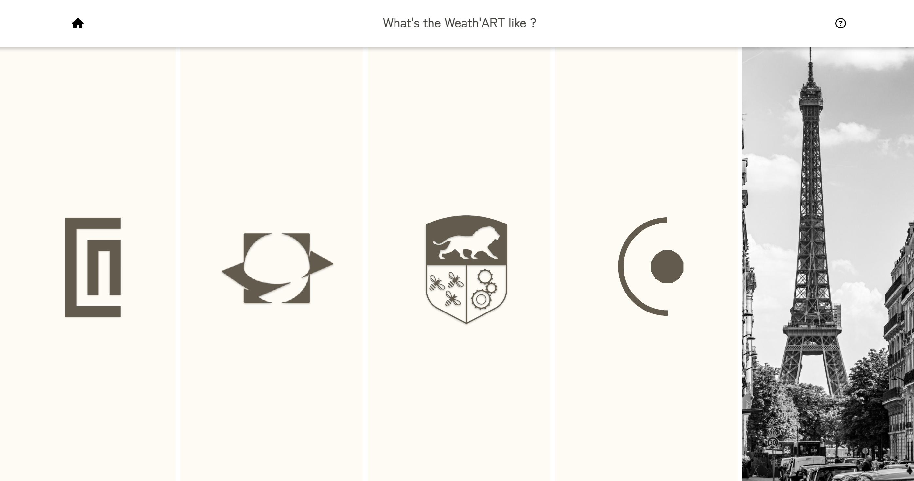
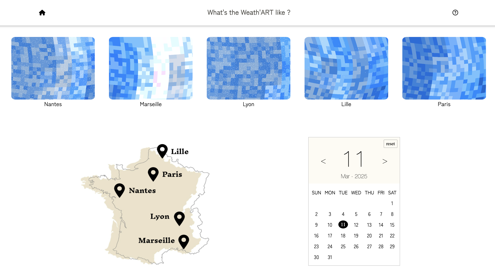

La page par ville avec la visualisation de l’année :

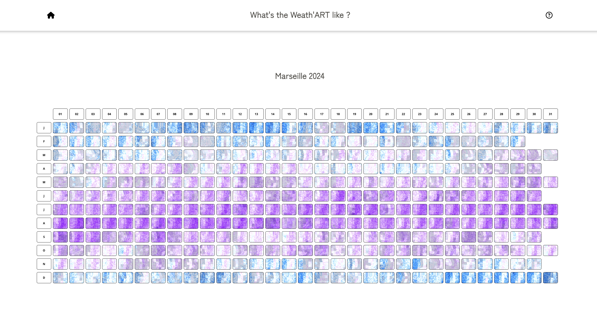

## Le back  

En parallèle de ce travail sur le site en statique, l’autre moitié de l’équipe s’est attelée à la réalisation du back du site, à savoir introduire et adapter les algorithmes Python créant les oeuvres, créer un système de routage, et afficher dynamiquement les oeuvres générées sur les pages.

Une des grosses difficultés que l’on a rencontré sur le développement de cette partie était la mise en cache du navigateur. Un très grand nombre de bugs incompris auraient pu être évités si l’on avait su que vider le cache pouvait résoudre tous nos problèmes.

### Gestion des routes avec FastAPI

Nous avons choisi de réaliser le back du site avec **FastAPI**, car c’est un framework assez simple qui utilise Python. Nous avons regardé la documentation de FastAPI pour comprendre la syntaxe permettant de créer des routes et nous avons mis ceci en application pour notre site dans le fichier `main.py`, ce qui fut un succès au bout de quelques essais.

Notre site est maintenant structuré autour de la page principale `index.html`, avec une page par ville qui repose sur un seul et même fichier `ville.html`. Sur la page d’accueil, lorsque l’on clique sur une ville, cela demande la route associée à celle-ci (par exemple : /villes/marseille/), puis le script associé à la page `ville.html` s’occupe de mettre à jour la page en fonction de la ville demandée.

### Appel des images

Nous avons choisi de stocker toutes les images de 2024 dans un dossier statique afin de ne pas avoir à les générer à chaque fois que l’on affiche le tableau de l’année de chaque ville (cela prendrait trop de temps). Pour les autres images, on regarde d’abord **si l’image est déjà stockée en statique**, si oui alors **on va la chercher directement**, mais si elle n’existe pas encore, alors **on la génère** avec notre algorithme, puis **on la stocke**. Pour récupérer puis afficher les images des œuvres dans le DOM, nous faisons une requête GET via une route contenant l’identifiant de l'œuvre / des œuvres que l’on souhaite récupérer. Cet identifiant est la date (formatée) qui a été demandée (par défaut, hier), et permet de donner à notre algorithme les éléments nécessaires à la création de l'œuvre si celle-ci n’existe pas encore. La réponse à cette requête sera le chemin de l'œuvre à afficher.

Grâce à cette méthode, notre site maintenant dynamique permet d’afficher n’importe quelle œuvre sur demande !

## Le site accessible à tous  

En parallèle de ce travail, nous avons souhaité déployer notre site sur le serveur de Do-It (**aioli**) afin qu’il soit accessible à tous. Pour cela nous avons pris le temps de configurer l’environnement qui héberge le site, et essayé longtemps avant de réussir à faire tourner le serveur en continu sur notre application, grâce aux connaissances de Titouan ayant suivi le cours Unix.

## Apprentissages

Pour évaluer les apprentissages que ce projet nous aura permis de tirer, il faut rappeler que nous ne partions pas tous avec les mêmes bases. **Juliette** et **Esther**, n’ayant pas suivi de cours d’informatique en 2ème année, avaient des bases assez limitées avec quasiment aucune pratique sur les deux dernières années. **Lola** et **Titouan**, quant à eux, avaient suivi des cours d’informatique en 2ème année et avaient plus ou moins pratiqué pendant leur césure. Nous ne partions donc pas tous avec les mêmes acquis, ce qui justifie une pluralité des apprentissages sur ce projet.  

### Compétences informatiques  

**Pour Juliette et Esther :**  

Repartant presque de zéro en informatique et réalisant, via ce projet, notre premier projet informatique, celui-ci a été riche en apprentissages.  

Nous avons pu fortement progresser sur nos compétences techniques, notamment sur les éléments suivants :  

- **Python**  
- **Bibliothèques Python (pillow)**  
- **JSON**  
- **API et token**  
- **HTML**  
- **CSS**  
- **GitHub** pour le travail collaboratif 

**Pour Titouan :**
Le fait de décortiquer et d'utiliser les endpoints exposés par Météo-France m'a permis de me sentir plus à l'aise avec les concepts d'API. J'ai également été amené à réfléchir pour trouver la solution la plus adaptée à notre situation. Par exemple, pour la génération automatique des œuvres, j'ai d'abord choisi d'écrire une tâche CRON exécutée chaque jour. Bien que cette solution n'ait finalement pas été retenue, cette idée m'a permis d'acquérir de nouvelles compétences.
Ensuite, le fait de générer les œuvres en Python en utilisant la bibliothèque *Pillow* m'a permis de réactiver et de renforcer mes connaissances dans ce langage de programmation. À cela s'ajoute la découverte de FastAPI qui, comme son nom l'indique, permet de créer une API en Python de manière rapide et efficace. J'ai beaucoup appris en codant le backend et en déployant le site sur le serveur *aioli*. 
Par ailleurs, je me sens désormais bien plus à l'aise avec la gestion d'un environnement virtuel ainsi qu'avec l'utilisation des outils ssh et tmux.
**Pour Lola : **
Tout comme Titouan, la première partie du projet fut l’occasion pour moi de renforcer mes connaissances en **Python** et de me familiariser avec la **notion d’API** qui était nouvelle pour tout le monde.
Quant à la deuxième partie, ayant déjà réalisé plusieurs projets web se limitant au front-end, ce fut pour moi l’occasion d’aller plus loin dans mon apprentissage en m’initiant à la pratique du développement **back-end**. Ces nombreuses heures de pratique (dont beaucoup de débogage) m’ont permis de me sentir bien plus à l’aise avec ces notions.

### Données météorologiques  

En parallèle de ces apprentissages techniques, nous avons tous pu nous familiariser avec les données météorologiques. Pour choisir les paramètres à utiliser, il a fallu comprendre leur sens et leur évolution. Nous avons notamment découvert la notion de **nébulosité**, une échelle de 0 à 8 permettant de quantifier la couverture nuageuse.  

### Sens artistique  

Ce projet étant à l’intersection entre l’**art** et l’**informatique**, il nous a donné l’occasion de développer notre fibre artistique et de challenger notre créativité. Nous avons notamment dû apprendre à jouer avec :  

- le choix des couleurs et leurs associations,  
- les formes et leurs combinaisons,  
- la superposition des paramètres,  
- et enfin le **pixel art**.  

### Gestion de projet  

**Pour Juliette et Esther :**  

Ce projet était le dernier d’une longue liste de projets réalisés pendant notre cursus à l’école, mais il avait la particularité d’être le premier en **informatique**. Ainsi, au-delà des compétences en gestion de projet que nous avions déjà bien pratiquées, celui-ci nous a permis de découvrir les spécificités de l’informatique.  

- **Un travail plus personnel** : contrairement aux autres projets, ici, si l’on touche au travail d’un autre, on peut potentiellement tout faire planter. Alors que sur un projet plus matériel, il est plus compliqué de modifier la partie d’un autre sans s’en rendre compte.  
- **Un projet plus abstrait** : ce qui peut parfois être démotivant. Passer 4 heures à essayer de corriger un bug sans succès peut donner l’impression de perdre son temps.  
- **Application de la méthodologie agile** : nous connaissions déjà bien l’agile, mais ce projet nous a permis de l’expérimenter dans son domaine d’origine : l’informatique.

**Pour Lola :** 

Bien qu’ayant déjà eu des projets informatiques en équipes, celui-ci se distinguait par sa durée et par la quantité de travail à fournir. La collaboration sur GitHub a été plus difficile à mettre en place que nous avions imaginé, et même si le travail est aussi en quelque sorte personnel, nous avons tout de même bien réussi à nous entraider pour résoudre les problèmes des uns et des autres grâce aux forces et aux faiblesses de chacun. Le sérieux de chacun et la régularité que nous avons appliqué à notre travail tout au long du projet est une réussite vis-à-vis de la gestion de celui-ci, mais aussi, nous avons pu bénéficier de l’expérience un peu plus fournie de Esther et Juliette sur les méthodologies de gestion de projet qui nous ont aidé à bien cadrer les choses dès le début.

## Suite à donner

Nous avons atteint nos objectifs, mais si ce projet venait à continuer, voici les idées qui pourraient être mises en place.

### Maintenance du site

Un premier point est que le site internet aura probablement besoin d’être maintenu si nous voulons nous adapter, notamment aux évolutions de l’API de Météo France, comme cela a été le cas récemment.

### Esthétique

Nous pourrions, dans un second temps, envisager de retravailler l’esthétique de nos œuvres, car c’est quelque chose que nous aurions aimé faire, mais cela n’a pas été une priorité en raison du timing. En effet, nous pourrions notamment élargir la palette de couleurs pour voir les variations de température plus en détail, ajouter ou retirer des paramètres, par exemple.

### Code

Nous avons réalisé nos codes grâce aux compétences de chacun, mais il est clair que ceux-ci ne sont pas parfaits d’un point de vue des bonnes pratiques. Une amélioration pourrait donc être de les reprendre, que ce soit pour les œuvres ou pour le site, afin d’y appliquer les bonnes pratiques et les "nettoyer" en quelque sorte.

Nous pourrions aussi prévoir de développer ou d’adapter notre travail, notamment en rendant le site responsive, afin de proposer une application pour la visualisation de nos œuvres.

Enfin, il serait peut être judicieux de placer toutes les images demandées par le site dans le cache du navigateur, afin d’accélérer l’affichage de celles-ci lorsqu’elles sont demandées à nouveau.

### Communication

Pour l’instant, nous avons travaillé uniquement sur la création de l’œuvre, mais une étape suivante aurait pu être d’établir une communication avec les différentes centrales afin de diffuser nos œuvres dans chacune d’elles, ou encore de les afficher au sein des écoles.

### Atelier de sensibilisation

La diffusion de nos œuvres pourrait aussi servir de support pour sensibiliser sur les sujets climatiques, car grâce à notre connexion API, nous pourrions réaliser nos œuvres sur plusieurs années pour illustrer les effets du changement climatique. Cette sensibilisation pourrait être réalisée dans le cadre scolaire, ou via des associations comme Échanges Phocéens.

### Exposition

Et pour aller plus loin, pourquoi ne pas imaginer exposer nos œuvres, que ce soit dans des musées, des expositions, ou en plein air ?
