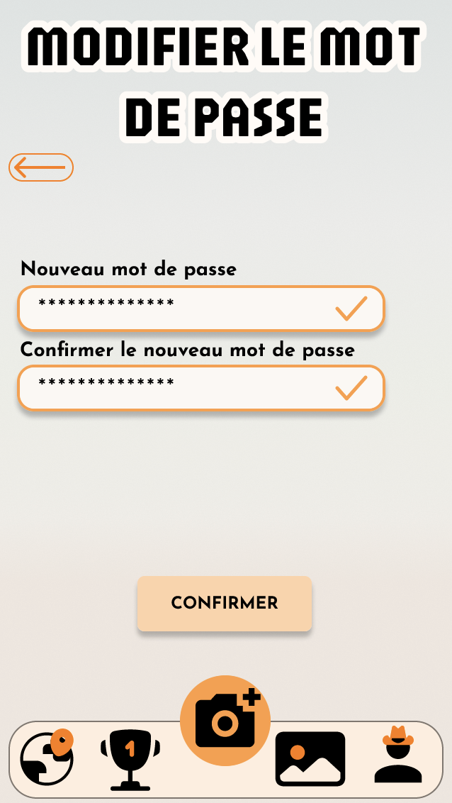
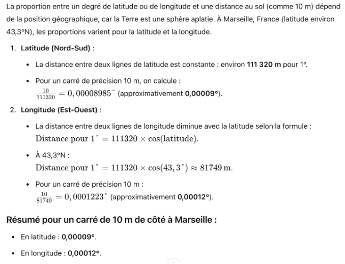
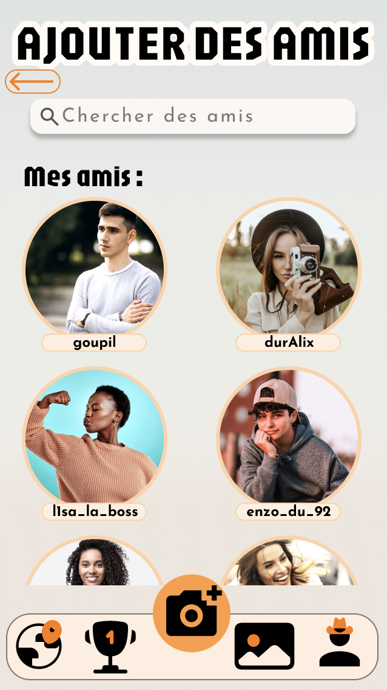

Ce projet a pour but de faire découvrir l'architecture de Marseille et l'histoire de la ville sous forme de jeu de piste.



- ✨[App finale Bubble](https://jeannemenager.bubbleapps.io/version-test)✨
- [Canva de l'UX Design](https://www.canva.com/design/DAGS_cyzG8E/nXSwpYAMsJBjibVLob1-UA/edit?utm_content=DAGS_cyzG8E&utm_campaign=designshare&utm_medium=link2&utm_source=sharebutton)
- [Maquette Figma](https://www.figma.com/proto/WJOUM8vqwIua6D9li4bCwS/Art'chitecture?node-id=3-42&p=f&t=BGbKFixNioSXnLWb-1&scaling=min-zoom&content-scaling=fixed&page-id=0%3A1&starting-point-node-id=3%3A42&show-proto-sidebar=1)
- [Specifications fonctionnelles de la maquette](https://docs.google.com/presentation/d/1sy3HVC5WTgDq-TgAo58hm1nuXv2vNO2w/edit?usp=sharing&ouid=116971710093552311266&rtpof=true&sd=true)
- [Base de données Airtable](https://airtable.com/invite/l?inviteId=invgZCrNfrcYO8E88&inviteToken=ed6b9a8f0d6d42cf7f96e74ff25ab67c93d7d9f8a916261058adf51cc9fe437a&utm_medium=email&utm_source=product_team&utm_content=transactional-alerts)




[[toc]]


## Introduction

### Contexte

Notre projet, Art’chitecture est une application innovante qui permet de découvrir une ville sous un nouveau regard ! Elle transforme une simple promenade en une expérience interactive et immersive, vous transportant dans le passé et l’histoire de la ville.

Lors de votre balade, vous passerez près de points d'intérêt marqués sur une carte dans l’application. Il vous faudra alors vous rendre sur place et prendre en photo le monument ou la rue en tentant de reproduire au mieux l’image affichée dans l’application. Si votre photo est validée, car suffisamment proche de l’originale, une image d’archive se dévoilera, accompagnée d’informations historiques pour vous plonger dans la mémoire du lieu. À chaque photo validée, vous gagnerez des points pour vous mesurer aux autres explorateurs et tenter de collectionner le plus d'images anciennes.

Art’chitecture a pour objectif d’offrir un nouveau regard sur la ville. Elle permet aussi bien d’explorer un nouvel endroit de manière originale que de redécouvrir son propre quartier à travers des images inédites.

Cette expérience unique de voyage vous invite à renouer avec le passé et à imaginer la ville d’autrefois grâce à des peintures, des photos, des gravures et bien plus encore.

### Immersion

Voici un petit exemple du principe de l'application :

- L'utilisateur a sur son téléphone la photo actuelle qu'il doit retrouver dans la ville grace aux coordonnées GPS :

- S'il parvient à reproduire la photo réel au bon endroit et l'envoyer dans l'application, la photo ancienne se révèle :

Voici une démonstration complète:

<video controls autoplay loop>
  <source src="./demo.MP4" type="video/mp4"/>
</video>

## UI/UX Design

### Gestion de projet et UX Design

Pour la réalisation de ce projet, nous avons suivi plusieurs étapes avant de commencer l’implémentation de l’application et d’aboutir à une solution fonctionnelle.

Tout d’abord, nous avons commencé par bien cadrer notre sujet en définissant les fonctionnalités essentielles de notre application.

Ensuite, nous avons priorisé ces fonctionnalités en sélectionnant chacun trois éléments que nous considérions comme les plus importants, puis en votant ensemble. Cette démarche nous a permis d’identifier les fonctionnalités indispensables :

- **La prise de photo et l’apparition des images d’archives**
- **Une carte avec les différents points de repère pour les identifier et les rejoindre**
- **Une galerie permettant de consulter l’inventaire des images d’archives déjà collectées**

Et les fonctionnalités autres :

 
Puis, une fois l’application bien cadrée dans nos esprits, nous nous sommes penchés sur les attentes et besoins de nos futurs utilisateurs afin de définir leurs usages. Nous avons alors créé trois personaes, chacun présentant des profils et des motivations différentes (voir document en annexe des personas).
Une fois ces personnages bien définis, nous avons retracé leur parcours utilisateur afin d’anticiper la manière dont ils allaient utiliser notre application. Nous avons ainsi identifié que certains seraient plus orientés statistiques et nombre de points, cherchant à dépasser leurs amis. D’autres, en revanche, privilégieraient l’apprentissage et la découverte, préférant se concentrer sur leur historique d’images et lire les informations historiques à chaque capture. Il était donc essentiel de garder en tête ces différentes user stories pour proposer une solution aboutie et adaptée à tous. Tout ceci est retrouvable [ici](https://www.canva.com/design/DAGS_cyzG8E/nXSwpYAMsJBjibVLob1-UA/edit?utm_content=DAGS_cyzG8E&utm_campaign=designshare&utm_medium=link2&utm_source=sharebutton).

Avec ces éléments en tête, nous sommes passés à la construction d’une première maquette sur [Figma](https://www.figma.com/proto/WJOUM8vqwIua6D9li4bCwS/Art'chitecture?node-id=3-42&p=f&t=BGbKFixNioSXnLWb-1&scaling=min-zoom&content-scaling=fixed&page-id=0%3A1&starting-point-node-id=3%3A42&show-proto-sidebar=1). Une fois la maquette finalisée, nous avons détaillé nos [spécifications fonctionnelles et surtout nos parcours utilisateurs](https://docs.google.com/presentation/d/1sy3HVC5WTgDq-TgAo58hm1nuXv2vNO2w/edit?usp=sharing&ouid=116971710093552311266&rtpof=true&sd=true) afin de vérifier que cela correspondait bien à nos attentes. Puis, nous l’avons fait tester à notre entourage afin de recueillir des retours. Cela nous a permis de corriger de nombreux détails, mais aussi d’opérer des ajustements plus conséquents. Par exemple, au départ, nous pensions proposer aux utilisateurs une image d’archive à retrouver en ville pour débloquer l’image réelle. Cependant, de nombreux retours nous ont amenés à inverser cette logique : l’image réelle est désormais capturée en premier, ce qui favorise une meilleure découverte du monument sur place et rend la collection d’images plus intéressante.

Une fois la maquette aboutie, nous avons lancé la construction de l’application réelle. Après plusieurs réflexions sur la meilleure approche technique, nous avons choisi d’utiliser [Bubble](https://jeannemenager.bubbleapps.io/version-test) pour le développement et [Airtable](https://airtable.com/invite/l?inviteId=invgZCrNfrcYO8E88&inviteToken=ed6b9a8f0d6d42cf7f96e74ff25ab67c93d7d9f8a916261058adf51cc9fe437a&utm_medium=email&utm_source=product_team&utm_content=transactional-alerts) pour gérer notre base de données. Ce choix nous est apparu pertinent compte tenu de nos compétences limitées en développement d’applications, mais aussi du fait qu’il s’agit d’une version 0, qui n’a pas vocation à être déployée à grande échelle. Nous ne serons donc pas contraints par les performances du low-code. (Voir lien de l’application.)

Pour la construction, nous avons d’abord mis en place les fonctionnalités critiques (prise de photo, carte, galerie), avant d’ajouter progressivement les autres éléments (classement, profil, messagerie privée…) et d’améliorer le design.

À chaque phase du projet, nous avons organisé un point en début de cycle pour fixer nos objectifs, puis nous avons réparti les tâches avec des deadlines en fonction de nos compétences, de nos préférences et des besoins de l’application. Par exemple, chacun a conçu un persona et son user story associée, nous nous sommes répartis la création des pages sur la maquette Figma, puis sur Bubble, etc. Une bonne communication a été essentielle pour assurer une progression fluide, en veillant à respecter l’ordre logique des tâches (par exemple, il était nécessaire de concevoir la base de données avant de pouvoir implémenter la galerie). Cette organisation nous a permis d’avancer efficacement tout au long du projet.

### Figma

Nous avons commencé la maquette Figma lors du cours d’UX Design et de l’initiation reçue, puis nous l’avons poursuivie, améliorée et affinée par nous-mêmes. Pour cela, nous avons réalisé des tests utilisateurs auprès de notre entourage et pris en compte leurs retours. Ces retours ont ensuite joué un rôle clé lors de la réalisation sur Bubble.

Voici quelques concepts appris en cours que nous avons appliqués systématiquement et intégrés dans Bubble :

- Variables globales : pour les couleurs et les styles de texte, garantissant une cohérence visuelle.
- Composants réutilisables : par exemple, la barre de navigation, créée une seule fois et utilisée sur chaque page.

<i>Exemple d'un parcours utilisateurs sur la maquette Figma</i>

 

Grâce aux retours des utilisateurs, nous avons pu apporter plusieurs améliorations :

- Sur la carte d’accueil, possibilité de voir en grand la photo du lieu souhaité.
- Ajout d’un message d’erreur indiquant si l’utilisateur est trop éloigné du point de géolocalisation.
- Amélioration de la lisibilité des pins orange en choisissant un fond de carte plus épuré.
- Mise en place d’un indicateur de chargement pour signaler les temps d’attente lorsque les pages sont longues à charger. Bien que cette fonctionnalité ait été intégrée dans la maquette Figma, elle n’a finalement pas été ajoutée dans Bubble, car la plateforme dispose déjà de son propre indicateur de chargement sous forme d’une barre progressive colorée.
- Ajout de flèches "Retour", permettant de naviguer plus intuitivement sans passer par la barre de navigation.

 

 

## Développement

### Airtable

**Choix du logiciel**

Lors de la création de la base de données, nous avons hésité entre Airtable et la base de données intégrée à Bubble. Cependant, les retours d’expérience soulignant la simplicité d’utilisation d’Airtable et son interface intuitive ont rapidement orienté notre choix.
La connexion entre Bubble et Airtable s’est avérée très simple à mettre en place et à gérer, sans poser de difficultés particulières.

**Évolution**

À l’origine, notre base Airtable comportait trois tables : “Utilisateurs”, “Lieux_Librairie” et “Mes_Lieux”, cette dernière servant de table de jonction entre les deux premières. Nous avons finalement constaté que cette table intermédiaire était inutile, Airtable assurant la liaison entre les 2 tables facilement.
Sa suppression a permis d’alléger la base de données, de simplifier les requêtes entre Bubble et Airtable, et d’améliorer la clarté de notre structure.

### Bubble

En raison de nos faibles connaissances en développement web, nous avons choisi d'utiliser Bubble, un outil de programmation low-code que nous avions déjà un peu utilisé lors d'un cours en début d'année. Ce langage nous a permis de créer le front-end plus facilement et de le lier à une base de données Airtable.

Afin d'assurer l'uniformité de notre projet, nous avons commencé par créer des variables globales pour les couleurs et les textes. Nous avons également pu créer des composants de boutons ainsi qu'un composant unique pour le menu. La navigation dans l'application se fait grâce à des "workflows". La création du composant menu nous a permis de ne définir qu'une seule fois le workflow. Par exemple, lorsqu'on clique sur l'icône de personnage, on arrive sur la page profil.

Lors de nos premiers tests, nous nous sommes vite rendu compte que le rendu n'était pas le même sur nos différents téléphones : en effet, notre projet n'était pas responsive, c'est-à-dire qu'il ne s'adaptait pas bien aux différentes tailles d'écran. Nous y avons donc remédié en utilisant l'option "layout" de Bubble et les différentes façons de gérer l'espacement entre les éléments. Nous avons choisi un format d'application portable ; la mise en page n'est donc pas optimale sur ordinateur ou tablette, mais elle convient à tous les téléphones.

Nous avons aussi dû faire face à des contraintes techniques liées à l'utilisation de Bubble : nous avions prévu de faire une page avec la caméra visible, mais cela s'est avéré impossible. Nous avons d'abord mis sur une page un bouton qui ouvrait l'appareil photo, mais finalement, nous avons conditionné l'ouverture de l'appareil photo au bouton d'appareil photo directement sur le menu.

### Point clé technique : la Géolocalisation

Pour notre application, nous avions également besoin d'une carte pour visualiser les différents points d'intérêt de la ville. Pour cela, nous avons utilisé l'API Google Maps, qui nous offre une certaine quantité de requêtes gratuitement. Ce plan a changé durant l'année, et aujourd'hui, nous avons droit à 200 $ de requêtes offertes par mois, ce qui nous suffit pour l'instant mais ne serait pas suffisant en cas d'utilisation à grande échelle.

Le placement des points sur la carte se fait grâce à l'adresse des points et non grâce à leurs coordonnées GPS. Cela signifie qu'il n'est pas possible d'avoir deux points à la même adresse et visibles en même temps sur la carte, comme nous aurions aimé le faire pour Centrale avec la salle Do-it et l'amphi Joule.

Pour pouvoir valider une photo de lieu, nous avons fait le choix de nous baser uniquement sur la position GPS. C'est pourquoi, avant de nous lancer dans la réalisation de l’application sur Bubble, il était essentiel de s’assurer que notre concept était techniquement réalisable. La principale difficulté technique de notre projet résidait dans la géolocalisation.

Nous avons donc commencé par un **PoC** (Proof of Concept) afin de tester cette fonctionnalité dans un cas simple : cliquer sur un bouton pour afficher les coordonnées GPS de la position. L’objectif était de vérifier que nous pouvions récupérer ces données et qu’elles étaient précises.

Finalement, cette étape s’est révélée plus simple que prévu, car l’accès aux données de position GPS est natif sur tous les smartphones, et Bubble propose une fonctionnalité intégrée permettant de les récupérer facilement.

**SCREEN**

Nous avons ensuite dû choisir la marge d'erreur que nous souhaitions accorder aux utilisateurs, car il est impossible de leur demander d'être au point GPS exact de la photo. Nous avons donc choisi de donner comme marge un carré de 20 mètres de côté. Pour trouver l'équivalent de 20 mètres en degrés de latitude et de longitude, nous avons demandé à une intelligence artificielle de faire le calcul. Ainsi, nous avons trouvé que, en latitude, 10 mètres équivalent à 0,00009° et, en longitude, 10 mètres équivalent à 0,00012°.

**SCREEN**

Finalement, après avoir fait quelques tests et découvert que la précision des GPS intégrés à nos téléphones n'est pas très fiable (jusqu'à 100 mètres d'incertitude), nous avons décidé de doubler notre marge pour obtenir un carré de 40 mètres de côté. Cela donne donc une marge de 0,0002° à la fois pour la latitude et la longitude.



*Quelle est la variation en degrés de latitude et de longitude correspondant à un carré de 10 mètres de côté à Marseille, en France ?*



## Résultats et Retour d'expérience

### Ecart avec nos objectifs et objectifs futurs

**Ecarts avec nos objectifs**

- *Enregistrement des photos dans l’application*
  
  Initialement, nous avions prévu que la photo prise par l’utilisateur soit enregistrée directement dans l’application, lui permettant ainsi de la retrouver dans sa galerie de Lieux flashés. Toutefois, pour des raisons de gestion de mémoire et d’optimisation de la base de données, nous avons finalement choisi une autre approche : offrir la possibilité d’enregistrer la photo sur le téléphone de l’utilisateur, sans stockage dans l’application. Cette alternative permet tout de même de conserver un souvenir du moment, de la lumière, et du partage avec des amis.

- *Classement des amis*

  Dans la maquette Figma, un classement des amis et un classement mondial des utilisateurs étaient prévus. Cependant, cette fonctionnalité n’a pas été implémentée, car nous n’avons pas encore intégré de distinction entre amis et non-amis.

- *Ajouts d'amis*

  Dans la continuité de cette décision, la fonctionnalité “Ajout d'amis” n'a pas encore été développée à ce stade.

 

 

**Objectifs futurs**

Pour continuer à améliorer et développer l’application, plusieurs évolutions sont envisagées :

- *Ajout d’amis* : Intégrer une fonctionnalité permettant d’ajouter des amis et d’interagir avec eux au sein de l’application.
- *Commercialisation* : Structurer le projet afin de le rendre disponible sur le marché.
- *Développement complet* : Reprendre l’ensemble du code pour créer une version entièrement codée, sans dépendance à des outils no-code.
- *Extension à Marseille* : Ajouter de nouveaux points d’intérêt dans la ville pour enrichir l’expérience utilisateur.
Déploiement national : Étendre l’application à d’autres villes de France afin d’élargir son impact et sa communauté.

Ces évolutions permettront d’offrir une expérience plus complète et d’ouvrir l’application à un plus large public.

### Retour sur l'organisation et capitalisation des résultats et apprentissages

L'expérience de travailler sur un projet digital tel que celui-ci en partant de rien au début nous a énormément appris. En effet, dans nos projets habituels on a souvent déjà un sujet assez cadré et la c’était suffisamment vague pour laisser libre cours à notre imagination. Puis, nous avons dû découvrir et appliquer différentes méthodes de gestion de projet mais aussi de brainstorming afin de parvenir à une solution aboutie.

Il a été aussi très important de bien s’organiser pour prioriser les tâches afin d’avoir quelque chose d’abouti dans le temps imparti et de bien prendre en compte les dépendances de chaque action. Nous avons ainsi pu apprendre énormément sur la gestion de projet.

Coté résultat, nous sommes très content de notre application et travailler dessus nous a fait aussi développé nos compétences en Bubble et en Figma.
