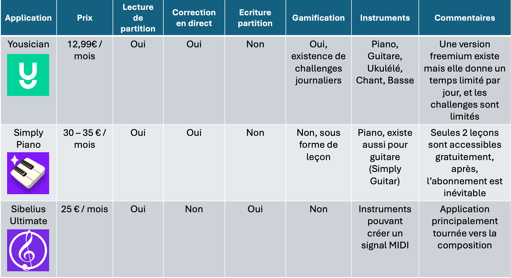

## Cadrage projet 

L’objectif du projet est la réalisation d’un site web afin d’apprendre à jouer d’un instrument. Les objectifs principaux à remplir sont les suivants : 
+ Réalisation d’un site web dans lequel la navigation est simple et ludique pour l’utilisateur
+ Chargement d’un audio et retour sur la précision de celui-ci par rapport à une partition (il sera fait référence plus loin à cette fonction en tant que partie apprentissage)
+ Génération d’une partition à partir d’un audio (il sera fait référence plus loin à cette fonction en tant que partie génération de partition)


Les cibles de ce projet sont : 
+ Les débutants en musique souhaitant apprendre à jouer d’un instrument par l’expérimentation.
+ Les novices ayant peu de connaissances en solfège souhaitant créer leurs propres morceaux et en garder une trace écrite.
Les raisons d’être de ce projet sont : 
+ Regroupement d’une partie apprentissage et d’une partie génération de partition
+ Facilité d’accès à des morceaux simples pour débuter l’apprentissage
+ Gratuité du dispositif pour permettre accès à tous


Les livrables attendus sont : 
+ Le GitHub contenant l'ensemble du code du site web
+ Un dossier apportant des détails sur le projet et ses avancés sur le site Do-It
+ Un poster présentant le projet


Le déroulement du projet MusiCoach a été marqué par deux périodes durant lesquels les méthodes organisationnelles ont été quelque peu différentes :
+ **Période 1 : Septembre 2024 - Décembre 2024 :**
  - Méthode employée : Agile 
  - Durée d’un sprint : 1 semaine. Un point chaque mardi dans l’équipe pour faire un point sur les avancées des tâches, détermination des tâches du prochain sprint, alignement sur la direction du projet.
  - Fréquence de point avec l’utilisateur/tuteur : tous les 15 jours
  - Répartitions des rôles/tâches : Subdivision de l’équipe en deux équipes, l’une responsable du “Front” (Sophia CAPDEVIELLE et Charles COOK) et l’une responsable du “Back” (Baptiste AUDOUIN et Guillaume OLIANA). 
  - Limites rencontrées : Après un point avec M. BRUCKER, la difficulté de lier la partie “Front” et la partie “Back” avec cette méthode a été mise en lumière. Cette organisation a donc été abandonnée afin de ne pas terminer le projet avec deux parties qui fonctionnent indépendamment mais que nous n’aurions pas forcément réussi à lier.

+ **Période 2 : Décembre 2024 - Mars 2025 :**
  - Méthode employée : Agile 
  - Durée d’un sprint : 1 semaine. Un point chaque mardi dans l’équipe pour faire un point sur les avancées des tâches, détermination des tâches du prochain sprint, alignement sur la direction du projet.
  - Fréquence de point avec l’utilisateur/tuteur : tous les 15 jours
  - Répartitions des rôles/tâches : Répartition des tâches en fonction des forces et faiblesses de chacun. 
  - Difficultées rencontrées : Effectivement, la mise en place du lien entre le “Front” et le “Back” n’a pas été sans difficultés. A elle seule, cette étape a duré 4 sprints. La gestion de pages, partitions et upload multiples a également été un challenge. 


1) Benchmark

+ Différentiation : 
  - Proposition d’une correction d’un morceau joué et génération d’une partition à partir d’un extrait audio.
  - Pas d’option non utilisable dans une version freemimum.
+ Points faibles :
  - Gamme d’instruments possibles pourrait être limitée
  - La notion de gamification n’est pas une priorité, dans la première version elle ne serait peut être pas active. 

2) Personnae
Voici un exemple de deux personaes applicables à notre projet :


## Développement de l’interface utilisateur du site web (Front)

+ Langage choisi : React.js
+ Avantages : Facilité de compréhension lorsque l’on a pas de connaissance en langage de programmation front end. Structure en composants qui permet leur réutilisation. Permet de mettre en place des dynamismes graphiques. 
+ Autres options : Angular, Vu.js


Le site MusiCoach est structuré comme suit : 
+ Une partie authentification, contenant une page “Inscription” pour les nouveaux utilisateurs, une page “Connexion” pour s’authentifier, et une page “Accueil” permettant d’accéder aux deux pages précédemment citées. 
+ Une page principale permettant de naviguer dans les différentes pages du site.
+ Des pages permettant d’uploader des fichiers audios, d’une part pour la partie “Génération de partition” et d’autre part pour la partie “Apprentissage”. 
+ Une section “Profil” permettant de faire apparaître les informations sur l’utilisateur.

Au préalable, nous avons réalisé une maquette Figma qui est visible dans la section “Livrables”. 


De manière générale, nous nous sommes inspiré de l'application *Duolingo* pour le développement de notre interface utilisateur, avec un chemin de progression thémpatique par exemple. 
Ci-dessous, des choix graphiques que nous avons fait : 
+ Barre de navigation : 
  - Objectif : Rassembler les liens vers les autres pages 
  - Contraintes : Possibilité de pouvoir rabattre la page pour ne pas gêner à la navigation
+ Bouton leçon :
  - Objectif : Faire des boutons rassemblés par thèmes qui mènent vers des morceaux simples pour débuter
  - Contraintes : Visuel ludique
+ Pages Upload :
  - Objectif : Pouvoir charger un fichier audio depuis le site
  - Contraintes : Ne pas à avoir à aller du côté du “Back” pour charger l’audio. Avoir un message qui permet de renseigner l’utilisateur sur l’état de chargement


+ Méthode choisie : Firebase
+ Avantages : Gestion autonome des bases de données des données utilisateurs (identifiants et mots de passe). Firebase nous permet de gérer toute la partie authentification de manière simple. 


## Développement des fonctionnalités du site web (Back)

## Test du Modèle CREPE
### Présentation du Modèle
CREPE (*Convolutional REpresentation for Pitch Estimation*) est un modèle de deep learning conçu pour la détection de fréquence fondamentale d’un signal audio. Il repose sur un réseau de neurones convolutifs (CNN), ce qui le rend plus performant que les méthodes classiques d’analyse spectrale.
Contrairement aux approches basées sur la transformée de Fourier, CREPE fonctionne directement sur le signal audio brut et apprend les caractéristiques optimales pour la détection du pitch.

### Expérimentation et Résultats
Nous avons implémenté CREPE et testé ses performances sur des enregistrements de notes jouées au piano. Les résultats ont été très satisfaisants.
#### Avantages
- Très haute précision dans la détection des notes, même dans des environnements bruités.
- Insensible aux variations d’amplitude du son (volume).
- Traitement rapide du signal, bien adapté pour une application interactive.
#### Limites
- Ne détecte que les fréquences fondamentales, ce qui convient pour la monophonie mais serait limité pour une future version polyphonique.
- Modèle pré-entraîné, donc peu personnalisable.
- Supporte uniquement les fichiers .wav
Globalement, CREPE nous a semblé être une excellente solution pour notre besoin actuel (*monophonie*).



Nous avons utilisé **Music21** et **MuseScore** pour générer et visualiser les partitions musicales. **Music21** permet de créer des partitions en Python de manière programmatique. Il offre des fonctionnalités avancées comme la manipulation des notes, l'ajout d'accords et l'exportation en **MusicXML**, compatible avec de nombreux logiciels de notation musicale. **MuseScore** est utilisé pour afficher et modifier les partitions générées. Il permet d’obtenir une visualisation graphique plus intuitive et d’exporter les partitions sous différents formats (PDF, MIDI, etc.). 


Cette partie “Génération de partition” fonctionne comme suit : 
- A partir de l’audio chargé, on détecte une suite de fréquence et de durée durant lesquelles ces fréquences sont jouées.
- A partir d’une liste mettant en correspondance une note et une fréquence, dans la liste précédente, chaque fréquence est remplacée par la noté jouée. 
- On obtient ainsi une liste de couple note/durée, qui permet d’obtenir une partition à partir de **Music21**.




Les bibliothèques utilisées sont les mêmes que pour la partie “Génération de partition”. 


Cette partie “Apprentissage” fonctionne comme suit : 
- A partir de l’audio chargé par l’utilisateur, on obtient la partition sous forme de liste de couple note/durée, comme cela est réalisé dans la partie “Génération de partition”.
- Chaque leçon correspond à une partition affichée et que l’utilisateur doit jouer. On a donc aussi une partition de référence (également sous forme de liste de couple note/durée).
- On compare alors les deux listes et on peut attribuer une note de justesse en comparant les notes, et une partie tempo en comparant les durées. 



Nous avons utilisé **Python** pour le backend et **React.js** pour le frontend.  **FastAPI** a été choisi pour sa rapidité et sa compatibilité native avec **Python**, ce qui facilite l’intégration avec le modèle de machine learning et le traitement du son. Il expose des **endpoints REST** en JSON pour envoyer et recevoir des données.  **React** permet d’avoir une interface fluide et interactive, pour l’affichage des partitions et l’interaction avec l’utilisateur. La communication se fait via des **requêtes HTTP**, où le frontend envoie les enregistrements audio au backend pour analyse, et reçoit en retour des retours sur la justesse et le timing des notes sous forme de PDF.


Les principales difficultés rencontrées ont été : 
- Faire fonctionner le modèle CREPE en local
- Mettre en lien le Front et le Back, afin que depuis un fichier chargé sur le front, il puisse être récupéré par le Back et renvoyer un nouveau fichier PDF
- Mettre en place un système permettant de charger un fichier audio et le sauver provisoirement dans un répertoire temporaire afin de pouvoir faire tourner le Back avec celui-ci


## Limites et pistes d’amélioration


+ **Limite** : CREPE est un modèle de Machine Learning qui permet une analyse efficace des sons monophoniques (voix, violon, trompette). Le modèle est peu efficace sur les instruments produisant plusieurs notes en même temps (accords, orchestres). Pour des instruments comme le piano, nous avons effectué les tests sur des morceaux dont les notes sont jouées les unes après les autres. 
+ **Piste d’amélioration** : Changement du modèle de Machine Learning qui permettrait d’analyser les accords. (cf Annexe : Pistes étudiées de modèles de Machine Learning)


+ **Limite** : L’audio uploadé doit être au format .wav obligatoirement.
+ **Piste d’amélioration** : L’idéal serait de pouvoir intégrer au code une partie qui transforme un fichier audio en .wav. Il existe des bibliothèques permettant de réaliser ceci : 
  - Bibliothèque : pydub
    - Avantages : Facile d’utilisation et compatible avec plusieurs formats (MP3, AAC, OGG,...)
    - Inconvénient : Nécésite que FFmpeg soit installé sur le système.
  - Bibliothèque : Librosa
    - Avantage : Permet également le traitement audio
    - Inconvénient : N’est pas compatible avec certains formats (MP3, OGG, …)


+ **Limite**: Lorsque l’utilisateur joue, il doit s’enregistrer afin de créer un audio, puis charger son audio sur le site MusiCoach. 
+ **Piste d’amélioration** : Utilisation d’une bibliothèque python permettant d’enregistrer un audio directement : 
  - Bibliothèque : sounddevice
    - Avantages : Faible latence et simple d’utilisation
    - Inconvénient : Ne possède pas d’interface graphique directement intégrée
  - Bibliothèque : pyaudio
    - Avantage : compatible avec une application ou un site en temps réel
    - Inconvénients : plus complexe d’utilisation et peut nécessiter un port audio


+ **Limite** : Sur la partie “Apprentissage”, les corrections sont faites à posteriori. L’utilisateur s’enregistre, charge son audio, puis seulement après traitement, il obtient un score et des indications sur les parties de son morceau qui sont fausses.
+ **Piste d’amélioration** : Il faudrait d’une part que le micro soit ouvert, donc l'enregistrement en direct évoqué plus haut. De plus, il faut que pendant que l’utilisateur joue, le morceau soit subdivisé en plusieurs petits audios (assez courts pour donner une impression de temps réel) et qu’ils soient envoyés au fur et à mesure pour être traités, puis que les résultats soient affichés à l’utilisateur. Le principal problème reste que le modèle CREPE possède une latence non négligeable qui rendrait la correction en temps réel difficile. Il faudrait donc changer de modèle de Machin Learning. 


+ **Limite** : Les erreurs sont présentées sous forme d’un graphique contenant en abscisse le temps, et en ordonnées les fréquences. Il affiche le morceau attendu (le morceau correspondant à la partition affichée) et ce qui a été joué par l’utilisateur. A la suite, il y a deux listes affichant les erreurs de justesse et de tempo avec ce qui était attendu et ce qui a été joué. 
- **Piste d’amélioration** : Une amélioration serait d’afficher dans le résultat la partition initiale, avec en rouge les notes qui sont fausses ou qui ont été jouées pas dans le bon tempo. La bibliothèque qui génère la partition dans notre maquette est music21, et prend en entrée une liste contenant une suite de notes et de tempos et qui renvoie une partition. Il faudrait changer de bibliothèque afin d’être capable de pouvoir modifier l’apparence de la partition (modification des couleurs, ajout d’annotations).


+ **Limite** : Le score du tempo est calculé dans notre modèle simplement en associant chaque note à une durée durant laquelle elle doit être jouée. Tant que la note est jouée durant la bonne période, elle est évaluée juste (sur le niveau tempo), même si elle est jouée un peu trop en avance ou en retard.
+ **Piste d’amélioration** : Il faudrait subdiviser la composante tempo en deux parties : 
  - Durée de la note : un blanche jouée pendant 2 secondes, une croche jouée pendant 0,5 seconde.
  - Tempo de la note : si la note est bien jouée au bon moment, en ne négligeant pas de silence ou de pause dans le morceau.
  Pour que cela fonctionne, il faut donc ajouter un nouveau paramètre dans notre liste “partition” avec un troisième paramètre correspondant au temps auquel doit être jouée la note par rapport au temps t=0, début du morceau. 


+ **Limite** : La partie “Apprentissage” de notre maquette ne fonctionne aujourd’hui qu’avec trois morceaux. Les morceaux (liste des deux paramètres note et tempo composant la partition) sont “hardcodé”. Pour un grand nombre de leçons, cette solution n’est pas pérenne, car les éventuelles modifications seront très fastidieuses dans le futur. 
+ **Piste d’amélioration** : Firebase permet également la gestion de base données. Une solution serait donc de stocker les listes formant les partitions dans cet outil et ainsi de réaliser la gestion des leçons avec Firebase. 


+ **Limite** : Lorsque l’on génère une partition, certaines notes sont régulièrement manquantes entre ce qui est joué et la partition générée. Une solution que nous avons trouvé au problème est de jouer sur l’intervalle de confiance. Nous avons remarqué qu’à un changement de note, il y a une chute de l’indice de confiance. Nous avons donc codé un système pour que chaque chute de confiance soit considérée comme un changement de note. Cependant, en fonction des morceaux, l’intervalle de confiance doit être modifié afin que la retranscription sous forme de partition soit optimale. 
+ **Piste d’amélioration** : Une solution pour la partie “Apprentissage” que nous avons implémenté est l’association à chaque morceau de leçon un indice de confiance optimal. Ceci ne peut pas être réalisé pour la partie “Génération de partition”. Nous n’avons pas trouvé de solution efficace à ce problème, la seule issue serait de changer de modèle pour un plus précis. 


## Livrables

Le GitHub est disponible au lien suivant. 


Le poster suivant présente le projet de manière synthétique. 


Le travail préalable réalisé sur le visuel de la  maquette MusiCoach est disponible au lien suivant. 


Une vidéo de présentation du site est disponible au lien suivant. 


## Analyse Post Mortem


+ **Atteinte** : Partielle
+ **Précisions** : L’interface utilisateur a été réalisée. Le site peut être utilisé en local, et la navigation entre les différentes pages reste assez simple. Cependant, l’objectif  ludique n’a pas été atteint. L’idée initiale était de s’inspirer de l’application “Duolinguo”, et d’ajouter une partie “gamification” avec un “chemin de progression”. Nous n’avons pas eu le temps de nous pencher sur cet aspect. De plus, le site n’a pas été déployé, il n’est utilisable qu’en local. 


+ **Atteinte** : Totale
+ **Précisions** : La maquette permet de charger un audio joué à partir d’une partition fournie par le site. 


+ **Atteinte** : Partielle
+ **Précisions** : Le site offre bien une fonctionnalité permettant de charger un audio et d’obtenir la partition associée. Cependant, du fait des limites du modèle de Machine Learning qui ont été énoncé précédemment, c’est pour cela que nous considérons l’objectif partiellement atteint. 



+ **Codage** : Nous n’avions aucune connaissance en “Front End”, nous sommes donc partis de zéro sur ce sujet. Nous avons tout de même produit une maquette viable et utilisable. Nous avons également énormément appris sur la manière de lier un “Front” et un “Back” dans la création d’un site web avec FastAPI.
+ **GitHub** : Nous avons appris sur la gestion d’un GitHub lors d’un projet IT, notamment la création et la gestion de branches, mais également sur la gestion de conflits. Nous avons également appris sur l’importance de créer des fichiers tels que le requirements ou encore git ignore.
+ **Gestion de projet IT** : À nos dépens, nous avons appris qu’un projet de site web ne peut pas être organisé en deux équipes avec une partie s’occupant du “Front” et une autre s’occupant du “Back”. Au moment de lier les deux, des modifications nombreuses sont alors à apporter des deux côtés, pouvant ralentir énormément le projet, et même aboutir seulement à deux parties qui fonctionnent indépendamment mais pas ensemble.


## Annexe : Pistes étudiées de modèles de Machines Learning

Dans le cadre du projet MusiCoach et de sa première version, nous nous concentrons initialement sur des exercices monophoniques, c’est-à-dire jouant une seule note à la fois.
Un défi technique majeur du projet est d’évaluer avec précision la justesse des notes jouées par l’utilisateur ainsi que leur timing par rapport à la partition attendue. Pour cela, nous avons exploré plusieurs approches allant d’une solution sans modèle basée sur des techniques de traitement du signal jusqu’à des modèles avancés de machine learning.
Ce compte rendu documente les étapes successives de nos recherches, les méthodes testées, ainsi que les raisons de nos choix finaux.

**Principe de la Détection de Notes via l’Analyse Spectrale**
Avant de nous tourner vers des modèles d’apprentissage automatique, nous avons exploré une solution basée sur des techniques classiques de traitement du signal. L’idée était d’extraire la fréquence dominante des sons captés par le micro afin de l’associer à une note musicale.
La détection de fréquence repose sur le fait que chaque note musicale correspond à une fréquence bien définie dans l’échelle des sons :
+ **La4 (A4) = 440 Hz**
+ **Do5 (C5) = 523.25 Hz**
+ **Sol3 (G3) = 196 Hz**, etc.
Pour extraire cette fréquence dominante, nous avons utilisé :
+ **La Transformée de Fourier Rapide (FFT - Fast Fourier Transform)** : permet de passer du domaine temporel (signal audio brut) au domaine fréquentiel (spectre des fréquences).
+ **La Transformée de Fourier à court terme (STFT - Short Time Fourier Transform)** : améliore la FFT en appliquant une fenêtre glissante pour analyser les fréquences à différents instants.
**Avantages**
- Méthode rapide et efficace pour la détection de notes isolées.
- Pas besoin d’entraîner un modèle, ce qui réduit la complexité.
**Limites**
- Difficultés à gérer les attaques de notes (l’instant précis où une note commence).
- Sensibilité au bruit et à l’acoustique de l’environnement.
- Impossible d’analyser le timing précis (précision milliseconde requise pour MusiCoach).
- Peu performant sur des sons de piano enregistrés, où les harmoniques peuvent compliquer l’identification de la fréquence fondamentale.
En raison de ces limitations, nous avons exploré des approches basées sur le machine learning.



**Présentation du Modèle**
*Onset and Frames* est un modèle développé par Google AI, conçu spécifiquement pour la transcription audio de piano. Il fonctionne en deux étapes :
1. **Détection des onsets** : identifie le moment exact où une note commence.
2. **Détection des frames** : suit l’évolution des notes au fil du temps.
Contrairement à CREPE, ce modèle est conçu pour la **polyphonie** et peut reconnaître plusieurs notes jouées simultanément.
**Problèmes rencontrés**
Bien que théoriquement adapté à notre projet, Onset and Frames nous a posé plusieurs difficultés :
- Problèmes d’implémentation :
  - Besoin de **GPU puissant** pour un fonctionnement fluide, ce qui n’était pas optimal pour une application légère.
  - **Temps de traitement trop long** pour une application interactive.

- Problèmes liés à la polyphonie
  - Complexité de gestion des erreurs dans les prédictions (**faux positifs** sur des notes non jouées).
  - Sur-optimisation pour des enregistrements de piano professionnels, **moins performant avec des sons captés par un simple micro.**
En raison de ces problèmes, nous avons décidé de revenir à CREPE, plus rapide et adapté à notre premier objectif (monophonie).


Après avoir testé ces différentes approches, nous avons retenu **CREPE** comme modèle principal pour l’évaluation des notes dans MusiCoach.
**Résumé des Avantages de CREPE**
- **Précision élevée** dans la détection de la note jouée.
- **Rapidité de traitement**, essentielle pour une application interactive.
- **Robustesse face au bruit**, contrairement aux méthodes FFT/STFT.
- **Simplicité d’implémentation**, sans nécessiter de gros calculs GPU.
**Limites à considérer pour l’avenir**
- **CREPE est monophonique**. Si nous voulons ajouter des exercices avec des accords ou plusieurs notes simultanées, il faudra explorer d’autres modèles.
- **Il ne détecte pas directement les erreurs rythmiques**, une fonctionnalité essentielle à améliorer pour évaluer la précision du timing des notes.

| Méthode | Avantages | Inconvénients | |--------------------------------|---------------------------------------------------------------------------|-----------------------------------------------------------------------------| | **Transformée de Fourier (FFT/STFT)** | - Rapide et simple à implémenter   - Pas besoin d'entraîner un modèle | - Sensible au bruit et à l’acoustique   - Difficulté à détecter le timing précis   - Moins précis sur les sons de piano (harmoniques) | | **CREPE (CNN pour estimation du pitch)** | - Haute précision sur la détection de notes   - Robuste face au bruit   - Fonctionne en temps réel, idéal pour l'interactivité | - Ne gère que la monophonie   - Modèle pré-entraîné, peu personnalisable | | **Onset and Frames (Modèle Google AI pour transcription de piano)** | - Gère la polyphonie   - Détecte le début des notes et leur durée   - Précis sur des enregistrements professionnels | - Nécessite un GPU puissant   - Temps de traitement trop long   - Moins performant avec des enregistrements de micro basiques | 

